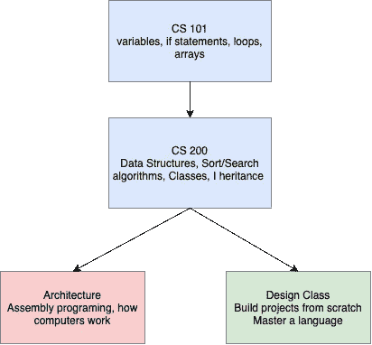
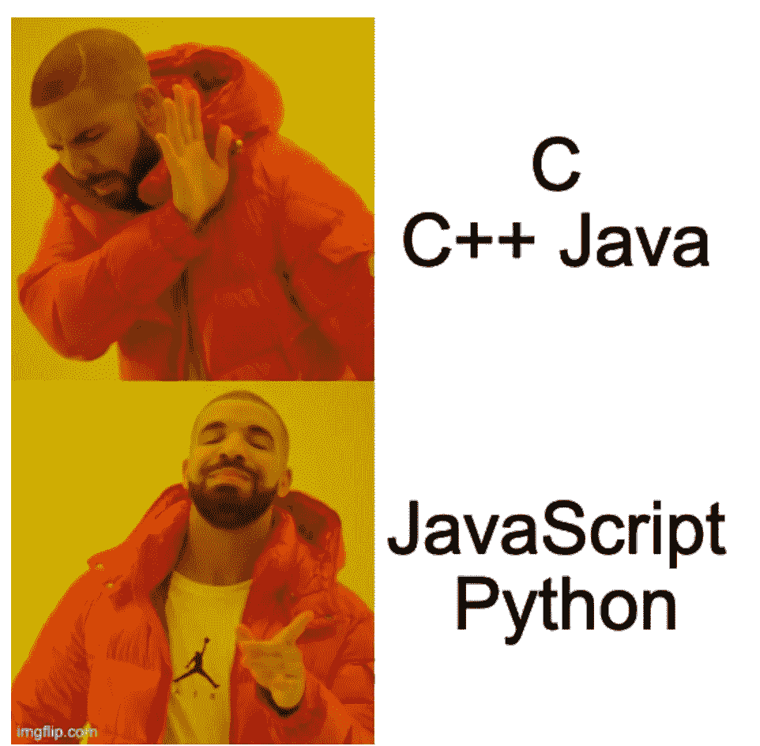
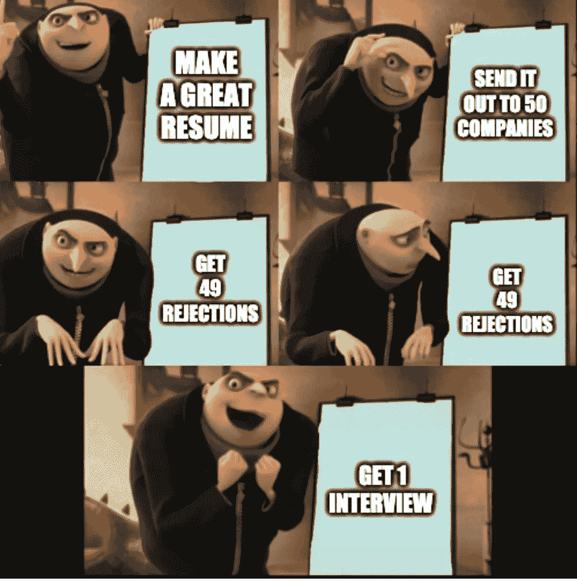
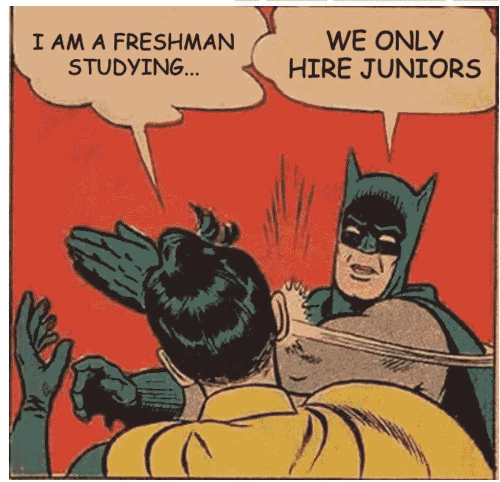
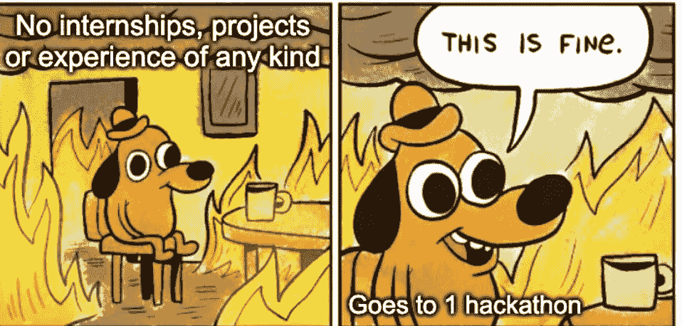

# 在大学获得计算机科学学位(课程、实习、项目等)。)

> 原文：<https://levelup.gitconnected.com/navigating-a-cs-degree-in-college-coursework-internships-projects-etc-faf3917d7409>

## 来自疲惫的学长的提示和技巧

# 介绍

随着初级软件工程师的平均收入超过 86，000 美元，以及数据科学和技术项目管理等领域获得了很大的吸引力，计算机科学成为大学中最受欢迎的专业之一就不足为奇了。计算机科学学位越来越受欢迎，这给许多大学带来了压力，这些大学的计算机科学系可能没有足够的教授来满足学生的需求。

作为一所学校的高年级学生，我注意到一个趋势是在课堂上教授的内容和学生希望学习的内容之间存在巨大的差距。许多教授选择专注于教授理论，通常选择过时的语言和技术。虽然知道事情如何在幕后工作很重要，但拥有现代框架和实践的知识对于成为一名成功的软件工程师来说也是必要的。

不幸的是，我所在的大学并没有要求教授学生软件工程实践的任何课程，而且到目前为止，即使没有编写过超过 1000 行代码的项目，也有可能获得 CS 学位。此外，校园内科技组织的缺乏使得相当多的学生很难找到外部资源，并让许多人不得不自谋生路。如果你是作为计算机科学专业的学生开始上大学，或者只是考虑计算机科学，我希望这篇文章能为你提供一些建议，让你在大学四年中获得最大收益。

# 大一/大二

大一大二是探索不同道路，搞清楚自己感兴趣的东西的时候。这似乎是美国的共识，然而，当你看到对 SWE 感兴趣的学生时，大一是每个人都在竞争暑期实习的比赛的开始。大学一年级可以说是你大学四年中最空闲的时候，所以如果你知道你想从事软件工程，那么你可以在一年级做几件事情。

## 课程作业

每所大学都有教授基础知识的 CS101 课程，以及后续的数据结构和算法课程。在你完成这两项之前，你很可能会被排除在任何上层阶级之外，所以让他们离开可能是个好主意。有些学校会让你跳过 CS101，如果你在高中上过 AP 课程，或者如果你能证明你足够了解这些概念。如果你能跳过这些课程中的至少一门，你的身材会更好。

如果你能跳过一门入门课程，下一门热门课程通常是计算机体系结构。虽然这是一个重要的话题，但是如果你想更快地学习编码，那就把这个课程留到明年吧。通常所有学校都会开设一些**软件设计课，前提是和一个陌生人**的团队做一系列项目。更重要的是，这将是第一门要求你从零开始构建一切的课程(在以前的课程中，你会得到一些预先制作的项目，其中有一些地方需要填写)。像这样的课程是一个巨大的时间承诺，因为除了常规的学校作业，每个项目每周要花 20-40 个小时，但你很可能永远不会像大一那样有那么多的空闲时间，所以不妨那时参加课程。更重要的是，如果这门课是毕业必修课，你可能会和其他几门难学的课程一起上。如果你无法在大一春季腾出时间来上这门课，请务必在大二秋季选修。

## 学习一种语言

在前两门入门课程之后，你将掌握足够的理论知识，可以去实习。然而，象牙塔里教授的语言往往与雇主希望在你的简历上看到的语言不同。大一是学习流行语言的好时机。**我个人的建议是 JavaScript，因为它是连续几年最受欢迎的编程语言，并且由于 JS 可以用于任何东西(Web 前端、服务器、移动设备，甚至 AR/VR)而受到初创公司的喜爱**。另一个不错的选择是 python(尤其是如果你认为数据科学和 ML 可能是你想做的事情)。

**一旦你选择了一门语言，我的建议是你花 20 美元上一门课程。**有大量的免费资源，但尤其是刚开始时，你可能会受益于一种付费课程中提供材料的结构化方式。在我的第一次实习中，我的雇主给我买了一门 NodeJS 课程，并给了我 2 周的时间完成培训，这是我学会一门语言的最快速度。

招聘人员在查看你的简历

## 获得经验

大一实习真的很难。一些大型科技公司为代表性不足的少数族裔提供机会，但即使是这些机会也很稀缺。大二学生比大一学生要轻松一点，但是如果你没有前一年的任何经验，你将和大一学生处于同一条船上。作为大三学生，最好的地方是初创公司。创业公司往往没钱给实习生发工资，却愿意投入时间培训新人。大一的时候，我在一家 4 人创业公司找到了一份工作，那里唯一的另一名开发人员是 CTO。虽然我没有报酬，但我与一位经验丰富的开发人员密切合作，他是我起步时的一位了不起的导师。

作为低年级学生招聘

如果你找不到一家创业公司，那么退而求其次就是在你的大学里找一份研究工作。你可以找到两种类型的机会。一个是**找到一个研究似乎很有趣的计算机科学教员**，给他们发邮件要求做一个研究项目。虽然这看起来有点吓人，但事实是教授们喜欢接受本科生，因为他们可以让本科生为他们研究一些技术，看看是否值得未来研究。大二的秋天，我开始和一位教授一起工作，他对用边缘计算改进增强现实感兴趣。她感兴趣的一个领域是移动 AR 的功能，但她还没有任何研究生，因为她刚刚加入大学，她自己没有时间与 ARCore 和 ARKit 打交道。在我的研究中，我尝试了 android 开发，构建了 REST API 并开发了使用这些 API 的 ARCore Android 应用程序。我的初步项目帮助她提出了一些未来的项目，并在第二年分配给她的研究生，我获得了很好的编程经验，这也可以放在我的简历上。

第二个选择是**找到需要 CS 学生帮助的非 CS 实验室**。我的一个朋友意识到他想做 CS 有点晚了，因此在实习中落后于其他人。他最终找到了一个生物学实验室，该实验室需要一名计算机系学生编写基本的 bash 脚本来组织和重命名他们的 CSV 文件。他抓住了这个机会，并逐渐接受了越来越多的新任务。几个月后，他编写了一个程序，使用图像处理来跟踪植物的根的生长(比简单的 bash 脚本要高级得多)。这段经历也帮助他获得了实习机会。

如果你在你的大学找不到机会，你可以尝试做个人项目。我把这个选项放在最后的原因是，虽然你仍然可以从个人项目中学到同样多的东西，但这是你简历上对招聘人员最没有吸引力的一点。通过看到你为别人工作，招聘人员知道你必须在专业环境中应用你的技能，并提供体面的质量代码。在个人项目中，你是唯一对自己负责的人，所以你的代码质量可能会受到影响。

# 大三/大四

如果你在低年级的时候努力积累经验，你的大三和大四压力应该会小很多。然而，如果你很晚才进入 CS，或者在开始时决定放松一下，现在是时候加倍努力获得经验了。

## 零件定时

没人说你只在暑期实习期间工作。大学校园周围通常有很多创业公司，他们会非常乐意接受那些愿意与他们合作超过 3 个月的学生。同样，**大学教授和实验室会很乐意给学生提供研究职位(通常是为了学分),帮助他们解决问题**。在整个大学期间，我继续与我从大二开始的同一个研究教授一起工作，这让我接触到了新的技术和框架，否则我不会有这样的机会。例如，去年我开始尝试为 Oculus 开发 Unity(我不会自己动手，因为我需要先投资几百美元买一个耳机)。

## 设计课程

有时计算机科学系提供设计课程，在那里你为一个实际的公司/非营利组织工作。这些课程很大程度上是由 T4 大学安排的实习，你可以获得 T5 课程的学分。如果你已经有实习经验，你不需要参加这些课程，因为它们对你的简历没有太大帮助。

## 研究生级别的课程

参加研究生水平的课程可以帮助你弄清楚**你是否想在未来的某个时候攻读博士学位**。此外，他们是了解你的教授的一个很好的方式，而且一般来说更有吸引力，因为班级规模更小，教授们正在教授他们真正擅长的材料。一些教授在研究生班为学生提供研究或实习机会，或者试图让他们与业内人士联系。

# 要避免的错误

## 不是以低年级学生的身份招聘

作为一名低年级学生，招聘会是痛苦的。有数百人排队等待招聘人员 30 秒的时间。很热，很吵，有汗味。大一的时候，我去的每家公司都很快拒绝了我，说“对不起，过几年再来吧。”总的来说，那次经历糟透了。然而，我没有让它挫伤我的积极性，并最终找到了获得大一经验的方法。大二的时候，我回到了招聘会，做好了被拒绝的准备，但令我惊讶的是，一些公司愿意和我谈。然而，并非所有大二学生都是如此。招聘人员一听到“大二”，他们立刻失去了兴趣，所以我确保快速推销“你好，我是迈克尔，我是计算机工程和计算机科学的双学位，去年我在一家初创公司工作……”注意，我从来没有提到我的年龄，一旦招聘人员听说我有经验，他们就不会在意我的年龄。我的很多朋友大一的时候都没有去过招聘会，他们都说了同样的话“我不知道该告诉他们什么。我以为他们会和我说话，但他们只是保持沉默。”我敢肯定，有一些大三学生完全避免了作为低年级学生被招募，最终犯了同样的错误。

## 灰心丧气，不去冒险

第一年，我每个月发出 25 份申请，被所有的公司拒绝。这发生在八月、九月、十月和十一月。一月份，我收到了一家初创公司要求面试的回复，那是我从一月份到八月份工作过的初创公司。被拒绝很容易让人气馁，但是如果你坚持下去，你一定会找到一些东西。

高二那年我还是听到了很多拒绝。我参加的一场招聘会上，脸书、谷歌、微软和亚马逊都在那里招聘。我当时对自己说，“我只是一个大二学生，我肯定会被拒绝，站一个小时的长队是不值得的。”博览会结束时，我看到脸书不再排队了，所以我决定试一试，去和他们谈谈。迎接我的是一位显然已经筋疲力尽的工程师，他浏览了我的简历，说:“我知道你有一些经验，但你已经大二了，所以我不认为你能通过面试。如果你愿意，你可以把你的简历放在这一堆里。”我继续把我的简历交给他们，带着一丝伤感离开了交易会。一个月后，我被召回参加第一轮面试。两年后的夏天，我接受了脸书大学软件工程师的邀请，并在脸书实习了两次。如果我没有决定在晚上结束时尝试一下，谁知道我今天会不会得到这样一个惊人的机会。

拒绝是很难的，开始的时候你会听到很多。重要的是不要气馁，继续前进。我的很多朋友在大三的时候发出了 50 多份申请，却没有收到至少一家公司的回复。这只是不幸的现实开始，但你越早学会不把拒绝放在心上，你就会过得越好。

## 落入黑客马拉松陷阱

黑客马拉松很棒。你可以花一个周末的时间和热衷于编程的人一起创造一些很酷的东西，互相学习，享受乐趣。然而，似乎计算机专业的学生已经开始利用黑客马拉松来拖延对他们的职业生涯更有帮助的事情。我认识不少人，他们因为没有经验、只懂一门语言或没有做过任何项目而感到紧张，在参加黑客马拉松后，他们会说“我参加了一个小时的 JS 研讨会，所以我现在知道了第二门语言，”或“我不再需要如此担心获得经验，因为我可以把半成品的黑客马拉松应用程序放在我的简历上”。黑客马拉松不是编码训练营。黑客马拉松不是实习。招聘人员知道这一点；工程师知道这一点；你知道的，所以别再骗自己了。

# 结论

大学里的计算机科学学位很奇怪。由于行业的快节奏和学术界的慢节奏，雇主的期望和大学教给学生的东西之间总会有差距。这就要靠你来填补这个空白了。幸运的是，作为一名软件工程师，你需要不断地自学新的语言、框架和技术。**你越有经验，事情就越容易**。我希望上面的文章不会给你太多压力。**这不是你毕业前必须做的所有事情的清单。即使你不遵循上面的任何步骤，你仍然可以得到一份软件工程师的工作。然而，如果你对磨砺自己的技能感兴趣，超出了大学教给你的范围，或者如果你想早一点获得成功，我希望这篇文章能给你一些如何开始的建议。**