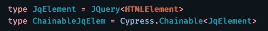
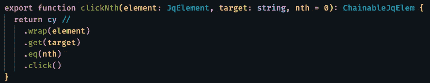
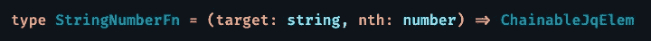
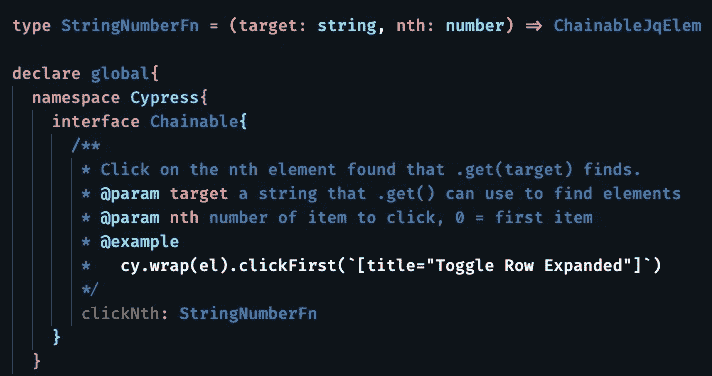
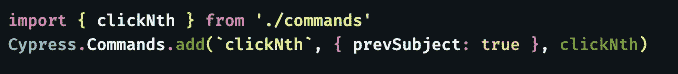
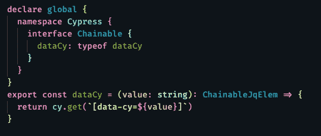
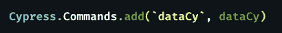

# 导航 Cypress 自定义命令

> 原文：<https://levelup.gitconnected.com/navigating-cypress-custom-commands-412a817b088>

## [JavaScript 和类型脚本测试](https://gentille.us/b3601fb73472?sk=0dc73c81df810c0f181c432c9db3e085)

## 自定义命令可以节省您的时间，清理代码，并使其更具可读性。它们很值得理解。

我刚刚开始使用 Cypress 测试用 TypeScript 编写的 React 应用程序。这是第一篇详细介绍一些经验教训的文章。

说到定制命令，我发现用稍微偏离官方文档的方式编写命令更容易维护。我还发现了一些很容易解决的小问题。

将`cypress/support/command.ts`文件组合起来用于通用命令是可行的，但是我喜欢将更复杂的命令放在它们自己的文件中。将函数本身与加载自定义命令的代码分开也更清楚。让我用一个全面的例子来说明这一点。

# 编写函数

从`cypress/support/commands.ts`文件开始，为该命令编写一个普通函数。假设我们有一个带有“my-table”的`data-cy`标签的表，并且有许多行的`title`属性设置为“Toggle ”,我们希望单击第一行。我们的目标是编写一个定制的子命令，这样在我们的测试中我们就可以这样做:
`cy.get(`[data-cy='my-table'].clickNth(`[title='Toggle'], 0)`

与 JavaScript 相比，我更喜欢 TypeScript，所以让我们从几个助手类型开始，以节省一些输入:

方便的打字稿类型

现在，我们可以编写完全类型化的子函数，点击找到的项目集合的第 n 个元素。

clickNth()子函数

这里有几件事值得进一步探讨。对`wrap`的第一次调用将 JQuery 元素转换回一个可链接的对象，接下来是一个简单的`get()`，最后用`eq()`检查感兴趣的项目。一旦我们有了想要的元素，我们就使用`click()`命令。

# 用 TypeScript 使它播放得更好

完成所有工作的函数已经完成，但是我们还需要两步才能使它可用。首先，我们希望 TypeScript 知道这个命令。首先创建一个描述新命令的类型。类型`StringNumberFn`指定了一个接受字符串和数字的函数，并返回我们之前定义的类型`ChainableJqElem`。

为我们的自定义子命令键入

这里需要注意的一个重要的事情是，这个类型是由**而不是**指定我们函数的第一个`element`参数的。对于子命令，您不会显式地传递它，Cypress 会为您包含它，但是 TypeScript 需要知道它不会被指定，所以我们在这里将其从我们的类型中删除。*(还要注意，这阻止了我们使用* `*typeof clickNth*` *作为我们的函数类型，我们将在稍后的父命令中看到* `*typeof*` *。)*

一旦我们有了类型，我们只需将我们的命令作为`property:type` 对添加到`global.Cypress.Chainable`中，如图所示。

让 TypeScript 知道我们的命令

注意注释是可选的，但是在许多支持代码完成帮助的编辑器(包括 Visual Studio 代码)中是有帮助的。

# 把功能变成命令

最后，我们修改`/cypress/support.index.ts file`来添加我们的新命令到 Cypress。为新编写的函数添加一个导入。然后，因为它是一个子命令，我们必须为`add()`函数指定可选的`Cypress.CommandOptions`参数。在这种情况下，我们将`prevSubject`属性设置为`true`，如图所示，同时显示用于调用我们的命令的字符串和要调用的函数。

将 clickNth 添加为命令

就是这样！现在 Cypress 和 TypeScript 都知道我们的子命令，在我们的测试中，我们可以直接使用它，而不需要任何额外的导入。

# 制作您自己的子命令

如果您发现自己在许多测试中单击了第一个元素，您可以很容易地创建第二个名为`clickFirst()`的子命令，它接受单个`target`参数，并使用第二个参数`0`调用`clickNth`。

# 父命令更简单

编写父命令时，可以跳过为命令编写自定义函数类型的步骤。您可以使用`typeof`操作符来提取类型。这里有一个父命令的最小例子，它专门为`data-cy`属性指定了`cy.get`命令。

父自定义命令

当您将该父命令添加到`index.ts` 文件时，您可以放弃可选的`Cypress.CommandOptions`参数，只需如下指定名称和功能:

通过`data-cy`属性获取元素是非常常见的，我发现它比全括号属性语法更快，更容易阅读。

我的更多 [JavaScript 和类型脚本测试](https://gentille.us/b3601fb73472?sk=0dc73c81df810c0f181c432c9db3e085)技巧。

平静地编码。