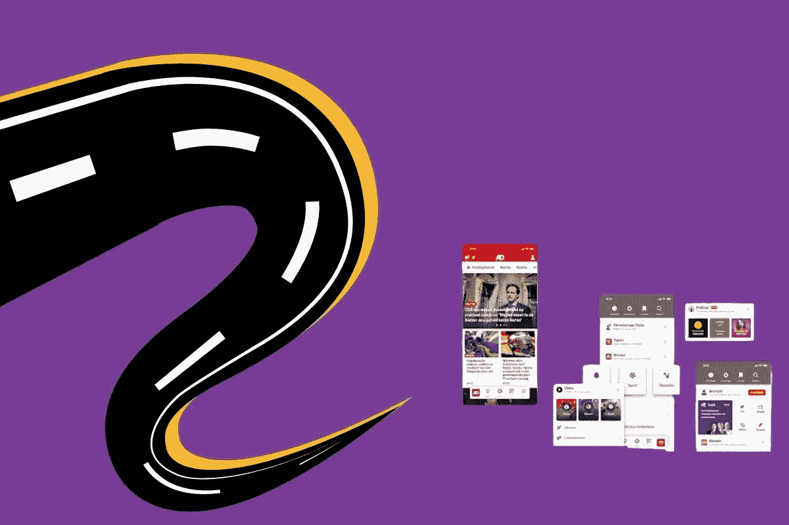
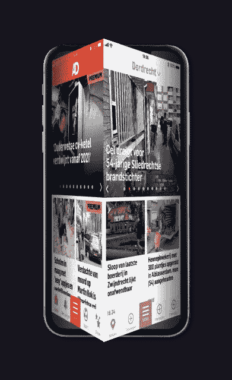

# 导航 2.0:原生路线

> 原文：<https://levelup.gitconnected.com/navigation-2-0-route-to-native-af1db349a423>

## 将我们的代码库迁移到本机

*作者:Tijs Teulings，React 本地专家*

**DPG 媒体的一些应用程序现在具有非常不同的导航功能。我们去了土著。这是一个“幕后”故事，讲述了我们是如何到达那里的，以及接下来会发生什么！**

# 我们为什么需要导航 2.0？

在过去的几个月里，我们的技术团队一直在努力开发导航 2.0。当你前往 App Store 下载[广告](https://apps.apple.com/nl/app/ad-nieuws-sport-regio/id411536869)、 [HLN](https://apps.apple.com/be/app/hln/id403025567?l=nl) 或 7sur7 应用程序，或我们的任何地区名称；埃德、图班蒂亚、BN DeStem、德斯藤托耳、PZC、布拉班特达格布拉德或德格尔德兰德，您将获得我们的移动应用程序的第 8 版，该版本具有这一完全改进的导航系统。

直到版本 8，我们的应用程序的一个独特的功能是它的立方体般的导航系统。你不能只是上下滚动或点击菜单中的一项。但你也可以向左或向右滑动当前部分(或我们称之为世界),看到当前屏幕动画，就像你在旋转一个方形的新闻星球。这不同于你过去可能用过的任何其他新闻应用。不过，这确实带来了一些挑战。这种效果在技术上很难适应标准的导航模式。这也让一些用户在从一个世界到另一个世界时迷失了方向，找不到他们之前阅读的内容。

因此，在 2021 年，我们开始设计新的导航系统，防止用户迷路，并确保他们能够找到我们的应用程序提供的所有目的地。讨论和设计冲刺中的一个主题是返回到更常见的带有标签栏的导航。这就是应用程序第 8 版最终交付的设计。

# 反应本地人对本地人

当我在 2018 年加入时，团队刚刚开始致力于内部开发移动应用程序，并从头开始创建一个新的新闻应用程序。web 团队已经使用熟悉的工具:Javascript 和声明式 UI 开发在 React Native 中创建了一个新闻世界。我们的团队将这个新闻世界与一个主题世界和一个视频世界结合到新的立方体框架中。一个不仅可以被广告使用，而且可以被来自相同代码库的所有新闻品牌使用的框架。

当时，React Native 大约五岁，已经非常受欢迎。它允许团队快速迭代组件，并在 iOS 和 Android 之间重用视图和其他代码，只需稍作调整。我们可以在主要编写 JavaScript 和后来的 TypeScript 时完成所有这些工作。因此，对于某些有意义的模块，我们回到了本地语言。这在一段时间内运行得相当好，并允许我们在同年夏天推出所有十个新的新闻应用程序。

在过去的几年里，随着我们的应用范围不断扩大，随着我们的团队不断壮大，我们确实开始遇到 React Native 的一些限制。对于我们的一些新功能，使用 iOS 和 Android 平台的本地语言是有意义的。随着我们更多的代码库是用 Kotlin 和 Swift 编写的，我们需要在应用程序的类型脚本层和本机模块之间进行更多的交流。虽然这种方法可行，但它往往会引入复杂性，因此也有可能产生 bug。

我们的团队现在有更多在原生框架方面有经验的开发人员。开发的重点已经从发布第一个版本转变为提高应用程序的稳定性。总的来说，将更多的代码转移到本机开始变得更有意义。

# 入乡随俗

当时我们应用程序中最大的 bug 和性能问题来源是导航系统。我们应用中的每个世界都依赖于一个 React 本地导航库。我们看到了将这个基于 JavaScript 的系统迁移到 iOS 和 Android 的默认原生导航系统的最大改进潜力。因为这个库被集成到每个世界中，并且这些世界中的许多组件依赖于它，所以我们不能只是制作一个本地导航，然后将所有现有的屏幕移动到这个新的导航。

首先，我们需要切断所有这些依赖性，使屏幕在本地环境和 React 本地环境中作为独立的组件工作。被称为“本土化”的项目。我们开始在应用程序的每个新版本中发布越来越多的本机代码。但是我们遇到的屏幕或组件不能以向后兼容的方式工作，或者依赖于不一定有相同优先级的其他团队。

因此，在某些时候，随着一些屏幕转移到原生，但仍然没有完全原生的导航，Go Native 项目陷入了困境，因为我们无法在不破坏向后兼容性的情况下进一步前进。幸运的是，在这个时候，UX 已经开始致力于导航 2.0。其中一个决定是从立方体中的世界转移到标签栏中的部分——就像许多其他移动应用程序一样。

由于导航现在正在重新设计，需要彻底检查，没有什么可以阻止我们从 React 导航转移到一个完全原生的系统。

# 新导航，新技术！

随着第一个拦截器的出现，我们开始从头开始重写新的导航。标签栏建成了，“药丸吧”诞生了，“超级菜单”诞生了。因为我们现在又前进了几年，所以我们能够使用最新最棒的可用工具来完成它。iOS 和 Android 最近都引入了工具，使用我们在 React Native 中已经熟悉的相同的声明式 UI 概念来创建屏幕和组件。因此，新的 iOS 屏幕现在可以使用 [SwiftUI](https://developer.apple.com/xcode/swiftui/) ，对于 Android 屏幕，我们选择使用 [Jetpack Compose](https://developer.android.com/jetpack/compose) 。由于我和我们团队中的其他 React Native 开发人员已经熟悉了这些框架的基本概念(部分灵感来自 React Native ),我们可以很快熟悉这个新的堆栈。

所以，这就是一个新的导航设计如何使采用新技术成为可能，使我们能够摆脱困境，继续走向一个更本土的应用程序。

# 稳定性与可重用代码

自 2018 年版本 1 以来，我们从 90%的 JavaScript 和 TypeScript 到当前应用程序中的 50%左右。另一半是 iOS 上的 Swift 和 Android 上的 Kotlin。但由于新的组件和屏幕现在可以更容易地使用原生技术来构建，我们预计这将逐渐转变为 100%的原生应用。

结果，我们失去了 React Native 的一些好处。最大的是跨平台可重用代码或“一次编写，随处使用”。不过最终，我们觉得使用苹果和谷歌为每个平台提供的官方工具所带来的稳定性的提高超过了这个好处。现在，为两个平台创建两次同一个屏幕需要的时间会稍长一些。但是我们不再需要编写代码来连接本机模块和 JavaScript 之间的通信。此外，我们的一些 Android 和 iOS 开发者现在更开心了，这绝对是一个值得一提的指标

# 导航 2.0 的下一步是什么？

当然，也有改进的余地。我个人会非常怀念的一个好处就是热重装。当您在 React Native 中处理视图时，视图的即时反馈仍然是无与伦比的。虽然 SwiftUI 和 Compose 都试图提供类似的预览功能，但事实证明，它在像我们这样的大项目中还不能工作。一个巨大的改进，我们计划下一步通过将我们相当大的项目模块化成更小的单元，应该允许预览功能开始按预期工作。

总的来说，我们相信这是我们项目前进的正确方向。因此，几个月后，我们希望在我们的一个演示中分享我们已经转移到 100%原生应用程序。但与此同时，我们继续通过改进超级菜单、添加个性化选项和许多更酷的功能来改进新的导航。

如果您或您的团队有兴趣了解我们如何管理此次迁移的更多细节，请随时联系我们，并在此留下您的评论。我们将愉快地回答您的问题并分享经验。