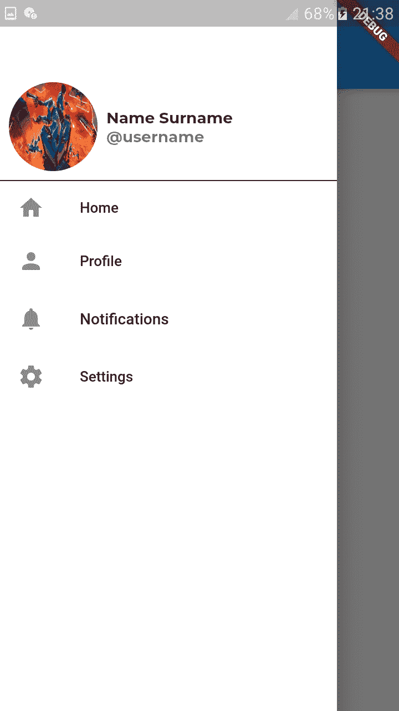

# 飘动中的导航抽屉

> 原文：<https://levelup.gitconnected.com/navigation-drawer-in-flutter-4fe70cbce328>

移动应用程序有不同的方式在屏幕之间导航，如导航抽屉、底部导航栏、滑动标签等。在这个特定的主题中，我想讨论一种非常常见的导航方式，称为导航抽屉。

Flutter 让开发者不用自己写太多代码就能轻松使用导航抽屉。导航抽屉通常通过[应用栏](https://medium.com/@bhandariaakash9/customizing-app-bar-in-flutter-29f3ea16468d)中的图标来访问。**flutter 的脚手架**小部件提供了一个名为*抽屉*的属性，该属性将**抽屉**小部件作为其值。这个小部件提供了一个默认的导航图标。

# 构建一个简单的导航抽屉

让我们建立我们的导航抽屉，看起来像这样。

Drawer 小部件接受放置在导航抽屉中的小部件列表。在上面的例子中，我创建了一个*容器*，它包含了一个项目列表。现在，我已经在一个**列表视图**中放置了几个**列表块**。ListTile 小部件中的 *onTap* 属性用于执行额外的逻辑，比如路由到其他屏幕。不一定需要使用 ListView。此外，您可以使用自己的自定义部件来创建一个项目列表。

除了为列表视图中的每一项硬编码 ListTile 小部件，我们还可以使用**列表视图。构建器**创建物品列表。这使得我们的代码更短，也更容易理解。

# 使用导航标题

我们还可以在页眉的顶部放置一个页眉，以放置额外的信息，如用户的图片、用户名或地址。为此，我们需要在上面代码的 ListView 中添加一段额外的代码。

在这里，我们可以放置任何关于项目列表的自定义小部件来定制我们的导航标题。因此，这样的导航抽屉看起来更好，也更丰富。

暂时就这样了。我希望你们喜欢阅读这篇文章。在我的下一篇文章中再见。

你可以在这里阅读我的下一篇关于在 Flutter 中定制 App Bar 的文章。

 [## 在 Flutter 中自定义应用程序栏

### 几乎每个手机应用程序都使用应用程序栏。它为各种操作提供了快捷方便的工具，也使我们的应用程序…

medium.com](https://medium.com/@bhandariaakash9/customizing-app-bar-in-flutter-29f3ea16468d)