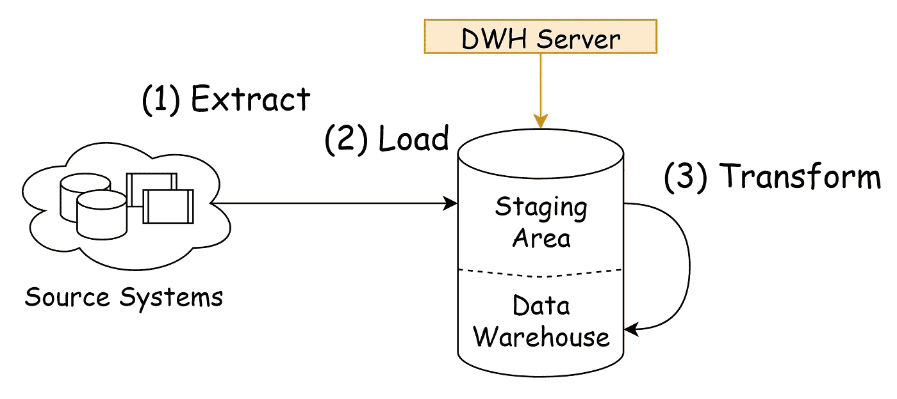
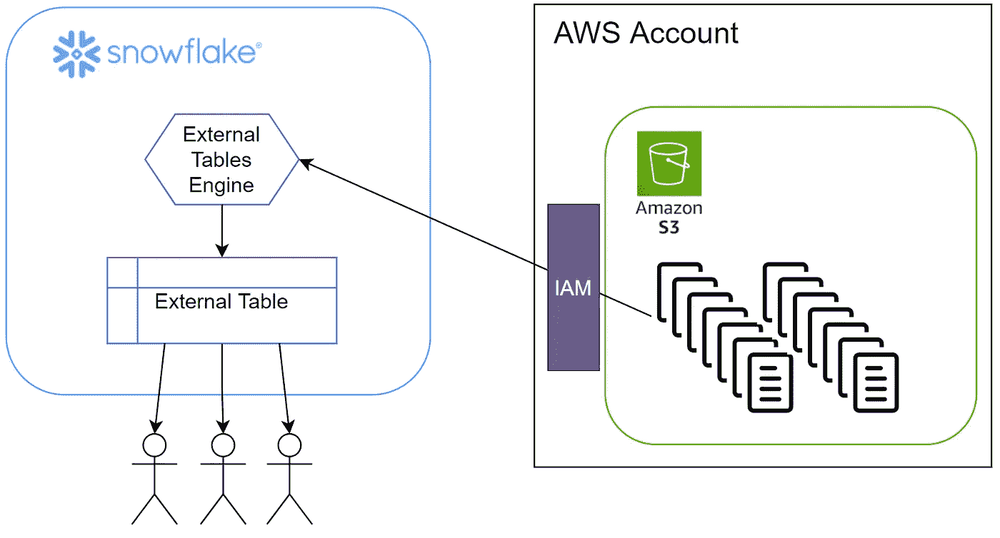
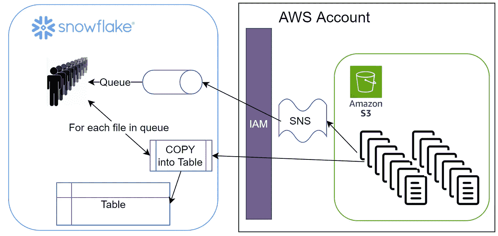
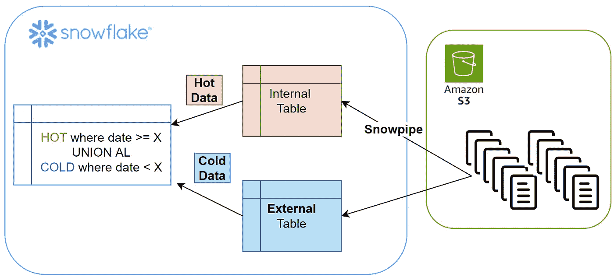

# 雪花中的近实时数据摄取

> 原文：<https://levelup.gitconnected.com/near-realtime-data-ingestion-in-snowflake-7033d45ce860>

## 在雪花中构建近乎实时的摄取管道


保罗·泰森在 [Unsplash](https://unsplash.com?utm_source=medium&utm_medium=referral) 上的照片

# 行动纲要

*   外部表很棒，但永远无法接近雪花内部表
*   Snowpipe 非常有弹性，速度也很快，只要确保你能监测到错误
*   Snowpipe 是一项相当新的技术，所以一些恼人的问题/缺失的功能需要一些解决方法
*   如何轻松实现临时表的热/冷/冻结数据存储方法

# 介绍



ELT 管道

在构建数据仓库或数据湖时，您需要解决的第一个基础问题是复制，这代表了 ELT 三个步骤中的两个(E+L)。本文关注负载部分，更具体地说，关注如何使用 Snowflake 以一种快速、可靠、经济的方式让**每天接收数十亿行数据。**

# 要求

在深入研究细节之前，让我们展示一下理想场景中的中转区应该具备的属性:

*   稳定、始终可用并尽可能保持最新
*   没有数据限制*(拥有所有曾经产生的数据)*
*   高性能
*   业务无缝可用*(使用相同的工具集和语言)*
*   成本效益

对于市场上的大多数 MPP 平台来说，其中大部分并不难获得，但是有两个是特别重要的，并且通常是最棘手的。

## 使所有数据可用

当您每天接收数十亿行数据时，规模就开始蔓延。通常情况下，您只将这些数据保存在数据湖中，只将其中的一小部分放入数据库，以避免高额的存储费用。但是您的企业可能需要 1 年以上的数据“有时”可用…

## 保持它总是最新的

刷新临时区域的方式将直接影响数据仓库的更新程度。在启动 ETL 之前加载数据，在运行 ETL 之前刷新数据，这是一种非常常见的 ETL 模式。然而，对于那些使用暂存区的人来说，这意味着只有 1 小时的刷新时间，这已经是一种妥协，并且限制了一些用例。此外，当处理每隔几分钟就到达的大量流数据时，每小时或每天加载一次可能不是一个好的选择..

现在我们已经了解了我们想要解决的问题，让我们看看雪花工具箱的内部。

# 外部表格



雪花外部表格-概述

把外部表想象成运行在 BLOB 存储数据*(在这种情况下是 S3)*之上的雪花 Presto 引擎，就像任何其他表*一样在您的数据库中可用(您可以在* [*雪花的文档*](https://docs.snowflake.com/en/user-guide/tables-external-intro.html) *中找到更好的解释)。*您可以在内部表和外部表之间混合和匹配，这使得它成为将数据湖中的数据与数据仓库中的数据连接起来的一种极其强大的方式。

## 好人

*   使用外部表作为将所有湖泊数据导入雪花的替代方法。
*   数据始终保持同步，Lake 和转移之间零延迟
*   将大量数据加载到雪花表格中很棒，实际上比使用 COPY 命令要快得多…

## 坏事

*   您必须有一个好的分区方案。当分区修剪不可行时，性能会差得多。
*   用于外部表的[查询优化器很容易混淆(参见链接)](https://jmarquesdatabeyond.medium.com/using-snowflake-external-tables-you-must-read-this-aeb66ae8e0e6)，当这种情况发生时，它最终会进行“全表扫描”(*花费大量的美元和时间*
*   性能永远不如内部表好，即使一切都完美地调优了

# 雪管



Snowpipe —概述

Snowpipe 是一个受管理的无服务器数据加载引擎，在这里你需要为文件的数量付费。你自己也可以用一个 Lambda 函数来实现类似的行为，这个函数会加载某个 S3 桶上的每个文件，但是你需要运行一个仓库，这可能会变得非常昂贵。

用过之后发现还是挺好的。它保持了一个非常稳定的 40 秒最大延迟*(通常大约 30 秒)*在一个文件到达 S3 和被 Snowpipe 摄取之间。还有，到现在为止我还没有看到“丢失的文件”。更多信息，请参见[雪花的文档。](https://docs.snowflake.com/en/user-guide/data-load-snowpipe-intro.html)

## 好人

*   数据在雪花表中，并保持“几乎同步”(*少于 40 秒*)
*   无需管理仓库/λ，可靠，无服务器
*   比其他选择要便宜得多

## 坏事

*   从管道管理的角度来看仍然不成熟(*例如:管道上唯一可能的授权是所有权，您需要使用它来监控管道；要发现错误，您需要一个运行仓库，这可能会使监控变得昂贵* )
    ***编辑 2021–07–18:此限制现已修复，请参考*** [***管道权限文档***](https://docs.snowflake.com/en/user-guide/security-access-control-privileges.html#pipe-privileges)
*   在很可能需要加载超过 7 天的文件的情况下，您将需要使用不同的过程
*   [如果你的 feed 有大量的小文件，Snowpipe 会变得很贵](https://docs.snowflake.com/en/user-guide/data-load-snowpipe-billing.html)。要么合并您的文件，要么考虑其他替代方案。

# 复制—你的老朋友

copy 命令不需要介绍。从性能的角度来看，我发现它与替代方案相比非常慢*(我发现用外部表复制数据可以快 3 倍)*而且我不太清楚向上扩展如何影响性能*(有些文件从向上扩展您的仓库中没有任何好处，有些文件有一些好处，即使不是通常的线性扩展)*。

# 我应该使用什么摄入管道？

现在我们知道了我们可以使用什么工具，是时候开始做一些选择了，而选择总是非常特定于用例的。我想考虑的用例如下:

*   S3 将成为主要的数据湖*(而不是让雪花成为你的数据湖)*
*   临时区域数据必须尽可能是最新的
*   数据只是附加的，从不重叠
*   数据太大了，无法保存在雪花中(*太贵*)，需要一个积极的数据生命周期

在这种情况下，这是我认为的最佳设置:



此使用案例的最佳暂存区架构

这种架构给了你很多:

*   数据从不超过 40 秒不同步 *(vs Lake)*
*   低维护和成本效益(*将这些文件保持在 100-250 MB 左右*)
*   简单的热/冷存储解决方案
*   企业可以使用他们已经知道如何使用的工具访问雪花中的所有数据
*   性能遵循热/冷策略*(访问最新数据比旧数据更快)*
*   在 S3，数据非常容易老化(*您可以使用 S3 数据生命周期*

## 那么，这个解决方案中的“妥协”在哪里呢？

*   它依赖于基于日期的分区方案
*   外部表，就像大多数 Hadoop 引擎一样，非常依赖于分区作为性能优化。如果您的查询错过了分区修剪，性能将受到严重影响
*   雪花外部表的查询优化器目前有一个 bug ( [，我在这里提到过](https://jmarquesdatabeyond.medium.com/using-snowflake-external-tables-you-must-read-this-aeb66ae8e0e6))，它很容易降低查询的性能
*   如果您的数据有一个 upsert 模式，这个模型将需要更改(*仍然可行，但是您需要稍微调整一下视图，性能将受到影响*
*   您将需要一些自动化的过程来应用一个滑动窗口到您的数据和雪花内部的视图
*   如果您需要加载超过 7 天的数据，您将需要一个替代的加载过程

# 我现在就要！！告诉我怎么做！

对于那些想尝试一下的人来说，这是对你需要做的事情的一个高度概括:

## 1.创建您的外部表

说明:[使用外部表格](https://docs.snowflake.com/en/user-guide/tables-external.html)
重要提示:

*   为此，您的数据必须按照“老化”列进行分区
*   如果分区键实现得很好，您应该能够对查询运行一个解释计划，并看到根据该键进行的过滤解析为一个正在读取的分区( *partitionsAssigned = 1* )

## 2.创建内部表

您可以创建一个非常简单的“create table as … where 1=0”来复制列。如果需要，您可以添加和删除列。

重要注意事项:

*   如果有一些预先计算会很方便，并且在一个简单的副本中是可行的，为它们创建列
*   我喜欢添加一些控制列，比如行是何时插入的，或者它来自什么文件(参见[元数据](https://docs.snowflake.com/en/user-guide/querying-metadata.html))

## 3.创建你的雪管

对每个云提供商的说明:[自动化连续数据加载](https://docs.snowflake.com/en/user-guide/data-load-snowpipe-auto.html)

[加载期间转换数据的说明](https://docs.snowflake.com/en/user-guide/data-load-transform.html)

重要注意事项:

*   说明书很长，但是设计得很好
*   如果希望在加载时添加/删除任何柱，请在创建管道时进行。示例:如果您想知道该行来自哪个文件，只需将**元数据$filename** 添加到您的复制命令中。
*   请注意，如果您定制您的副本，您将失去运行 VALIDATION_MODE *(模拟运行)*的能力
*   一旦您创建了 snowpipe，它将默认启用，数据将开始流动

## 4.定义你的分界点

如果您的截止点在过去不到 7 天，您可以使用[刷新管道命令](https://docs.snowflake.com/en/sql-reference/sql/alter-pipe.html)有选择地将文件/路径加载到您的表中:

```
alter pipe mypipe 
refresh prefix='d1/year=2021/' 
modified_after='2021-01-15T13:56:46-07:00';
```

但是，如果您想要更早的数据，我建议使用外部表将数据装载到内部表中。

## 5.创建您的视图

现在您只需要创建您的视图:

```
CREATE VIEW my_new_shiny_view AS
SELECT ..... --make this look like the external table
FROM INTERNAL
WHERE date_part_key >= 'yyyy-mm-dd'::date
UNION ALL
SELECT ..... --precalc cols if you can, to match internal table
FROM EXTERNAL
WHERE date_part_key < 'yyyy-mm-dd'::date
```

## 6.监控使用情况

监视使用情况非常重要，尤其是要注意那些最终仍会进入外部表的查询。如果您得到了正确的分界点，您的大多数查询现在应该只命中您的内部表*(如果没有，您将需要查看查询计划)*。

# 结论

Snowflake 为您提供了相当多的工具来管理您的数据及其接收。和往常一样，每个实现都有优点和缺点，但总的来说，我认为结合 snowpipe 和外部表可以为大多数用例提供解决方案。

## 雪花系列

*这篇文章是我的(不断成长的)雪花系列的一部分。如果您想了解更多关于雪花的信息，您可能也会对这些文章感兴趣:*

*   [是什么让雪花比其他的好得多](https://jmarquesdatabeyond.medium.com/what-makes-snowflake-so-much-better-than-others-58e839e29e80)
*   [使用雪花？不要犯这些昂贵的错误](/using-snowflake-dont-make-these-expensive-mistakes-66c1eaa7d1ee)
*   [*雪花 vs 红移的 RA3——对(不止是)速度的需求*](/snowflake-vs-redshift-ra3-the-need-for-more-than-just-speed-52e954242715)
*   [*使用外部表时的性能考虑*](https://jmarquesdatabeyond.medium.com/using-snowflake-external-tables-you-must-read-this-aeb66ae8e0e6)