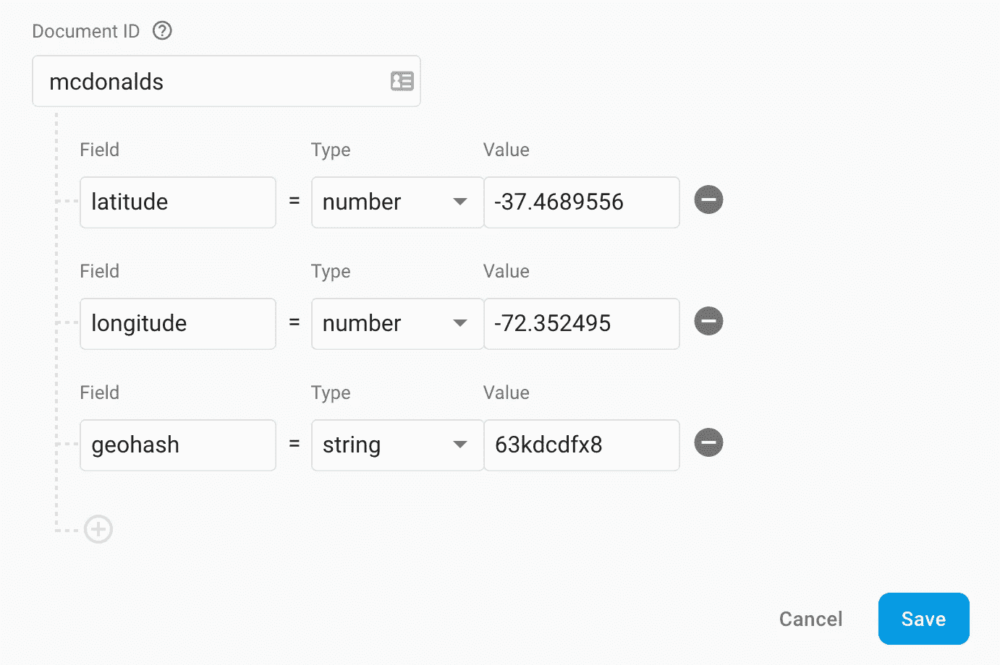

# 使用云 Firestore 进行附近位置查询

> 原文：<https://levelup.gitconnected.com/nearby-location-queries-with-cloud-firestore-e7f4a2f18f9d>

## 使用 Geohashing 在 Google 的云 Firestore 中检索附近的位置。

查询附近的地方几乎是许多网络和移动应用程序的基本功能。让我们深入探讨如何使用 Google Cloud Firestore 实现这一功能。

# 问题是

通常，当搜索附近的位置时，您需要创建一个纬度和经度坐标范围，用于获取餐馆、商店等的列表。但是，云 Firestore 查询只能对单个字段执行范围过滤。这意味着我们无法将纬度和经度作为单独的字段进行查询。那么，我们能把它们结合起来吗？

是的，幸运的是，这种算法已经存在！其他人已经为我们解决了这个问题——它被称为地理哈希。

基本上，Geohashing 将纬度和经度坐标编码成一个字符串——geo hash。这些字符串的格式是这样的，附近的坐标将生成类似的地理哈希。这对于 Firestore 查询中的范围过滤器非常有用。

# 入门指南

让我们从引入地理哈希库开始。
`npm install ngeohash --save`

 [## ngeohash

### nodejs 的 Geohash 库。将一对纬度和经度值编码到 geohash 中。第三个论点是…

www.npmjs.com](https://www.npmjs.com/package/ngeohash) 

此外，请确保您已经安装了谷歌云 Firestore 库。
`npm install @google-cloud/firestore --save`

 [## @谷歌云/firestore

### 这是 Google Cloud Firestore 的 Node.js 服务器 SDK。谷歌云 Firestore 是一个 NoSQL 文件数据库建立…

www.npmjs.com](https://www.npmjs.com/package/@google-cloud/firestore) 

# Firestore 文档结构

为了在查询中使用 Geohashing，您需要确保所有文档(表示数据库中的地点)都具有基于相应纬度和经度的预先计算的 Geohash。我们可以使用库的`encode`方法来计算这个 Geohash。

重要的是，这些文档在执行查询的之前有一个`geohash`字段*。这又回到了解决我们最初的问题，即只能在 Firestore 查询中的一个字段上执行范围过滤。*

比方说，我们正在查询附近的餐馆。给定的 Firestore 文档应该类似于此。

# 执行附近的查询

以下示例说明了如何根据给定的纬度、经度和英里距离执行附近位置查询。我包含了一个生成两个散列的实用函数——一个用于上边界，一个用于下边界。

我还包含了使用地理定位 API 检索客户机当前坐标所需的代码。

 [## 地理定位 API

### 地理定位 API 允许用户向 web 应用程序提供他们的位置，如果他们需要的话。为了隐私…

developer.mozilla.org](https://developer.mozilla.org/en-US/docs/Web/API/Geolocation_API) 

这应该是您使用云 Firestore 执行附近位置查询所需的全部内容！我希望这篇文章能帮助你创建应用程序，并让你更好地理解地理哈希的基础知识，以及为什么我们在使用 Firestore 查询时需要使用它。

如果你有任何问题，请随时回复或给我发信息，我很乐意帮忙。我希望这篇文章能给你带来价值，如果你能花时间与任何能从这些知识中受益的人分享，我将不胜感激。祝您愉快！

## 在 React Native 中使用地理位置 API

 [## 如何在 React Native With Hooks 中使用地理定位

### React Native 中地理定位 API 的说明性介绍

medium.com](https://medium.com/better-programming/how-to-use-geolocation-in-react-native-hooks-aea06bf58263) 

另外，如果你感兴趣的话，我最近写了一篇关于如何使用 React Hooks 在 React Native 中使用地理定位的现代教程。