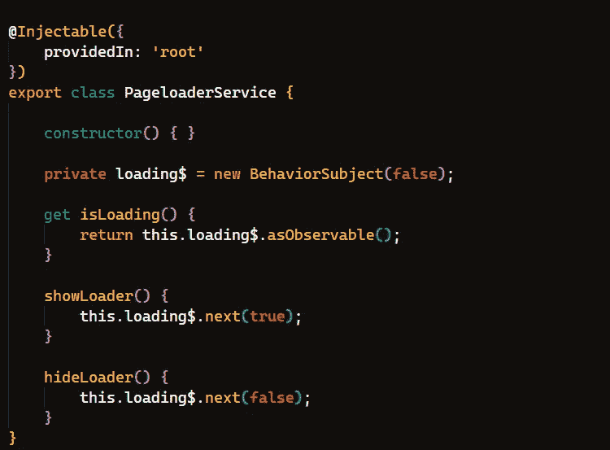
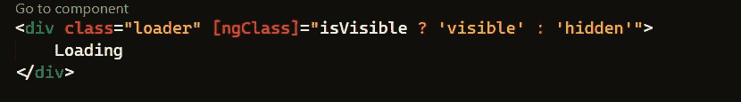
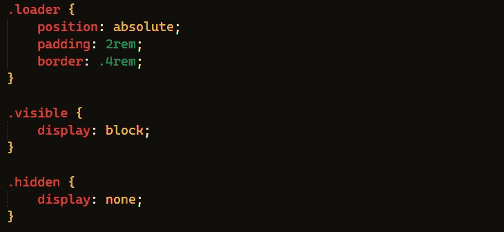
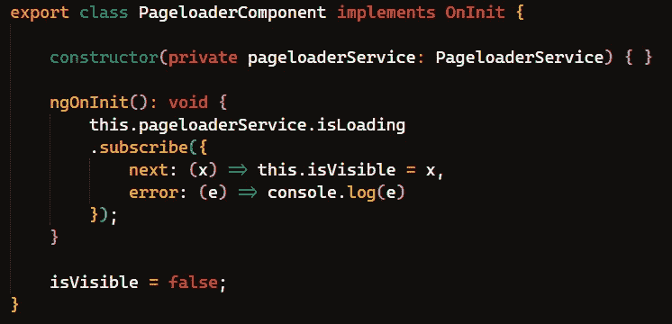
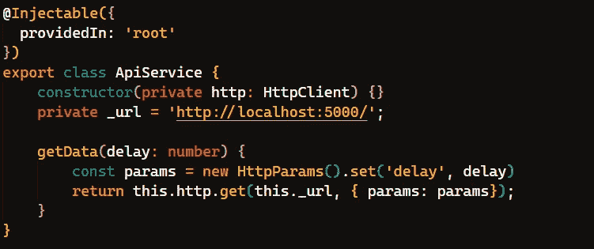
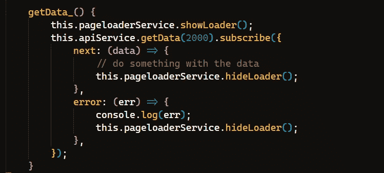
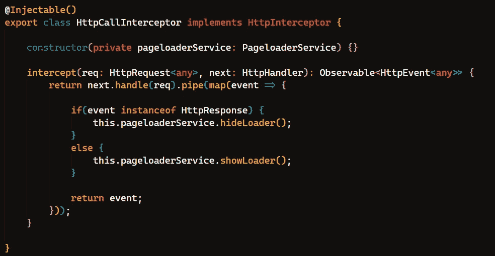
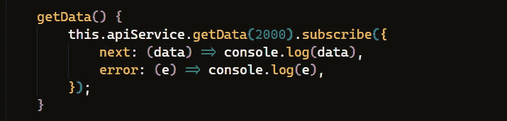
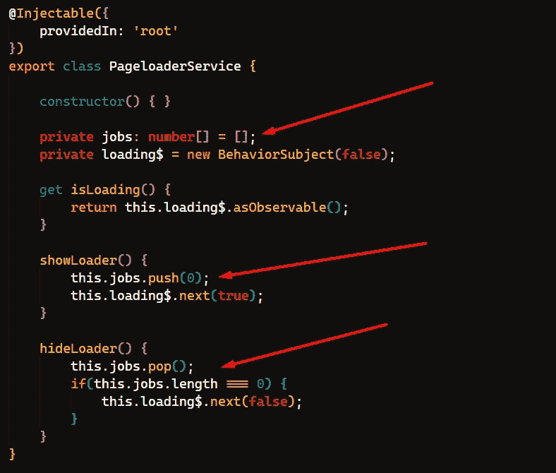

# 有角度的 Http 拦截器的巧妙技巧

> 原文：<https://levelup.gitconnected.com/neat-trick-with-angular-http-interceptor-5ba8412da84b>

我喜欢棱角分明。总有一些技巧可以让你的应用程序开发变得更容易。我不知道我怎么没早点想到这个。

所以，不久前，我写了关于从零开始实现页面加载器的文章。然而，我遗漏了一个小细节(bug ),我将在这里解决它。

让我们再次重新创建这个页面加载器组件和服务。概念我就不再解释了，这个仅供参考。裸机再次实现:



pageloader.service.ts

跟踪装载机状态的简单服务。现在是组件:



pageloader.component.html



pageloader.component.css



pageloader.component.ts

该组件订阅服务来显示/隐藏带有“加载”文本的 div。还是那句话，我不在乎这里的风格。

那么，我们什么时候使用页面加载器呢？从服务器获取一些数据是一个常见的场景，所以让我们为此创建一个服务:



api.service.ts

我创建了一个很小的后端项目，只有一个端点来返回随机数据。它得到这个*延迟*参数，这样我就可以指定呼叫将持续多长时间。否则，我几乎可以立即得到结果。后端部分超出了本文的范围，您可以使用`express.js`或其他东西来完成。

鉴于上述所有情况，从某个组件获取的内容应该是这样的:



一些组件

我们必须显示页面加载器，获取数据，然后在成功或错误响应中隐藏它。为了！每一个！该死的。Http 呼叫！

如果页面加载器每次都自动出现和消失，那不是很好吗？没错。我们可以从一个`HttpInterceptor`调用它。

拦截器主要用于将 JWT 附加到传出请求的授权头，但是没有什么可以阻止我们做更多的事情。您还可以拦截 http 调用的**响应**。想象力是极限。所以让我们实现这样的拦截器:



httpCall.interceptor.ts

简单的东西。有很多关于如何使用角度拦截器的教程，所以我不会在这里讨论细节。主要思想是使用`rxjs/pipe`和`rxjs/map`操作符，并检查`HttpEvent`是请求类型还是响应类型。只需注入`pageloaderService`并调用适当的动作。这样，我们可以像这样重写`getData()`函数:



页面加载器将会自动显示和隐藏。酷毙了。

然而，并不是一切都很好。我在之前的帖子中提到过我没有解决一个 bug，这个 bug 在这里也一直存在。幸运的是，这很容易解决。完成所有拦截器的工作后，考虑下面这段代码:

```
apiService.getData(delay: 2 seconds).subscribe(...);
apiService.getData(delay: 1 second).subscribe(...);
```

我在这里试图模拟的是不止一个组件从服务器获取数据的情况。这些操作可能需要不同的时间，但是拦截器会为每个请求显示/隐藏页面加载器。在上面的场景中，第一个 http 调用显示页面加载器，然后第二个调用再次显示页面加载器(页面加载器已经启动，所以还没有任何问题)，但是第二个调用在第一个调用完成获取数据之前完成，并隐藏了加载器。不太好。

我们需要跟踪有多少东西被称为显示/隐藏页面加载器函数。只有当比率为 0 时，我们才能安全地隐藏它。这很容易实现。第回`PageloaderService`:



非常愚蠢但有效的修复。只需添加一个数组。我称之为`jobs`。每当调用`showLoader()`时，将一个元素推入其中。每当调用`hideLoader()`时，弹出一个元素，检查长度是否为 0。这样，您就知道所有的*【作业】*都已完成，并且您可以安全地隐藏加载程序。或者，你可以使用`jobCount: number` 变量来代替数组。

恐怕就这样了。不完全是火箭科学，但这应该是一件好事，对不对？

感谢阅读:)