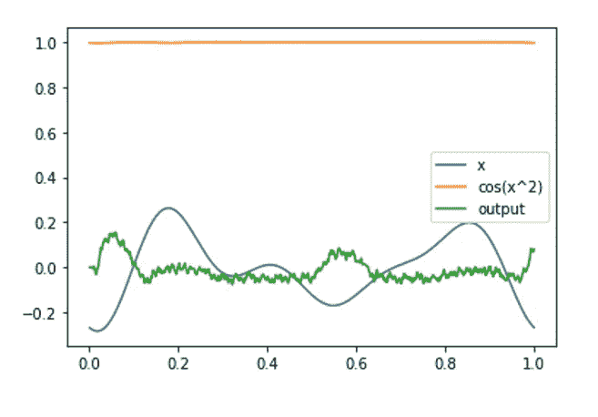
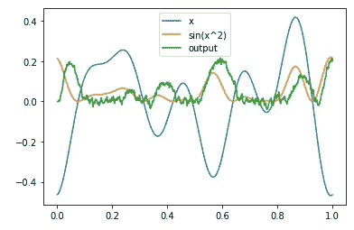

# Nengo:如何用 Python 模拟网络信号

> 原文：<https://levelup.gitconnected.com/nengo-how-to-simulate-network-signals-with-python-3a0f78ddc597>

## 深度学习和模拟工具



Nengo 网络。作者的照片

在本文中，我们将讨论简单的 nengo 网络来产生和模拟信号 a 波。

Nengo 是一个用于构建、开发、模拟深度学习项目的工具。

[](https://pub.towardsai.net/differences-between-concat-merge-and-join-with-python-1a6541abc08d) [## Python 中 concat()、merge()和 join()的区别

### 在 pandas 中组合数据帧

pub.towardsai.net](https://pub.towardsai.net/differences-between-concat-merge-and-join-with-python-1a6541abc08d) [](https://pub.towardsai.net/understand-time-series-components-with-python-4bc3e2ba1189) [## 用 Python 理解时间序列组件

### 机器学习中预测模型的基本概念及实例

pub.towardsai.net](https://pub.towardsai.net/understand-time-series-components-with-python-4bc3e2ba1189) 

如果您的环境中没有安装 nengo，请使用 pip 下载。

```
pip install nengo
```

我们需要导入库

```
import nengo
import numpy as np
import matplotlib.pyplot as plt
```

现在，我们将在 nengo 中制作一个网络和连接来定义输入并连接它们。

```
num = 0
np.random.seed(num)**#We need seed to process the network's build**
with nengo.Network(seed=num) as net:**#Giving input to the node for data summary**
    inpt = nengo.Node(nengo.processes.WhiteSignal(1, 5, rms=0.3))
```

WhiteSignal 是一个前端 API 类方法，在一个进程中对白噪声进行低通滤波。创建该信号是为了使功率低于截止频率。

白色信号中的参数是 period，high，rms，y0，seed。在本例中，**周期** = 1，**高电平** = 5，**均方根值** = 0.3。

*   **周期**将产生周期性白噪声。
*   **高**值是低通滤波器截止频率的限值。
*   **rms** 是经过滤波的信号的均方根值。

下一步是给出神经元的数量和维度。

```
**# To simulate Sin wave with 20 neurons and 1 dimension**
    square = nengo.Ensemble(20, 1)**# This is second ensemble input**
    sin = nengo.Ensemble(20, 1)**# Creating another node to output summary**
    outpt = nengo.Node(size_in=1)
```

现在，是时候连接所有并探测它们了。探测方法用于从输出模拟中获取数据。

```
**# Connect all input and output with connection method**
    nengo.Connection(inpt, square)
    nengo.Connection(square, sin, function=np.square)
    nengo.Connection(sin, outpt, function=np.sin)**# using probe to get input and output data**
    inpt_p = nengo.Probe(inpt)
    outpt_p = nengo.Probe(outpt, synapse=0.01)
```

现在，我们将运行模拟器来获取数据。

```
with nengo.Simulator(net, seed=seed) as sim:
    sim.run(1.0)
```


作者的照片

现在，我们将定义绘制信号的函数。

```
def plot(plot_sim, ax=None, idx=slice(None)):
    if ax is None:
        plt.figure()
        ax = plt.gca()
    ax.plot(plot_sim.trange(), plot_sim.data[inpt_p][idx],
    label="x")
    ax.plot(plot_sim.trange(), np.sin(plot_sim.data[inpt_p][idx]**
    2), label="sin(x^2)")
    ax.plot(plot_sim.trange(), plot_sim.data[outpt_p][idx],
    label="output")
    ax.legend()plot(sim)
```

图输出如下所示:



输出图。作者的照片

## 结论:

本文给出了使用 nengo 工具的基本思想以及程序中对象的使用。

我希望你喜欢这篇文章。通过我的 [LinkedIn](https://www.linkedin.com/in/data-scientist-95040a1ab/) 和 [twitter](https://twitter.com/amitprius) 联系我。

# 推荐文章

[1。NLP —零到英雄与 Python](https://medium.com/towards-artificial-intelligence/nlp-zero-to-hero-with-python-2df6fcebff6e?sk=2231d868766e96b13d1e9d7db6064df1)
2。 [Python 数据结构数据类型和对象](https://medium.com/towards-artificial-intelligence/python-data-structures-data-types-and-objects-244d0a86c3cf?sk=42f4b462499f3fc3a160b21e2c94dba6)3 .[Python 中的异常处理概念](https://pub.towardsai.net/exception-handling-concepts-in-python-4d5116decac3?source=friends_link&sk=a0ed49d9fdeaa67925eac34ecb55ea30)
4。[用 Python 进行主成分分析降维](https://pub.towardsai.net/principal-component-analysis-in-dimensionality-reduction-with-python-1a613006d531?source=friends_link&sk=3ed0671fdc04ba395dd36478bcea8a55)
5。[用 Python 全面讲解 K-means 聚类](https://medium.com/towards-artificial-intelligence/fully-explained-k-means-clustering-with-python-e7caa573176a?source=friends_link&sk=9c5c613ceb10f2d203712634f3b6fb28)
6。[用 Python](https://medium.com/towards-artificial-intelligence/fully-explained-linear-regression-with-python-fe2b313f32f3?source=friends_link&sk=53c91a2a51347ec2d93f8222c0e06402)
7 全面讲解了线性回归。[用 Python](https://medium.com/towards-artificial-intelligence/fully-explained-logistic-regression-with-python-f4a16413ddcd?source=friends_link&sk=528181f15a44e48ea38fdd9579241a78)
充分解释了 Logistic 回归 8。[用 Python 实现时间序列的基础知识](https://medium.com/towards-artificial-intelligence/basic-of-time-series-with-python-a2f7cb451a76?source=friends_link&sk=09d77be2d6b8779973e41ab54ebcf6c5)
9。[与 Python 的数据角力—第一部分](https://pub.towardsai.net/data-wrangling-with-python-part-1-969e3cc81d69?source=friends_link&sk=9c3649cf20f31a5c9ead51c50c89ba0b)
10。[机器学习中的混淆矩阵](https://medium.com/analytics-vidhya/confusion-matrix-in-machine-learning-91b6e2b3f9af?source=friends_link&sk=11c6531da0bab7b504d518d02746d4cc)