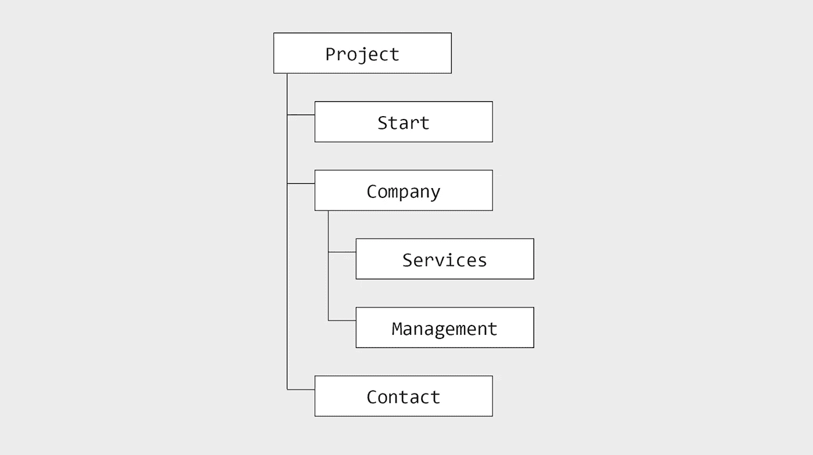
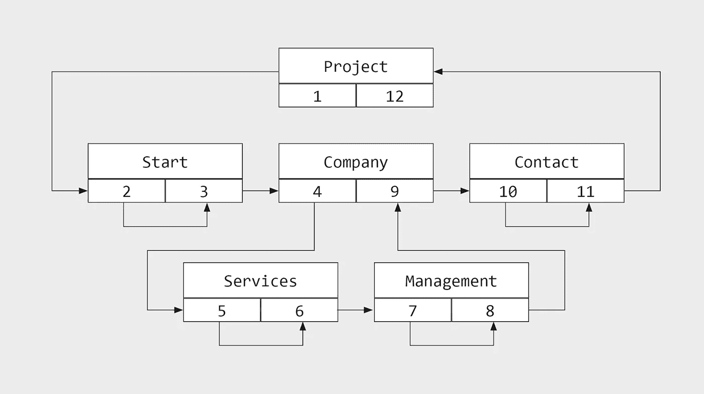
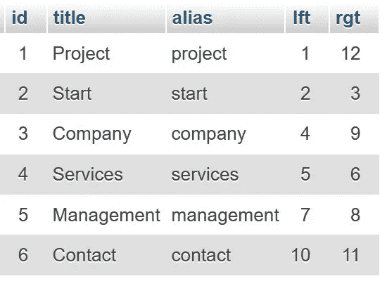
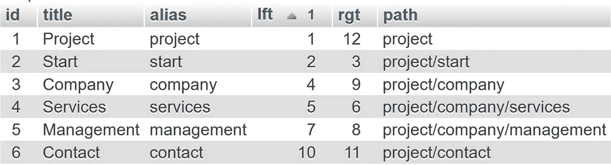
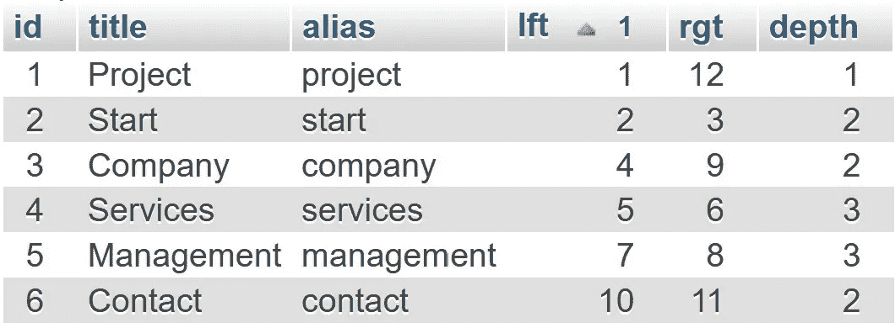
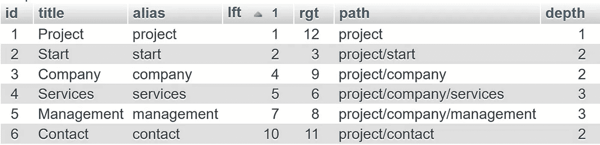

# MySQL 网站的性能树——嵌套集合和别名路径

> 原文：<https://levelup.gitconnected.com/nested-sets-and-alias-paths-performant-trees-for-websites-with-mysql-d7ad4e4a8b4>

## 一个简单的教程，展示了如何使用嵌套集合模型在 MySQL 中映射性能树结构。

我用的是网站的嵌套集模型，不是论坛或者评论软件。有足够多的文章展示了在论坛环境中嵌套集合是多么复杂。由于网站通常对其结构的数据库有更多的读写权限，这在这里不是一个问题。

# 出发点



起点是一个简单的树形结构。

为了说明原理，我拿一个很小的网站的结构来说:*【项目】*是根，*【开始】**【公司】**【联系人】*是深度 1 的分支。*【公司】*还有支行*【服务】**【管理】*。

# 这个概念



嵌套集合背后的概念。

在嵌套集合中，一棵树的每个分支都有两个值:*“左”*和*“右”*。根的左值总是 1。

例如，left 值可用于读取排序顺序。

```
1  Project
2  Start
4  Compamy
5  Services
7  Management
10 Contact
```

一个分支的子分支数可以用下面的公式(“右”-左)-1)/2 来计算。以*【公司】*分公司为例:

```
(9 - 4 - 1) = 2
```

更多创建、编辑和删除分支的例子可以在网上找到。我在下面的文章里附上了几个链接。

# 用 MySQL 阅读会说话的网址



phpmyadmin 中的示例表数据。

我已经在 MySQL 中构建了上面的例子。表格*“页面”*有以下几列:*“id”**“标题”**“别名”**“lft”**“rgt”*。

字段*“别名”*现在可用于通过子选择读出相应页面的路径:



带有路径子选择的 SQL 查询的结果。

# 使用子选择读取分支深度

使用另一个子选择，分支的深度也可以读取如下:



有深度的结果。

# 带有别名路径和分支深度的完整 MySQL 查询。

如果你现在把两者结合起来，你就获得了构建一个网站结构所需的所有价值。



路径和深度的结果。

**好处:**表格可以很容易地用一个栏目*【语言】*来扩展，实现一个多语言的网站。每种语言都需要一个单独的根页面。

**方便:**通过在查询末尾添加一个简短的 where 子句，可以从结果中删除根页面:

```
...
FROM pages
WHERE pages.lft!=1
...
```

在过去的几年里，我用这种方法做得非常好，并且用多种语言和超过 50 个子页面实现了各种项目。即使在小型网站上，性能也非常好。

如果有更好更有效的方法来用 MySQL 显示网站树，请告诉我！我期待你对这个话题的反馈！