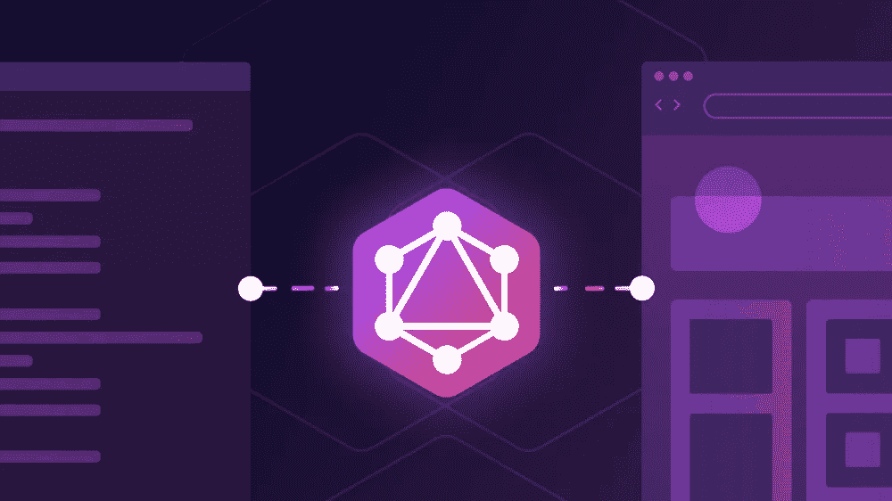

# 在 GraphQL 模式中嵌套 GitHub 的 API

> 原文：<https://levelup.gitconnected.com/nesting-githubs-api-in-your-graphql-schema-bf87b96177c9>



图片作者:Aaron Ortbals

GraphQL 很棒。每个 GraphQL 端点都同意使用相同的语言`{data, errors}`,这使得服务器之间的通信变得容易。现在假设两个公共 API 都使用 GraphQL 我们可以利用哪些优势？像 [graphql-tools](https://www.graphql-tools.com/) 这样的包使得合并和缝合模式变得容易，这允许团队通过连接和联合功能构建他们的子模式的独立部分。但是有自己的认证、速率限制和错误的第三方模式呢？比如看一下 [GitHub 的 GraphQL API](https://docs.github.com/en/graphql/overview/explorer) 。如果能把 GitHub 的端点嵌套在自己的模式中岂不是很棒？在一个简单的 GraphQL 查询中，您可以从您的应用程序中获得用户的姓名，也可以从 GitHub 中获得他们的简历:

```
# Application schema
query {
  viewer {
    name
    githubApi {
      # GitHub's schema
      query {
        viewer {
          bio
        }
      }
    }
  }
}
```

当然这只是开始。客户端可以更新你的应用和 GitHub，而不需要任何额外的后端逻辑。很好的图表:

```
mutation ($userId: String!) {
  addFriend(userId: $userId) {
    user {
      name
      githubApi {
        mutation {
          followUser(input: {userId: $userId}) {
            user {
              bio
            }
          }
        }
      }
    }
  }
}
```

有了 [nest-graphql-endpoint](https://github.com/ParabolInc/nest-graphql-endpoint) ，这终于成为可能🎉。

# 商业案例

今天，建设一个成功的 SaaS 意味着在客户所在的地方与他们见面——集成他们已经使用的工具。我已经为 Slack 和 Atlassian 构建了集成，但是在构建 GitHub 集成时，我注意到我在重新创建 GitHub 的 API 已经内置的许多逻辑。

例如，我们的[规划扑克会议](https://www.parabol.co/solutions/sprint-poker)从 GitHub 获取团队的所有故事，提供一种有趣的、身临其境的方式给每个故事打分，并将分数导出到 GitHub。没有嵌套 GitHub 的模式，我创建了自己的有一个`repos`字段的`GitHubIntegration`对象。该字段有一个定制的`resolve`函数，通过使用手写的 GraphQL 字符串从 GitHub 获取 repos。这不是很好，有几个原因:

*   这是我必须维护的额外代码
*   该查询没有明确显示前端开发人员哪些部件来自 GitHub
*   如果没有数据加载器，多个查询会导致对 GitHub 的多次提取
*   即使有了数据加载器，对 GitHub 的多次提取也是不可避免的，除非每个查询都是相同的(因此会导致过度提取)

我需要的是一种方法，将所有发送到 GitHub 的片段进行批处理，将它们合并成一个网络请求，然后再将响应解析成相应的片段。为什么要批处理？因为在现实世界中，查询会变得很大&经常重复:

```
query {
  viewer {
    githubApi {
      query {
        ...Bio
      }
    }
    myTasks {
      user {
        githubApi {
          query {
            ...Bio
            viewer {
              bio
              id
            }
          }
        }
      }
    }
  }
}fragment Bio on _extGitHubQuery {
  viewer {
    bio
  }
}
```

# 工作原理:nest-graphql-endpoint

考虑到所有这些复杂性，我需要一种方法，只用一行代码就能在我的模式中嵌套端点:

```
const mergedSchema = nestGitHubEndpoint({
  parentSchema,
  fieldName: 'githubApi',
  parentType: 'User',
  resolveEndpointContext: (source) => ({accessToken: source.accessToken})
})
```

就是这样！您的`User`对象现在有了一个包含查询、突变和错误的`githubApi`对象。`resolveEndpointContext`允许您获取并提供访问端点所需的密钥。

在幕后，它是这样工作的:

1.  它获取 GitHub 模式并为所有的`__typename`字段添加前缀，这样您就可以编写查询，而不用担心命名冲突
2.  它收集了`gitHubApi`对象中的所有片段&并将它们合并成一个查询
3.  它删除了未使用的变量、变量定义和片段
4.  它取消了`__typename`字段的前缀，这样 GitHub 就能理解这个查询
5.  在名称冲突的情况下，它会在获取请求之前给字段起别名
6.  它取消响应的别名，重新应用`__typename`前缀，并通过路径过滤错误

让我们看看它是如何建造的。

# 构建 GitHub 模式

GitHub 提供了一个很棒的包叫做[@ octo kit/graph QL-schema](https://github.com/octokit/graphql-schema)。它提供了一个 GitHub 模式，保证是最新的，所以我不需要异步获取自省模式。然后，我使用 [graphql-tools](https://www.graphql-tools.com/) ' `wrapSchema`到[用我的前缀](https://github.com/mattkrick/nest-graphql-endpoint/blob/main/src/nestGraphQLEndpoint.ts#L44)重命名类型。`wrapSchema`内部增加一个代理解析器，调用他们的`delegateToSchema`函数。由于我们自己处理所有的获取，我们可以用默认的 GraphQL 解析器覆盖这个解析器:

```
(source, _, _, info) => source[info.fieldName]
```

最后，我们使用 graph QL-tools[将包装的模式](https://github.com/mattkrick/nest-graphql-endpoint/blob/main/src/nestGraphQLEndpoint.ts#L77)合并到父模式中。这给了我们一个如下所示的对象扩展:

```
user {
  githubApi {
    errors {...}
    query {...}
    mutation {...}
  }
}
```

请注意，`errors`是它自己的字段，尽管它将由`query`或`mutation`的响应填充。通过设计，GraphQL 使得一个字段似乎不可能填充另一个字段的响应。为了解决这个问题，`errors`字段返回一个承诺&通过改变`source`将`resolve`回调暴露给其他操作。你可以称它为 hacky，但我认为它非常干净😎。

# 分批处理碎片

在 Urql、Apollo 和 Relay Modern 出现之前，我写了一个糟糕的 GraphQL 客户端缓存，叫做 [Cashay](https://github.com/mattkrick/cashay) 。虽然这个项目没有取得任何进展，但它教会了我很多关于 GraphQL AST 的知识。例如，遍历 AST 很痛苦，但是 GraphQL 内置了一个节点访问者函数！

假设我们的查询有一堆变量，但其中只有一部分需要发送到 GitHub。我们如何确定哪些变量需要删减？这很简单，因为:

```
const usedVariables = new Set<string>()
graphql.visit(selectionSet, {
  Variable(node) {
    usedVariables.add(node.name.value)
  },
})
```

同样的模式可以重复用于片段、变量定义(看起来像`$foo: String!, $bar: ID`的块)，甚至是我们加前缀的`__typename`字段。一旦每个片段都被重构为一个独立的查询，就应该将尽可能多的片段组合在一起并进行合并。

为了完成批处理，我们使用关闭了缓存功能的[数据加载器](https://github.com/mattkrick/nest-graphql-endpoint/blob/main/src/getDataLoader.ts#L9-L11)。为什么没有缓存？每个请求都有一个与其他请求稍有不同的查询。例如，一个片段可能要求`viewer {id}`，而另一个片段要求`viewer {id, bio}`。我们*希望*将它们合并在一起，如果我们基于键进行缓存，那么它们将被分开保存。

也就是说，我们希望[在整个执行过程中重用同一个数据加载器](https://github.com/mattkrick/nest-graphql-endpoint/blob/main/src/getDataLoader.ts#L5)，所以我们将所有的数据加载器保存在一个`WeakMap`中，其中键是`context`，因为每次调用`GraphQL.execute`都会创建一个新的`context`。通过使用`WeakMap`，我们防止了内存泄漏，因为一旦`GraphQL.execute`不再引用`context`，它也将从`WeakMap`被垃圾收集。

一旦一个滴答过去，dataloader 用一个查询数组[调用它的批处理函数&变量，我们可以将这些变量合并在一起](https://github.com/mattkrick/nest-graphql-endpoint/blob/main/src/batchFn.ts#L25)。首先，[我们合并所有具有唯一名称的字段](https://github.com/mattkrick/nest-graphql-endpoint/blob/main/src/mergeGQLDocuments.ts#L108)。然后，如果两个字段共享一个名称，[我们比较它们的所有子字段](https://github.com/mattkrick/nest-graphql-endpoint/blob/main/src/mergeGQLDocuments.ts#L124)。如果两个字段不同，我们[将其中一个字段命名为](https://github.com/mattkrick/nest-graphql-endpoint/blob/main/src/mergeGQLDocuments.ts#L59-L67):

```
**# Before**
query {
  repository(name: "parabol", owner: "parabolinc") {
    id
  }
}
query {
  repository(name: "nest", owner: "mattkrick") {
    id
  }
}**# After**
query {
  repository(name: "parabol", owner: "parabolinc") {
    id
  }
  repository_2: repository(name: "nest", owner: "mattkrick") {
    id
  }
}
```

这种策略允许我们将无限数量的片段一起批处理到一个网络请求中。我们只需要保存我们添加的别名列表，这样最终的响应看起来就像是`**#Before**`请求。

# 处理响应

当 GitHub 响应时，它可能不是 GraphQL 对象。GitHub [可能关闭了](https://github.com/mattkrick/nest-graphql-endpoint/blob/main/src/nestGitHubEndpoint.ts#L48)，或者[网关可能需要太长时间来响应](https://github.com/mattkrick/nest-graphql-endpoint/blob/main/src/nestGitHubEndpoint.ts#L37)，或者如果 auth 令牌无效，它可能只是发送`{message}`。为了处理这些情况，执行程序用一个超时&来包装获取。如果响应看起来不像一个`GraphQLExecutionResult`，它将强制它成为一个。

一旦我们有了形状为`{data, errors}`的东西，剩下要做的就是[为每个片段](https://github.com/mattkrick/nest-graphql-endpoint/blob/main/src/batchFn.ts#L54-L57)创建一个响应对象。这意味着取消我们重命名的字段的别名，给`__typename`字段重新加前缀，并且[通过片段](https://github.com/ParabolInc/nest-graphql-endpoint/blob/main/src/filterErrorsForDocument.ts#L4-L23)过滤错误。过滤错误很容易，因为大多数错误都有一个显示错误发生位置的`path`。例如，如果路径是`['viewer', 'repository_2']`，那么我们知道错误应该只出现在第二个片段中。

# 结论

嵌套 GraphQL 端点是 GraphQL 统治世界的下一步。在未来，每个服务都使用 GraphQL 模式，集成将轻而易举地实现，并且需要更少的代码。听起来很有趣？我们正在招聘。让我们一起做些酷的东西。