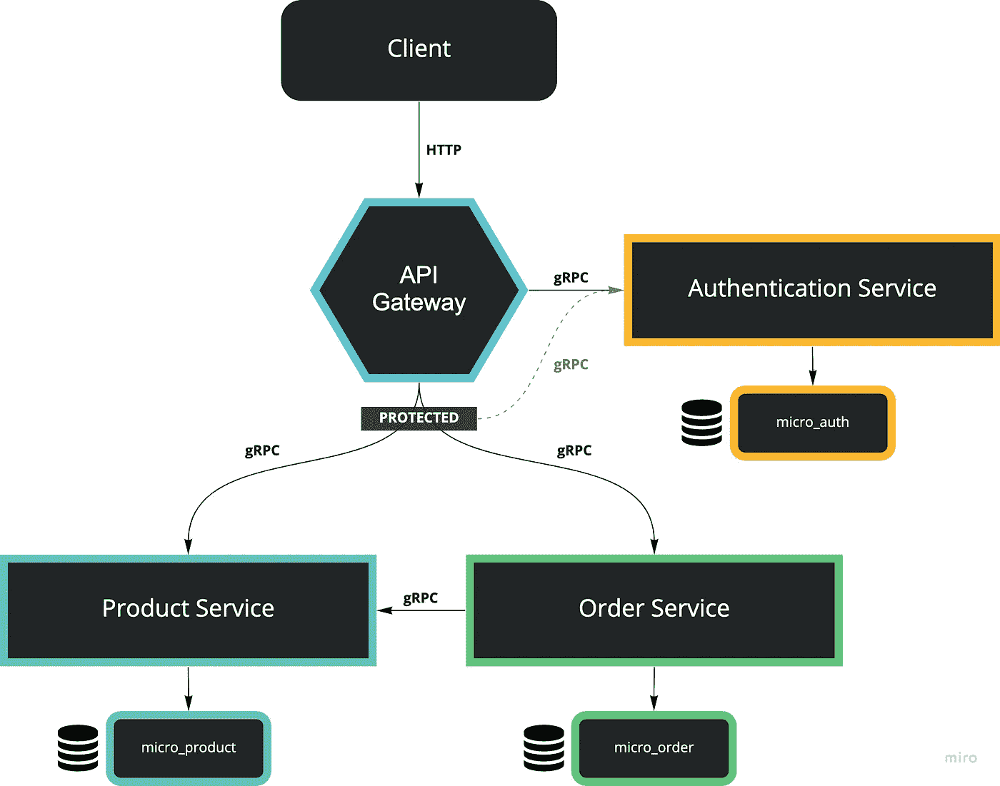
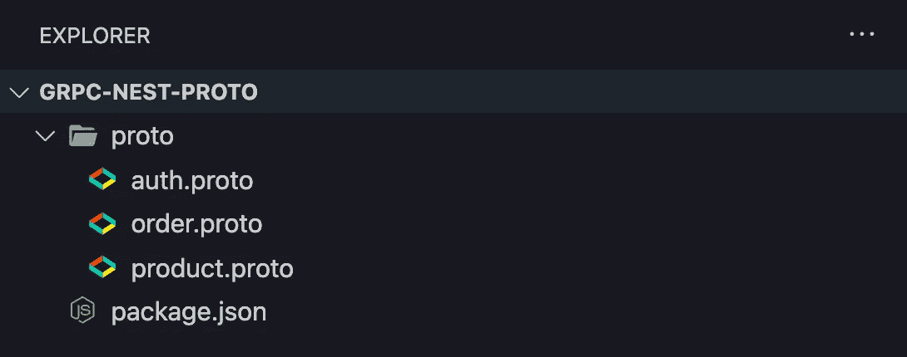

# NestJS:具有 gRPC、API 网关和认证的微服务—第 1/2 部分

> 原文：<https://levelup.gitconnected.com/nestjs-microservices-with-grpc-api-gateway-and-authentication-part-1-2-650009c03686>

## 以打字打的文件

## 分步指南:使用 TypeScript、gRPC、API 网关、身份验证和验证的 NestJS 应用程序



今天我要向大家介绍的是 **NestJS (TypeScript)** 中的**微服务**结合 Google 的 **gRPC 框架**，以及基于 **JWT** 处理传入 HTTP 请求的 **API 网关**和**认证**。这篇文章很长，所以我把它分成两部分。

1.  介绍、准备、数据库、共享原型项目
2.  认证微服务、产品微服务、订单微服务

您将在本文的每一节中找到每个存储库的链接。这里可以看第二部[。](/nestjs-microservices-with-grpc-api-gateway-and-authentication-part-2-2-d67dc8e3b86a)

# 应用基础设施

对于本文，我决定编写一个简单的电子商务微服务项目，该项目使用 API 网关管理传入的 HTTP 请求，并将它们转发给总共 3 个微服务。

*   第一个**服务**将是**认证**，用户可以注册并登录，同时我们验证请求的授权。
*   **第二个服务**将处理**产品**来创建一个新的产品，但是也根据它的 ID 找到一个产品。
*   这对第三个服务**很重要，它为我们的小型电子商务应用程序处理传入的**订单**。**

您将看到，这些服务中的每一个都尽可能地向您介绍 NestJS 和 TypeScript 中微服务的基础知识，同时不破坏我们的应用程序。

我们不会处理环境变量、截止日期、深度错误处理、docker 和复杂配置。所以不要担心，**我们保持简单！**

每个服务将是一个独立的项目，所以请记住这一点。此外，我们将有一个共享的存储库，在那里我们存储和管理原型文件，这是使用 gRPC 时的常见做法。最后但同样重要的是，我们将创建另一个项目，这将是 API 网关。所以我们总共谈论 5 个项目。

在我们开始阅读本指南之前，让我们先简要讨论一下我们将在这里使用的框架和概念。这听起来可能很无聊，但是请继续关注我，了解接下来会发生什么以及理解我们将要构建的应用程序是非常重要的。

## 什么是 NestJS？

NestJS 是一个用于构建高效、可伸缩的 Node.js web 应用程序的框架。它使用现代 JavaScript，并且是用 TypeScript 构建的。如果您开发一个用 TypeScript 构建的 API，那么 NestJS 是一个不错的选择！它深受春天和棱角的启发。

## gRPC 是什么？

gRPC 是一个现代的、开源的、高性能的 RPC 框架，可以在任何环境下运行。借助对负载平衡、跟踪、运行状况检查和身份验证的可插拔支持，它可以高效地连接数据中心内和数据中心间的服务。

## 什么是 API 网关？

API 网关是所有客户机的入口点，在我们的例子中，是所有基于 HTTP 的客户机请求的入口点，但它不需要仅限于 HTTP。API 网关以两种方式之一处理请求。一些请求被简单地代理/路由到适当的服务。它通过分散到多个服务来处理其他请求。


照片由 [Maxime Horlaville](https://unsplash.com/@mxhpics?utm_source=medium&utm_medium=referral) 在 [Unsplash](https://unsplash.com?utm_source=medium&utm_medium=referral) 上拍摄

# 逐步指南

正如我所说的，我把这篇文章分成了两部分。覆盖范围将是这样的:

1.  数据库，共享原型项目，API 网关
2.  认证微服务、产品微服务和订单微服务

# 先决条件

它需要对你本地安装在机器上的 TypeScript、RPC、Git (+ Github)、PostgreSQL 有一个基本的了解。我会选择 [Visual Studio 代码](https://code.visualstudio.com/)作为我的代码编辑器。你可以用你喜欢的任何东西。

## 注意力

在本文中，您会经常看到命令`code .`。这是一个基于当前目录打开 Visual Studio 代码的 Visual Studio 代码命令。如果不使用 Visual Studio 代码，请确保在 IDE 或代码编辑器中打开了正确的目录。

# 数据库ˌ资料库

首先，我们需要创建 3 个 PostgreSQL 数据库。这是因为我们将遵循每服务的[数据库模式。当涉及到数据管理时，每一个微服务的数据库都将是独立的。](https://microservices.io/patterns/data/database-per-service.html)

每个人都有不同的处理方式，有些人使用某种图形用户界面，但我们将使用我们的终端。同样，您需要在您的机器上安装 PostgreSQL。如果您安装了 PostgreSQL，以下四个命令将在 Linux、Mac 和 Windows 机器上运行。

```
$ psql postgres
$ CREATE DATABASE micro_auth;
$ CREATE DATABASE micro_product;
$ CREATE DATABASE micro_order;
$ \l
$ \q
```

## 命令解释:

*   使用用户 Postgres 打开 psql CLI
*   `CREATE DATABASE micro_auth;`创建数据库
*   `CREATE DATABASE micro_product;`创建数据库
*   `CREATE DATABASE micro_order;`创建数据库
*   `\l`列出所有数据库
*   `\q`退出 psql CLI

在我们成功地执行了所有四个命令之后，我的终端看起来应该是这样的。正如我们所看到的，这 3 个数据库创建成功。


# 创建项目

让我们继续讨论 NestJS。我们将在全球范围内安装 NestJS CLI。

```
$ npm i -g @nestjs/cli
```

我们用它的 CLI 初始化了 4 个新的 NestJS 项目。此外，我们为我们要通过 Github 共享的原型文件创建了一个项目。

> 我建议创建一个文件夹作为工作空间，您可以在终端中执行以下命令，将所有项目放在一个地方，但这取决于您。因此它不是本指南的一部分。

```
$ mkdir grpc-nest-proto
$ nest new grpc-nest-api-gateway -p npm
$ nest new grpc-nest-auth-svc -p npm
$ nest new grpc-nest-product-svc -p npm
$ nest new grpc-nest-order-svc -p npm
```

# 共享原型存储库

所以，正如我所说的，我们将从共享原型项目开始。我们需要这样做，因为我们必须在所有其他项目中使用这些文件。

github:[https://github.com/hellokvn/grpc-nest-proto](https://github.com/hellokvn/grpc-nest-proto)

首先，我们需要在我们的代码编辑器中打开项目，这个命令`code .`在我们的 VSCode 编辑器中打开`grpc-proto`项目。

```
$ cd grpc-nest-proto
$ npm init --y
$ git init
$ mkdir proto
$ touch proto/auth.proto && touch proto/product.proto && touch proto/order.proto
$ code .
```

该项目将如下所示:



然后，我们将添加一些代码到我们的原型文件。跟我来。

## 授权协议

首先，我们将为我们的认证服务创建原型文件。我们将添加 3 个 RPC 端点:`Register`、`Login`和`Validate`

让我们给`proto/auth.proto`添加一些代码

## 订单原型

其次，我们将为订单服务创建原型文件。我们将只添加一个名为`CreateOrder`的 RPC 端点。

让我们给`proto/order.proto`添加一些代码

## 产品原型

最后但同样重要的是，我们将为我们的产品服务创建原型文件。我们将添加 3 个 RPC 端点:`CreateProduct`、`FineOne`和`DecreaseStock`

让我们给`proto/product.proto`添加一些代码

## 在 Github 上创建存储库

正如我所说，我们需要以某种方式分享这个项目。对于本指南，我选择 Github。所以让我们在这里创建一个公共存储库[。顺便说一下，这是您在本教程中需要创建的唯一存储库。我们将在稍后的项目中把这个库作为 NPM 包安装。](https://github.com/new)


让我们回到我们的代码，因为我们需要提交和推动我们的项目。

> *用你的 Github 用户名替换* ***你的用户名*** *。*

```
$ git remote add origin https://github.com/YOUR_USERNAME/grpc-nest-proto.git
$ git add .
$ git commit -m "chore(): init nestjs"
$ git branch -M main
$ git push -u origin main
```

就是这样。现在我们的代码应该在 Github 上了。我们在这里不再做任何更改，让我们前进到 API 网关。

# API 网关

知识库:[https://github.com/hellokvn/grpc-nest-api-gateway](https://github.com/hellokvn/grpc-nest-api-gateway)

在这个项目中，我们将把 HTTP 请求转发给我们的微服务。有时，需要对传入的请求进行授权，这是与我们稍后要编写的 Auth 服务结合在一起的部分情况。

首先，我们需要在我们的代码编辑器中打开项目，所以回到您的终端中存储项目的目录。

```
$ cd grpc-nest-api-gateway
$ code .
```

## 安装依赖项

让我们安装一些我们将需要的依赖项。

```
$ npm i @nestjs/microservices @grpc/grpc-js @grpc/proto-loader
$ npm i -D @types/node ts-proto
```

## 项目结构

像往常一样，我将继续创建最终的文件夹和文件结构。为了简单起见，我们这里只讨论一个模块。

```
*$ nest g mo auth && nest g co auth* --no-spec *&& nest g s auth* --no-spec
*$ nest g mo product && nest g co product* --no-spec
*$ nest g mo order && nest g co order* --no-spec
$ touch src/auth/auth.guard.ts
```

## 添加脚本

我们需要向我们的`package.json`添加一些脚本，以基于我们刚刚完成的共享 proto 项目生成我们的 protobuf 文件。

让我们简单地将这 5 行代码添加到我们的`package.json`文件的`scripts`属性中。

> *用你的 Github 用户名替换* ***你的 _ 用户名*** *。*

package.json

这就是它将如何查看我的`package.json`或者在我的存储库上检查这个[文件](https://github.com/hellokvn/grpc-nest-api-gateway/blob/main/package.json)。


让我们运行这些脚本吧！

```
$ npm run proto:install && npm run proto:all
```

*   `proto:install`将把我们共享的原型库作为 NPM 包安装
*   `proto:all`将在我们的模块`auth`、`order`和`product`中生成后缀为`.pb.ts`的 protobuf 文件

所以在这些步骤之后，项目应该是这样的:


现在，让我们开始编码。

## AuthService

因此，我们在这里要做的是让我们的身份验证服务调用它的 validate 方法，我们将在后面编写代码。但是，我们已经可以准备它了，因为我们有它的 protobuf 文件。我们知道它的反应和有效载荷。

让我们把`src/auth/auth.service.ts`从

到

## 授权保护

我们的 AuthGuard 依赖于我们刚刚创建的服务。这里我们得到了不记名令牌，稍后我们会得到。然后我们验证这个令牌，如果它无效，我们抛出一个未授权的异常，所以我们阻止没有有效授权的用户的请求。

让我们把`src/auth/auth.guard.ts`从

## 授权控制器

Auth 微服务还将负责新用户和用户登录，因此我们还在 API 网关中添加了一个控制器，将这些请求转发给我们的 Authentication 微服务。

让我们把`src/auth/auth.controller.ts`从:

到

## 授权模块

现在我们需要注册我们的认证服务。我们需要将这个模块全局化，并导出我们的 AuthService，因为我们需要在其他模块中使用依赖于 AuthService 的 AuthGuard。所以请记住这一点。

让我们更改`src/auth/auth.module.ts`文件

到

现在我们完成了 API 网关的 auth 模块。让我们继续订单模块。这比我们的认证模块简单多了。

## 订单模块

类似于我们的 AuthModule，我们需要注册我们的订单微服务，以便稍后与之通信。

你可能会意识到，我们将使用与认证服务不同的端口，这是必要的，因为我们不能两次使用同一个端口。

让我们改变`src/order/order.module.ts`的形态

到

## 订单控制器

这里我们只需要编写 1 个端点，因为我们的订单微服务只拥有 1 个端点。请看，我们将在这里使用我们的 AuthGuard 服务，来验证我们现在要编码的 POST 请求的授权。

如果发出请求的用户得到授权，AuthGuard 会将用户的 ID 添加到请求中，我们将在这里将其与请求主体合并，因为我们的 protobuf 文件`order.pb.ts`需要一个用户 ID。

让我们改变`src/order/order.controller.ts`形态

到

## 产品模块

现在让我们为 API 网关的产品模块重复这个过程。

让我们把`src/product/product.module.ts`从

到

## 产品控制器

产品微服务包含 3 个端点，但是 DecreaseStock 不应该从我们的 API 网关到达，这就是为什么要添加另外 2 个端点。

让我们改变`src/product/product.controller.ts`形式

到

太好了！就是这样。API 网关已完成。现在我们可以运行它了。不幸的是，没有它的微服务，这个 API 网关就没用了，所以让我们继续本文的第 2 部分。

```
$ npm run start:dev
```


感谢您阅读我关于 NestJS 微服务的文章的第一部分。点击[此处](/nestjs-microservices-with-grpc-api-gateway-and-authentication-part-2-2-d67dc8e3b86a)进入第 2 部分。

干杯！

我希望你喜欢读这篇文章。如果你愿意支持我成为一名作家，可以考虑注册[成为](https://medium.com/@hellokevinvogel/membership)的媒体成员。每月只需 5 美元，你就可以无限制地使用 Medium。

想支持我？[给我买杯咖啡。](https://www.buymeacoffee.com/hellokevinvogel)

# 接下来阅读

[](/nestjs-microservices-with-grpc-api-gateway-and-authentication-part-2-2-d67dc8e3b86a) [## NestJS:具有 gRPC、API 网关和身份验证的微服务—第 2/2 部分

### 认证服务(grpc-nest-auth-svc)

levelup.gitconnected.com](/nestjs-microservices-with-grpc-api-gateway-and-authentication-part-2-2-d67dc8e3b86a) 

# 分级编码

感谢您成为我们社区的一员！**在** [**级别的工作平台**](https://jobs.levelup.dev/) **上雇佣不可思议的软件工程师。**

[](https://jobs.levelup.dev) [## 提升就业平台

### 软件工程师、数据科学家、经理、设计师、建设者和程序员的最佳角色

作业. levelup.dev](https://jobs.levelup.dev)