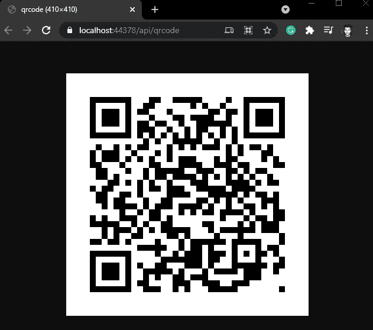

# 。NET 5 -生成二维码

> 原文：<https://levelup.gitconnected.com/net-5-generate-qrcode-c11a55356fdf>

## 本文的目的是展示如何在？NET 5 API。


在 [Unsplash](https://unsplash.com?utm_source=medium&utm_medium=referral) 上由 [Toa Heftiba](https://unsplash.com/@heftiba?utm_source=medium&utm_medium=referral) 拍摄的照片

在本文中，我将展示如何用**生成一个**二维码**。网 5** 。

# 要求

为了构建我们的应用程序，我们需要一些工具:

*   IDE: [Visual Studio 社区](https://visualstudio.microsoft.com/thank-you-downloading-visual-studio/?sku=community&ch=pre&rel=16)
*   [。网络 5](https://dotnet.microsoft.com/download/dotnet/5.0)

# 你准备好了吗？我们走吧！！

我们需要创建一个新项目 ASP.NET1️⃣核心网络应用程序

2️⃣我们需要添加下一个包:

```
**dotnet add** **package** QRCoder
```

QRCoder 的源代码和文档可以在这里[查阅](https://github.com/codebude/QRCoder)！

3️⃣我们将用这段代码创建一个名为“QrCodeGenerator.cs”的类。

我们从 QRCoder 文档中获得的代码已经生成了 QRCode，但是，我们可以将此代码放在一个返回位图的方法中，就像我们在 GenerateImage 方法中看到的那样。

如果我们需要以字节为单位的返回，我们创建另外两个方法 GenerateByteArray 和 ImageToByte

**注意:**这个类的思想是允许重用二维码生成。

4️⃣使用二维码，我们将创建一个控制器，以便我们可以运行我们的应用程序，我们可以在浏览器中查看二维码。

因为这是一个演示，所以我在方法中放了一个 if 条件，以防 URL 为空，这样我们总是有一个 **QRCode** 要生成。

现在，我们所要做的就是在控制器中调用我们的生成器，使用生成的图像，我们可以用传递图像字节和 Mime/Type 的 FileResult 进行响应。

5️⃣:现在我们能够测试二维码的生成，为此，让我们执行我们的。Net 5 应用程序。

*   在浏览器中导航到[https://localhost:{](https://localhost:44378/api/qrcode)[your port](https://localhost:44378/api/qrcode?url=https://twitter.com/viniciosdev)[}/API/QR code](https://localhost:44378/api/qrcode)



*   我们可以通过一个查询生成任意字符串的二维码，例如:[https://localhost:{ your port }/API/QR code？URL = https://Twitter . com/viniciosdev](https://localhost:44378/api/qrcode?url=https://twitter.com/viniciosdev)

# 结论

你可以看到生成一个二维码是多么容易。Net 5 使用了 [QRCoder](https://github.com/codebude/QRCoder) 包。

我在这个库上传了正常实现[的代码](https://github.com/MarcosdrVinicios/QRCodeAPI)

# 其他文章

[](/asp-net-5-authorization-and-authentication-with-bearer-and-jwt-2d0cef85dc5d) [## ASP。NET 5:使用无记名和 JWT 进行授权和认证

### 本文的目的是展示授权、无记名身份验证和 JWT (JSON Web Token)是如何在

levelup.gitconnected.com](/asp-net-5-authorization-and-authentication-with-bearer-and-jwt-2d0cef85dc5d) [](/asp-net-core-user-secrets-2964219f675b) [## ASP。网络核心-用户秘密

### 本文解释了在 ASP.NET 核心开发过程中存储和检索敏感数据的技术

levelup.gitconnected.com](/asp-net-core-user-secrets-2964219f675b)