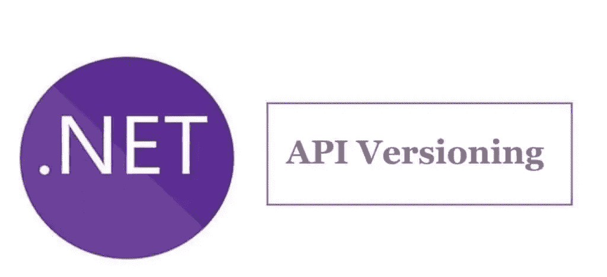
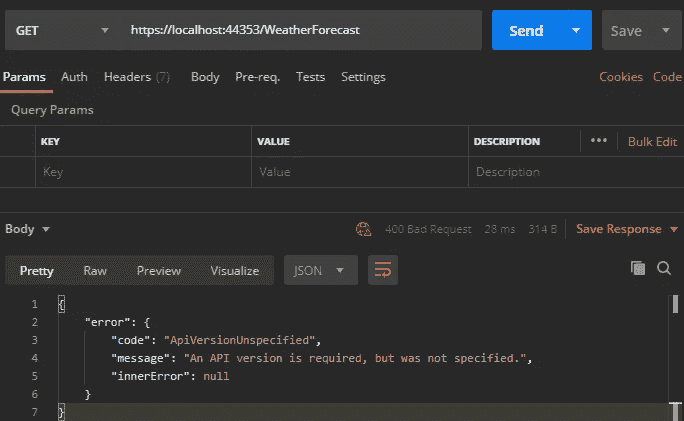
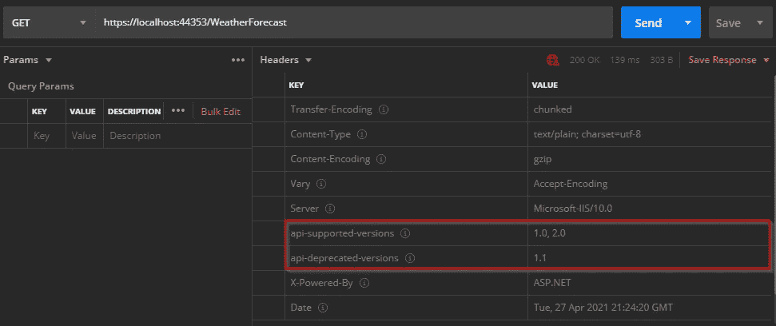
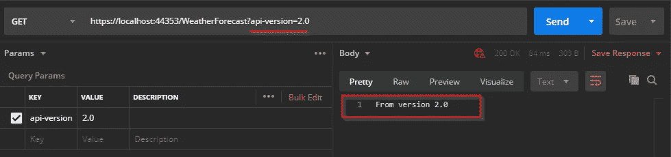
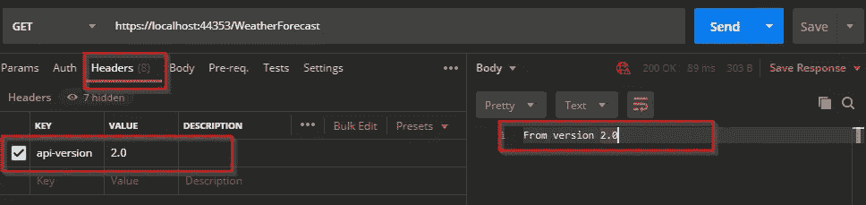
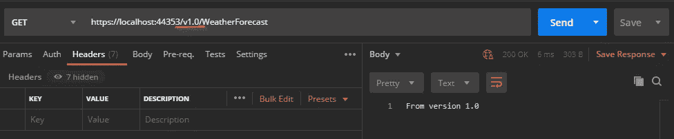
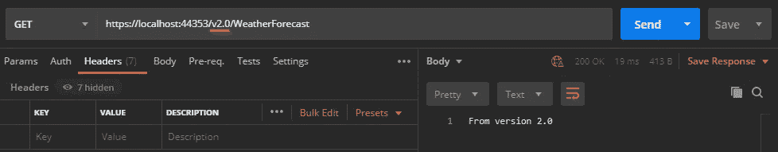

# 。NET 5 -使用 API 版本控制

> 原文：<https://levelup.gitconnected.com/net-5-use-api-versioning-4ffe8b0210b2>

## 本文的目的是展示在 API 版本控制中使用的一些常用策略。NET 5 API。



# 版本控制。网

> 版本控制是任何成熟 web 服务的一个重要方面。微软发布了 REST API 指南，要求所有兼容的服务必须支持显式版本控制。这确保了客户端可以依赖服务保持稳定，同时仍然支持服务更改和新功能。

# 什么是 API 版本控制

一旦你发布了一个 API，它就固定下来了，用户依赖这个 API，但是需求会改变，你需要一种方法来发展这个 API，以便支持 API 版本应用的服务的旧版本。

# 要求

为了构建我们的应用程序，我们需要一些工具:

*   IDE: [Visual Studio 社区](https://visualstudio.microsoft.com/thank-you-downloading-visual-studio/?sku=community&ch=pre&rel=16)
*   [。网 5](https://dotnet.microsoft.com/download/dotnet/5.0)
*   [邮递员](https://www.postman.com/downloads/)

# 你准备好了吗？我们走吧！！

我们需要创建一个新的项目 ASP.NET1️⃣5 网络应用程序

2️⃣我们需要添加下一个包:

```
**Microsoft.AspNetCore.Mvc.Versioning**
```

3️⃣现在，我们已经安装了这个包，我们可以在 Startup 类的 **ConfigureServices** 方法中配置 API 版本控制，如下所示(第 4 行)。

此时，如果我们发出请求，将会返回一个错误。



API 错误

为了解决这个问题，我们需要在**添加 API 版本服务**时指定默认版本。如果请求中没有指定版本，我们将使用默认版本(1.0)(如果我们没有定义版本，所有端点都将使用默认版本 1.0)。下面的代码展示了我们如何做到这一点。

如果我们想让 API 的用户知道端点支持的版本，我们需要添加如下所示的 **ReportApiVersions** (第 5 行)

# 使用控制器中的版本

在接下来的代码片段中，对于*WeatherForecastController*，我们有受支持的版本，其中一个版本已被弃用(1.1，作为示例)。

如果我们向这个控制器发出请求，我们可以看到支持的版本和不推荐的版本。



支持的版本和不推荐的版本

# 在操作方法中使用版本

我们可以使用属性**maptoaviversion**，在控制器内部映射一个动作方法的特定版本。**注意**如果我们不为动作分配一个版本，它将是 API 版本服务中分配给容器的默认版本( **DefaultApiVersion** )。

# API 版本控制策略。净 5 ❓

## 作为 QueryString 参数的➡️Passing 版本信息

在这种情况下，我们可以将版本信息作为查询字符串传递，如下所示。



## 标题中的➡️Passing 版本信息

为了使用这个策略，我们需要在 API 版本控制服务上添加一些配置，正如我们在下一个代码片段(第 6 行)中看到的。

现在，我们能够使用如下所示的策略进行测试。



## URL 中的➡️Passing 版本信息

我个人不喜欢这种做法，因为它打破了休息的一个根本原则。但是要使用这个策略，我们需要改变我们的控制器路由(第 2 行)。

调用**版本 1:**



调用**版本 2:**



# 结论

您可以看到实现 API 版本控制是多么容易。净 5。我们可以使用多种策略，我们只需要决定哪种策略最适合我们。

我将代码[上传到这个库](https://github.com/MarcosdrVinicios/APIVersioning)

# 其他文章

[](/net-5-generate-qrcode-c11a55356fdf) [## 。NET 5 -生成二维码

### 本文的目的是展示如何在？NET 5 API。

levelup.gitconnected.com](/net-5-generate-qrcode-c11a55356fdf) [](/asp-net-5-authorization-and-authentication-with-bearer-and-jwt-2d0cef85dc5d) [## ASP。NET 5:使用无记名和 JWT 进行授权和认证

### 本文的目的是展示授权、无记名身份验证和 JWT (JSON Web Token)是如何在

levelup.gitconnected.com](/asp-net-5-authorization-and-authentication-with-bearer-and-jwt-2d0cef85dc5d)