# 。NET 6 Web API 和实体框架核心快速启动

> 原文：<https://levelup.gitconnected.com/net-6-web-api-entity-framework-core-jumpstart-5c80ad340e97>

## 使用 Web API、EF Core 和 SQL Server Express 立即构建. NET 6 web 应用程序的后端！

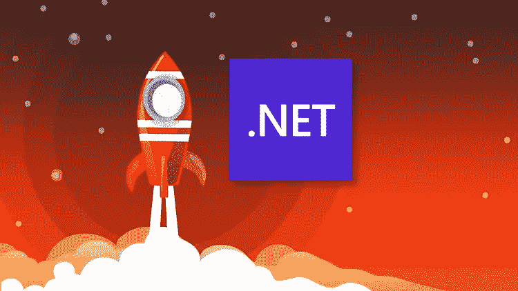

矢量插图由 [practicuum/Shutterstock](https://www.shutterstock.com/image-vector/rocket-launch-space-concept-flat-design-644386219)

# 介绍

。NET 变得越来越好，在当今的 web 开发世界中变得越来越重要。

几乎我收到的每一个新的 web 开发项目的请求都是**在寻求知识。NET** ，包括 Web API 和实体框架核心。

因此，了解后端 web 开发的基础知识。网络对你的职业生涯大有裨益。这就是本系列教程的由来。

在很短的时间内，**将学会如何建立一个 Web API** ，对这个 Web API 进行 restful 调用，并且**用实体框架核心**、**代码优先迁移**、一个 **SQL Server & SQLite 数据库**以及这个数据库中所有三种类型的**关系**持久保存数据。

我们将开门见山，你将看到编写必要代码的每一个步骤，在本课程结束时，你将具备对所有人说*是*的能力。来自任何招聘人员的净项目请求。

开始时你唯一需要的工具是 **Visual Studio 代码**，它是免费的。

我们将使用 Visual Studio 代码来实现，并在 Swagger UI 的帮助下调用 Web API，Swagger UI 是一个界面，它允许您使用现成的 API，这得益于。NET 框架。

Visual Studio 代码可用于 Windows、Mac OS 和 Linux。自从。NET 框架是跨平台的，你可以在这些操作系统上学习本课程。

稍后，我们将利用免费的 **SQL Server Express** 和**SQL Server Management Studio**来管理我们的数据库。我们还将快速浏览一下 SQLite，这样你就知道如何使用你想要的任何数据库。

我们要构建的后端应用程序是一个小型的**基于文本的角色扮演游戏**，不同的用户可以注册(我们将使用 **JSON web 令牌进行身份验证**)并创建他们自己的角色，如法师或骑士，添加一些技能和武器，还可以让角色互相战斗，看看谁是最好的。

所以，我希望你为你的新技能和新项目做好准备。开始吧！

# 工具

我们现在唯一需要的工具是 Visual Studio 代码。除此之外，您还必须下载并安装。NET 6 SDK。

VS 代码可以在[https://code.visualstudio.com/](https://code.visualstudio.com/)上找到。

并且 SDK 可以在[https://dotnet.microsoft.com/download](https://dotnet.microsoft.com/download)下载。一定要下载。适用于您的操作系统的. NET 6。

# 创建新的 Web API

一旦。NET SDK 和 Visual Studio 代码已安装，我们已经可以创建我们的第一个。NET 应用程序，它将很快成为一个 Web API。

首先，我为“dotnet 角色扮演游戏”创建了一个名为“dotnet-rpg”的新文件夹。在 VS 代码中打开文件夹。

我假设您已经对 Visual Studio 代码有点熟悉了，如果还不熟悉，请随便看看。

当你这么做的时候，安装某些扩展可能也是一个好主意。

微软自己的第一个“ [C# for Visual Studio 代码](https://marketplace.visualstudio.com/items?itemName=ms-vscode.csharp)”。一旦创建了第一个 C#应用程序，VS 代码也会建议使用这个扩展。它包括编辑支持，语法突出，智能感知，去定义，找到所有的参考，只是看看，非常有用的东西。

接下来是 KreativJos 的“ [C#扩展](https://marketplace.visualstudio.com/items?itemName=kreativ-software.csharpextensions)”。正如描述所言，通过向上下文菜单添加一些条目，比如添加一个新的 C#类或接口，它可能会加快开发工作流。

最后一个已经是我个人的最爱之一了，那就是“[材质图标主题](https://marketplace.visualstudio.com/items?itemName=PKief.material-icon-theme)”。这个只是提供了很多很多可爱的图标。

好的，但是现在让我们创建我们的 Web API！我们打开一个新的终端窗口，然后让我们看看`dotnet`命令提供了什么。

通过添加一个`-h`，您可以看到所有可用的命令。我们现在感兴趣的是 **new** 命令，它创建了一个新的。NET 项目。

但是我们也得到`run`命令来运行我们的应用程序，还有`watch`命令，它可以和`run`一起使用，一旦我们使用*热重装*对任何文件进行更改，就可以重启应用程序。非常有用，如果你不想每次做任何改变的时候都自己停下来重新开始项目的话。

通过`dotnet new`,我们可以看到一些可用的模板。要全部看到，可以输入`dotnet new --list`。有很多，我们最终得到了 *Web API* 。所以还是用起来吧！

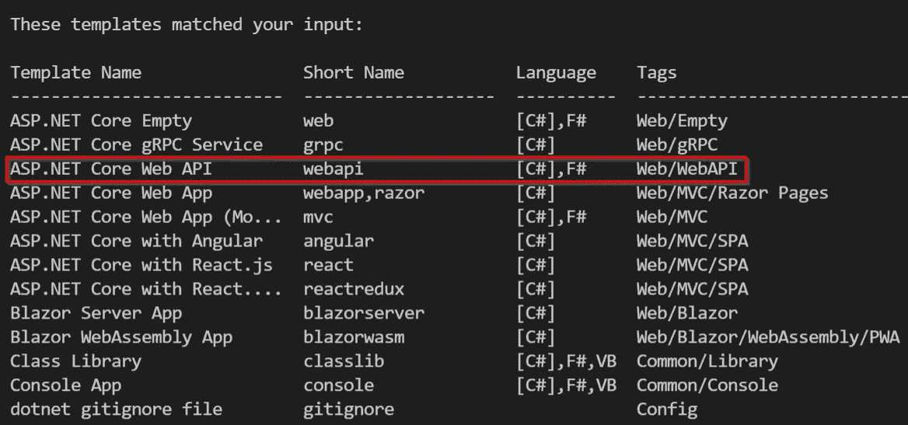

可用应用程序模板

我们输入`dotnet new webapi`,然后按回车键。

现在我们可以在浏览器中看到一些已经生成的文件。让我们快速浏览一遍。

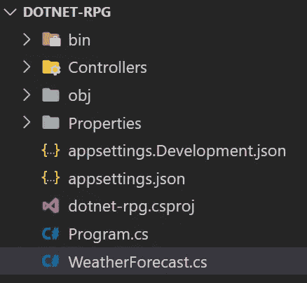

为 Web API 生成的文件

在底部，我们看到了`WeatherForecast`类。这只是默认 Web API 项目的一部分。我们并不真的需要它，但是让我们马上用这个例子。

与此同时，我们得到一个小弹出窗口，告诉我们应该添加一些文件。当然，我们希望添加它们。

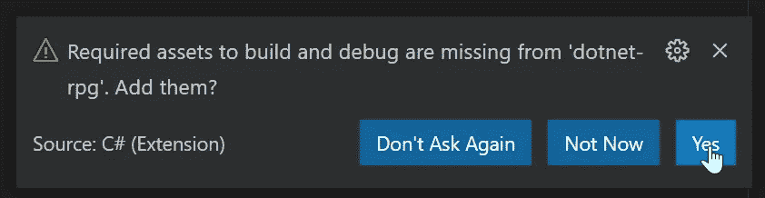

Pop 要求添加一些文件

你现在应该看到，我们得到了带有`launch.json`和`tasks.json`的`.vscode`文件夹。两者都是用于调试的配置文件、源代码格式化程序、捆绑程序等等，但是目前我们对此并不感兴趣。

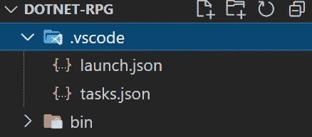

补充道。vscode 文件夹

所以我们来看看`Program`类。

*这是新来的。NET 6。之前我们额外得到了* `*Startup*` *类用于配置事宜。现在一切都在* `*Program.cs*` *中处理。*

Program.cs of。网络 6

例如，在这里，我们配置应用程序的服务，这是一个提供应用程序功能的可重用组件。

我们将来会在这里注册服务，这样就可以通过*依赖注入*在我们的 web 服务中使用它们。

请现在不要介意这些时髦的词语…

此外，这个类创建了应用程序的*请求处理管道*，这意味着我们指定了应用程序如何响应 HTTP 请求。

如你所见，我们使用了`HttpsRedirection`、`Authorization`等等。通过所有这些`Use...`扩展方法，我们将中间件组件添加到请求管道中。

例如`UsesHttpRedirection`添加了中间件，用于将 HTTP 请求重定向到 HTTPS。

我还想提一下，自从。NET 5 我们得到了 SwaggerUI 的开箱即用的配置。这样，我们就有了一个测试 API 的方便的解决方案。我们将在下一章中用到它。

在`.csproj`文件中，我们看到 SDK，在我们的例子中是目标框架。NET 6 和根命名空间。

。csproj 文件

我们还看到了一个对 SwaggerUI 的`Swashbuckle.AspNetCore`的包引用。

稍后，我们将在这个文件中找到类似于*实体框架核心*的附加包。

关于`appsettings.json`文件，我们只需要知道我们可以在这里添加和修改一些配置。

现在更有趣的是 launchSettings.json 文件，其中配置了当前环境和应用程序 URL。通过这个 URL，我们将找到我们正在运行的 web 服务。

launchsettings.json 的一部分

现在可以忽略`obj`和`bin`文件夹。我们在这里找到临时的目标和最终的二进制文件。

非常有趣并且在本系列教程中经常使用的是`Controllers`文件夹。

你在这里看到的第一个控制器是生成的`WeatherForecast`演示控制器。我们稍后将讨论控制器的细节。现在，重要的是知道我们已经可以在这里调用`Get()` Get()方法。

天气预报控制器的 Get()方法

## 第一次 API 调用

在终端中，我们输入`dotnet watch run`来启动我们的应用程序，并且已经使用了观察器和热重载。您的默认浏览器应该会自动打开，在您看到的终端中，这里已经有了我们在`launchSettings.json`中看到的 URL。

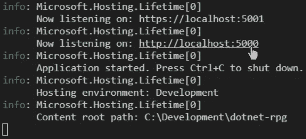

运行应用程序时显示的信息。端口可能因您的情况而异。

我们在这里看到的已经是 Swagger UI 了。它将帮助我们测试我们的 Web API，但是让我们暂时忘记 Swagger。这里已经可以看到`WeatherForecast`控制器，但是我们也可以通过 Chrome 的地址栏访问控制器。

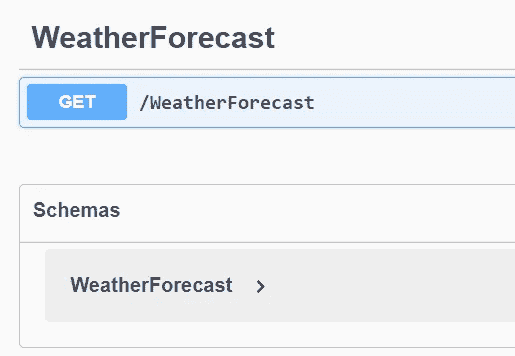

斯瓦格瑞

当我们回到 VS 代码时，我们看到控制器的名字(`WeatherForecast` —没有“控制器”)。我们还看到路由属性(`[Route("[controller]”)`)来定义如何访问这个控制器——我们将在下一章讨论路由是如何工作的。

天气预报控制器的顶部

所以我们只是复制名字— *WeatherForecast* —回到 Chrome，输入正确的路线，最后，我们得到结果。

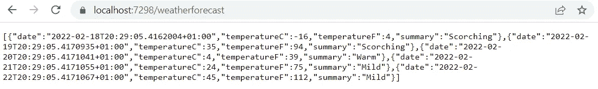

使用 Chrome 地址栏的天气预报控件的结果

现在回到大摇大摆。你可以在这里看到控制器和模式。


SwaggerUI 中的天气预报控制器和模式

模式实际上是`WeatherForecast`类，它告诉我们 Web API 调用的结果会是什么样子。

现在，上面不仅是控制器，它实际上是 Web API 的`GET`调用。我们可以看到可用的参数——在这个特殊的例子中没有参数——我们还可以看到预期的结果。

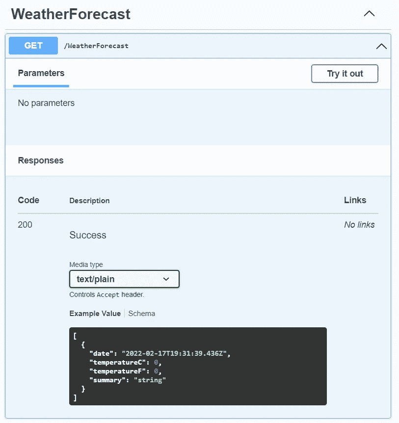

调用 SwaggarUI 的天气预报控制器

最棒的是，我们可以在这里尝试。就这么办吧！

当我们单击 execute 时，我们会看到请求 URL(这与我们一分钟前在地址栏中输入的内容相同),并看到结果。

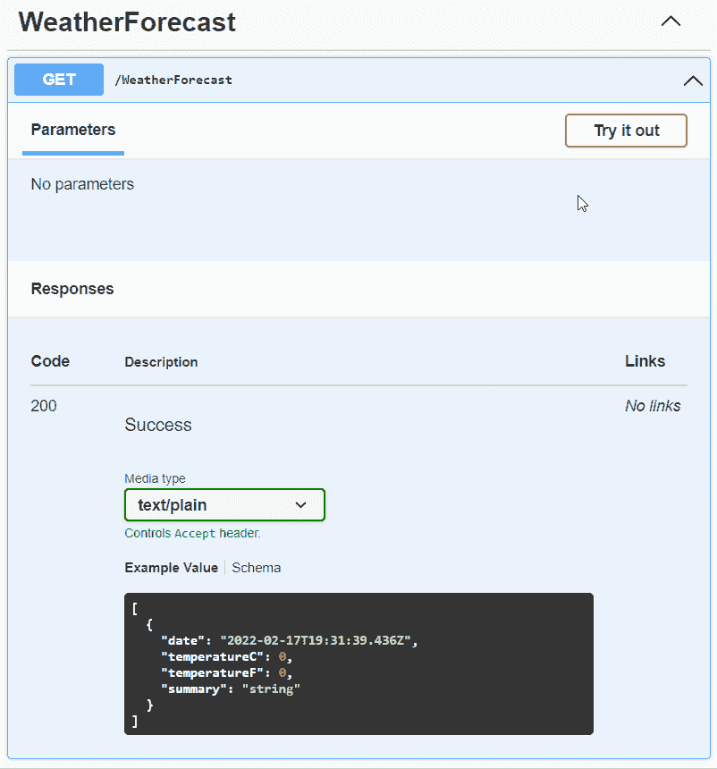

在 SwaggerUI 中执行 WeatherForecast 控制器的 GET 调用

我们也可以在 Chrome 的*开发者工具*的网络标签中看到结果。只需按下键盘上的 F12 打开工具，进入*网络*选项卡，通过*XHR*——代表 XML Http 请求——进行过滤，然后再次执行调用。

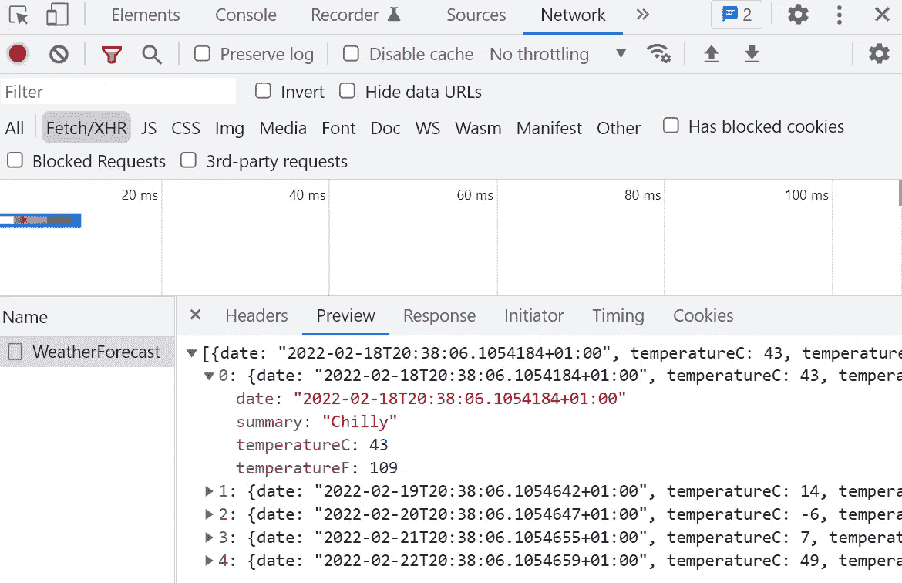

开发者工具的网络标签中天气预报获取调用的结果

你看，结果本质上是一样的，只是随机值不一样。

太好了！这是可行的。现在让我们继续构建我们自己的 web 服务。

# Web API

## 介绍

到目前为止，您已经学习了如何在？NET 以及如何进行第一次 API 调用。

在接下来的部分，我们将为我们的 RPG(角色扮演游戏)角色创建一个新的控制器和模型。

此外，我们将把我们的同步调用变成异步调用，利用数据传输对象(dto)并改变我们的 Web API 的结构，使其符合最佳实践。

但是首先，让我们看看模型-视图-控制器(MVC)模式，这是所有这一切的基础。

## 模型-视图-控制器(MVC)模式

模型-视图-控制器或简称 MVC 是一种软件设计模式，它将相关的程序逻辑分成三个相互联系的元素。让我解释一下，这三个元素中的每一个都代表什么，以及它们是如何协作的。

我们从模型开始。你也可以说，数据。例如，我们角色扮演游戏中的一个角色是一个模特。它可以有一个 Id，一个名字，生命值，属性，技能等等。

dotnet-rpg 的字符类

作为开发人员，您知道您的模型的代码。但是用户看不到你的代码。这就是观点出现的地方。用户可能希望看到 HTML、纯文本或令人惊叹的 3D 图形的角色表现——这取决于你的游戏。换句话说，视图就是(图形)用户界面或(G)UI。

综上所述，模型更新视图，用户看到视图。如果模型改变了，比如说我们的角色获得了另一个技能或者生命值降低了，那么视角也会改变。这就是为什么模型总是更新视图。

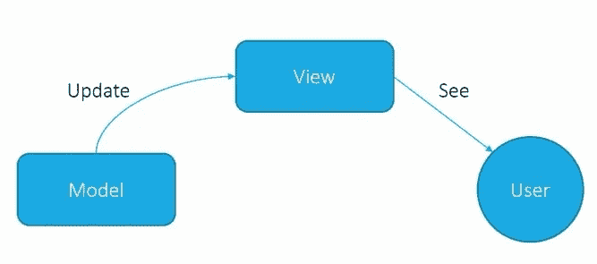

模型更新视图，用户看到视图。

现在，控制器怎么了？控制器做实际的工作。在那里你会发现你的大部分代码，因为它操纵你的数据或模型。在我们的例子中，是 Web API 创建、更新和删除你的数据。

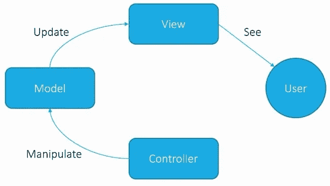

控制器操纵你的数据。

因为除了在 Postman 中调用的结果之外，我们没有视图，所以我们将按照以下顺序构建我们的应用程序:首先是模型，然后是控制器。我们将永远在这两者之间来回跳跃。

不过，在视图的帮助下，用户可以操作数据，从而使用按钮、文本字段等操作 RPG 角色的属性。在一个浏览器游戏中，本质上可能是 JavaScript 代码——可能在 Angular、React 或 VueJS 等框架的帮助下——或 [Blazor WebAssembly](https://youtu.be/G04IYKORYy0) 。

这个 JavaScript 代码反过来使用控制器进行操作，并将这些更改持久地保存在数据库中。被操纵的模型将更新视图，然后用户再次看到该视图，并且循环再次开始。

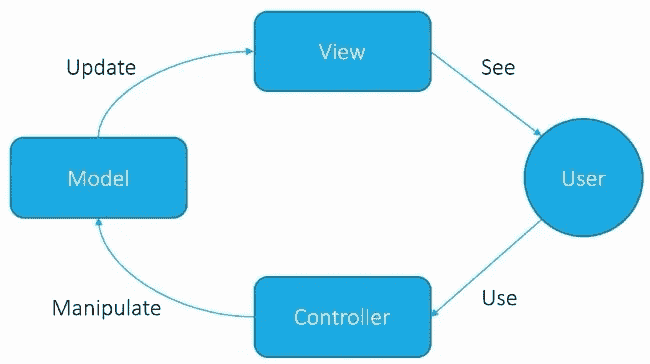

MVC 模式的完整循环。

嗯，这总结了 MVC 模式。现在我们要建立我们的第一个模型。

## 新型号

我们首先需要的是新的模型。我们需要一个角色扮演角色本身的模型，也需要一个角色扮演角色*类型*的模型，例如野蛮人、僧侣、亡灵巫师等角色类别。

首先，我们创建一个`Models`文件夹。

对于角色模型，我们将在 Models 文件夹中创建一个新类。如果你已经安装了“C#扩展”，你可以用鼠标右键添加一个新的 C#类，否则，你只是创建一个新的文件。

所以右键单击 Models 文件夹，然后单击“New C# Class”并调用这个类`Character`。

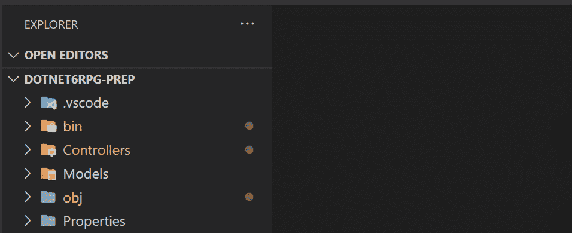

创建角色类

现在让我们添加一些属性。

没有 RpgClass 属性的字符类

我们还将添加一个`RpgClass`属性，即角色的*类型*。但首先，我们必须为此创建一个新的`enum`。

所以，在 Models 文件夹中，让我们添加一个新的 C# `enum`名为`RpgClass`。

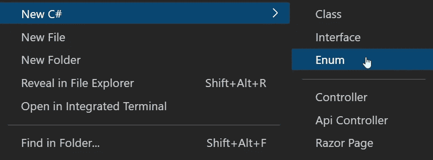

创建新的枚举。

你可以在这里随意添加任何你想添加的角色扮演课程。在这个例子中，我使用了骑士、法师和牧师。我猜是你需要的最基本的角色。一些近战动作，一些魔法，当然永远不要忘记治疗者。

RpgClass 枚举

现在，当我们准备好`RpgClass` `enum`时，我们终于可以将它添加到`Character`模型中了。

具有 RpgClass 属性的字符类

我将默认设置为骑士，但同样，这完全取决于你。

好了，第一批模型准备好了。现在让我们添加一个新的控制器，并进行一个`GET`调用来接收我们的第一个角色扮演游戏角色。

## 新控制器&获得一个新角色

为了添加一个新的控制器，我们在 Controllers 文件夹中创建一个新的 C#类。使用 C#扩展，我们也可以创建一个准备好的“API 控制器”类，但是让我们首先手动执行必要的步骤。

我们姑且称这个类为`CharacterController`。

在我们开始实现任何逻辑之前，我们必须让这个东西成为一个合适的控制器。为此，我们首先从`ControllerBase`开始推导。为此，我们还必须添加适当的引用，`Microsoft.AspNetCore.Mvc`。

这是一个没有视图支持的 MVC 控制器*的基类。*

因为我们在这里构建一个 API，所以我们不需要*视图支持。然而，如果我们想要添加对观点的支持，我们可以从`Controller`中获得。但在我们的例子中，只需确保添加`ControllerBase`。*

```
public class CharacterController : ControllerBase
```

之后，我们必须添加一些属性。第一个是`[ApiController]`属性。此属性指示某个类型(以及所有派生类型)用于提供 HTTP API 响应。

此外，当我们将这个属性添加到控制器中时，它会启用几个特定于 API 的特性，如*属性路由*和如果模型有问题时的自动 HTTP 400 响应。当我们利用这些特性的时候，我们将得到细节。

```
[ApiController]
public class CharacterController : ControllerBase
```

关于*属性路由*，那已经是我们要添加的下一个东西了。

在`[ApiController]`属性下面，我们添加了`[Route]`属性。当我们想要进行 web 服务调用时，这就是我们能够找到这个特定控制器的方法。

我们添加到`[Route]`属性的字符串是`("api/[controller]”)`(paranthesese 中)。这意味着这个控制器可以被字符串“api”访问，然后是它的名字，在我们的例子中是“Character”——所以 C#类的名字的一部分在“controller”之前。

```
[ApiController]
[Route("api/[controller]")]
public class CharacterController : ControllerBase
```

请注意，`WeatherForecastController`没有“api”字符串。再说一次，这完全取决于你。

好了，让我们进入 C#类的主体。我想添加的第一件事是一个静态模拟字符，我们可以将它返回给客户端。为此，您必须添加`dotnet_rpg.Models`参考。

具有模拟角色的角色控制器

由于我们在这里使用 C# 10，我们也可以将“global”关键字添加到 using 指令中，并可能将这一行移到 Program.cs 中。现在，整个应用程序都知道了这个引用，我们再也不用添加 using 指令了。

程序. cs

接下来，我们最终实现了`Get()`方法来接收我们的游戏角色。

使用 Get()方法的字符控制器

我们返回一个`IActionResult`,因为这使我们能够将特定的 HTTP 状态代码和实际请求的数据一起发送回客户机。在这个方法中，我们用`Ok(knight)`将状态码`200 OK`和我们的模拟角色发送回去。

其他选项将是一个`BadRequest 400`状态码或一个`404 NotFound`，如果没有找到请求的字符。

好了，代码实现了。现在让我们通过使用`dotnet watch run`再次启动应用程序来测试这一点。

打开 SwaggerUI，我们首先看到一个错误！

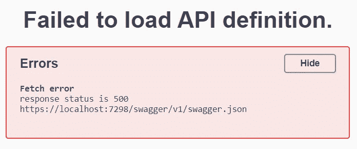

SwaggerUI 中的错误

尽管如此，让我们尝试通过浏览器调用我们的 web 服务方法。类似于 WeatherForecastController，我们必须将 CharacterController 的路线输入到浏览器的地址栏中。注意你的 URL 的端口，它可能是不同的。在我的例子中，完整的 URL 是`[https://localhost:7298/api/character](https://localhost:7298/api/character.)` [。这个网址应该会引导我们找到我们想要的结果。](https://localhost:7298/api/character.)

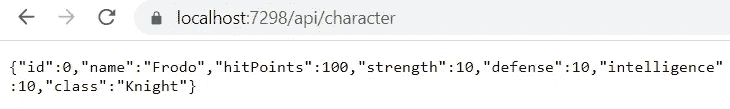

接收单个 RPG 字符

回到 Swagger，让我们打开开发者工具，看看网络选项卡。这里我们看到了实际的问题:*动作需要为 Swagger* 显式绑定 HttpMethod。

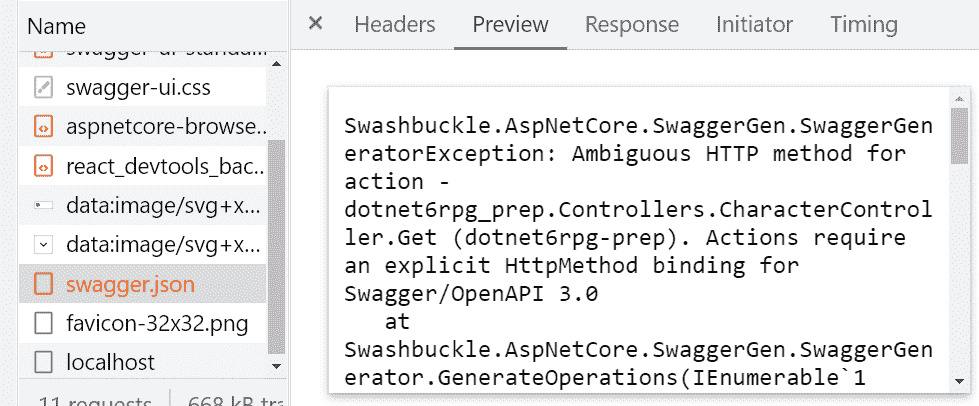

Swagger 中的错误:*操作需要为 Swagger* 显式绑定 HttpMethod。

回到 VS 代码，注意添加到我们的`Get()`方法中的属性。确切地说，有*无*。

当我们将其与`WeatherForecastController`进行比较时，我们可以添加一个`[HttpGet]`属性。

但是对于`CharacterController`来说这不是必须的，因为 Web API 支持*命名约定*，如果方法的名称以`Get...()`开头，API 会假设所使用的 HTTP 方法也是`GET`。

除此之外，到目前为止我们的控制器中只有一个`Get()`方法，所以 web 服务确切地知道请求的是什么方法。

然而，正如我们现在所知道的，为了帮助 Swagger out，我们必须添加`[HttpGet]` 属性。让我们这样做，然后回到 Chrome。

```
[HttpGet]
public IActionResult Get()
```

我们现在看到了这个方法，但是没有看到任何模式或预期的返回类型。

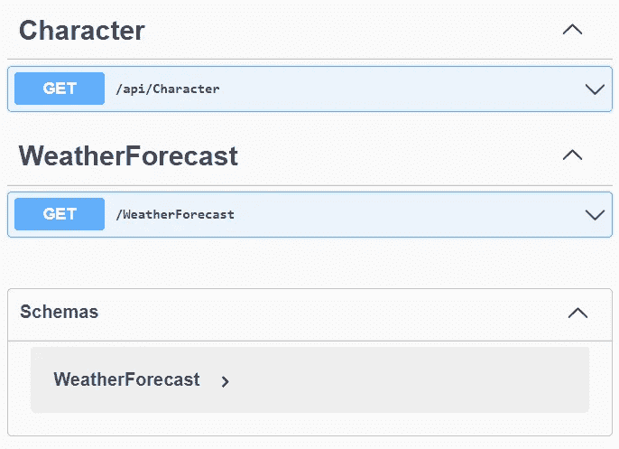

没有任何模式的字符控制器

让我们再一次回到 VS 代码，将返回类型改为类型为`Character`字符的`ActionResult`。

```
[HttpGet]
public ActionResult<Character> Get()
```

在保存了这个更改之后，由于一个*粗鲁的编辑*，我们可能不得不重启我们的应用程序。

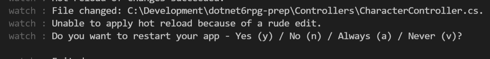

由于粗暴编辑，无法应用热重新加载。

那么，让我们这样做，最后，我们看到所有想要的信息。Swagger 向我们展示了我们的`Character`类和`RpgClass`枚举。

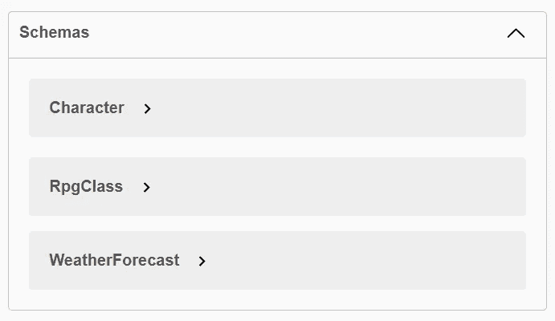

SwaggerUI 中的所有模式。

还有一点我们可以补充的。

查看 enum，我们只看到了`RpgClass`的*编号*而不是*名称*。

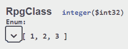

SwaggerUI 中带数字的 RpgClass

我们可以通过在 enum 文件中配置`JsonConverter`来改变这一点。

我们使用类`JsonStringEnumConverter`将属性添加到枚举定义的上方，该类*将枚举值与字符串相互转换。*我们还必须为此添加适当的参考，即`System.Text.Json.Serialization`。

具有 JsonConverter 属性的 RpgClass 枚举

*如果您仍然看不到 RPG 类的名称，您可能需要手动重启应用程序。*

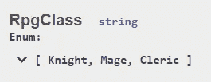

带字符串的 RpgClass 枚举

但是在那之后，我们看到了`RpgClass`的名字，我们可以测试`Get()`方法，没有任何问题。

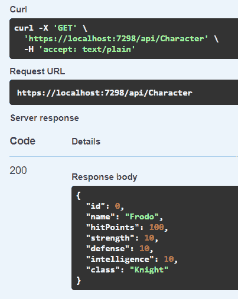

SwaggerUI 中 Get()方法的结果

这就是本系列教程的第一部分。我希望它已经对你有用了。非常感谢您的宝贵时间！要获得下一部分的通知，只需[订阅我的时事通讯](https://mailchi.mp/364b891b448f/dotnetdev)或[通过媒体](https://medium.com/@patrickgod)关注我。你会是第一个知道的。

下次见！

保重，

帕特里克(男子名)

*接下来:属性路由、HTTP 方法、用 POST 添加一个新字符、异步调用等等！*

# 但是等等，还有呢！

*   [▶️](https://emojipedia.org/play-button/) ️Enjoy 很多。NET & Blazor 教程上 [**YouTube 上**](https://www.youtube.com/patrickgod) **。**


在 YouTube 上订阅编码教程

*   ❤️ ️Let's 在 [**上连接 Twitter**](https://twitter.com/_PatrickGod) ， [**LinkedIn**](https://www.linkedin.com/in/patrickgod) 或 [**上连接媒体**](https://medium.com/@patrickgod) 。
*   📧 [**订阅我的简讯**](https://mailchi.mp/364b891b448f/dotnetdev) 提前获取即将推出的教程&在线课程。NET，Blazor &更！

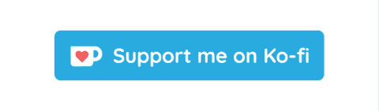

# 分级编码

感谢您成为我们社区的一员！更多内容见[升级编码出版物](https://levelup.gitconnected.com/)。
跟随:[推特](https://twitter.com/gitconnected)，[领英](https://www.linkedin.com/company/gitconnected)，[通迅](https://newsletter.levelup.dev/)
**升一级正在转型理工大招聘➡️** [**加入我们的人才集体**](https://jobs.levelup.dev/talent/welcome?referral=true)