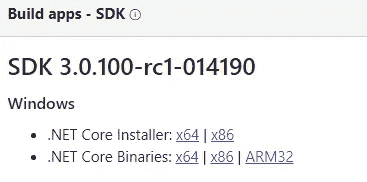
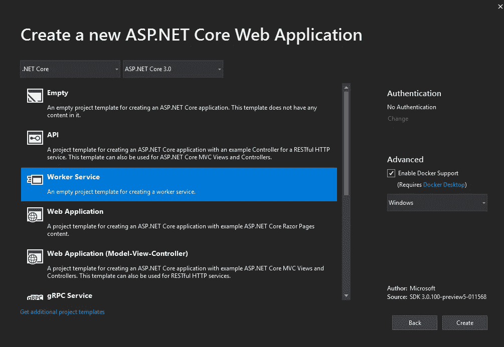
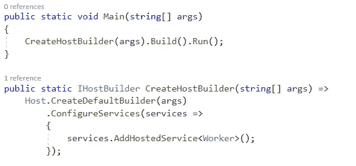
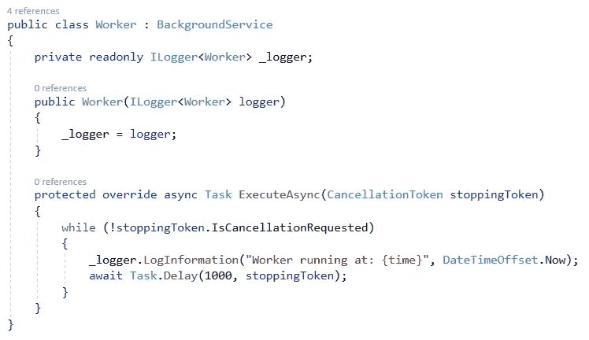
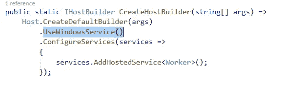
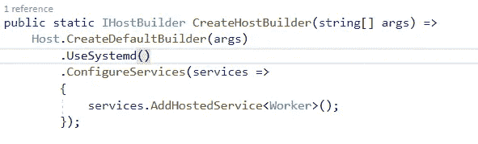

# 。NET 核心工作服务作为 Windows 服务或 Linux 守护进程

> 原文：<https://levelup.gitconnected.com/net-core-worker-service-as-windows-service-or-linux-daemons-a9579a540b77>

中引入了一种称为“工作服务”的新型应用程序模板。NET Core 3(撰写本文时仍在预览中)。这是在中编写 Windows 服务或 Linux 守护进程的新方法。网芯。

以前，我们可以在中创建这些服务。NET Core 2.1 使用`IHostedService`。您只需在中创建一个控制台应用程序。NET Core 2.1 并使用 TopSelf NuGet 包(也有其他方法)监听来自`WindowsService`的开始和停止信号。你们都完了。那为什么是工人服务？

## **什么是工人服务，何时使用？**

此应用程序类型旨在为中的长期运行服务提供一个入口点。网芯。完美的用例是任何长时间运行的后台处理，以处理来自任何队列的消息，或者如果您想要检查您的应用程序的健康状况。工作者服务是这类用例的直接框架。您可以将其部署为 Windows 服务或 Linux 守护进程。下面是创建一个简单的 Worker 服务作为 Windows 服务和 Linux 守护进程的逐步演练。

## **创建工人服务的逐步指南**

点击下载样本源

1.  安装最新版本。网芯 3.0 RC1 SDK 发布:[https://dotnet.microsoft.com/download/dotnet-core/3.0](https://dotnet.microsoft.com/download/dotnet-core/3.0)

2.创建新的 ASP.NET 核心 Web 应用程序。*文件>新建项目>ASP.NET 核心 Web 应用*(其中包含工人服务模板 while。网芯 3.0 在预览版)

如果你看不见。NET Core 3.0 在下拉列表中，你需要告诉 VS 使用预览版 SDK。打开菜单栏中的工具>选项。打开“项目和解决方案”节点。打开。网络核心选项卡。选中使用预览框。NET Core SDK。选择确定

请注意选项**使用的预览。NET Core SDK** 已经移到工具- >选项- >常规- >预览 SDK 下

如果缺少工作服务模板，请检查 preview SDK 与 Visual Studio 2019 版本之间的兼容性。

3.一旦创建了工作服务，找到 Program.cs，它应该类似于下面这样:

**程序。CS**

宿主负责应用程序的启动和生存期管理。`CreateDefaultBuilder`创建这个运行时主机来运行应用程序。`CreateDefaultBuilder`做几件事:配置 Kestrel 服务器，设置根目录，加载应用配置(`appsettings.json`，`appsettings.{Environment}.json`，配置日志记录。

**Worker.cs**

这是做实际工作的后台工作人员。

4.**作为 Windows 服务运行**

为了作为 Windows 服务运行，我们需要我们的工人监听来自`ServiceBase`的开始和停止信号。NET 类型，向其公开 Windows 服务系统。NET 应用程序。为此，我们想添加`Microsoft.Extensions.Hosting.WindowsServices` NuGet 包。

如果您在安装过程中遇到任何错误，说明您的 nuget 软件包与。NET Core SDK。确保两者的预览版本相同。

将`UseWindowsService()`调用添加到主机构建器中。

现在我们可以使用[sc.exe 实用程序](https://support.microsoft.com/en-au/help/251192/how-to-create-a-windows-service-by-using-sc-exe)将其部署为 Windows 服务器。

5.**作为 Linux 守护进程运行**

添加`Microsoft.Extensions.Hosting.Systemd` NuGet 包(请注意需要**)。NET Core SDK Preview7+** 为此)。

向主机构建器添加`UseSystemd()`调用。

在 Linux 上设置为守护进程。

6.或者您可以简单地从 Visual Studio 运行解决方案并检查它。

 [## 了解如何编码-查找编码教程| gitconnected

### 从开发者提交和排名的教程中学习任何编程语言、框架或库。教程是…

gitconnected.com](https://gitconnected.com/learn)