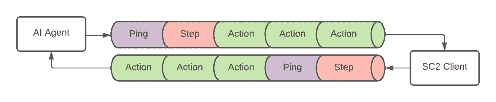

# SC2 API 的. NET 核心包装器

> 原文：<https://levelup.gitconnected.com/net-core-wrapper-for-sc2-api-e0c0346e895b>


*本文假设您正在开发。NET 核心，并打算使用 NydusNetwork。我尝试在文章中预先载入一般适用的知识，这样它就可以为其他包装器的用户提供价值。*

星际争霸 2 的 API 包含了相当多的消息。它们都被包装在消息中，所以这是您将发送的唯一消息——客户端将用包含所有可能响应的消息进行响应。


*请求*发送到客户端的基本流程。作者图解。

该图展示了一个简单代理请求消息流。这些是创建一个正常运行的机器人的唯一必要的*请求*(在*实时*模式中甚至可以省略该步骤)——但是理解所有类型是有益的；

*   **CreateGame**
    设置一个新游戏，相当于在常规游戏中创建一个大厅。该消息只能在*启动*状态或*结束*状态下发送。
    - *禁用迷雾，*如果关闭将允许你的机器人看到一切(没有战争迷雾)。
    - *实时，*告诉客户端不要等待 StepRequest 来推进游戏。
    - *玩家设置，*每个玩家的种族和‘类型’(AI 或暴雪 AI)列表。
    - *本地地图，*游戏地图路径玩**或**
    - *战场地图名称，*SC2 官方地图名称
*   **JoinGame**
    开始你主持的游戏或加入另一个主持人。此消息包含您的 [*界面选项*](https://github.com/Blizzard/s2client-proto/blob/01ab351e21c786648e4c6693d4aad023a176d45c/s2clientprotocol/sc2api.proto#L564) ，您可以在其中告诉客户您的代理需要什么信息。被称为 *raw* 的是游戏状态的一个表示，作为一个可见单元、方块等的列表。这对计算机来说很容易解释。这相当于能够一次看到整个地图——这是人类组件永远做不到的。另一种选择是*特征层*——通过多种颜色编码的*图像*表示的游戏状态，更接近人类可用的信息(用于机器学习)。
*   **离开游戏**
    离开比赛的空消息。
*   **快速保存**
    快速保存的空消息。
*   **快速加载**
    清空加载之前快速保存的信息。
*   **退出**
    关闭客户端的空消息(优雅地)。适用于所有州。
*   观察者可以应用的动作(非玩家)。
*   **步骤**
    要求客户端用 x *步骤推进游戏模拟。*默认情况下，客户端会在推进游戏前等待这条消息，除非是在*实时*中玩，这可以在*创建游戏中配置。*
*   查询
    请求关于路径、可用能力和建筑布局的信息。
*   **SaveReplay**
    将游戏保存为重播——可以在*游戏内*或在*结束*状态下完成。
*   **ReplayInfo**
    加载关于重播的元数据。
*   可用地图获取可用地图列表。如果您的客户端从未下载过地图，此列表可以为空。[手动下载](https://github.com/Blizzard/s2client-proto#downloads)或者在你想要的地图上用普通客户端创建游戏强制下载。
*   **保存地图**
    将地图数据保存到本地路径。
*   **MapCommand**
    手动执行一个 map 触发器。
*   **Ping**
    嗯……令人惊讶的不是一个真正的 Ping 消息。客户端以游戏版本、数据版本、数据构建版本和基础构建版本进行响应。
*   **Debug** 执行一个 *DebugCommand* 的列表，它允许你在屏幕上绘图或者通过繁殖单位、杀死单位、更新它们的值等操作游戏。

# 安装 API 包装程序

*使用 API 包装器可以帮你省去很多麻烦——很多！本节假设您正在编写。NET 核心，并希望使用 NydusNetwork 作为您的 API 包装器，但您可以在其他语言中找到许多替代品* [*这里*](https://wiki.sc2ai.net/Main_Page) *。你也可以从头开始写你自己的，在这种情况下，这个指南可能会有用；*

[](/guide-to-starcraft-ii-proto-api-264811da8a50) [## 星际争霸 2 原型 API 指南

### 官方星际争霸 2 API 介绍——一个请求/响应消息系统，允许你建立自己的 AI…

levelup.gitconnected.com](/guide-to-starcraft-ii-proto-api-264811da8a50) 

NydusNetwork 是一个用。NET Core，它是作为 Abathur 框架的一部分创建的，但被编写为一个独立的组件，可以独立于 Abathur 使用。如果你打算选择完整的框架体验，我推荐克隆 SC2Abathur。

或者，要在没有 Abathur 的情况下继续，只需使用 nuget 包管理器安装它，并开始在您的定制 bot 中使用它。当 Abathur 封装 NydusNetwork 时，我假设您选择了这种方法。

```
Install-Package NydusNetwork
```

*通过软件包管理器控制台*安装 NydusNetwork

```
dotnet add package NydusNetwork
```

*通过 dotnet CLI 安装 NydusNetwork】*

# 使用 NydusNetwork

正在导入*nydusneweb。模型*让你可以访问官方星际争霸 2 API 支持的所有消息类型。NydusNetwork 最基本的用法是简单地使用 *SendRequest(Request r)* 向客户端发送原始消息。

```
using NydusNetwork;

namespace AdequateSource
{
  class Example
  {
    void QuitGame(GameClient client)
      => client.QuitRequest();
  }
}
```

基本上所有的 API 包装器都会给你这个直接的客户端原始接口，但是 NydusNetwork 比瘦 API 包装器多了一些额外的特性。

## 人手不足

其中最基本的是空请求的缩写。API 包含了相当多的空请求消息，所以它允许我们稍微清理一下代码。

```
using NydusNetwork;

namespace AdequateSource
{
  class Example
  {
    void QuitGame(GameClient client)
      => client.QuitRequest();
  }
}
```

## 完成游戏初始化

NydusNetwork 也有助于游戏创作。初始化方法将根据提供的设置连接到客户端，如果客户端应用程序没有运行，则启动该方法。确认连接后，只需调用 *CreateGameRequest()* 和 *JoinGameRequest()* 即可启动并运行。这些方法也支持本地多人游戏(bot vs bot)。

```
using NydusNetwork;
using NydusNetwork.API.Protocol;
using NydusNetwork.Model;
using System.Collections.ObjectModel;

namespace AdequateSource
{
  class Example
  {
    void Initilize() {
      var client = new GameClient(
        new GameSettings
        {
          FolderPath = @"C:\Program Files (x86)\StarCraft II",
          ConnectionAddress = "127.0 0.1",
          ConnectionServerPort = 8165,
          ConnectionClientPort = 8170,
          MultiplayerSharedPort = 8175,
          InterfaceOptions = new InterfaceOptions {
            Raw = true, Score = true
          },
          Fullscreen = false,
          ClientWindowWidth = 1024,
          ClientWindowHeight = 768,
          GameMap = "Cloud Kingdom LE",
          Realtime = false,
          DisableFog = false,
          ParticipantRace = Race.Random,
          Opponents = new Collection<PlayerSetup> {
            new PlayerSetup {
              Type = PlayerType.Computer,
              Race = Race.Random,
              Difficulty = Difficulty.VeryEasy
            }
          }
        }
      );
      client.Initialize(asHost: true);
      client.CreateGameRequest();
      client.JoinGameRequest();
    }
  }
}
```

## 得到回应

支持从客户端获取响应的两种方式。最简单的是 *TryWait{Type}Request* ，其中阻塞执行流，直到请求被接收或失败。此方法支持可选的超时。

第二种方法是注册一个监听特定响应类型的处理程序。每次收到该类型的响应时都会调用该处理程序，直到您注销该处理程序。这就是*try wait { Type }请求*在后台实现的方式。

```
using NydusNetwork;
using NydusNetwork.API.Protocol;
using System;

namespace AdequateSource
{
  class Example
  {
    void Ping(GameClient client) {
      if (client.TryWaitPingRequest(out var r, wait: 3000))
        Console.WriteLine(r.Ping.GameVersion);
    }

    void ListenForPing(GameClient client)
    {
      var action = new Action<Response>(r => {
        Console.WriteLine($"Heard ping! {r.Ping.GameVersion}");
      });
      client.RegisterHandler(Response.ResponseOneofCase.Ping, action);
    }
  }
}
```

# 为什么是经手人？

客户端不是一个整洁的小 rest API，当你调用它的时候它会回答，它是一个 web socket，当你高兴的时候它会回答你。有些请求不会立即得到客户的答复。例如， *StepRequest* 一旦客户端从游戏中的每个人那里收到，就会得到响应——这在单人游戏中意味着立即，但在多人游戏中可以是任何时候。



web 套接字流的临时图表。作者图解。

这意味着*请求*可能不会以相同的顺序接收*响应*。然而，客户端会确保按顺序处理相同类型的请求，因此例如*动作请求*将总是按顺序处理(或者可以替换游戏)。注意，同一个单元的多个动作将*覆盖*它的动作。

*原载于 2020 年 8 月 30 日 https://adequatesource.com*[](https://adequatesource.com/nydusnetwork/)**。**