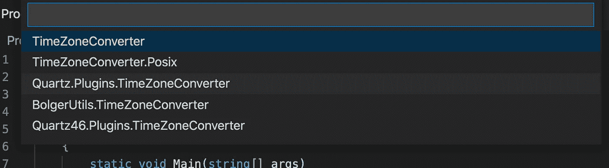

# 。NET 提示:获取不同平台上的时区数据

> 原文：<https://levelup.gitconnected.com/net-tips-get-timezone-data-on-different-platforms-cff0e2b37f52>


照片由[马太·亨利](https://burst.shopify.com/@matthew_henry?utm_campaign=photo_credit&utm_content=Free+Stock+Photo+of+Antique+Globe+Close+Up+%E2%80%94+HD+Images&utm_medium=referral&utm_source=credit)发自[突发](https://burst.shopify.com/travel?utm_campaign=photo_credit&utm_content=Free+Stock+Photo+of+Antique+Globe+Close+Up+%E2%80%94+HD+Images&utm_medium=referral&utm_source=credit)

如果你以前开发过跨平台的应用程序，你可能会遇到这样的情况:尽管使用了跨平台的解决方案，不同的平台仍然有不同的性能。这篇文章将讨论一种情况，在这种情况下，获取时区数据的结果在。网芯。

# 获取 Windows 平台上的时区数据

首先，让我们创建一个新的。Windows 平台上的 NET Core 控制台应用程序。既然这样，我就以新西兰时间为例。

```
using System;namespace DotNETTips
{
    class Program
    {
        static void Main(string[] args)
        {
            var dateTime = **DateTime.UtcNow**;
            Console.WriteLine($"dateTime in UTC : {dateTime}"); var nzTzInfo = **TimeZoneInfo.FindSystemTimeZoneById("New Zealand Standard Time");**
            dateTime = TimeZoneInfo.ConvertTimeFromUtc(dateTime, nzTzInfo); Console.WriteLine($"dateTime in NZ Time Zone : {dateTime}");
            Console.ReadKey();
        }
    }
}
```

在上面的代码中，Windows 平台上新西兰的时区 id 是“新西兰标准时间”，如下图截图所示。


如果您对 Windows 平台上的时区数据感兴趣，可以在下面的链接中找到 Windows 上的默认时区列表。

[](https://docs.microsoft.com/en-us/windows-hardware/manufacture/desktop/default-time-zones?WT.mc_id=DT-MVP-5001664) [## 默认时区

### 当第一个用户登录 Windows 10 或 Windows Server 并识别他们所在的地区时，Windows 会设置时区。的…

docs.microsoft.com](https://docs.microsoft.com/en-us/windows-hardware/manufacture/desktop/default-time-zones?WT.mc_id=DT-MVP-5001664) 

所以我们可以通过调用***FindSystemTimeZoneById***方法得到新西兰的 TimeZoneInfo 数据。

```
TimeZoneInfo.**FindSystemTimeZoneById**("**New Zealand Standard Time**");
```

然后，我们可以将 UTC 格式的日期时间数据转换成 NZDT。

```
TimeZoneInfo.**ConvertTimeFromUtc**(dateTime, nzTzInfo);
```

实际上，上面的代码在 Windows 平台上运行得很好，你可以发现日期时间在终端中被打印出来。


# 获取 macOS/Linux 上的时区数据

然而，如果你想在 mac pro 笔记本电脑或 Linux 电脑上运行相同的代码，它不会打印出新西兰时区的日期时间，而是打印出一个**time zonenotfoundexception**。


这并不是因为你的 mac pro 没有安装时区数据，而是因为 macOS 使用了另一个时区数据提供商——IANA 时区数据库。

与 Windows 平台上的时区 Id 不同，新西兰的 IANA 时区标识符是“ ***太平洋/奥克兰”*** 。并且也有您的时区列表，您可以单击下面的链接在时区数据库中查看时区列表。

[](https://en.wikipedia.org/wiki/List_of_tz_database_time_zones) [## tz 数据库时区列表-维基百科

### 这是 tz 数据库 2021a 版的时区列表。UTC 偏移量(第 6 列和第 7 列)在…以东为正

en.wikipedia.org](https://en.wikipedia.org/wiki/List_of_tz_database_time_zones) 

所以，要想让你的代码按预期运行，就得在 macOS/Linux 上把 FindSystemTimeZoneById 方法的参数从" ***新西兰标准时间*** "修改为" ***太平洋/奥克兰"*** 。


正确的日期时间将会显示在控制台上。因此，如果你的应用程序将在不同的平台上运行，你将需要处理这些差异。

# 解决办法

但是，如果您不想自己处理这些差异，因为这很难维护，GitHub 上有一个可用的开源包可以帮助您解决这个问题。

[](https://github.com/mattjohnsonpint/TimeZoneConverter) [## mattjohnsonpoint/时区转换器

### TimeZoneConverter 是一个轻量级的库，可以在 IANA、Windows 和 Rails 时区名称之间快速转换…

github.com](https://github.com/mattjohnsonpint/TimeZoneConverter) 

TimeZoneConverter 是一个轻量级的库，可以在 IANA、Windows 和 Rails 时区名称之间快速转换。

我们可以通过 NuGet 非常容易地安装软件包。



我在 macOS 上使用 VS 代码来安装这个 NuGet 包，然后我将 FindSystemTimeZoneById 修改为 GetTimeZoneInfo，并将 Windows 上使用的相同时区标识符/id“新西兰标准时间”传递给该方法。代码在控制台中打印出正确的结果。


通过这种方式，我们能够以统一的方式与不同的时区提供者一起工作，并且更容易维护我们的代码。

感谢您的阅读，希望对您有所帮助。

在聊天

[](https://www.linkedin.com/in/chenjd/) [## 陈家东-高级软件开发人员-X 公司| LinkedIn

### 起亚·奥拉，我是个有经验的人。NET/Unity/Azure Developer @ Company-X 而我是 2015 年 10 月起的微软 MVP。之前…

www.linkedin.com](https://www.linkedin.com/in/chenjd/)