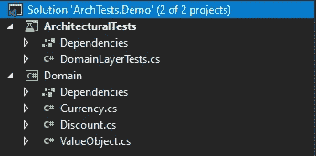
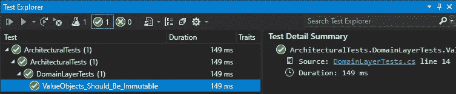
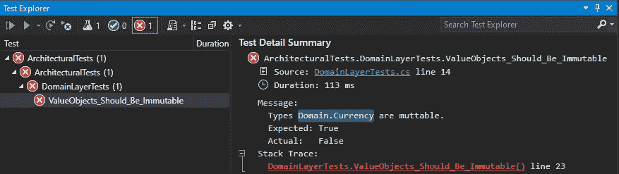

# NetArchTest —在您的。网络应用

> 原文：<https://levelup.gitconnected.com/netarchtest-enforce-architecture-and-design-rules-in-your-application-e6c6c9f5c97e>

## 通过编写单元测试。

约书亚·阿拉贡在 [Unsplash](https://unsplash.com?utm_source=medium&utm_medium=referral) 上拍摄的照片

今天，我想快速浏览一下迷人的 [NetArchTest](https://github.com/BenMorris/NetArchTest) 库，我在几个月前开始在我的项目中使用它，通过编写单元测试来执行各种特定于架构应用程序的规则和约定。

NetArchTest 库允许您编写在应用程序中强制执行架构和设计规则的单元测试。您可以测试应用程序的不变性、封装、类型依赖、命名约定、项目分层等等。

让我们来看一个快速演示。

这是一个包含两个简单的。NET 核心项目:**域**和**架构测试**。

领域层包含三个简单的类:`ValueObject`、`Currency`和`Discount.`下面是实现:

如您所见，`Currency`和`Discount`是不可变的数据类型，因为它们的状态在创建时只初始化一次，并且由于缺少设置器，没有办法改变状态。

然而，坏消息是编译器不阻止开发人员向值对象属性添加公共设置器，所以通常这样的违反只能在代码审查期间检测到。

这就是 NetArchTest 可以让开发人员的生活变得更轻松的地方。

**architectural tests**project 为我们的应用程序中的所有值对象实施不变性规则。这是一个简单的 xUnit 测试项目，带有 [NetArchTest。规则](https://www.nuget.org/packages/NetArchTest.Rules/)包已安装。

这就是单元测试的样子，它检查值类型是否确实是不可变的:

如果值对象设置器是私有的，测试将是绿色的。

例如，如果我们向`Currency`值对象的`Code`属性添加一个公共 setter，测试将会失败。

NetArchTest 库有更多的规则，包括你可以使用的自定义规则。以下是该库可以测试的其他几个示例:

*   域层在基础结构层上没有引用。
*   不是聚合根对象的实体不依赖于其他聚合。
*   文件夹或项目中的某些类型标有 internal 关键字。
*   IQueryHandler 接口的所有实现都以名称中的“QueryHandler”结尾。
*   项目中没有以“Manager”或“Helper”结尾的类。

要了解更多信息，您可以查看 GitHub 页面。

## 我的其他文章

 [## 5 个 ASP.NET 核心开源项目，获取实用知识

### 在实践中学习。

levelup.gitconnected.com](/5-asp-net-core-open-source-projects-to-gain-practical-knowledge-24fbf9164230)  [## 在 C#中克隆对象的 5 种方法

### 各有利弊

levelup.gitconnected.com](/5-ways-to-clone-an-object-in-c-d1374ec28efa)  [## 养成这几个习惯，成为一名优秀的软件工程师

### 你所需要的只是纪律。

levelup.gitconnected.com](/develop-these-few-habits-to-become-an-outstanding-software-engineer-8117a155af77)