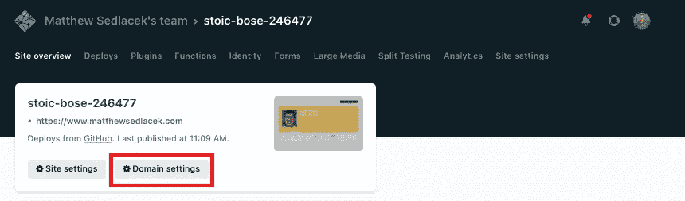
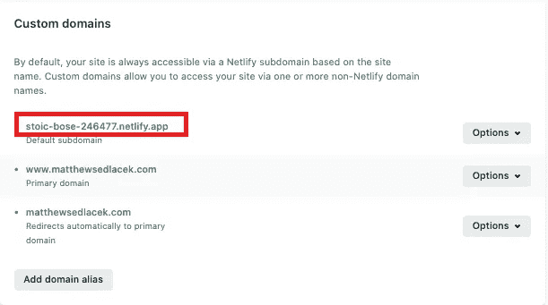
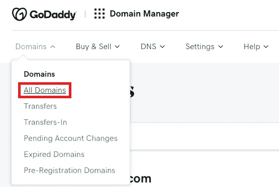
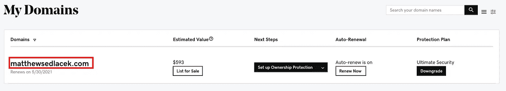
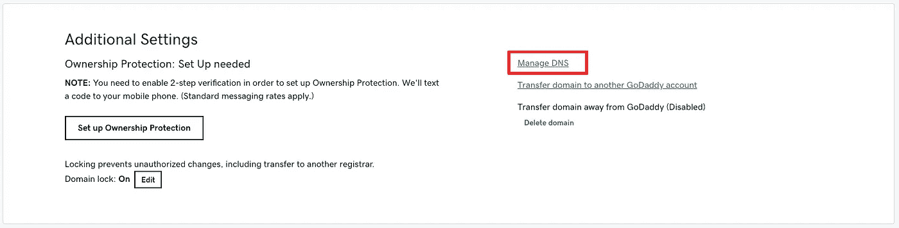
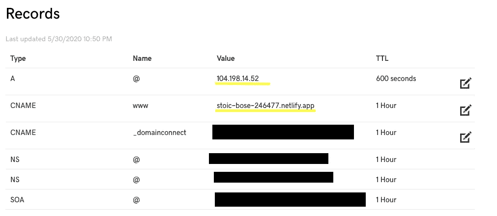
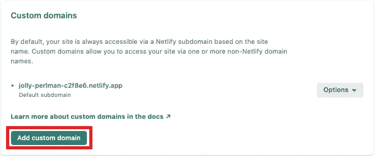
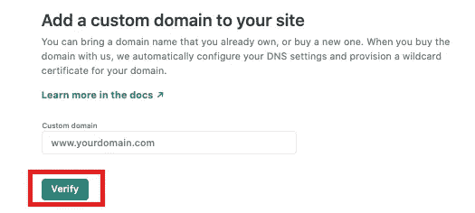
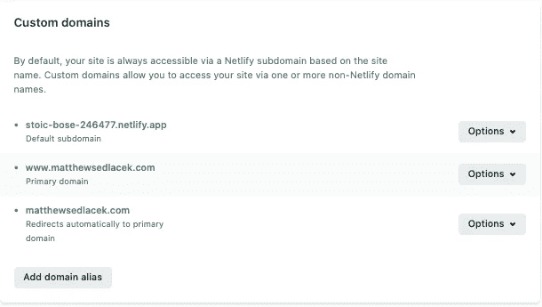

# Netlify:用 GoDaddy 定制域

> 原文：<https://levelup.gitconnected.com/netlify-custom-domains-8b4cc5fddb5d>

美国宇航局在 [Unsplash](https://unsplash.com?utm_source=medium&utm_medium=referral) 拍摄的照片

如果你已经在 Netlify 上部署了你的应用程序，但更喜欢使用你在 GoDaddy 上购买的域名，这是为你准备的博客。

本指南将引导您完成使用自定义 GoDaddy 域的必要步骤，同时继续使用 Netlify 及其所有有用的部署功能。

**前期工作**

本博客假设您已经创建了一个 Netlify 帐户并购买了一个 GoDaddy 域名。如果你还没有这样做，你可以在这里注册/购买([Netlify](https://app.netlify.com/signup?_ga=2.39371296.2083118729.1605908234-1975371472.1597791247)&[go daddy](https://www.godaddy.com/))。

** [请注意，Netlify 现在允许用户直接购买域名](https://www.netlify.com/blog/2018/06/19/buy-and-secure-a-custom-domain-through-netlify/) **

关于如何将 GitHub 库部署到 Netlify 的教程，请参见我在这里发布的博客。

**网络生活:入门**

要开始，我们首先要确定我们的默认子域。我们稍后需要向 GoDaddy 提供这些信息。要查找默认子域，请单击您的 Netlify 站点的站点概述选项卡中的域设置按钮。

站点概述选项卡网络

您的默认子域将是自定义域部分的第一项。

Netlify 中的默认子域

**GoDaddy: DNS 管理**

登录您的 GoDaddy 帐户，并从域下拉列表中选择所有域。

GoDaddy 登录页面

单击您想用于网络站点的自定义域。

GoDaddy 的域名列表

向下滚动到附加设置，然后单击管理 DNS。这将填充自定义域记录。

这些记录应该预先填充了您需要的所有必填字段。唯一需要更新的两个字段是 Type A 和 CName 的值字段。类型 A 是网络服务器的 IP 地址，对所有域和用户都是一样的，104.198.14.52。CName 是我们前面提到的网络默认子域。更新此字段允许 GoDaddy 将自定义域发送到正确的 Netlify 子域。

GoDaddy DNS 管理记录

**Netlify:自定义域验证**

现在回到 Netlify，我们能够添加我们的自定义域。单击添加自定义域按钮。

添加自定义域

接下来，键入您的自定义域名，以“www”开头。然后单击验证。

如果您的验证成功，您应该会看到类似如下所示的内容。你的自定义域名应该包括一个默认的子域，主域(即[www.matthewsedlacek.com](https://www.matthewsedlacek.com/))，以及当用户不输入 www 时的重定向(即【matthewsedlacek.com】T2)。

现在是庆祝的时候了；您现在可以与全世界共享您的自定义域名了！

**资源**

TopTechNow。"如何将 Netlify 连接到 Godaddy(自定义域)." *YouTube* ，由 TopTechNow 上传，2018 年 1 月 18 日[https://www.youtube.com/watch?v=qbChXHDAK4s](https://www.youtube.com/watch?v=qbChXHDAK4s)。