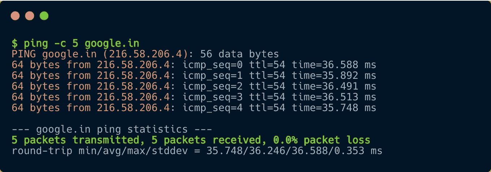

# 面向开发人员的网络故障排除基础

> 原文：<https://levelup.gitconnected.com/network-troubleshooting-basics-for-developers-cf0a1e96ea00>

## 4 个简单的命令行工具，可以更快地调试网络问题

在您职业生涯的某个阶段，您可能会面临这样的问题，比如无法连接到数据库或应用程序，无法浏览网站，或者根本无法通过 ssh 连接到另一台机器。通常情况下，您看到的错误消息也不是非常有用。

在这篇文章中，我想讨论 4 个实用程序，它们可以帮助您有效地调试和修复此类问题，或者至少可以帮助您获得具体的发现，以便您可以有效地与技术同行交流。

# 重要的事情先来

你面前的电脑或电话被称为*客户端——请求信息的客户端*。另一边的计算机，*一台服务器——*服务于该请求的服务器。客户端和服务器之间的所有通信都涉及不同的层。履行各自职责的层，以确保两台机器能够相互通信。它们从上层/下层获取某种形式的信息，并将其进一步传递到链中。

这形成了 TCP/IP 模型的基础，它是世界上任何客户机和服务器之间的通信标准。补充不同层的是协议——客户机/服务器可以使用的不同语言。这些就是我们所知道的 HTTP，FTP，TCP 等。它们使服务器能够充当 web 应用程序、ssh 服务器等。同时。

然而，在这篇文章中，我们不会深入研究 TCP/IP 模型或不同的协议，而是将重点放在工具/实用程序上，这将帮助您调试这些层的不同方面，并使您作为开发人员的生活更加轻松。

作为一名开发人员，您通常首先会有一个域名。

# dig——给我那个域名

计算机不理解域，它们需要一个 IP 地址。你可以用`dig` *轻松获取一个域后面的服务器。*让我们从谷歌开始:

dig —域名解析(google.com)

因此，客户对 google.com 的请求(在本例中是对 T10 的请求)将由 216.58.210.14 现有的机器提供服务。*查询时间*响应中突出显示了解析该域名所花费的时间。操作系统和浏览器通常在定义的 *ttl* (生存时间)持续时间内缓存这些结果，以便对*google.com*的后续请求可以自动发送到 216.58.210.14

同样地，你可以检查谁是亚马逊的幕后黑手

dig —域名解析(amazon.de)

有三台服务器准备好接受对 *amazon.de.* 高流量网站通常会这样做，以便在不同的服务器之间对传入的请求进行负载平衡。客户端(浏览器/终端等。)然而，每次将仅启动与其中任何一个的连接。

一个小版本的快速知道谁在一个特定的域后面是与选项`+short`

摘要—短输出格式

可以使用类似的步骤来识别 AWS Cloud 上的服务器、您的办公网络中的数据库或在互联网上注册的任何其他域。

一旦 *dig* 返回 ip 地址，你现在可以检查你的机器是否真的可以到达它。

# ping——发送一个无声的“你好”

砰

发送 5 个数据包到 *google.in* 服务器，说*你好。* `ping`使用 ICMP 协议向服务器发送回应请求，服务器以回应响应进行回应，确认您的机器和 *google.in* 之间的网络路径是正常的——仅此而已。它不使用任何端口，也不提供对以下问题的智能洞察:该服务器能与 HTTP 对话吗？也许 FTP？我能从中得到什么有用的东西吗？

例如，很有可能服务器不允许你用它来说 HTTP。因此，理解从 *ping* 的输出中得到什么很重要

# nc —服务器是否监听特定端口？还是端口范围？

*nc (netcat)* 帮助您进一步确认服务器是否响应特定端口。

*netcat* 与<主机>和<端口>一起工作，作为参数传递给命令。你可以测试 *amazon.de* 是否开放 talk HTTP(端口 80)，比如:

netcat —扫描服务器上的可用端口

看起来它确实在端口 80 上做出了响应！但是，其他端口似乎被封锁了。在这种情况下，选项`-v`将`verbosity`添加到 *netcat* 输出中，并且`-z`确保端口被扫描——但是没有数据发送到服务器。类似地，您可以通过在端口 22 上启动 *netcat* 检查来调试远程服务器是否允许 SSH 连接。

## 注册一个 netcat 监听器

如果您想测试两台机器——X & Y——之间的网络，并且您可以访问这两台机器，该怎么办？快速检查可以是在服务器 Y 上“注册”一个 netcat 监听器:

netcat —服务器 Y 上的侦听器

并且触发来自*客户端 X* 的请求

netcat —来自客户端 X 的请求

这种测试在您无法控制两台这样的机器之间的网络，并且由于某些网络/安全配置，您的数据包实际上在“途中”被丢弃的情况下非常有用。netcat 使您能够在没有真正的 HTTP 服务器的情况下进行测试。这可以帮助你排除任何破坏聚会的外部因素。

# curl —一切看起来都很好，让我们说一种标准语言

测试了基本的网络连接后，您现在可以直接在终端上使用 *curl —* 来使用 HTTP 和 FTP 等高级协议。

curl 了解许多其他协议，如 HTTPS、TELNET、SCP 等。也是。

向*发送一个简单的 HTTP 请求，google.com*的响应是:

curl — HTTP 请求和响应

将 *curl* 与`-i`一起使用也会返回 HTTP 响应头。您可以看到*google.com*最初发送了一个 HTTP 301 重定向，我们使用了`-L`选项(就像浏览器会做的那样)并最终获得了 HTTP 响应。

我们可以通过发送自定义 HTTP 头来进一步自定义请求:

curl —带有自定义 HTTP 头

## 知道你在外面世界的身份

有时你可能有兴趣知道你的请求到达互联网的公共 IP 地址。测试使用*卷曲*的快速方法是:

卷发——和 icanhazip.com 一起

icanhazip 是一个超级酷的服务，可以返回你发出请求所使用的公共 ip 地址。它还提供许多其他服务，绝对值得一试。例如，此类数据可以帮助您将您的公共 IP 暴露告知第三方服务，以满足白名单需求。

# 所有这些看起来都不错——接下来呢？

上面的帖子已经向你介绍了不同命令的一些基本用法，已经可以帮助你开始了。然而，真正的潜力在于这些命令的**许多选项**，您可以进一步利用这些选项来完成更多工作。例如，学习它们的一个好方法是使用`man curl`浏览各自的手册。

我希望这些能帮助你成为一名更好的工程师，增加你的知识和技能。在以后的文章中，我将尝试深入研究这些工具，探索它们提供的其他精彩功能！

在那之前，楚斯！:)