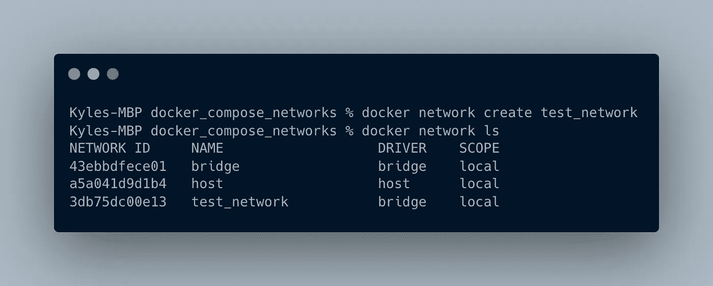
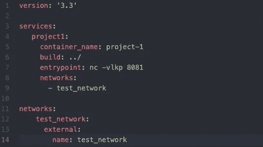
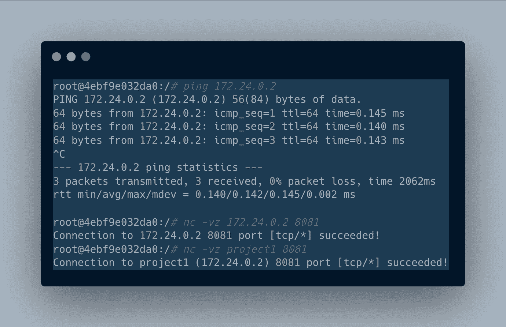
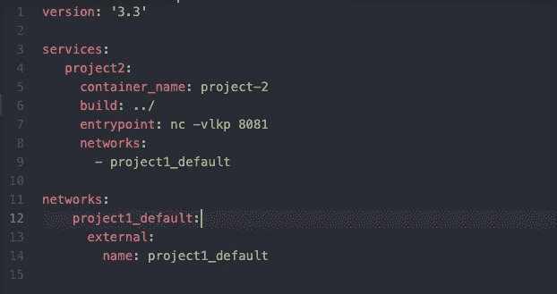

# 多个 Docker-Compose 项目之间的联网

> 原文：<https://levelup.gitconnected.com/networking-between-multiple-docker-compose-projects-317922eb85d2>

当你想在本地运行项目时，一个跨 repos 和 docker-compose 文件的微服务应用程序可能会变得混乱。

多个 Docker-Compose 项目之间的联网

设置开发环境总是具有挑战性，尤其是微服务架构。在我的上一个项目中，我将一个大型的 monolith 分割成跨不同代码库的微服务，最后得到了几个独立的 docker-compose 文件。

我想通过路由 docker 网络中的所有内容，在我的本地机器上测试完整的应用程序。我怎样才能让不同的服务在 docker 中连接起来，但是运行在它们单独的 docker-compose 项目目录中？

我不是专家，但是我通过使用 docker-compose 文件和服务发现了一些有趣的概念。

# Docker 网络公司

Docker 有它的[网络](https://docs.docker.com/network/)子系统。当启动 Docker 时，它创建了一个**桥**网络。该网络连接了所有服务，但除非指定，否则不直接连接容器。您也可以创建和指定自己的桥接网络。

在 ***相同的 YAML 文件中概述的 Docker-compose 服务将总是在相同的桥接网络*** 上，通过它们的服务名创建并可到达。我想使用它，这样我在多个 docker-compose 文件中的不同服务就可以通过它们的服务名互相访问。

我的测试目录。每个项目都在自己的目录中，以确保创建了不同的网络。

## 手动创建 Docker 网络

我们可以建立我们的 docker 网络，并指导 docker-compose 服务使用我们创建的网络。

我们这样做:

创建网络并检查它是否存在

现在告诉他们使用这个 docker 网络

我们通过在 docker-compose 文件中将网络声明为 ***外部*** 来实现这一点

将网络声明为外部网络

这告诉 docker-compose 不要创建默认网络，而是使用我们预先存在的网络。让我们 ping 另一个项目的 IP 地址——我们可以使用`docker inspect [container]`来检索它。然后，让我们使用 IP 地址和服务名向它发送一个请求，以证明 Docker 仍然在同一个网络上解析它。

向另一个 docker-compose 项目发送请求

## 让它变得更容易

Docker 通常使用目录和`_default`的命名方案来制作默认网络。我们可以在第二个项目中将其声明为外部的，而不接触第一个项目的 docker-compose 文件。

只需使用第一个项目中默认网络的名称

以下是帮助很大的 StackOverflow 帖子！

 [## 多个 docker-compose 项目之间的通信

### 如果你试图在来自不同 docker-compose 项目的两个容器之间进行通信，并且不想使用…

stackoverflow.com](https://stackoverflow.com/questions/38088279/communication-between-multiple-docker-compose-projects)  [## docker-编写容器之间的请求

### 我对 docker-compose 有点陌生，所以我甚至不确定我在寻找什么。我创建了两个图像，我正在运行…

stackoverflow.com](https://stackoverflow.com/questions/52010778/docker-compose-make-requests-between-containers) 

# 帮助工具

*   `docker network create`
*   `docker network ls`
*   `docker inspect [container name]`
*   `netcat`

# TL；速度三角形定位法(dead reckoning)

*   连接多个 docker 网络可能会变得棘手
*   通过创建一个网络或者使用创建的默认网络，我们可以在文件名中使用`external`来连接它们

如果你喜欢你读到的内容，请在 LinkedIn[或 Medium 上关注我:)](https://www.linkedin.com/in/stcalica/)

# 分级编码

感谢您成为我们社区的一员！在你离开之前:

*   👏为故事鼓掌，跟着作者走👉
*   📰查看[升级编码出版物](https://levelup.gitconnected.com/?utm_source=pub&utm_medium=post)中的更多内容
*   🔔关注我们:[Twitter](https://twitter.com/gitconnected)|[LinkedIn](https://www.linkedin.com/company/gitconnected)|[时事通讯](https://newsletter.levelup.dev)

🚀👉 [**加入升级人才集体，找到一份神奇的工作**](https://jobs.levelup.dev/talent/welcome?referral=true)