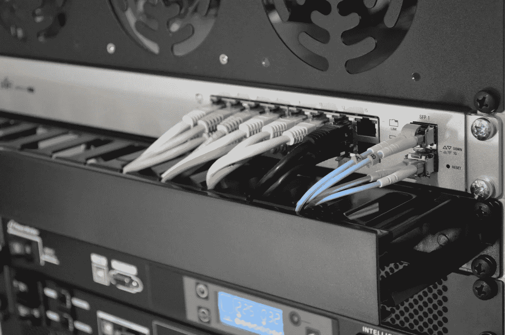
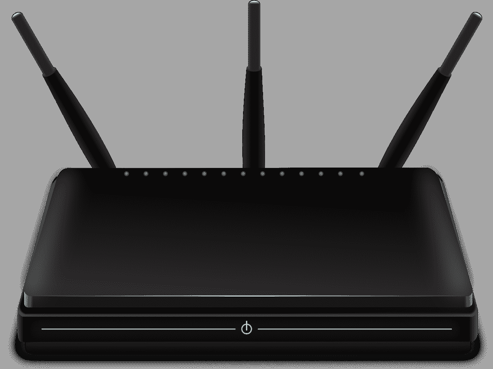
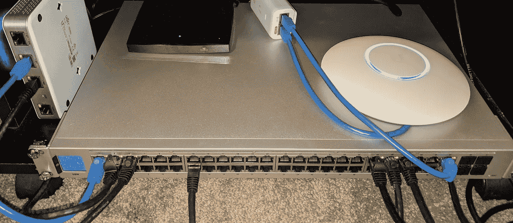

# 家庭网络:网络设备

> 原文：<https://levelup.gitconnected.com/networking-your-home-network-equipment-b864c9ecf596>

## 运行家庭网络所需的硬件

*照片由* [*托马斯·詹森*](https://unsplash.com/@thomasjsn?utm_source=unsplash&utm_medium=referral&utm_content=creditCopyText) *上* [*下*](https://unsplash.com/s/photos/network-rack?utm_source=unsplash&utm_medium=referral&utm_content=creditCopyText)

在之前的文章中，我已经谈到了 [*为什么在你的房子里获得一个健壮的网络是个好主意*](https://codeburst.io/networking-your-home-how-and-why-7e5a96a49a0f) ，以及 [*如何开始使用以太网*](/networking-your-home-ethernet-1dc94cdf6c1e) 为你的网络建立一个坚实的基础。在这篇文章中，我将讨论连接设备*和网络*所需的网络硬件。

 [## 家庭网络:如何和为什么

### 关于构建和管理家庭网络的系列文章

codeburst.io](https://codeburst.io/networking-your-home-how-and-why-7e5a96a49a0f)  [## 家庭网络:以太网

### 在家中安装以太网，实现高速家庭网络

levelup.gitconnected.com](/networking-your-home-ethernet-1dc94cdf6c1e) 

# 基础知识

在任何家庭网络中，至少有四种基本需求:

1) **一个调制解调器**。互联网进入你家的第一步。我们大多数人仍然需要一些硬件来接收网络信号。互联网服务提供商(ISP)通常通过以太网电缆以外的其他方式向我们的家庭传输数据。如果你有来自 ISP 的同轴电缆连接，这可能是一个电缆调制解调器，如果你有电话线连接或某些类型的光纤，这可能是一个 DSL 调制解调器，如果你连接到蜂窝网络，这可能是一个 5G 调制解调器，或者它可能完全是其他东西。

2) **一个路由器**。在网络中，路由器是调度器。当外部数据进入我们的专用网络时，路由器会告诉它去哪里，当它离开时，路由器会告诉专用数据去哪里。它是您的专用网络和互联网之间的唯一连接。由于这种中心角色，它通常充当防火墙来阻止不需要的数据或访问，以及作为一个中心位置来为您的硬件分配数字地址。

3) **一个开关**。路由器添加数字信息来告诉数据在网络上的去向，而交换机在不同的线路上物理地移动数据。路由器可能会收到一个它知道需要发送到地址 192.168.1.10 的传入数据包(例如)，交换机将知道通过哪条线路将信息向下发送到*到达* 192.168.1.10。

4) **一个无线接入点**。这本质上是一个无线设备的开关(从技术上讲，它更像是一个集线器)。您需要某种方式让您的无线设备访问网络，这就是接入点。这些设备会将以太网电缆上的信号转换成无线广播，反之亦然。您需要有策略地放置这些接入点，以最大化无线设备的信号强度。

*图片由*[openclipbart-Vectors](https://pixabay.com/users/openclipart-vectors-30363/?utm_source=link-attribution&utm_medium=referral&utm_campaign=image&utm_content=157597)*转自* [*Pixabay*](https://pixabay.com/?utm_source=link-attribution&utm_medium=referral&utm_campaign=image&utm_content=157597)

# ISP 多功能一体设备

许多 ISP 出租一种“多合一”设备，将所有这些功能集成到一个盒子中，您可以将其插入外部互联网连接。这很酷。它甚至可以在简单或小型设置中很好地工作。

然而，从长远来看，购买自己的设备往往更便宜，而且毫无疑问，它的可配置性要高得多。另外，谁真正信任他们的 ISP 并希望让他们的硬件看到你的私人网络呢？

为此，一个简单的方法是购买您的 ISP 需要的调制解调器(每个 ISP 都有一个兼容调制解调器的列表，如果您需要他们的支持，我通常建议您坚持使用他们的列表)，并购买额外的设备来满足其他三种需求。你可能会发现你不得不不时地升级你的调制解调器(比如每当康卡斯特*最终*推出 DOCSIS 4 来让我们获得更高的速度时[，但是通常你会通过节省 ISP 的调制解调器/组合盒的租赁费而获胜。](https://www.telecompetitor.com/comcast-docsis-4-0-test-puts-fiber-broadband-competitors-on-notice/)

 [## 如何构建家用戴尔服务器

### 使用 ZFS、RAID、Docker 和 Ubuntu 构建戴尔 R720XD

javascript.plainenglish.io](https://javascript.plainenglish.io/how-to-build-a-dell-server-for-home-use-cbf293b9614e) 

# WiFi 路由器

有许多设备将集路由器、交换机和无线接入点于一身。在我之前的文章中，你可以看到我正在使用其中的一个。这些工作太棒了！在不需要分散接入点的较小空间中，这可能是一个不错的解决方案。

我建议你的网络设备坚持使用主要品牌，这些年来我一直很满意 Linksys、TP-Link、Netgear 和华硕。

但是你需要哪些特性呢？

易于描述的功能是设备的路由器和交换机部分。确保你的设备支持广域网(互联网端)和局域网(你的网络)端的千兆以太网流量。这是相当标准的，但最好再检查一遍。路由器软件通常也很简单，但是如果你需要更强大的功能(DDNS、端口转发等)，这就是你需要钻研路由器软件的地方。

WiFi 接入点技术是事情变得复杂的地方，因为它在不断地变化。我们已经进入了 WiFi 6 的世界，一些 WiFi 设备支持 6e，现在据报道 7 即将到来。这些分类中的每一种都有不同的硬件和不同的频谱使用，那么我们该怎么做呢？

嗯，802.11ac 是目前事实上的标准。这是目前大多数实际消费设备所支持的。慢慢地，设备将迁移到 802.11ax 或更高，但现在我们谈论的是收益递减。这些设备可以达到*理论上的*千兆位或更高的无线速度，但在实践中，我发现当你在家里走动时，大多数设备的无线速度在 200 到 500 兆位之间。其次，我们大多数人不可能获得比任何给定网站或数据中心更高的速度。如果是这样的话(就目前而言)，我会选择任何高质量的 802.11ac 接入点，而不是昂贵得多，可能质量较低的 802.11ax 或更好的接入点。

对于三合一系统，我不会购买最新和最好的，因为随着这些标准的变化，您可能会发现自己想要更频繁地升级。100 到 200 美元范围内的大多数 WiFi 路由器都很好。

如果有人问我，我会推荐主要品牌中的一款:

*披露:这篇文章包含亚马逊联盟产品的链接。通过这些链接购买支持我们的写作，不收取额外费用！*

[华硕 RT-AC68U](https://amzn.to/2RbpkaI)

[TP-Link Archer AX20](https://amzn.to/3eE4hpj)

[网件夜鹰 R7800](https://amzn.to/3sYCyVv)

[Linksys WRT1900ACS](https://amzn.to/3nISTg5)

您还可以在互联网上找到各种指南，推荐这些路由器的最新和最佳版本，并讨论各种型号之间的差异和细微改进。

# 为什么我需要的不仅仅是一个简单的 WiFi 路由器？

*照片由* [*克里斯蒂娜·莫里洛*](https://www.pexels.com/@divinetechygirl?utm_content=attributionCopyText&utm_medium=referral&utm_source=pexels) *发自* [*Pexels*](https://www.pexels.com/photo/woman-standing-while-carrying-laptop-1181354/?utm_content=attributionCopyText&utm_medium=referral&utm_source=pexels)

许多这种路由器组合框的最大问题是，随着时间的推移，你会想要升级它们。我们不能完全预测未来，但我知道，在过去，我想每隔三到五年升级我的无线速度，每隔十年左右升级我的以太网速度。如果我有一个组合框，我必须买一个全新的框，并重新配置所有的软件和整个网络。

相反，如果我购买单独的盒子，我可以升级我需要的部件，并经常避免重大的重新配置。

如果你按照我以前的文章做了，并为你的房子安装了以太网，你将会想要比组合框所能提供的更多的交换能力。如果您的以太网在一个中心位置终止，您可以购买一台大型交换机，或者在每个工作站购买较小的单个交换机，以支持多个有线设备。

同样，如果你有一个中型到大型的家庭，你可能会发现一个 802.11ac 接入点不足以完全覆盖你的整个房子。如果你所有的无线接入需求都在你的组合框附近，没问题。否则，如果你想保持快速连接，你最终会需要更多的接入点。

组合框*仍然可以*工作，而*仍然可以*作为你的网络的主要基础。然而，虽然添加交换机通常就像在您需要的地方插入一个新交换机一样简单，但向许多组合框添加另一个接入点可能会很麻烦或很难正确完成，从而导致网络吞吐量出现问题。

相反，将设备的功能部分或全部分离出来通常是值得的。

对我来说，它归结为三个主要选择:Google Nest Wifi、TP-Link Omada 和 Ubiquiti UniFi。我最终选择了 UniFi，但出于不同的原因，它们都是不错的选择。

你*可以*通过购买(比如)二手商业硬件来拼凑一个便宜得多的二手解决方案。这对我们中的高级用户来说没问题，但通常需要对每个组件的功能有更深入的了解。我几乎走了那条路，但是我最终决定了易用性和可配置性。

至关重要的是，这些系统使用的接入点可以完全是无线的*或*可以与有线回程一起使用。如果您无法将以太网运行到您将放置接入点的位置，这些仍然可以工作。然而，由于我在上一篇文章中概述的许多原因，如果你*可以*为他们提供以太网，这些系统中的每一个都可以使用专用线路(有线回程)，这往往会提高吞吐量。

# Google Nest WiFi

如果我只需要一个简单的系统，或者正在为我的父母安装一个系统，我可能会选择 [Google Nest WiFi 解决方案](https://amzn.to/3e49bwQ)。设置非常简单。您可以购买 1、2 或 3 个接入点系统，并根据需要轻松扩展。每个接入点也是一个谷歌助手和扬声器。

它们的每个“球体”实际上是一个路由器*和一个接入点*，谷歌对它们进行了设置，以便最直接连接到你的调制解调器的那个决定成为路由器和父接入点，而其他的作为孩子加入网络。您可以将两个以太网端口中的任何一个连接到您的其他设备(调制解调器、交换机、计算机、打印机等)，在大多数情况下，它将“正常工作”。

这些设备的缺点是，由于它们使用*的简单性*，你无法获得其他路由器可能提供给你的所有强大功能。好处是它们非常便宜。一个两包的球体将花费大约 300 美元，与一些高端的*单*组合盒相当。

# “专业消费者”级解决方案

*图片由* [*Gerd 奥特曼*](https://pixabay.com/users/geralt-9301/?utm_source=link-attribution&utm_medium=referral&utm_campaign=image&utm_content=3087393) *转自* [*Pixabay*](https://pixabay.com/?utm_source=link-attribution&utm_medium=referral&utm_campaign=image&utm_content=3087393)

Ubiquiti 和 TP-Link 解决方案更复杂……但也更易于配置。它们比谷歌的解决方案更贵，因为你倾向于为每个组件(路由器、交换机、接入点等)购买不同的硬件，但你也可以随着时间的推移单独升级这些组件。此外，通过混合使用托管交换机(L2 交换机和 L3 路由器),您可以设置访客无线网络、面向儿童的隔离内部网络以及许多其他强大的“专业”功能。

这两个品牌拥有相同的解决方案架构。本文开头列出的每项功能都有自己的硬件部分(路由器、交换机、接入点)。另外，你需要一个控制器。这是一个独立的系统，要么作为软件在本地 PC 上运行，要么作为硬件在你从制造商那里购买的盒子上运行，要么通过订阅费在云中运行。

您将路由器的 WAN 端连接到调制解调器，LAN 端连接到交换机。交换机连接到所有接入点和控制器。至少有一个接入点需要通过以太网连接到交换机。其他交换机可以通过第一交换机无线连接到交换机，或者通过有线回程连接连接到交换机。

这种分离意味着我现在非常乐意购买单独的接入点，因为我知道几年后下一个标准出来时我可以升级它们。路由器、交换机和控制器都将正常工作，直到进入万兆网络，只有*和*需要升级(可能几年后)。

# Ubiquiti vs TP-Link

这是互联网上的一个长期争论，除了这两个选项，还有更多选项。在过去的一年里，Ubiquiti 和 TP-Link 在很多榜单上都名列前茅，所以它们是我调查的两个主要选项。两者各有利弊，尽管相似之处多于不同之处。TP-Link 更便宜，但 Ubiquiti 有更发达的功能集。

由于三个主要问题，Ubiquiti 最近的 PR 值一直很低。他们的云系统存在安全漏洞，或许应该处理得更好。他们正在开发一个新的 UI，它有一些不错的设计元素，但缺少许多关键功能(尽管你仍然可以在同一台机器上的旧 UI 中访问这些功能)。他们最近也开始在用户界面上为自己的产品做广告，这让人们很恼火。从积极的方面来看，Ubiquiti 似乎以像样的硬件和管理整个系统非常好的控制器而闻名。

类似地，TP-Link 几年前曾因质量问题出现在新闻中，但最近似乎表现不错。他们是新的整个系统控制器游戏，它显示，但它仍然工作得很好。

最后，我决定用 Ubiquiti 掷骰子。我喜欢拥有一个控制器，可以从一个系统控制接入点、路由器和交换机。我希望随着 UI 进入 alpha，他们会继续改进它。也许他们会听取顾客的意见，也去掉那些广告。在此之前，许多人可能会简单地使用旧的用户界面，或者永远不会更新到新的软件……这可能是控制器的一个可行的选择，除非发现了重大的安全漏洞(以前的安全漏洞是他们的云系统，可能来自内部，可能不是系统本身的漏洞)。

# TP-Link 解决方案

## 控制器

您可以选择云控制器、软件控制器或硬件控制器( [OC200](https://amzn.to/3eEg1Il) )。就我个人而言，我不希望我的所有信息都在云上，也不希望持续的互联网连接试图进行动态负载平衡，所以对我来说，这取决于软件控制器或硬件控制器。

软件控制器是免费的，但是如果你想动态管理你的网络，你可能希望它 24/7 运行，所以你需要一台 24/7 运行的计算机。我有一个家庭服务器，非常适合这个(特别是在 Docker 容器中运行)。如果你只是想偶尔改变一下，那也是可行的。

[OC200](https://amzn.to/3eEg1Il) 硬件控制器通常不到 100 美元，是另一个不错的选择。如果您没有可以 24/7 全天候运行的设备，或者想要将工作转移到专用的机器上，这是一种经济高效的方法，并且有足够的硬件来正确完成工作。

## 路由器(和 4 端口交换机)

那辆 [TL-R605](https://amzn.to/3xC5sxU) 有你罩着。我最后一次看到这个是 60 美元，在这个价格上它是一个强有力的竞争者。根据我阅读的许多评论，你可能会受限于一些不常用的功能，如 DDNS，或者可能会发现像 DHCP 这样的大规模 UI 没有很好地实现。但是您仍然可以将它用作千兆位交换机或实现 VLANs。

## 开关

如果四个端口对您的网络来说不够，您可以添加任何品牌的非托管交换机，并依靠路由器进行 VLAN 管理。那是一种非常便宜的方法。或者，根据端口数量以及是否提供以太网供电(POE)，您可以获得 60 美元至 500 美元的托管交换机(寻找 [Omada SDN 集成交换机](https://amzn.to/3gO9sWd))。

## 接入点

目前性价比最高的可能是 EAP245。花大约 100 美元，你就可以得到 802.11ac 和上面列出的所有功能。EAP225 功能稍弱，但 60 美元和更轻的家庭网络可能也是一个强有力的竞争者。你可以分别花 150 美元和 200 美元用 [620HD](https://amzn.to/3eG4hFg) 和 [660HD](https://amzn.to/3gPGIfG) 做得更大更快，但是如果 TP-Link 系统的目标是一个预算友好的系统，我会跳过这些，直到技术变得更便宜。

## 现在都在一起

如果你建立一个双接入点系统，你会看到一个 260 到 400 美元的价格标签，这真的一点也不差，至少在谷歌系统的价格范围内。您可以获得更多的功能，但设置更复杂。

# 普遍适用的解决方案

## 控制器

我们再次关注云控制器(购买[云密钥](https://amzn.to/3xC2sBG))、软件控制器(免费，但需要一台 24/7 运行的计算机)或硬件控制器( [Ubiquiti 梦想机器](https://amzn.to/3gPwPyQ))。这是一个艰难的选择。云密钥对我来说是不可能的，因为我不想为它支付 99 美元，我也不想我的配置被云管理。但是这台售价 300 美元的梦想机器还是很划算的，因为它同时也是路由器、接入点和交换机。同样值得注意的是，如果你开启了威胁管理(IPS/IDS)或者当作为 VPN 工作时，梦想机器在处理负载方面要好得多。

尽管如此，我还是通过我的家庭服务器和一个单独的路由器和交换机使用了软件控制器。这样，我可以在以后升级我的接入点，我可以有一个更大的管理交换机，我也可以保持我的控制器独立。

## 路由器

还是那句话，拿到梦想机，就不需要单独的路由器了。但是，如果你去我的方向， [UniFi 安全网关](https://amzn.to/3e5eRXc)是机器购买。它的价格约为 135 美元，可以让你得到一个功能非常全的路由器，尽管它的动力不足以进行主动威胁管理。

## 开关

根据您的端口需求和 POE 需求，Ubiquiti 提供了全系列的托管和非托管交换机(寻找 [UniFi 交换机](https://amzn.to/3aPMgDa))。如果你有梦想中的机器，你已经有四个端口可以添加。对于我自己的构建，我有一个 48 端口的交换机来与安全网关配对。矫枉过正，但我会做很长时间。大多数 Ubiquiti 交换机也是无风扇的，我希望运行安静，尽可能少发热，所以这是一个很好的选择。

## 接入点

UniFi nano HD[每台 175 美元，具有 4x 4 MU-MIMO(WiFi 上多达四个独立的带宽流)，并被设计为全向的。这是一个相当高质量的接入点，可能比你能以合理的价格使用的技术更多。外面有更好的，但这是坚实的。](https://amzn.to/3eF4OXT)

## 现在都在一起

梦寐以求的机器解决方案*或*安全网关解决方案加两个接入点将花费您大约 475 美元。再加上开关，价格开始变得相当明显。此外，最近的负面报道让一些人放弃了 Ubiquiti，转而支持其他竞争对手，比如 TP-Link，我不怪他们。我相信更全面的特性集会对我有用，而 Ubiquiti 凭借其相当精简的产品，将继续更新和升级他们的软件，并倾听他们的社区。我们看看这个赌注是否值得！

*更新:在写这篇文章的时候，Ubiquiti 已经发布了补丁说明，显示了在他们的控制器中移除广告横幅的能力。我选择把这当成一个积极的信号。*

# 结局？

*作者照片…我的装备的临时住所*

如果我在 Ubiquiti *上的赌注没有*得到回报，我很可能能够在未来打开 WRT 或类似的东西，跳过 Ubiquiti 的软件，尽管和所有与技术相关的东西一样，没有任何保证。与此同时，我已经为我希望我的网络实现的目标做了一个可靠的设置，我应该能够在未来根据需要一点一点地升级它。

在下一篇文章中，我将看看我使用 UniFi 软件的一些经验，并谈谈如何设置接入点以获得最佳 WiFi 体验。

# 敬请关注…

伙计们，就这样吧。我边写边建，当文章完成后，我会回来添加链接！

1.  [为你的家联网:如何和为什么](https://codeburst.io/networking-your-home-how-and-why-7e5a96a49a0f)
2.  [家庭网络:以太网](/networking-your-home-ethernet-1dc94cdf6c1e)
3.  家庭网络:网络设备
4.  家庭网络:WiFi 和 Ubiquiti

[*公民升级*](https://medium.com/@citizenupgrade) *是一个涵盖技术、社会、个人发展的专家社区。请访问我们的* [*网站*](https://citizenupgrade.com/) *，访问* [*脸书*](https://www.facebook.com/citizenupgrade) *，或访问* [*推特*](https://twitter.com/CitizenUpgrade) *。加入我们的* [*邮件列表*](http://www.citizenupgrade.com/join) *，获取更多精彩内容和其他有用资源。*

 [## Oculus Quest 2 和虚幻引擎 4 快速入门指南

### 虚拟现实入门

codeburst.io](https://codeburst.io/quickstart-guide-to-oculus-quest-2-and-unreal-engine-4-506ca8c27a05)  [## 使用 __init__ 创建本地 Python 包。巴拉圭

### 用于代码重用和分发的包

codeburst.io](https://codeburst.io/creating-local-python-packages-with-init-py-aa19f1e9e80f)  [## 通过我的推荐链接加入 Medium 公民升级

### 作为一个媒体会员，你的会员费的一部分会给你阅读的作家，你可以完全接触到每一个故事…

citizenupgrade.medium.com](https://citizenupgrade.medium.com/membership)