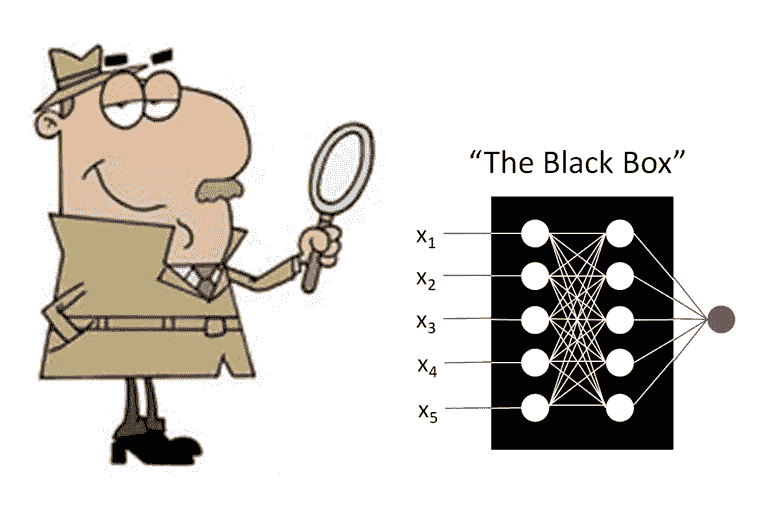
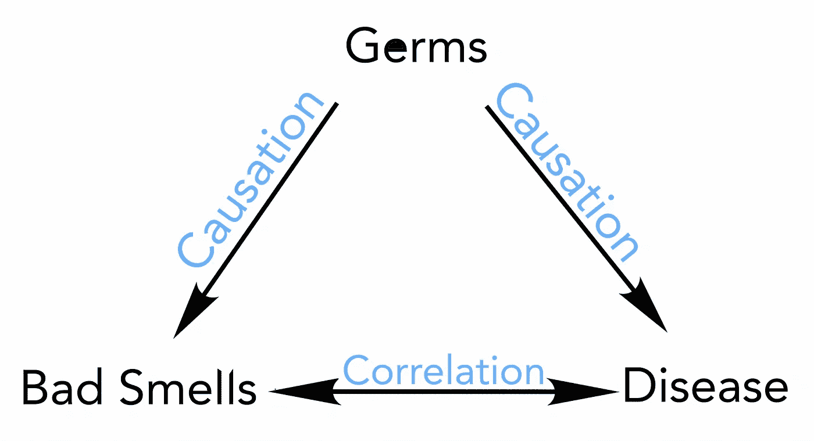
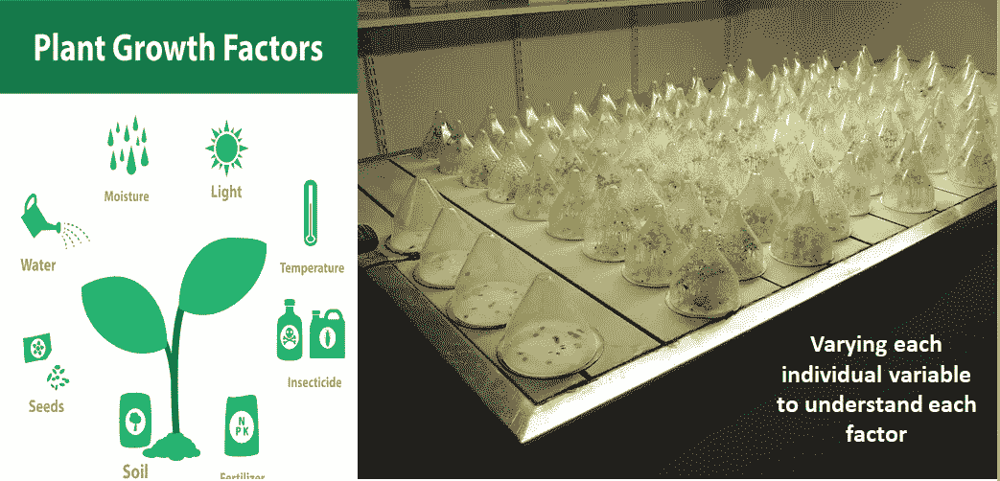
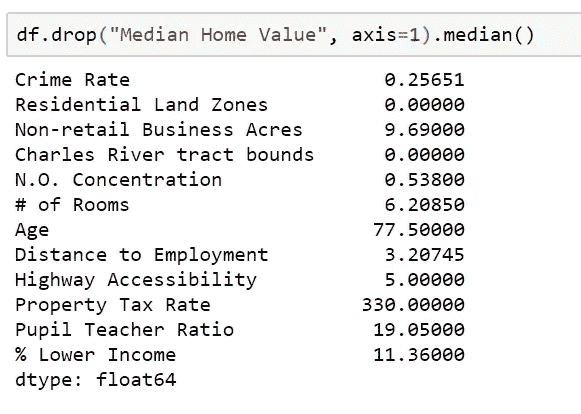
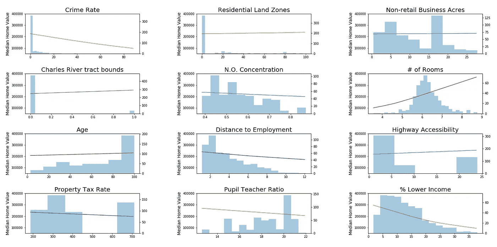
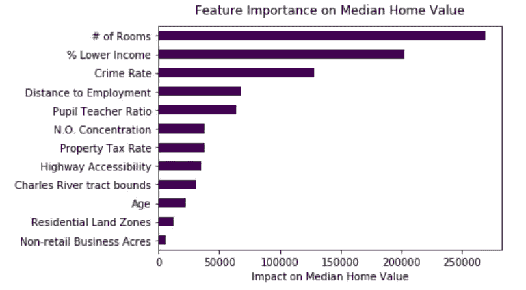

# 具有简单科学技巧的神经网络特征重要性和特征效应

> 原文：<https://levelup.gitconnected.com/neural-network-feature-importance-and-feature-effect-with-simple-scientific-trick-ffd6a453dab4>



# 介绍

所以你建立了你的神经网络，并且，基于它的坚持和/或过时的性能指标，它看起来相当不错。现在你需要把它“推销”给你的商业伙伴，为此，你需要能够**解释**幕后发生了什么。许多建模者会跳过这一部分，说“这是一个黑盒，很难真正知道网络是如何做到这一点的。我可以用 eli5 和 SHAP 得到一个想法，但很难解释它是如何做到的。”

虽然在神经网络中确实有很多事情在进行(数百个权重和偏差，乘以一个激活函数)，但这并不意味着我们不能**对我们的网络如何工作提出一个商业解释**。

在这篇文章中，我将向你展示一个科学家一直用来理解和解释我们周围的自然世界的简单技巧，称为“**其他条件不变**”，翻译过来就是“其他事情保持不变”这是我们能够真正推导出**因果关系和**相关性的唯一方法。我们将探索如何利用 Python 中的其他条件不变来理解我们的神经网络是如何工作的。



# 构建我们的神经网络:波士顿数据集

我已经发表了一篇关于建立预测房价的神经网络的文章。这里 可以找到 [**。出于本文的目的，我将从我离开的地方继续。参考文章将为您提供您需要的所有细节，作为本文剩余部分的背景。**](https://medium.com/@keenan_65699/predicting-house-prices-using-a-deep-neural-network-case-with-the-boston-dataset-48baee64f6b7)

# 特征对预测的影响:*其他条件不变*

为了真正理解一个特征如何影响我们的预测，我们需要**保持所有输入值不变**和**只改变我们想要研究**和理解的特征。通过测量我们预测的结果，我们可以在输入和预测之间画出一个清晰的关系。

一个很好的类比是研究植物生长。如果你想真正知道是什么导致植物长得更高、更绿或结出更多果实，你需要**分离出每个单独的生长因子**，改变它，然后**测量输出，并将**与输入的变化进行比较。这会让你很好地了解那个因素是如何影响预期结果的。



现在，在我们的住房例子中，让我们对照我们的目标结果，**房屋价值中值**，检查一下**【卧室数量】的影响。根据我们的相关矩阵和 sns.pairplot，卧室数量与我们的结果高度相关，因此，在其他一切保持不变的情况下，**(其他条件不变)，看看卧室数量的变化如何影响房价将是很有趣的。****

**首先，我们需要创造我们不变的价值观。我们选择什么样的价值观？一般来说，我推荐**使用每个输入的中间值。**如果您决定选择一行，中间值将允许您避免极端输入。在 Python 中，您可以通过简单地执行以下操作来实现:**

****

**请注意，我们删除了我们的目标可变房价中值，因为我们在向模型提交值时无法使用它**

**现在，让我们创建“房间数”中的所有变体。为此，我们需要知道数据集中“# of Rooms”的最小值和最大值是多少，然后创建一个最小值和最大值之间的变量数组，以提交到我们的模型中。**

```
# create variables to store min and max value for "# of Rooms"
minimum, maximum = df[“# of Rooms”].min(), df[“# of Rooms”].max()# create an evenly spaced array of 100 value between min and max
arr = np.arange(minimum, maximum, (maximum - minimum)/100)
```

**现在，我们已经生成了所有的变量，让我们创建模型的实际输入，这将是每个变量**加上**其他因素/特征的中值，保持不变。**

****

**因为我们现在只对**“房间数”**感兴趣，所以你会注意到它位于 python 列表的第 6 行，即第 5 个值(python 列表总是从 0 开始)。因此，为了改变“房间数量”，我们将按照以下方式修改 python 列表中的第 5 个值:**

**太好了！我们的列表“lst”包含“# of Rooms”的所有变化，而其他所有内容都保持不变，处于中间值。其他条件不变！现在，让我们将输入“lst”提交到模型中，并检查输出。**

```
# scale our values
lst = scaler.transform(lst)# submit to model 
predictions = model.predict(lst)
```

**瞧，我们现在有了对“房间数”的各种变化的所有预测。让我们把它画出来，以便更好地理解正在发生的事情。**

```
plt.figure(figsize=(12, 6))sns.lineplot(test_values, predictions.flatten(), color='r')
plt.xlabel("# of Rooms")
plt.ylabel("Median House Price (Red)")
plt.ylim(0, 400000)plt.twinx()
sns.distplot(df['# of Rooms'], kde=False, bins=10)
plt.ylabel("Distribution of House Price (blue histogram)", labelpad=7)plt.title("Impact of # of Rooms on Median House Price", pad=13);
```

****

# **我们如何解读上面的图表？**

**红线测量的是在改变“# of Rooms”(x 轴)时房价中位数 (y 轴)的**变化。红线清楚地表明，房间数越高，房价越高。事实上，看起来房价中值可以从 100，000 美元的 1 BR 房到 360，000 美元的 9 居室房，**其他一切保持不变**，这是一个 260，000 美元的波动**。仅仅一个变量就让人印象深刻！**

**浅蓝色分布图将帮助您查看波士顿数据集中房间数量的实际分布。这让您了解每个值出现的频率。看起来房间数服从正态分布，最常见的值是 6。请注意，在我们的例子中，房间数是指不含浴室的房子中的房间数。例如，如果某人有一个客厅/餐厅(1) +一个厨房(1) +一个主卧室(1)，那就是一个 3 室公寓。**

# **让我们将此应用于所有特性**

**我们的下一步是检查每个特征对我们的目标变量房价中值的影响。最简单的方法是循环遍历每个特性，并执行与上面相同的步骤。因为我们有 12 个特征，让我们把它们画在一个 3 x 4 的网格上。**

****

**你会注意到，我对所有的图形都使用了相同的 y 轴，所以效果不是相对的，而是绝对的。正如所料，并不是所有的特性对我们的目标变量都有相同的影响。有些有轻微的反比关系，有些有直接的正比关系。**

> ****你需要向你的商业伙伴展示所有的特色效果，这样他们可以帮你把故事拼凑起来。模型验证的这一步对于确保您的模型从业务/现实世界的角度来看是有意义的至关重要。****

**如果您发现要素和结果之间的关系有任何异常，您可能需要重新查看您的数据，因为那里可能会发生一些奇怪的事情。然而，如果你的数据是正确的，你可能要质疑你或你的商业伙伴认为你知道什么！这肯定是建模的乐趣所在。**

# **功能重要性和功能影响**

**上面的图表可以帮助我们讲述一个伟大的故事，但它没有回答这个重要的问题:**当谈到房价时，哪个特征比其他特征更重要？****

**为了检查特征之间的重要性，我们将简单地比较**每个变量对我们的目标产出**、房价中值的最大影响，并将它们从最高到最低排序。这里有一个用 Python 实现的简单方法。**

```
impact_dct = {}for x, y in dct.items():
    df_feature = pd.DataFrame.from_dict(dct[x])
    impact = abs(tdf.y.max() - tdf.y.min())
    impact_dct[x] = impact
```

**请注意，最大影响简单地衡量为**每个特征的所有变化的最高房价和最低房价之间的差异**。让我们把它画出来并给它们排序。**

```
pd.DataFrame.from_dict(impact_dct, orient='index', columns=['Impact']).sort_values(by="Impact").plot(kind='barh', colormap='viridis')plt.xlabel("Impact on Median Home Value")
plt.legend().remove()
plt.title("Feature Importance on Median Home Value", pad=12);
```

****

**现在我们知道评估房价时哪些特征最重要了！看起来确实如此，根据我们的神经网络，“房间数量”对房价的影响最大，紧随其后的是“%较低收入”，根据官方文件，这代表了“较低收入人口”。请注意，在后一种情况下，关系是相反的，这意味着低收入的百分比越高，房价越低。**

**您可以将特征重要性与特征效果结合使用，以获得您的神经网络的完整故事。这将极大地放松你的业务，因为他们现在能够理解你的模型如何优先考虑每个功能，以及它如何评估房屋的价格。**

# **结论**

**我希望你喜欢读这篇文章，就像我喜欢写它一样！我在[www.thepythonacademy.com](http://www.thepythonacademy.com/)兼职教授数据科学，所以如果你想要进一步的培训，或者甚至想从头开始学习，请随时在网站上联系我们。我还计划在这里发表许多关于机器学习和人工智能的文章，所以请随时关注我。请分享、喜欢、联系和评论，因为我*总是*喜欢收到你的来信。谢谢大家！**