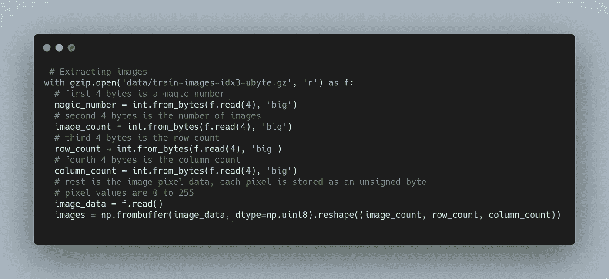
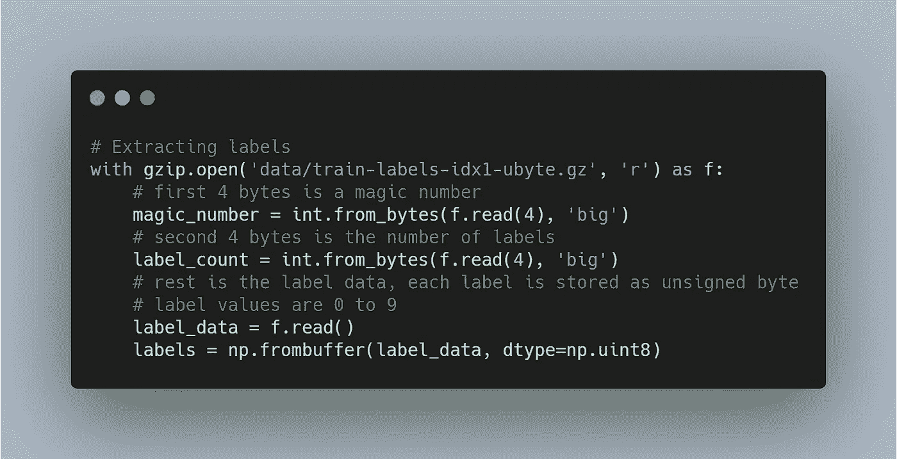
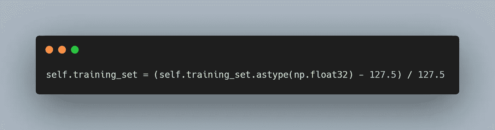
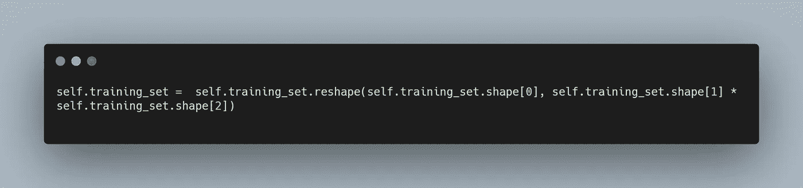
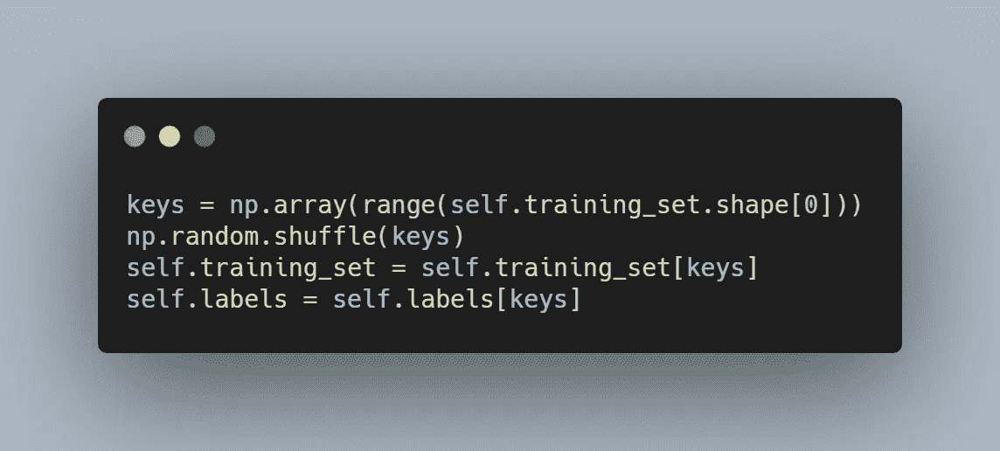
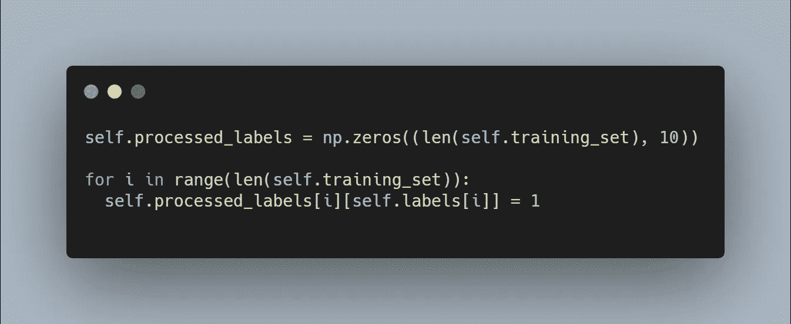
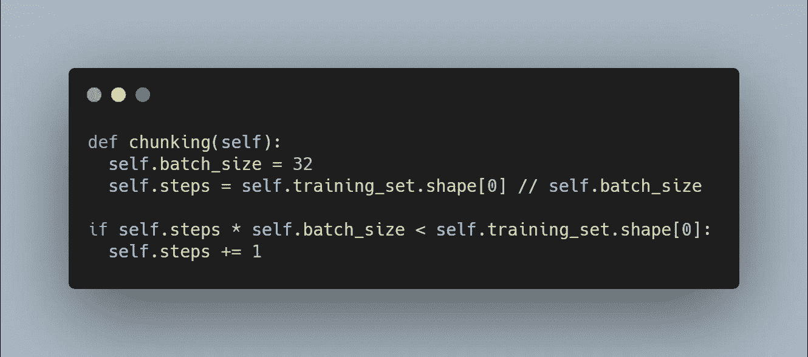
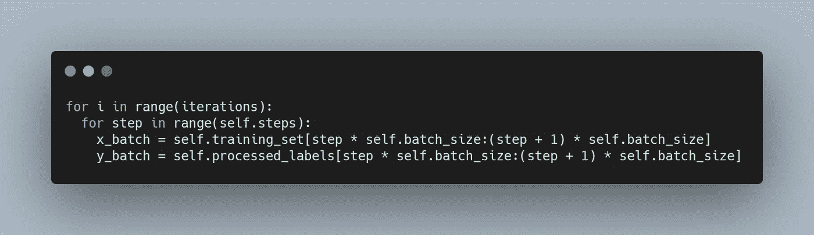
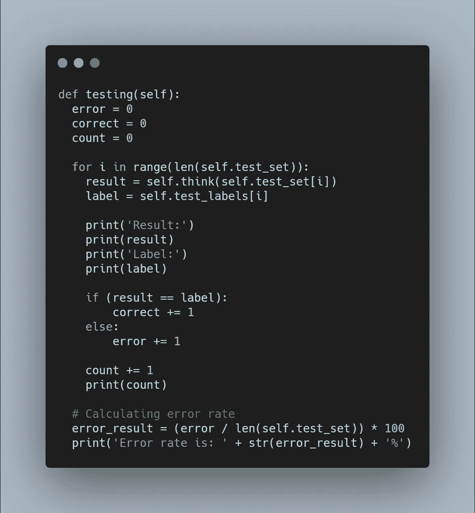
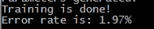

# 从零开始的神经网络:手写数字识别器

> 原文：<https://levelup.gitconnected.com/neural-network-from-scratch-handwritten-digit-recognizer-ca9f0672fe0c>

之前我们学习了如何创建神经网络的不同部分。为了训练不同版本的人工智能，我们使用了抽象的训练数据。现在是使用真实数据的时候了。

**数据**

我们将在 [MNIST 数据集](http://yann.lecun.com/exdb/mnist/)的帮助下，教会我们的神经网络识别手写数字。在机器学习行业也被称为“hello world 问题”。

MNIST 数据集包含 60 000 个标记数据点(图像)作为训练数据集和 10 000 个测试数据集。原始数据存储在二进制文件中，所以我们需要做一些提取工作。你可以在 Kaggle 上找到同样的数据集，以更加用户友好的形式，但我们并没有寻找一种简单的方法。

文件 IDX 文件中的数据作为向量存储在多维矩阵空间中。为了从 IDX 文件中提取数据，我们将需要分离矩阵的每个维度，然后每个数据点，在我们的例子中，将是像素。然后我们将使用 **numpy** 方法以我们熟悉的数组形式塑造数据。并且库 **gzip** 将帮助我们打开并读取 IDX 文件。这就是训练集的做法:

这就是我们提取训练标签的方法(这是一个一维数组，所以它更短):

我会将这些数据保存到 JSON 文件中，这样我们就不必在每次需要运行代码时重复格式化过程。

**预处理数据**

我们有 python 友好格式的可用数据，所以我们可以开始使用它。接下来，我们将做几个操作来烹饪我们的数据，以便神经网络可以消化它。

第一步是正常化。我们将使用最小-最大归一化方法，该方法将转换范围[-1:1]内所有像素的值。-1 是全白像素，1 是黑像素。我们需要这样做，因为像素的原始值在[0:255]中，而神经网络更喜欢(工作更快)使用-1 和 1 之间的值。

第二步是将二维数组改造成一维数组。我们将需要它来使矩阵对齐，这样就有可能提取点积。

第三步，我们将重组我们的数据，以减少方差，确保模型变得更通用，而不是过度拟合。

预处理的最后一步是修整标注数据集。现在它是 1x 维数组的形式，每个值对应于训练数据集中的每个图像。我们需要做的是将每个标签转换成输出层的数组大小(在我们的例子中是 10)并用 0 填充它。并将与原始标签数据集中的数字相匹配的索引中的 0 替换为 1。

**配料**

以前，我们处理的是一个非常简单的数据集，可以将整个数据集输入神经网络。但现在我们正在处理一个更大的数据集，如果你试图加载它，计算机会告诉你你疯了，它没有那么多内存来存储这么多数据。解决办法是把数据分批次，一个一个喂。批处理的大小取决于您的机器资源，通常在每批 16 到 128 个元素的范围内。

这是我们批量处理数据的方式:

我们需要稍微修改一下学习过程 a，以便一次加载一批:

**培训和评估**

训练过程与上一篇关于神经网络的文章中的过程基本相同。唯一的区别是我们要提供给外部网络的数据量。都是一样的 **sigmoids** 、 **softmax** 以及衍生产品。查看我之前关于学习过程不同部分的 [帖子](/neural-network-from-scratch-multiply-entities-classification-72f7d5f4c2e)。

为了测试我们的模型在训练后的表现如何，我们有 10 000 个带标签的例子来测试它。您需要从 MNIST 数据集中提取它，方法与我们提取训练数据的方法相同，但是是从不同的文件中提取。这里是我创建的测试函数:

检查最终代码:

**结论**

最后，我们开始使用真实世界的数据集。只有在 MNIST 数据集上训练了我的第一个模型之后，我才及时意识到为什么第一个罗森布拉特感知器神经网络没有成功。因为这是一项非常昂贵的计算任务。那时，我的台式机的计算能力甚至连美国军事研究人员都无法使用。

这就是我们的模型如何使用代码中声明的参数执行的:

就像我们可以看到的错误率只有 1.97%，这对于从头开始构建的神经网络来说是非常好的。现在，我们可以提出用例，并创建由人工智能驱动的应用程序！

不断学习，不断成长！