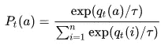
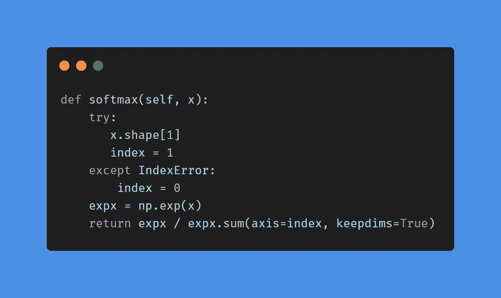

# 从零开始的神经网络:多重实体分类

> 原文：<https://levelup.gitconnected.com/neural-network-from-scratch-multiply-entities-classification-72f7d5f4c2e>

[上一次](https://medium.com/better-programming/neural-network-from-scratch-hidden-layers-bb7a9e252e44)我们讨论了向我们的神经网络添加隐藏层，它在解决二进制分类任务方面做得很好。但是如果我们的本体中有更多的实体呢？让我们来想想如何教会我们的神经网络如何解决多个实体分类问题！

[来源](https://pixabay.com/photos/artificial-intelligence-brain-think-3382521/)

## **生成数据**

说到神经网络，训练数据集是第一位的！我们将生成数据集的 3 个部分，以演示如何处理两个以上的分类。每个片段将包含两个痴呆坐标阵列，我们将指定这些点的范围，以将它们分组在一起。因此，每一段将以 0:-3，3，3 和-3，3 点为中心。并且每个段将对应于一个输出。这是原始数据生成的样子:

接下来，我们将在一个数据集中组合所有 3 个片段，并对其进行标记，这使我们的神经网络能够从中学习。

这是我们的数据:

## **网络参数**

下一步是生成神经网络的所有参数。比如隐藏层和输出层的权重和偏差。如果你读了前一篇文章，你可能会注意到我们的神经网络结构非常相似，只有输出层不同。

这里是参数生成的代码:

**激活功能**

以前我们只使用 sigmoid 激活函数，它很好地服务了我们。但是因为现在我们在输出层有 3 个类，所以最好使用其他的。

我们有一个 **softmax** 函数来帮助我们。softmax 函数是两个以上类情况下输出层的常用激活函数。因为输出有 3 个元素，我们可以把每个元素的输出看作输入层的一个元素。数学上，softmax 函数是这样的:

在简单的语言中，softmax 函数将每个输入元素的指数除以每个输入元素的指数之和。这是 softmax 函数在 python 中的样子:

现在我们可以继续训练我们的模型。

**培训**

训练过程非常类似于二进制分类。我们有前馈和反向传播阶段。但是因为在输出层上我们使用不同的激活函数，所以存在一些差异。

在前馈过程中，我们仍然要为隐藏层使用 sigmoid 激活函数。softmax 函数将用于输出图层。

对于反向传播，我们计算输出层的新权重和偏差，作为 softmax 函数的结果。所有其余的操作基本保持不变。

对于 softmax 情况下的误差成本的计算，我们将使用交叉熵函数而不是均方差。交叉熵函数只是所有标记概率的总和，并且预测概率为负对数。交叉熵函数的数学表示如下:

现在我们准备好生成数据并训练我们的模型。让我们来测试一下。

## **测试**

训练完成后，我们可以使用产生的权重和偏差来尝试随机数据点。对于测试，我们将再现前馈过程，而不是反向传播，因为权重和偏差已经被训练，不需要更新。

在我们以一个痴呆数组的形式获得 softmax 函数的输出后，我们可以找到最大值的索引，这将是该数据点的标签。

为了添加新的数据点并测试它是否接近我们肉眼所见的事实，我们将向训练数据集和标签集中添加新的数据点及其标签。

现在，让我们用 50000 次交互来尝试一下，以确保成本函数得到了很好的优化。第一个坐标将是[0.0，0.5]，这是我们的模型如何在地图上标记它:

对于位置的解码，只需记住在 softmax 函数的输出中，数组中有 3 个元素。元素索引 0 代表蓝色标签，元素索引 1 代表粉色，元素索引 2 代表黄色。我们可以看到，模型非常确定这个点应该是蓝色的，我们可以在图上看到它的预测是正确的。

下一种情况是[-2.0，1.0]，我们可以看到模型非常自信地认为它是黄色的。

而最后的测试是[2.0，-0.5]。在这种情况下，mode 确信它绝对不是黄色的。它更倾向于蓝色，但仍然有很多疑问。对于这样一个边缘案例来说，这是一个很好的结果。

## **完整代码**:

## **结论**

今天我们学习了如何修改神经网络，使其能够解决多种分类问题。现在我们已经准备好处理真实的数据集，解决真实的问题。这就是我们接下来要做的！

不断学习，不断成长！