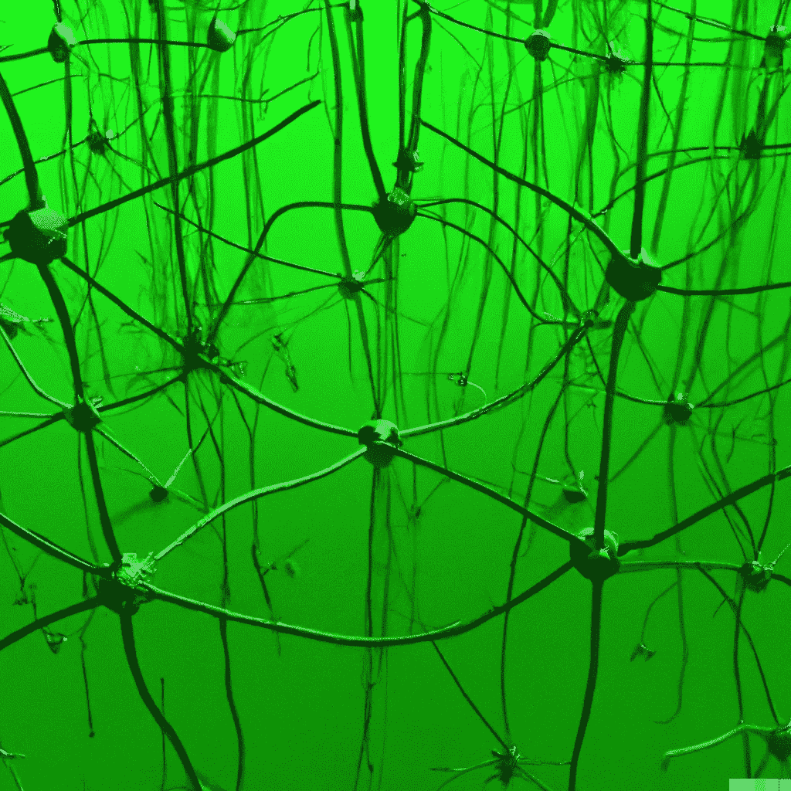
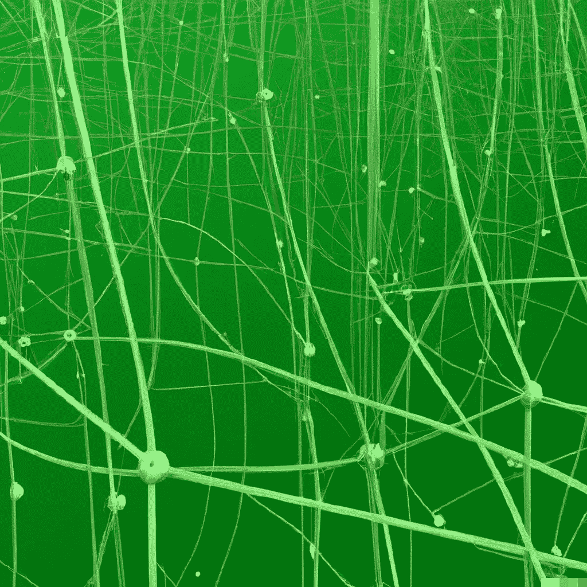

# 神经网络(第四章:人工智能手册)

> 原文：<https://levelup.gitconnected.com/neural-networks-chapter-4-ai-handbook-24c5a569fa05>

简化的、基于当今应用解释的几个神经网络。

来自 [Pixabay](https://www.pexels.com/@pixabay/)

神经网络是一组“神经元”[2]，它们一起工作来处理信息，并且相互连接。它们被用于人工智能(AI)，因为它们可以学习和识别模式，并根据这些模式进行预测。

输入层、隐藏层和输出层是神经网络的典型组件。输入层接收数据，数据的行为类似于图像(作为一个例子)，然后被传递到隐藏层。使用被称为激活函数的方法，隐藏层从数据中提取信息。最后，输出层生成分类或预测结果(进一步扩展图像示例:识别图像中的对象)。

# **层层**

在神经网络中，输入层是初始层。它接受原始数据，并将其转发到隐藏层，即后续层。隐藏层分析数据并为输出层生成输出。输出层是神经网络的最后一层；它生成最终结果。

输入层由从网络周围接收输入的神经元组成。用最简单的话来说，输入层使网络能够从例子中学习。

在神经网络中，输入层是数据进入系统的地方。这些数据可能包括传感器信号、照片、文本或任何可以转换成数字的东西。然后，输入层将这些数据传输到下一个系统层，通常称为隐藏层。隐藏层由神经元(处理单元)组成，这些神经元相互链接，并与输入层中的神经元链接。

这些单元间的连接允许信息在系统间传递。隐藏层中的每个神经元对其输入执行简单的计算，并作为结果生成输出信号。隐藏层是神经网络中大多数计算发生的地方。

来自[作者](https://medium.com/@aniltilbe) [1]

# **普通神经网络**

存在不同种类的神经网络，例如卷积神经网络、递归神经网络以及具有长期和短期记忆的网络，并且它们都具有以下基本组件:

— CNN(卷积神经网络)用于图像分类，可以认为是特征提取器。它检查图片的一小部分，以检测是否存在特定的模式。

— RNN(递归神经网络)用于文本数据，并考虑词序。这表明它可以处理语法规则之类的事情。

— LSTM(长短期记忆)同样用于文本数据，但可能比其他神经网络更有效地记住长期依赖关系[3]。

简单来说，CNN 主要用于图像处理，而 RNN 和 LSTM 可以用于文本数据。CNN 通过将卷积滤波器应用于输入的局部区域来工作，而 rnn 顺序地读取输入(例如，一次一个元素)。LSTMs 是一种 RNN，包括反馈循环，以更好地模拟长期的复杂依赖关系。

# **看一眼 LSTM**

序列数据的处理，比如时间序列或文本，是 LSTMs 真正的亮点。与其他类型的人工智能算法相比，LSTMs 具有在更长时间内记住信息并从上下文中学习的能力，这使它们能够有效地解释自然语言。LSTMs 是如何工作的？

每个独立的 LSTM 单元由一个遗忘门、一个输入门、一个输出门和一个单元状态组成。这四个基本组成部分构成了 LSTM。遗忘门决定该单元应该从当前时间步之前的时间步保留多少信息；输入门决定该单元应该从当前时间步长中获取什么新信息；输出门决定该单元在当前时间步长应该计算什么信息作为输出；并且单元状态存储单元到目前为止已经观察到的所有信息。

来自[作者](https://medium.com/@aniltilbe) [1]

# **对 RNN 的温柔描述**

它们属于人工智能领域，广泛应用于序列数据的建模。rnn 可以被训练来模拟多种形式的序列，包括文本、时间序列数据或音频信号。rnn 被设计用来识别数据序列中的模式，并且可以被训练来模拟任何种类的序列。

RNNs 的功能是通过包含递归神经网络的隐藏层顺序处理输入。隐藏层以状态的形式保存关于先前输入的信息，状态是向量表示。在每次迭代中，RNN 接收一个输入并相应地修改其状态向量。然后，修改后的状态向量被转发到后续阶段，直到所有输入都已被处理。

训练期间学习的权重和偏差决定了 RNN 在每一步的输出。训练 RNN 的目的是最小化目标函数，例如预测输出和实际输出之间的交叉熵或均方误差。使用随机梯度下降[4]跨时间反向传播梯度是一种常见的训练方法。

# 离别的思绪

神经网络可以潜在地识别人类可能错过或发现难以识别的复杂模式。例如，在计算机视觉编程中用于面部识别的软件中经常使用神经网络。此外，它们是可扩展的，这意味着当向它们添加更多数据时，它们可以提高它们在模式识别任务中的性能。

一个困难是，如果没有足够的数据进行训练，模型的准确性将会下降。因此，他们的效率可能会因此降低。

如果你对这篇文章有任何建议或拓宽主题的建议，我将非常感谢你的来信。另外，请考虑 [**订阅我的简讯。**](https://predictiveventures.substack.com)

我在 Medium 上创建了以下“列表”，你可以访问它来查看这个 [**【人工智能手册】**](https://aniltilbe.medium.com/list/b67f31a002b3) 系列中的所有其他帖子。

如果你喜欢看这样的故事，并且想支持我这个作家，可以考虑注册成为 Medium 会员，获得 Medium 上所有故事的无限使用权:[*** * *订阅 Medium*****](https://medium.com/@AnilTilbe/membership) **。**

**此外，考虑阅读以下来自*人工智能手册*的帖子:**

 [## 人工智能历史(第一章:人工智能手册)

### 开始、中间和现在。一个端到端的，但非常简单的介绍人工智能在这个多部分…

levelup.gitconnected.com](/artificial-intelligence-history-chapter-1-ai-handbook-ae5774ef8026) 

***和***

 [## 知识表示(第 2 章:人工智能手册)

### 所有人工智能产品都采用的基本问题空间，这是一个非常简单的知识表示介绍…

levelup.gitconnected.com](/knowledge-representation-chapter-2-ai-handbook-f37da56d5868) 

参考资料:

1.  OpenAI 协助开发了这一可视化工具
2.  蒂尔贝，阿尼尔。(2022 年 7 月 24 日)。10 个最重要的递归神经网络。[https://medium.com/p/8de9989db315](https://medium.com/p/8de9989db315)
3.  Pal，s .，Ghosh，s .，Nag，a .(公元前 1 年)。基于 LSTM 递归神经网络的情感分析。国际合成情绪杂志(IJSE)，9(1)，33–39。[https://doi.org/10.4018/IJSE.2018010103](https://doi.org/10.4018/IJSE.2018010103)
4.  陈，G. (2016 年 10 月 8 日)。带误差反向传播的递归神经网络教程。ArXiv.Org。[https://arxiv.org/abs/1610.02583](https://arxiv.org/abs/1610.02583)

阿尼尔·蒂尔贝