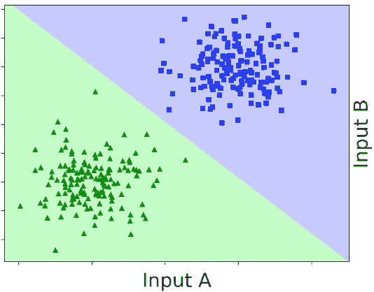
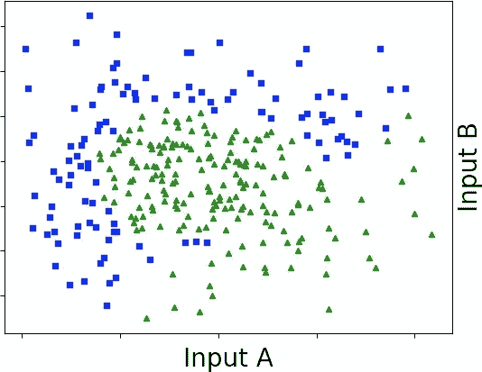
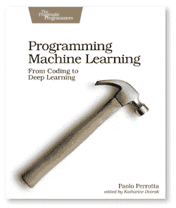

# 可视化神经网络

> 原文：<https://levelup.gitconnected.com/neural-networks-visualized-6cc657f9d7c5>

在这篇文章中，我们将通过一个小的神经网络，看看它是如何分类数据的。我们不会在公式上花太多时间。相反，我们将专注于可视化网络节点中的功能。最后，你会对三层神经网络的每一步有一个直观的感觉。

要阅读这篇文章，你应该熟悉神经网络和感知机。你应该知道“sigmoid”、“激活函数”、“偏置节点”之类的概念。如果你正在阅读[编程机器学习](https://pragprog.com/titles/pplearn)，或者另一个 ML 介绍，那么你已经知道你需要的一切。让我们跳进来吧！

# 功能机

当你忽略细节时，事情总是更简单。以神经网络为例:从远处看，它们非常简单。神经网络是实现功能的机器。例如，想象一个获取云覆盖范围并输出下雨几率的网络。一旦你用历史数据训练了它，这个神经网络就是一个函数，它接受一个数字并返回另一个数字。你可以在一张纸上画出这个函数，结果会和神经网络本身一样好。很简单！

当你看得更近时，事情变得令人困惑。神经网络中有如此多的部分，很难看出它们是如何组合在一起构成最终功能的。隐藏节点计算什么样的中间函数？激活功能的作用是什么？即使是疲惫的研究人员也很难理解大型网络中的每个神经元在做什么。

谢天谢地，较小的网络更容易被搜索到。如果你走过一个三层的神经网络，你就能理解它的全部。这就是我们要做的。我们将逐步通过一个神经网络，看看它的各个部分是如何对端到端功能做出贡献的。

让我们从一个小数据集开始:

这个数据集包含两个类:绿色三角形和蓝色正方形。从现在开始，我们将用值 1 编码绿色三角形，用 0 编码蓝色正方形。

假设我们有一个分类器——例如，一个神经网络——根据这些数据进行训练。我们不关心这里的训练部分。我们关心的是:在训练之后，分类器实现了一个函数。该函数接受一个点，并返回两个类中的一个:

现在我们来详细看看这个分类器。然而，在我们转向神经网络之前，让我们先来看一个更简单的分类器:感知器。

# 穿过感知器

让我们回顾一下感知器是什么样子的:

感知器的输入是一个点的坐标(A 和 B)，加上一个固定值为 1 的“偏差”输入。输出是一个介于 0 和 1 之间的数字。接近 1 的数字表示“蓝色正方形”，接近 0 的数字表示“绿色三角形”。

当感知器进行预测时，它首先计算中间节点 *z* 的值。它将输入乘以权重，然后将结果相加，如下所示:

如果你习惯于代数，你会认识到这是一个平面的方程。如果你不懂代数，不用担心:我们可以画出这个函数，看看它是什么样子。我根据上面的数据训练了一个感知器，并在训练后绘制了 *z* 的值:

输入的加权和，包括偏差输入。

明确地说，这是一个平面，因为我们使用的数据有两个输入和一个输出，总共是三维的。随着维度的增加，这个平面将会变成一个令人费解的高维线性形状。尽管如此，核心思想在任何维度上都是一样的:感知机的前半部分生成一个“直”的形状。

感知器的另一半通过一个 s 形驱动那个形状，产生输出 *ŷ* 。这是ŷ的样子:

加权和的 sigmoid。

s 形弯曲 *z* ，将它变成值在 0 和 1 之间的曲线曲面。更接近 0 的值被归类为蓝色正方形，更接近 1 的值被归类为绿色三角形。为了得到一个直截了当的预测，我们可以将 *ŷ* 四舍五入到最接近的整数。高于 0.5 的值变成 1，低于 0.5 的值变成 0——就像这样:

感知器的输出，四舍五入到最接近的整数。

等等——让我在水平面上挤压这个函数，使它更具可读性:

这就是当我们使用感知机对数据进行分类时得到的结果:一个直接的“决策边界”。边界一侧的点被归类为绿色三角形。另一边的点被归类为蓝色方块。

概括一下，这是感知器及其内部功能的示意图:

如果你熟悉感知机，你就会知道它们有一个严重的缺点。我们刚刚描述的过程会产生一个直接的决策边界。不幸的是，并不是所有的数据集都可以用一条直线整齐地划分。例如，看看这些数据:

这一次，我们需要一个弯曲的边界来区分蓝色正方形和绿色三角形。感知器无法绘制弯曲的边界，但神经网络可以。

# 升级到神经网络

让我们从感知器升级到神经网络。作为第一步，我们可以用一堆感知器并行运行它们。例如，假设我们想要一个三层神经网络，其中三个节点位于隐藏层。为此，我们需要并行运行三个感知器，如下所示:

你看到三个感知器了吗？它们重叠是因为它们共享相同的输入。另一方面，每个感知器都有自己的权重，所以它输出不同的值 *z.* 这三个 *z* 依次产生三个输出。我把输出称为 *h* ，因为它们将是我们神经网络的隐藏节点。

我们处理了神经网络的前半部分。为了完成它，我们需要用一个输出层来结束它，就像这样:

如今，大多数神经网络会用 ReLU 来代替乙状结肠。我懒得做那件事。ReLU 可能有不同的形状，但其核心思想与 sigmoid 相同:将平面变成非线性形状。

说到激活功能，最后的 softmax 有些大材小用了。记住 softmax 是如何工作的:它接受一组输入(“逻辑”)并调整它们的大小，使它们的总和为 1。在只有两个输出的情况下，就像在这种情况下，每个输出都是 1 减去另一个——一旦我们知道了一个，我们也就知道了另一个。所以你可能会想:为什么我们需要冗余输出？难道我们不能用一个更简单的函数来代替 softmax，返回一个介于 0 和 1 之间的值，比如 sigmoid？

是的，我们可以。在这种情况下，我承认我用了一个 softmax 来保持传统。大多数神经网络示例的末尾都有一个 softmax，我想让这个网络感觉熟悉一些。为了弥补两个冗余输出，我们只考虑其中一个，忽略另一个。

撇开 softmax 的题外话，现在我们有了一个神经网络。让我们看看里面发生了什么。

# 可视化网络的功能

你已经看到我们神经网络的前半部分和三个并联的感知器是一样的。这意味着网络隐藏节点中的函数看起来像感知器的输出。但是不要相信我的话:让我们看看它们。

我又一次在实践中尝试了这个实验。我训练了一个类似上面的神经网络，并绘制了其隐藏节点的内容:

看到了吗？来自前一层的三个节点具有明显的 sigmoid-y 形状。唯一突出的节点是附加偏置节点，它的固定值为 1-水平面。

接下来，网络将 logits 计算为隐藏节点的加权和，计算如下:

由于有两个 logits，这个网络用不同的权重计算两次。然而，我们决定忽略网络的一个输出——因此我们也可以忽略它的匹配逻辑。我们将跳过第一个逻辑，专注于第二个。下面是它的功能图:

如果你对实际的数值感兴趣，这些是我在实验中得到的重量:

我们快完成了。接下来，logits 通过 softmax 得到输出，每个输出等于 1 减去另一个输出。我们决定关注第二个输出。这是:

而这就是整个神经网络实现的功能。当它接近 0 时，该点被分类为蓝色正方形。当它接近 1 时，该点被分类为绿色三角形。像我们对感知器所做的一样，让我们将函数四舍五入到最接近的整数:

最后，我们可以将函数压缩到二维来查看决策边界

向我们的神经网络致敬:这是区分蓝色正方形和绿色三角形的一个不错的机会。仍然有一些错误分类的点——但是考虑到这个网络只有三个隐藏节点。多几个隐藏节点可能会使边界更容易弯曲，分类也更好。

总结一下:

1.  神经网络的前半部分产生 sigmoid-y 函数，就像感知器一样。
2.  第二部分使用这些函数，加上一个偏差，来计算一个 logit——一个更复杂的函数，有峰有谷。
3.  logit 通过一个 s 形线，生成一个近似于数据点的表面。

这是神经网络后半部分的视觉回顾:

这就是三层神经网络如何产生巧妙的弯曲决策边界。

*本帖是* [编程机器学习](http://www.progml.com/) *的衍生，我的机器学习零到英雄入门，从基础到深度学习。前往* [*此处*](http://www.pragprog.com/titles/pplearn) *为电子书，* [*此处*](https://www.amazon.com/gp/product/1680506609/ref=as_li_qf_asin_il_tl?ie=UTF8&tag=ductyp-20&creative=9325&linkCode=as2&creativeASIN=1680506609&linkId=21357a11b4a7bc9be95476540d1d3a09) *为纸质书，如有疑问或评论，欢迎来到* [*论坛*](https://forum.devtalk.com/tag/book-programming-machine-learning) *！*