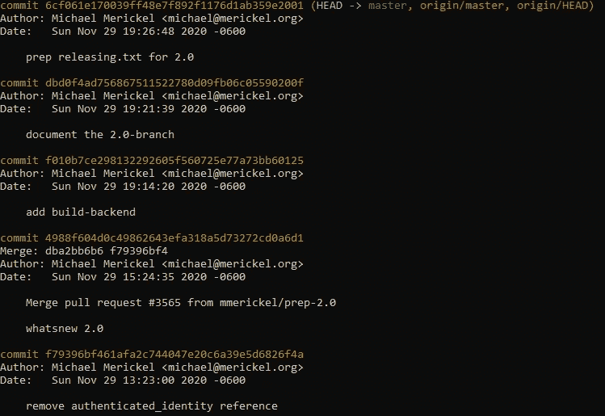
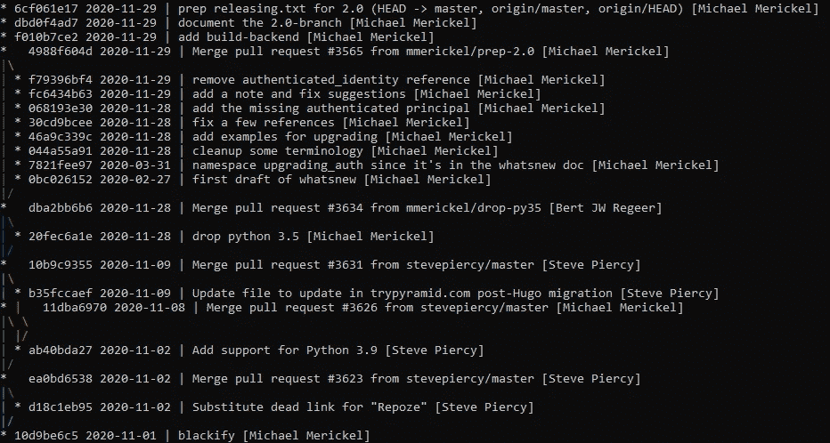
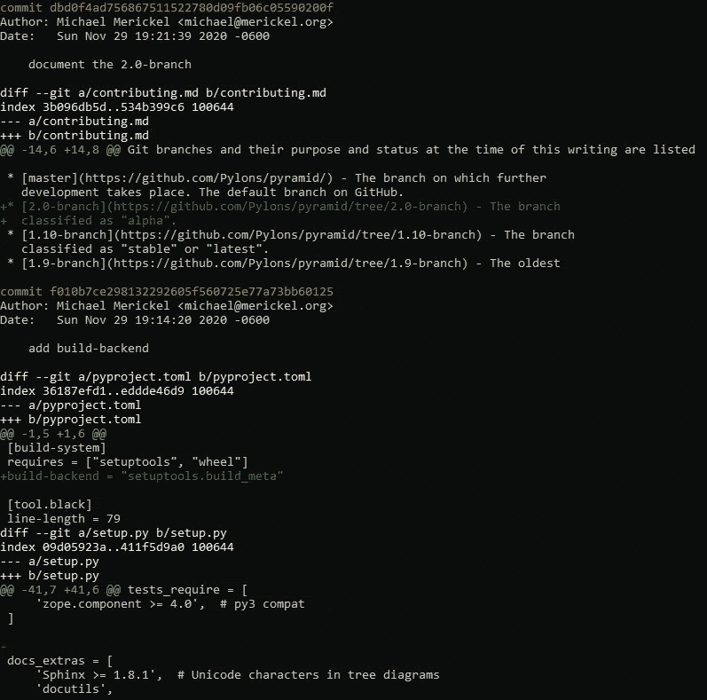
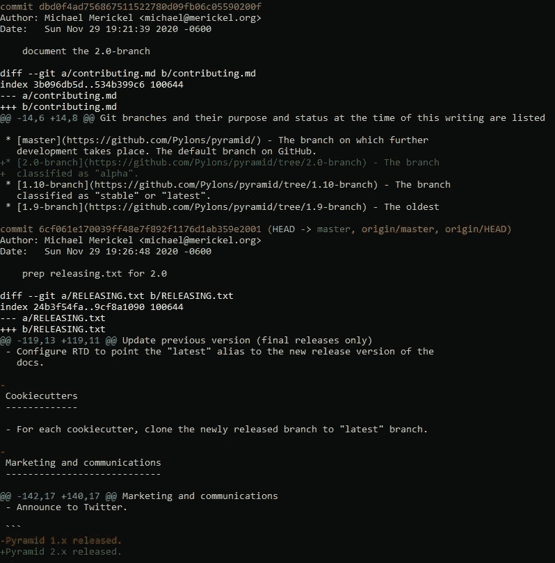

# 千万不要带着这些 Git 日志特性离开终端

> 原文：<https://levelup.gitconnected.com/never-leave-the-terminal-with-these-git-log-features-e6a4334c4bcf>

## 让您的本地代码评审更有效的简单技巧。


Maksym Kaharlytskyi 在 [Unsplash](https://unsplash.com?utm_source=medium&utm_medium=referral) 上拍摄的照片

代码被阅读的次数比它被编写的次数多得多。但是提交消息呢？

> 提交消息只写一次，可以无限多次读取。

您永远不会返回并更改您的`master`分支中的提交消息，理想情况下，您甚至没有这个选项。然而，Git 提交历史是项目中最重要的事情之一。

您的提交历史记录是您可以随时转向的地方:

*   了解您正在更改的代码的原始需求
*   检查文件最近被更改的原因
*   哪一次合并破坏了你的主分支

当然，你可以随时访问你的在线库管理器，比如 [GitHub](https://github.com/) 或者 [GitLab](https://about.gitlab.com/) 。然而，这些工具使得检查分支结构或浏览分支或文件的发展变得很麻烦。

下面我解释一下`git log.`的一些有用的特性，这些特性可以让你在挖掘提交、解开分支或者本地审查代码时更加轻松。

*所有的例子都显示在开源的* [*金字塔*](https://github.com/Pylons/pyramid) *项目上，一个针对 Python 的 web 框架。*


乔纳森·肯珀在 [Unsplash](https://unsplash.com?utm_source=medium&utm_medium=referral) 上拍摄的照片

# 裸 git 日志

普通的`git log`显示了你提交历史的线性概览。这很有用，但是默认情况下，您对分支是如何发展的以及每个提交包含的变更种类没有一个总体的了解。更不用说它有点冗长，而且你经常想要更密集的信息显示。



线性提交历史

# 分支历史图

为了查看分支结构，`git log`有一个`--graph`标志，通过巧妙的格式化选项，我们可以看到关于每个提交的最少信息。例如散列、日期、单行消息和作者。

`git log --graph --pretty=format:”%h %ad | %s%d [%an]” --date=short`产生以下结果:



图表上的提交和分支历史记录

让我们来分析一下这是怎么回事:

*   `--graph`标志显示了分支和提交的 ASCII 图形
*   `--pretty=format:”%h %ad | %s%d [%an]`确保在图中我们只获得关于每次提交的期望信息:短散列`%h`，日期`%ad`，提交消息的第一行`%s`，引用名(如果有的话)`%d`，以及作者名`%an`
*   `--date=short`告诉 Git 如何[呈现格式字符串中指定的日期](https://git-scm.com/docs/git-log#Documentation/git-log.txt---dateltformatgt) ( `%ad`)，在本例中是 [ISO8601](https://en.wikipedia.org/wiki/ISO_8601) `YYYY-MM-DD`版本

更多格式选项，请查看[文档](https://git-scm.com/docs/git-log#_pretty_formats)。

## 别名

您很可能不记得也不想多次输入。幸运的是，Git 为此提供了别名。

在终端中运行`git config --global alias.hist "log --graph -- pretty=format:\”%h %ad | %s%d [%an]\” --date=short"` *一次*，设置`git hist`别名以立即访问您的库的分支图。

或者，您可以直接编辑您的`.gitconfig`文件并将新的命令定义放入`[alias]`部分:

```
[alias]
hist = log --graph --pretty=format:\”%h %ad | %s%d [%an]\” --date=short
```

*注意在格式字符串的引号前的定义中使用反斜杠，这是别名工作所必需的。*

**现在你可以运行** `**git hist**` **得到同样的结果。当执行此操作时，您仍然可以传递任何额外的参数和参数，如文件路径或修订范围，如** [**文档**](https://git-scm.com/docs/git-log) **中所述。**

# 有差异的历史

`git log`的`-p`标志会将相关的差异添加到日志中显示的每个提交中。这使得对正在进行的工作分支和变更进展的本地审查变得容易。或者像我一样，您有时会使用 git-crypt 加密的文件，在这种情况下，修改在拉请求中是不可见的。

此时`git log -p -w -M -M`可以提供帮助，除了提交消息，还会显示相关的差异:



有差异的线性提交历史

它是这样工作的:

*   `-p`将差异添加到`git log`的默认输出中
*   `-w`隐藏一行中的空白变化，所以 diff 只显示真正重要的内容
*   确保文件重命名和重写的组合显示为可读的差异，而不是完全删除一个文件并添加另一个文件

添加`--reverse`标志和提交范围可以让您按照从旧到新的顺序关注历史的给定部分，这与“最新的在顶部”的默认行为相反。

例如，`git log -p -w -M -M --reverse HEAD~2..HEAD`:



最近两次更改的反向提交历史记录，有所不同

## 别名

要设置别名，运行`git config --global alias.difflog "log -p -w -M -M"`或编辑您的`.gitconfig`，如前一示例所述:

```
[alias]
difflog = log -p -w -M -M
```

要按时间顺序查看变更的进度，运行`git difflog --reverse <from commit>..<to commit>`并在给定的提交范围内滚动后续补丁。

# 摘要

浏览 Git 日志是软件开发人员的第二天性。`git log`子命令提供了许多惊人的可能性，可以加速您在终端中的工作。在图形上显示您的提交历史或者回顾分支的发展都可以在命令行中访问。而不需要借助额外的可视化工具或在线存储库管理器。

虽然这些命令通常很长并且很难记住，但是使用简单的名称设置别名可以使它们成为您日常工作流程的一部分。

# 资料来源和额外阅读

*   [Python PEP8 指南](https://www.python.org/dev/peps/pep-0008/#a-foolish-consistency-is-the-hobgoblin-of-little-minds)
*   [Git 日志文档](https://git-scm.com/docs/git-log)
*   [Git 别名](https://git-scm.com/book/en/v2/Git-Basics-Git-Aliases)