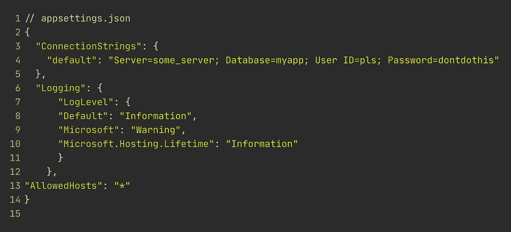
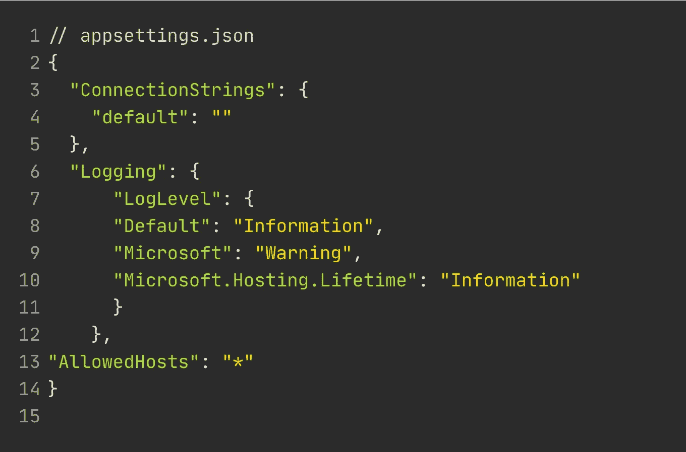

# 永远不要在 appsettings.json 中存储机密

> 原文：<https://levelup.gitconnected.com/never-store-secrets-in-appsettings-json-3a7404ea50d0>

## 太多人误解了这一点。让我们来弥补吧。



您可能以前见过一些安全文盲这样做。

你明白我的意思吗？第 4 行的秘密将提交给你的代码回购。

做这件事的人基本上是 ASP.NET 核心的新成员。这样的事情为什么会发生，是可以理解的。很简单。它让你的开发体验变得愉快。

> 然而，这是一个巨大的安全缺陷。永远不要在源代码中存储敏感数据。

稍微有经验的开发人员可能会做出`appsettings.Development.json`。这并没有更好，除非你真的`.gitignore`那个文件。

## 隐藏你的秘密！

幸运的是，这个问题有一个简单的解决方法。

不要创建额外的 appsettings . some environment . JSON，而是使用默认的 appsettings.json 作为应用程序运行所需的模板。



你看到了吗？第 4 行，未提供秘密。

## 使用 dotnet 用户机密来保护您的敏感数据的安全

好了，现在我们已经把这个问题从我们的文件中删除了。让我们弄清楚如何以安全的方式填充`ConnectionStrings:default`。

在项目位置的终端中，写入`dotnet user-secrets init`。UserSecretsId 生成并存储在您的。csproj 文件。

接下来，就像写`dotnet user-secrets set "ConnectionStrings:default" "my_connectionstring”`一样简单

就是这样。您不再错误地在源代码中包含敏感数据。

## 你可能会问，生产中要做什么

在生产中，您需要有一个包含所有敏感数据的 appsettings.json 或者，您可以将它们作为环境变量添加。

更好的方法是使用密钥库，比如 Azure KeyVault。很简单。很安全。没有理由不用它。但是设置 KeyVault 超出了本文的范围。

```
Resources for the curious[Microsoft documentation on Secrets Manager](https://docs.microsoft.com/en-us/aspnet/core/security/app-secrets?view=aspnetcore-2.2&tabs=windows)
```

[](https://medium.com/swlh/stop-checking-for-nulls-5f9f857ddf72) [## 停止检查空值

### 空对象模式、工厂方法——让我们看看一些生产就绪代码！

medium.com](https://medium.com/swlh/stop-checking-for-nulls-5f9f857ddf72) [](https://medium.com/swlh/dynamic-command-dispatching-in-c-d3abe21b3d1b) [## C#中的动态命令调度

### 让我们保持这一个简短和甜蜜

medium.com](https://medium.com/swlh/dynamic-command-dispatching-in-c-d3abe21b3d1b) [](https://medium.com/@nmillard/brief-overview-of-asp-net-core-authentication-451e630bc42d) [## ASP.NET 核心认证简介

### 顾问指南 aspnetcore 身份验证的基本概念。

medium.com](https://medium.com/@nmillard/brief-overview-of-asp-net-core-authentication-451e630bc42d) [](https://medium.com/@nmillard/jwt-bearer-authentication-for-machine-to-machine-and-single-page-applications-1c8ba1211a90) [## 在 ASP.NET 核心网建立 JWT 承载认证

### 快速简单的顾问指南

medium.com](https://medium.com/@nmillard/jwt-bearer-authentication-for-machine-to-machine-and-single-page-applications-1c8ba1211a90) 

Nicklas Millard 在丹麦四大咨询公司之一担任高级技术顾问。他主要担任客户项目的首席开发人员和解决方案架构师。

他一直在为商业客户和政府机构开发软件，如丹麦国防部、教育部、环境和食品部、国家警察局、丹麦劳动力市场和招聘机构以及 rstad。

> 在 [LinkedIn](https://www.linkedin.com/in/nicklasmillard/) 上连接