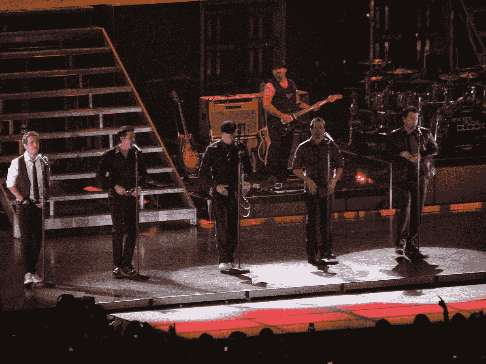
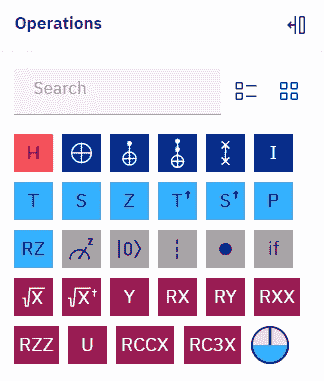

# 街区里的新大门

> 原文：<https://levelup.gitconnected.com/new-gates-on-the-block-9cad1bc583fd>

[https://commons . wikimedia . org/wiki/File:NKOTB _ 2008-11-06 . jpg](https://commons.wikimedia.org/wiki/File:NKOTB_2008-11-06.jpg)

# "一扇门一扇门，哦，宝贝！"

我已经多次阅读了 [OpenQASM 2.0 规范](https://arxiv.org/pdf/1707.03429.pdf)，我认为我对它有相当好的理解。毕竟，我仍然认为自己是 IBM 第一个也是唯一一个非官方的 [OpenQASM 倡导者](https://bsiegelwax.medium.com/openqasm-advocate-program-7e2dcb2afdb1)。但是，由于竞赛和[获奖方案对相对相位 Toffoli gates](/classiqs-toffoli-problem-54b7e5084833) 的强调，我最近注意到了一些新的令人兴奋的东西。

IBM 量子拖放操作

上面截取的截图显示了可以在 IBM Quantum circuit composer 中拖放的门。非常坦率地说，我总是立即将其最小化，以便我可以看到更多的电路。但是，每次我打开 circuit composer 时，它又会弹开，终于有什么吸引了我的注意。

相对相位门！

那里！在右下角！从什么时候开始我们可以拖放相对相位 Toffolis？！？！？这是否意味着我可以在我的 OpenQASM 代码中使用这些语句？！？！？

是啊！！！

它们不在规范中，但是 IBM 显然在某个时候添加了它们。RXX 和 RZZ 门已经存在一段时间了，不知何故我已经知道了中间电路相位盘，但我完全错过了他们可能或可能没有就相对相位 Toffolis 做出的任何声明。哦，好吧，现在是七月的圣诞节。

“有什么大不了的，”你问？

谢天谢地，你已经读过我所有的文章，你已经知道答案了。

但是，以防你感觉有点健忘，托弗利门，[除了一个例外](/a-native-toffoli-gate-970093e4770c)，不是本地门。你在电路图上看到的 Toffoli 实际上是由一定数量的单量子位和多量子位操作组成的。

相比之下，相对相位 Toffolis 由稍少的运算组成。这意味着相对相位托夫里更有效，尽管有一个警告:控制量子位在相对相位托夫里之后的相位与相对相位托夫里之前的相位不同。如果不再需要控制量子位，这实际上可能不是问题。否则，相对相位 Toffolis 可以在使用非计算的电路中取代 Toffolis，例如在 [Grover oracles](https://quantumzeitgeist.com/grovers-algorithm-an-intuitive-look/) 中。不计算相对相位 Toffolis 会抵消相位差，结果与使用 Toffolis 相同，但电路深度更小。

TL；DR:它们是你量子计算工具包中的一个很好的工具，现在它们在你的 OpenQASM 工具包中。

# # ClassiqCodingCompetition 竞赛系列

*   [街区上的新大门](https://bsiegelwax.medium.com/new-gates-on-the-block-9cad1bc583fd)
*   [我从 Classiq 的编码竞赛中学到了什么](https://bsiegelwax.medium.com/what-i-learned-from-classiqs-coding-competition-9ebfbb6816bb)
*   [Classiq 的哈密顿问题](https://bsiegelwax.medium.com/classiqs-hamiltonian-problem-31e2992903d0)
*   [Classiq 的分配问题](https://bsiegelwax.medium.com/classiqs-distribution-problem-8e3c7a74afaa)
*   [Classiq 的托夫里问题](https://bsiegelwax.medium.com/classiqs-toffoli-problem-54b7e5084833)
*   [Classiq 的可满足性问题](https://bsiegelwax.medium.com/classiqs-satisfiability-problem-c8e78502f82b)
*   [非安西利亚 MCX](/no-ancilla-mcx-e59f455bb9f6)
*   [回顾:Wolfram 量子框架](/review-wolfram-quantum-framework-1fdb23d61be9)
*   [一个土生土长的托夫里门](/a-native-toffoli-gate-970093e4770c)

[https://www.youtube.com/watch?v=6ZRjjy9cwYQ](https://www.youtube.com/watch?v=6ZRjjy9cwYQ)