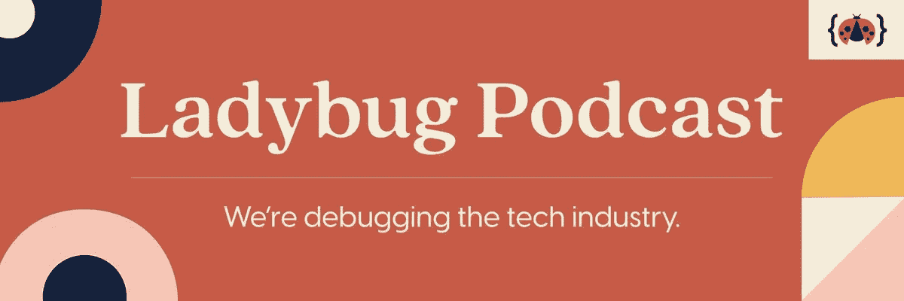
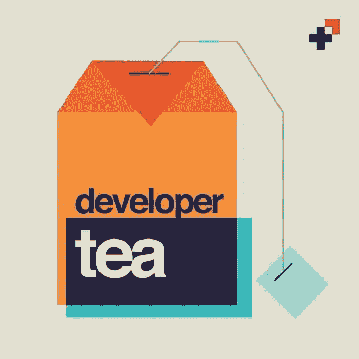

# 编码新手？看看这些播客

> 原文：<https://levelup.gitconnected.com/new-to-coding-check-out-these-podcasts-2c76e5ff4390>

由 [Unsplash](https://unsplash.com?utm_source=medium&utm_medium=referral) 上的 [C D-X](https://unsplash.com/@cdx2?utm_source=medium&utm_medium=referral) 拍摄的照片

*是时候谈论编码播客了。

编码播客就像个人的，便携式的大师。一些去神秘化的编码概念——如何使用 React 构建一个 app，香草 JS 到底是什么，作为一个“道德黑客”意味着什么。

其他人列出了职业道路——前端和后端工作是什么样子，是参加编码训练营还是获得计算机科学学位，等等。有些会给你指出你不知道的资源的方向。

最重要的是，它们都有助于向您表明，您在学习编码方面并不孤独。

听着——我明白了。你的时间是宝贵的，没有太多的空间来“浪费”。为什么要听人们谈论编码，而你可以利用这段时间去做实践教程，创造切实的成果呢？

我最喜欢的编码播客是那些让我感觉自己和一个社区有联系的播客。而且，特别是对于像我一样，正在把科技作为第二职业的人来说，这是保持动力的一个好方法。

以下是我的最爱。

# 1.代码新手

途经德夫托和 codenewbie.org

这是我的第一个编码播客。我在 2020 年开始听 Code Newbie，就在一门 CS 课程不及格之后。灰心丧气的我有一天午休的时候开始听 Code Newbie，立刻就迷上了。

主持人萨隆·伊特巴雷克不仅是一位女强人——[一位演说家、企业家、开发者，以及一家名为 Disco](https://solocoder.com/podcast/audio-courses-in-tech-disco-saron-yitbarek) 的新兴企业的创始人兼首席执行官——她还是一位技巧娴熟的采访者。

每位嘉宾——从丹尼·汤普森(Danny Thompson，他在加油站做油炸厨师时自学了编程，现在在谷歌工作)到作为系统软件工程师建立了自己个人品牌的陈彦蓉(Danny Thompson，T8)——都是鼓舞人心的、令人感兴趣的、有趣的听众，尤其是与 Yitbarek 温和、好奇和有趣的面试风格相呼应的。

点击此处查看代码新手:

 [## CodeNewbie

### 当涉及到前端时，有许多要考虑的因素-我们是来提供帮助的

www.codenewbie.org](https://www.codenewbie.org/podcast) 

# 2.瓢虫播客

via @ladybugpodcast 和 ladybug.dev

听瓢虫播客感觉就像和喜欢编程的朋友一起闲逛。

这个播客带来了一种轻松的氛围——想想和你最喜欢的办公室同事一起喝酒，聊聊天。

这个节目有四位主持人——是的，四位——凯莉·沃恩、西德尼·巴克纳、阿里·斯皮特尔和艾玛·博斯提安——他们中的每一位都比上一位更有成就，也更坏。(说真的。这些人太棒了。)

每当我听这个播客，我总是带着大量的新信息离开。感觉比《Code Newbie》中一对一风格的面试稍微不那么正式，但信息量同样很大。

如果你想了解科技领域的几乎任何话题，他们可能已经涵盖了。不确定从哪里开始？看看他们在《T2》中关于创建数字内容的一集，这一集[关于网页可访问性](https://www.ladybug.dev/episodes/web-accessibilitiy)，或者这一集[关于升级 CSS](https://www.ladybug.dev/episodes/css-part-1) 。

在这里听瓢虫播客:

 [## 瓢虫播客

### 2020 年是电子商务史上最大的一年之一。事实上，疫情刺激了…的增长

www.ladybug.dev](https://www.ladybug.dev/) 

# 3.显影剂茶

通过 spec.fm 和 developertea.com

如果你没有太多的时间听播客，不要担心——开发者之茶是为适应你的日常生活而设计的。

这部 15 分钟的剧集非常适合快速通勤，喝咖啡休息，或者只是从电脑屏幕上快速转移注意力。

主持人乔纳森·卡特雷尔(Jonathan Cutrell)不仅有一份令人印象深刻的简历(T9)——他是 PBS 的技术总监和 spec.fm 的联合创始人(T11)——他还拥有可以说是编码播客中最舒缓的声音。(说真的——他的声音或许应该用来讲述冥想应用。)

开发人员 Tea 感觉比列表中的其他人更有哲理性和反思性。与其他节目不同，这更像是 Cutrell 在与听众进行一对一的对话。(然而，这并不是说这部剧没有公平的采访集——看看这个由《选择学》播客主持人凯蒂·米尔克曼主持的[精彩的两集，或者是《瓢虫》播客主持人阿里·斯皮特尔](https://developertea.com/episodes/e56421d3-def3-4bad-9761-dfe14607d6dd)主持的[这一集。)](https://developertea.com/episodes/d62abc0f-1565-46be-8791-5ae89152a3dc)

听下面的开发者茶播客:

 [## 开发者茶::所有剧集

### 我在 2015 年启动了开发者之茶，帮助工程师在定期的短时间爆发中找到清晰性、视角和目的…

developertea.com](https://developertea.com/) 

无论你的目标是什么——无论你听是为了学习、放松，还是为了快速复习科技话题——你可能会在这些播客中找到你想要的。如果没有，继续寻找——有各种各样的编码播客。

快乐编码，快乐聆听！