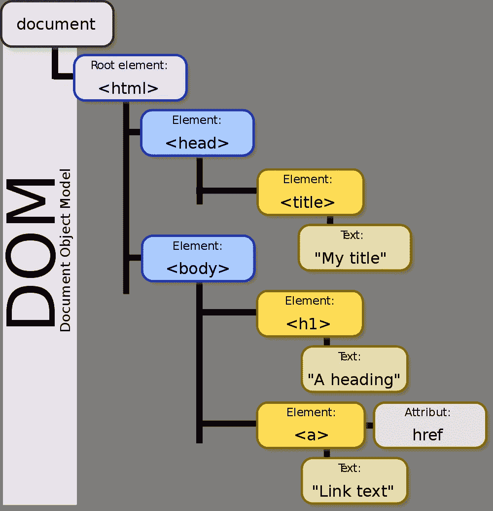

# 您需要了解的关于 React 的关键概念

> 原文：<https://levelup.gitconnected.com/new-to-react-you-need-to-understand-these-key-concepts-before-anything-else-2247efc1eaac>

> 你刚刚完成的那个在线教程并没有教会你 React 的“大局”。不要犯和我一样的错误…


# 了解全局

> 起初 React 难倒了我。

在线教程甚至官方文档有时在解释 React 如何工作以及为什么这样工作方面做得很差。

如果你正在学习 React，你可能不会完全理解所有的东西是如何组合在一起的。如果没有这种理解，你就会遇到障碍，你会花更多的时间去适应。

React 是世界上最受欢迎的前端库，这是有原因的，但一开始你可能会很难学会用 React 的术语来思考。尤其是如果你从未使用过其他前端库/框架的话。

当我开始学习 React 时，我很困惑。组件、道具、构造函数、组件状态和 JSX 一起搅乱了我的大脑。直到我退一步看大局，做一些研究，我终于明白了一切是如何结合在一起的。

> 在这篇文章中，我将省去你阅读和研究的时间。我已经把我学习 React 如何工作的所有笔记放在一起，并提炼出最基本的要点来帮助你理解 React。

React 可能很复杂，大多数教程都让它太复杂、太快。然而，如果你正在学习 React，你只需要知道几个关键概念就可以释放它的力量。我将在这里分享这些概念。

# React 不是一个框架，所以不要称它为框架

React 经常与 Angular 混为一谈，被称为“前端框架”

这似乎是一个很小的区别，但是这个术语——“框架”——伴随着很多包袱。框架意味着一个相互依赖的工具生态系统。当你创建一个 Angular 应用时，你必须按照 Angular 的方式来做。

> 但是 React 不是这样的。

它不依赖于特定的生态系统来工作。简单多了。React 是一个“库”，而不是一个框架。

这种区别对于如何使用 React 有着深远的影响。它可以在不同种类的后端上工作，你可以在同一个应用程序中把它和其他工具一起部署。

如果你已经有一个现有的应用程序，随着时间的推移慢慢加入 React 是完全可能的。只是一次构建一个组件！

## **啊哈时刻:**

> 当你用 React 构建一些东西时，你并不是真正在构建一个“React 应用程序”

相反，您只是在 React 中构建一部分网页，React 负责处理这部分网页的功能和呈现方式。

# 组件很酷！

> 由于 React 是一个库，而不是一个框架，我们在 React 中构建网页片段，而不是整个 React 应用程序。

当然，如果您想将多个部分组合成一个完整的应用程序，这取决于您。但是如果你愿意的话，你也可以在普通的 HTML 页面中放置一些 React。

这些“网页片段”是 React 的“组件”。

当您使用 React 时，您是在使用 JavaScript 创建可以放在 web 页面中的组件。

这种关系通常采取创建组件的形式:

```
class Hello extends React.Component {
  render() {
    return <h1>Hello World</h1>;  
  }
}
```

然后像使用 html 标记一样使用该组件。我们使用 JavaScript 告诉浏览器在哪里放置我们的新组件。

```
ReactDOM.render(<Hello />, document.getElementById('root'));
```

上面的代码告诉 React 将新组件放入我们的 HTML 文件中，只要有一个 id 为“root”的元素。

(如果您是 React 新手，您可能正在为将 HTML 标签直接混合到 JavaScript 中而挠头。别担心，这不是真正的 HTML，而是 React 的一种特殊标记，叫做 JSX。在“你对 JSX 的问题是你不了解 JSX”一节中会有更多的介绍。)

## **啊哈时刻:**

您可以在 React 中构建一个完全静态的站点，它根本不是交互式的。你只需要用 JSX 创建组件，然后把它们放到你的网站上。反应不一定要互动，只要 ***能*** 能并且擅长就行。

需要明确的是，对于静态网站，React 和 JSX 并不是模板语法的好选择。您可能想选择其他不太复杂且开销较少的东西。

> 不过，最基本的是，React 是一种使用 JavaScript 定义网页的一部分，然后将该组件放入网页的方法。

组件也是可重用的，所以如果我们定义了它，我们就可以在我们站点的任何地方使用它。

# 与 DOMs 的交易

看起来很酷，对吧？模板化和可重用组件离突破性还很远，但在基本的、直观的层面上，这就是 React 正在做的事情。

> 但是 React 是如何使用 JavaScript 将组件放置到网页中的呢？

当您使用 JavaScript 在网页上做一些事情(任何事情)时，您编写的 JavaScript 需要一种方式来与 HTML 和组成网页的其他文档进行交互。

JavaScript 通过一个称为文档对象模型(DOM)的 API 来实现这一点。如果您编写过 JavaScript，那么您可能听说过 DOM 并与之交互过。



大教堂

然而，对于复杂的网站来说，管理和修改 DOM 很快就会成为一个挑战。当多个脚本需要访问多个 DOM 对象时，维护 DOM 的一致状态需要各种操作和检查，有些事情您可能想做却完全不可能。

> 管理 DOM 是 React 的一项突破性技术。

React 没有试图直接管理 DOM，而是创建了一个新版本，称为 React 虚拟 DOM。当您编写 React 代码时，您是在对虚拟 DOM 进行更改，而不是对真实 DOM 进行更改。

这就是为什么在我给出的 Hello 示例中，我们呈现给 ReactDOM，而不是直接呈现给实际的 DOM:

```
ReactDOM.render(<Hello />, document.getElementById('root'));
```

当用户单击按钮或在 React 组件中输入值时，React 会将虚拟 DOM 的状态与真实 DOM 的状态进行比较。如果它们相同，React 不需要做任何事情。如果它们不同，React 会更新真实 DOM 以匹配虚拟 DOM。

## 啊哈时刻:

> React“反应”虚拟 DOM 中的变化，并在真实 DOM 中进行这些变化。

惊呆了。？？

那么到目前为止我们学到了什么？

*   React 是一个允许你创建可重用组件的库。
*   它还是一个 DOM 管理器，可以比较站点文档对象树的虚拟和真实版本。

这种组合的含义是，您可以在组件内部和组件之间编写复杂的交互，无需重新加载页面即可无缝呈现。

此外，您不再需要担心 DOM 并对其进行修改。相反，React 会在编译时提醒您任何问题。

# 请把道具递过来


React 有点像家庭晚餐，父母把东西传给孩子

好了，我们已经了解了 React 的核心概念:创建组件并在虚拟 DOM 中呈现它们。理解这些基本概念是理解当事情变得更加复杂时 React 为什么以及如何工作的关键。

> 在 React 中，组件可以相互调用和对话。当它们这样做时，它们可以将信息作为属性在它们之间传递。

假设我们在 React 中创建了一个数独、跳棋或国际象棋游戏。委员会的基本结构是:

```
class Board extends React.Component {

  ... renderSquare(squareValue) {
    return (
      <Square 
        value={squareValue}
      />
    );
  }

  ...
}
```

为了突出一个组件如何调用另一个组件，上面我已经省略了 Board 组件的很多细节。

在 Board 的`renderSquare()`方法中，它返回一个`<Square />`。这是 React 应用程序中的常见模式。

很可能，在 Board 类的其他地方，Board 会多次调用`renderSquare()`，创建许多不同的 Square 组件，这些组件都是 Board 的子组件。

随着`renderSquare()`的每次调用，变量`squareValue`会发生变化。因此，每个新的方块可能有不同的值。

这些从父节点传递到子节点的值就是 React 中的“道具”(属性的缩写)。

在 Square 类的声明中，我们现在可以访问板子作为道具传入的任何信息。

```
class Square extends React.Component {
  render () {
    return (
      <button>{props.value}</button>
    );
  }
}
```

使用`props.value` React 知道使用我们在创建正方形时传入的`value`。

(这个例子来自 React 官方教程，其中你构建了一个井字游戏。Board 组件呈现并管理 9 个方块作为子组件。参见 Codepen 上的这个[工作示例。)](https://codepen.io/gaearon/pen/gWWZgR?editors=0010)

## 啊哈时刻

> React 使组件之间传递信息变得非常简单。但是有一点要尽早意识到，道具只在一个方向起作用。

父母可以将信息传递给他们的孩子，但是如果孩子需要将信息传递回父母，你需要在你的父母中定义一个函数，允许孩子将信息向上移动。

将道具传递给错误的方向或试图将道具传递给父母是 React 初学者犯的最大错误之一。

# 喜欢你在这里读到的吗？

我免费与我的电子邮件列表分享我最好的内容。

[加入我的电子邮件系列中目前的 500 名其他开发人员。](https://sunny-architect-5371.ck.page/0a60026a5d)

# 沿着链条向上移动权力

让我们想象一下，当一个按钮被点击时，我们想要做一些事情。

在普通的 JavaScript 中，我们使用 onclick 事件来更新 DOM。

```
<button onclick="myFunction()">Click me</button>
```

React 也使用 onClick，但是现在我们可以用它从我们的组件中调用其他方法。

```
class Button extends React.Component {
  handleClick() {
    // do something
  }
  render() {
    return (
      <button onClick={() => this.handleClick()}>
        {buttonValue}
      </button>
    )
  }
}
```

如果我们想将信息传递回父组件，我们可以在父组件中定义`handleClick()`方法，然后将该方法作为道具传递给子组件。

现在，按钮组件被简化为:

```
class Button extends React.Component {
  render() {
    return (
      <button onClick={props.onClick}>
        {buttonValue}
      </button>
    );
  }
}
```

Button 的父节点现在将`onClick`方法作为道具传入:

```
class ButtonList extends React.Component {
  handleClick() {
    // do something
  }
  render() {
    return (
      <Button onClick={() => this.handleClick()} />
    );
  }
}
```

敏锐的读者会注意到，我们只用了大约 20 行 React 来做一些如果我们直接管理按钮，用一两行 JavaScript 就可以完成的事情。

> 你是对的！如果你所需要的只是应用程序中单个按钮的单个功能，那就不要使用 React！

只有当我们需要呈现多个按钮时，上面的结构才变得有价值，每个按钮都有自己唯一的标识符，但是所有的按钮都需要一个共享的`handleClick`方法。

想象一个管理多个按钮的`ButtonList`组件:

```
class ButtonList extends React.Component {
  renderButton() {
    return (
      <Button onClick={() => this.handleClick()} />
    );
  }
  renderButtonList() {
    let buttonList = [];
    for (let i=0; i<10; i++) {
      buttonList.push(this.renderButton());
    }
    return buttonList;
  }
  handleClick() {
    // do something
  }
  render() {
    return <div>{this.renderButtonList()}</div>;
  }
}
```

通过将`handleClick`提升到父组件，我们至少做了两件事:

1.  我们在创建一个新按钮的时候不会重复自己(干巴巴的)。`handleClick`方法在`ButtonList`的所有子按钮上都是标准化的。
2.  我们获得了查看所有`Buttons`当前状态的完整列表的能力，因为每次它们被点击时都会传回信息。不再需要单独查看每个按钮的状态，我们现在可以跟踪所有按钮的状态，甚至恢复更改(参见下面的“const vs let ”,了解更多详细信息)。

当然，有编写 React 代码经验的读者会注意到我上面的例子是不正确的。我们仍然缺少管理多个子组件的关键部分；).

有经验的 React 用户还会指出，我可以用更短的语法认真清理这两个代码示例。这些例子不需要这么长。

出于教育目的，我一直保持冗长，但不用担心！我会缩短一些东西！(参见下面的功能组件)。

# 不要忘记“钥匙”

我们已经看到，React 可以轻松地创建多个子组件，通过 props 将信息传递给这些子组件，甚至可以从父组件跟踪这些子组件的状态。


不过，React 面临的部分挑战是记住哪些孩子发生了变化。如果您的应用程序涉及到操纵子组件的顺序，这一点尤其正确。

例如，想象一下，如果我们允许用户拖动并重新排列 ButtonList 中十个按钮的位置。当列表索引不断变化时，React 如何保持每个按钮的状态？

> 如果我们给用户删除他们不需要的按钮组件的能力，这尤其危险。React 可能会误删错误信息！

为了解决这个问题，React 希望您为您创建的每个子组件提供一个唯一的标识符。这个唯一的 id 在 React 中被称为`key`。

因为我们的是一个简单的按钮列表，所以添加按键非常简单:

```
class ButtonList extends React.Component {
  renderButton(i) {
    return (
      <Button 
        key={i} // The Button now has a key!
        onClick={(i) => this.handleClick(i)} 
      />
    );
  }
  renderButtonList() {
    let buttonList = [];
    for (let i=0; i<10; i++) {
      buttonList.push(this.renderButton(i));
    }
    return buttonList;
  }
  handleClick(i) {
    // do something to the button where key===i
  }
  render() {
    return <div>{this.renderButtonList()}</div>;
  }
}
```

## 啊哈时刻

在上面的例子中，您可以看到我们为对`renderButton`的调用添加了一个键。但是我们也给所有对`onClick`和`handleClick`的呼叫添加了关键字`i`。这样，React 就知道当有点击事件时应该更新哪个`Button`组件。

键非常重要，它们可以变得更加复杂，但是它们允许 React 跟踪页面上大量不同组件的独特状态。

# 构造函数，super()，局部状态:打开潘多拉的盒子

说到跟踪状态，React 允许您存储一些关于组件状态的本地信息。如果您想在工作流程中保留组件进度的历史记录或信息，这将非常有用。

例如，在我们的`ButtonList`示例中，如果我们想要记录按钮被点击的次数和顺序，我们需要在`ButtonList`组件中保存一些列表状态的信息。

为此，我们使用一个构造函数来初始化组件状态:

```
class ButtonList extends React.Component {
  constructor(props) {
    super(props);
    this.state = {
      clickCount: 0,
    };
  } ... // The rest of the component that we've already seen.}
```

所有的 React 组件都有一个内置的状态，所以我们需要调用`super(props)`来访问父类的(React。组件)构造函数能够更新状态。

现在我们已经构建了我们的构造函数，我们可以修改和使用状态:

```
... handleClick(i) {
    const clickCount = this.state.clickCount;

    ... // Do something this.setState({
      clickCount: clickCount + 1,
    });
  } ...
```

我们现在有一个计数器，每次点击一个`Button`就会增加。

这是一个说明状态的简单例子。我不建议你在实际应用中把它当作计数器使用。相反，您可能希望创建一个`this.state.history`变量，它将哪个按钮在哪个点被点击的确切信息存储为不同时间点的当前状态的数组。

然后，如果您需要一个点击计数，您可以使用`this.state.history.length`来访问它，即使您撤销了过去的更改，这个点击计数也将是正确的。

## 啊哈时刻

状态和历史为潜在的应用打开了一个全新的世界。现在，您可以用 React 构建一些复杂的东西，只需存储状态信息。

> 想在购物车中添加/删除商品吗？反应状态可以处理这个问题。
> 
> 在浏览器象棋游戏中撤销移动？组件状态为您提供了保护。
> 
> 基于用户切换不同地呈现组件？国家也可以在这方面帮助你。

理解并擅长`this.state`(还有`this.props`)是擅长 React 的关键。

# 对简单的东西使用功能组件

因为在 React 中我们将所有的权力都给了父组件，所以子组件最终会变得很笨。

考虑我们的基本`Button`组件的最终版本:

```
class Button extends React.Component {
  render() {
    return (
      <button onClick={props.onClick}>
        {props.buttonValue}
      </button>
    );
  }
}
```

该组件所做的只是呈现一个按钮。因为它非常简单，所以我们实际上不需要在 React 中为它创建一个完整的类。

相反，只要让它成为一个函数:

```
function Button(props) {
  return (
    <button onClick={props.onClick}>
      {props.buttonValue}
    </button>
  );
}
```

我们删除了两行代码，但是我们也避免了扩展`React.Component`。`Button`维护和使用变得简单多了。

# 你和 JSX 的问题是你不了解 JSX

到目前为止，我一直在避免使用它，但是如果您是 React 新手，您会注意到 React 将一些看起来像 HTML 的东西与 JavaScript 符号直接混合在一起。

这让很多新人反应混乱，因为他们以为它 ***就是*** HTML。

> 不是的。React 中的标记实际上被称为 JSX，它与 HTML 有一些关键的不同，这些不同会影响到你如何使用它。

了解 JSX 最重要的一点是，Babel(React 使用的 JavaScript 编译器)正在幕后将 JSX 转变为 JavaScript。

当你在 JSX 写作时:

```
const element = (
  <h1 className="greeting">
    Hello, world!
  </h1>
);
```

巴别塔将其转化为:

```
const element = React.createElement(
  'h1',
  {className: 'greeting'},
  'Hello, world!'
);
```

ReactDOM 就是这样知道要呈现什么的。

你可以直接使用`React.createElement`而不是 JSX 来编写整个 React 组件。但是 JSX 看起来更好，因为所有的 web 开发人员都知道 HTML，所以更容易理解这个元素会发生什么。

不过，巴别尔对 JSX 教的皈依有一些重要的含义。

首先，`React.createElement()`只创建一个元素。该元素中可以嵌套子元素，但是 Babel 不知道如何处理多个元素。

例如，这在 JSX 行不通:

```
return (
  <h1>Hello World</h1>
  <p>Nice to meet you</p>
);
```

但是，如果我们将这些元素嵌套在另一个元素中，它将会工作:

```
return (
  <div>
    <h1>Hello World</h1>
    <p>Nice to meet you</p>
  </div>
);
```

如果您发现自己经常需要像这样返回多个元素，您可以考虑使用`React.Fragment`来代替:

```
return (
  <React.Fragment>
    <h1>Hello World</h1>
    <p>Nice to meet you</p>
  </React.Fragment>
);
```

`React.Fragment`允许您添加多个元素，而无需向 DOM 添加一堆不必要的`div`。

JSX 还允许您将 JavaScript 直接嵌入到语法中，以便在编译后进行评估:

```
function getGreeting(user) {
  if (user) {
    return <h1>Hello, {formatName(user)}!</h1>;
  }
  return <h1>Hello, Stranger.</h1>;
}
```

JSX 对注射攻击是安全的。您可以根据用户输入创建 JSX 变量，然后在整个应用程序中使用这些变量，不会出现任何问题。React 对 JSX 中嵌入的所有值进行转义，并在渲染之前将所有内容转换为字符串。

绊倒新来者的另一个挑战是 JSX 更接近 JavaScript 而不是 HTML。因此，它将 camelCase 用于所有命名方案。

注意，我在我们的`ButtonList`例子中使用了`onClick`，而不是标准的 HTML `onclick`。

由于 JSX 将成为 JavaScript，JavaScript 关键字是禁区。因此，如果您需要在 JSX 指定一个 CSS 类，您将需要调用它`className`。

# render()方法中的循环和条件

> JSX 和 React 对可以在组件的`render()`方法中使用的条件和循环施加了一些限制。

这可能会让新来者感到沮丧。但是通常解决方案是简单地创建一个单独的方法来运行循环或条件，然后从`render()`中调用该方法。

React 中经常看到的一种模式是使用`.map()`将数组转换成一组元素。

例如，通常保存一个`this.state.history`,其中包含给定组件过去发生了什么的信息。它通常被格式化为一个对象数组，其中`this.state.history[0]`是组件在会话开始时的状态，`this.state.history[this.state.history.length]`是最近的更改。

让我们假设您想以列表的形式列出最近的更改。

为此，我们将使用`.map()`:

```
const history = this.state.history;const changes = history.map((changeNum, changeDesc) => {
  return <li key={changeNum}>{changeDesc}</li>;
}
```

您可以根据需要使`.map()`变得复杂，在您调用的 arrow 函数中创建变量，以便根据需要呈现元素、CSS 类和内容。

# const vs let &为什么 React 更喜欢不变性

如果你能坚持到这一步，我为你喝彩。您致力于学习 React 基础知识！

> 一旦你有了这个核心的理解，你将学习的关于 React 的其他一切都是有趣的部分！

JavaScript 引入了新的关键字来声明 ES6 中的变量。关于关键词`let`和`const`以及为什么你会使用它们而不是`var`已经有很多文章了。然而，理解这些新声明如何影响 React 是很重要的。

> React 官方倾向于在声明变量时使用`const`。

当然，这意味着你不能在程序的后面更改`const`。相反，您需要确保您的常量变量声明在函数和其他作用域块中有良好的作用域，以便可以保存和返回值。

这并不是说你不会在 React 中使用`let`或`var`！可变变量仍有大量的应用。

React 之所以在可能的情况下更倾向于不变性，是因为 React 中有太多其他的东西在变化。当底层变量不能改变时，预测您的应用程序将做什么变得更加容易。

此外，不变性允许我们保存某些变量的过去值。如果我们在函数中使用一个`const`，然后将那个`const`的值加到`this.state.history`(反之亦然)，那么我们就有了状态历史的基础，允许我们撤销/重做并恢复到特定的时间点。

考虑我们上面使用的例子:

```
const history = this.state.history;const changes = history.map((changeNum, changeDesc) => {
  return <li key={changeNum}>{changeDesc}</li>;
}
```

因为我们从状态历史中获取值，所以我们知道这些值不需要改变。当它们发生变化时，我们会将这些变化保存为`this.state.history`中的新条目。

# 欢迎反应！

咻，那是一个了不起的向导！我希望它是有用的。

现在，您已经了解了 React 如何组合在一起的更广泛的背景，开发 React web 应用程序和了解 React 中的复杂项目变得更加容易。

> 我错过了什么或者犯了什么错误吗？请在评论里告诉我！

# 关于班尼特

我是一名用 Python 和 JavaScript 构建东西的 web 开发人员。

*想要我关于 web 开发和成为更好的程序员的最佳内容吗？*

我在邮件列表中分享我最喜欢的建议——没有垃圾邮件，没有推销内容，只有有用的内容。

[加入我的电子邮件系列中目前的 500 名其他开发人员。](https://sunny-architect-5371.ck.page/0a60026a5d)