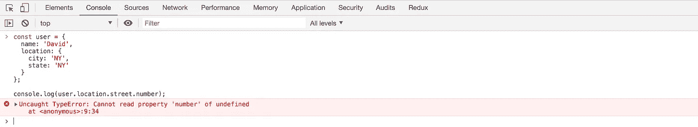
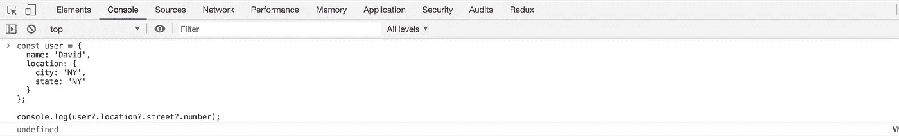
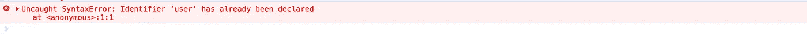
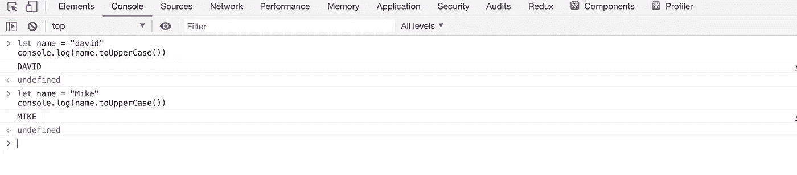
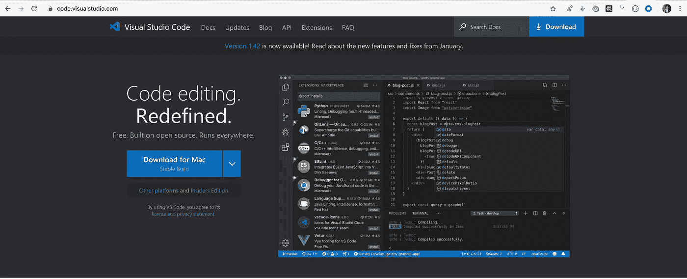
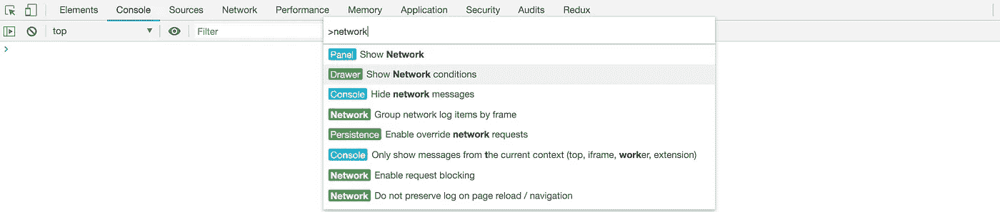
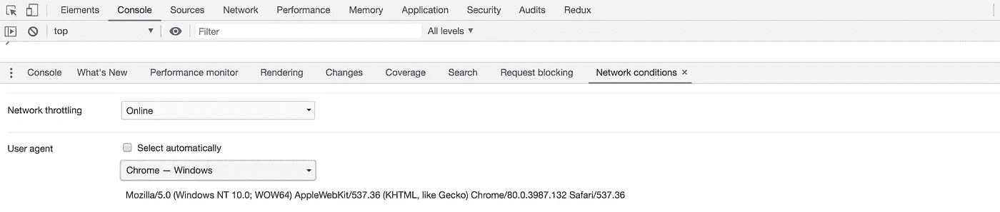
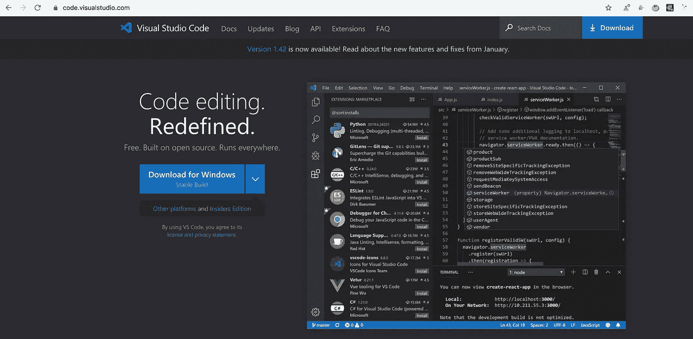
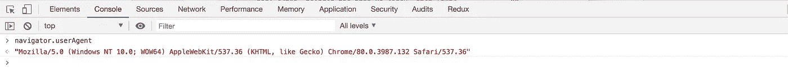

# Chrome 80 增加了新的有用的 JavaScript 特性

> 原文：<https://levelup.gitconnected.com/new-useful-features-added-in-chrome-80-af24a5b7c7ac>

## 探索 chrome 80 的一些最有用的功能


Chrome 最新版本 80 增加了新工具。在本文中，我们将研究一些最有用的特性。

## **1。支持可选链接**

如果我们有一个深度嵌套的用户对象，如下所示:

```
const user = {
 name: 'David',
 location: {
   city: 'NY',
   state: 'NY',
   street: {
     number: '4127',
     name: 'Kroonprinsstraat'
  }
 }
};
```

然后要访问`user.location.street.number`，我们首先需要检查是否所有的父对象属性都存在，如下所示:

```
if (user && user.location && user.location.street) {
 console.log(user.location.street.number);
}
```

因为如果街道不存在，直接访问它会导致错误。



`ES2020`增加了对可选链接操作符(`?`)的支持，这允许我们访问深度嵌套的属性，避免了增加额外检查的需要。如果该属性不存在，则为`undefined`。



## 2.**支持** `**let**` **和** `**class**` **在控制台中重新声明**

在 chrome 80 之前，如果我们在控制台中编写一些代码，并重新声明一个`let`或`class`变量，我们会得到一个错误:



我们不得不刷新页面，因为我们不能重新分配，但现在 Chrome 80 允许我们在控制台中重新声明一个`let`或`class`变量，所以我们不需要每次都刷新页面来尝试一些微小的变化。



## 3.**更新用户代理字符串**

Chrome 80 允许我们测试浏览器或操作系统的特定变化，而无需实际更改`device`或`Operating system`。

如果您访问任何软件下载页面，您会看到它使用`user-agent`字符串检测您的操作系统，并提供针对您的操作系统的下载选项。例如，如果你在 MacOS 上访问`Visual Studio Code`网站([https://code.visualstudio.com/](https://code.visualstudio.com/))，你会看到`Download for Mac`按钮



因此，如果没有选项，我们无法为其他操作系统下载，如果我们想为其他操作系统下载，例如通过 Firefox 中的`about:config`，我们必须在浏览器中进行一些配置更改。

但是在 Chrome 80 中，我们可以改变`user-agent`字符串，下载任何操作系统的软件。为此，请按照下列步骤操作:

1.打开 Chrome 开发者工具
2。使用 Control+Shift+P 或 Command+Shift+P (Mac)打开命令面板
3。在搜索框中输入`network`并点击`Show Network Conditions`命令
4。从抽屉中打开，取消勾选`Select automatically`复选框
5。从下面的下拉列表中选择任意操作系统，例如
`Chrome — Windows`，刷新[https://code.visualstudio.com/](https://code.visualstudio.com/)页面，保持开发者工具打开。
6。你会看到下载按钮变成了`Download for Windows`



这也改变了`navigator.userAgent`字符串，您可以通过将其记录到控制台来查看。



Chrome 80 提供了一种改变`user-agent`的简单方法，这在某些情况下非常有益。

今天到此为止。希望你今天学到了新东西。

**别忘了订阅我的每周简讯，里面有惊人的技巧、诀窍和文章，直接在这里的收件箱** [**订阅。**](https://yogeshchavan.dev/)