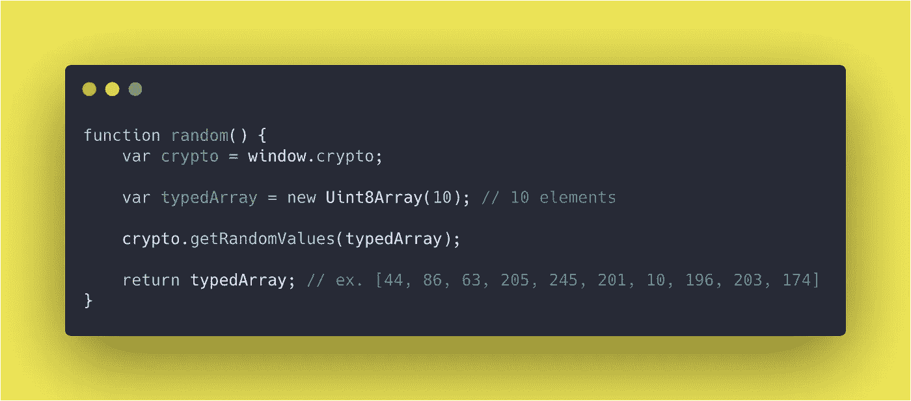

# 使用 Crypto 在 JavaScript 中生成随机数，不使用 Math.rand()

> 原文：<https://levelup.gitconnected.com/new-way-of-getting-random-number-in-javascript-using-crypto-9388cfbd2a3e>

了解如何在不使用`Math.rand()`的情况下获得随机数

`**Crypto.getRandomValues()**`方法让您获得加密的强随机值。

语法:`**getRandomValues(*typedArray*)**`

论据:`**typedArray**` **→** 是以整数为基的`TypedArray`，可以是`Int8Array`或`Uint8Array`或`Int16Array`或`Uint16Array`或`Int32Array`或`Uint32Array`。数组中的所有元素都将用随机数填充。

下面例子将生成一个由 10 个随机整数组成的数组。您可以根据需要进行修改。

如果需要单个值，只需创建一个长度为 1 的数组或访问第一个元素`typedArray[0]`。

类型化数组用随机值填充，上面例子中的最大值是`2⁸-1`，因为我们正在传递`Uint8Array`。如果我们通过了`UInt16Array`，那么数组将被填充`2¹⁶- 1`的最大值。

要获得`0 to 1`之间的随机值，您可以将结果除以各自的`typedArray` `maxValue`。如果我们使用`UInt8Array`，那么我们需要将该值除以`**(Math.pow(2,32)-1)**` **。**

要了解如何用老方法得到一个随机数，请阅读这里的。

如果你发现这个有用的惊喜🎁我这里****。****

****开心就分享😃 😆 🙂。****

****跟随** [**Javascript Jeep🚙**](https://medium.com/u/f9ffc26e7e69?source=post_page---------------------------) **如果你觉得值得。****

** [## 学习 JavaScript -最佳 JavaScript 教程(2019) | gitconnected

### JavaScript 是世界上最流行的编程语言之一——它随处可见。JavaScript 是一种…

gitconnected.com](https://gitconnected.com/learn/javascript)**