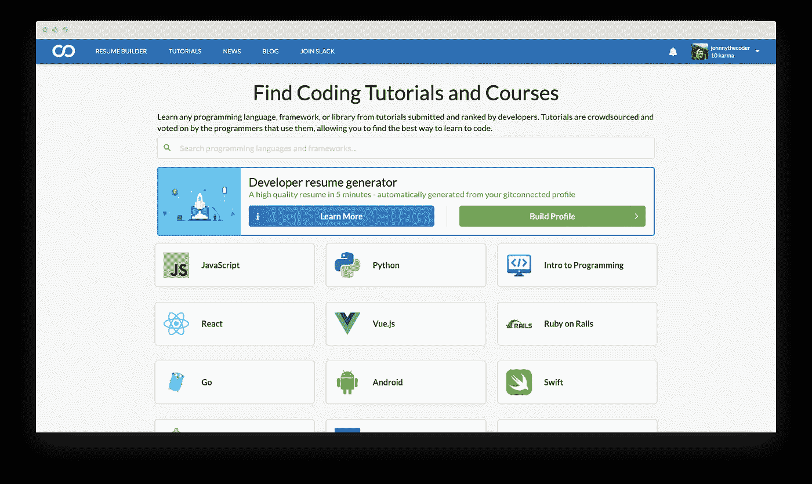
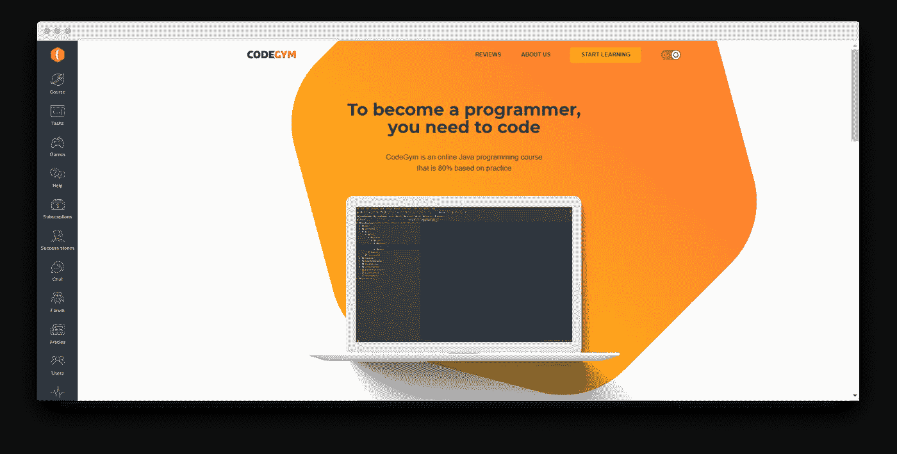
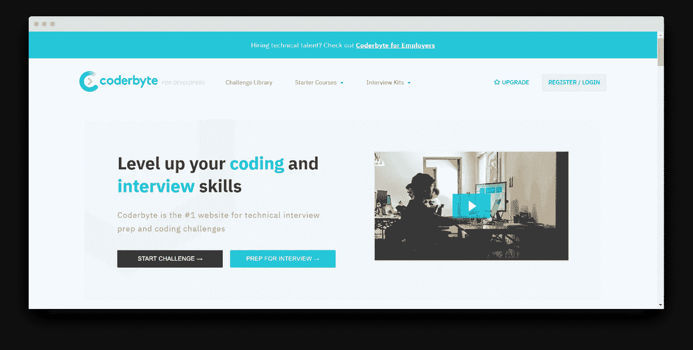
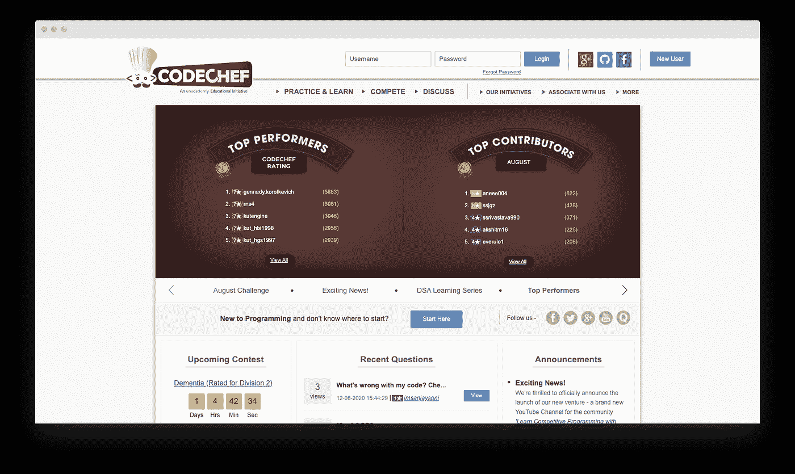

# 新手程序员的错误及如何避免

> 原文：<https://levelup.gitconnected.com/newbie-programmers-mistakes-and-how-to-avoid-them-f39a94bf753b>

为了成为一名高级 Java 开发人员，我已经学习 Java 很多年了，但我仍然不会停止学习，因为实际的编码从来不会停止教学。我也已经教了七年多了。想象一下，我自己已经犯了多少错误，我看着我的学生犯了多少错误。我很确定现在我知道一百种学习编码的错误方法(以及几十种正确的方法)。

有很多途径可以让你开始你的开发者生涯。但同样的事情造成了一种错觉，认为所有通往编码成功的道路都是一样好的。从我的经验来看，我可以说并不完全如此。在这里，我将分享如何学习编程的无效方法，并向您展示更好的替代方法。

# 学习编程的 9 种无效方法

# 1.同时做这件事

当你觉得自己有心情取得成就时，你会渴望立刻做所有的事情。你打开几个网页，开始学习一点 Java，然后一点 PHP，然后你对 JS 框架有一个简短的了解。到一天结束的时候，你认为你对编程了解很多。但是没有。

看看你如何在第二天早上醒来，突然意识到你几乎不记得昨天的事情。几个小时的学习(看似)零成绩！嗯，这就是学习新事物的诀窍:专注于某事。Java——那么只有 Java。至少在最初几个月坚持这个策略。以后，你可能会受益于其他技术，并在实际项目中一起尝试它们。

# 2.跳过基础知识

当你可以马上开始写你的第一部小说时，谁会在乎简单的字母表呢？为什么要浪费时间去做只有失败者才会做的事情？是啊，没错。跳过枯燥的基本面。如果下一件大事正在等着你，你为什么还要费心学习任何关于类或继承的东西呢？

不完全是。学习基础知识是你未来职业生涯的基石。如果你现在不认真做好构建它的工作，你将会被它绊倒很多年。当你找到一份真正的工作时，你可能真的没有时间回到基础。所以从 A 点慢慢移动到 B 点的最佳时刻就是现在。不，你还不是盒子里最聪明的蜡笔(目前还不是！)，所以不要跳过学习基本面。

# 3.千载难逢的学习

下一招，与上一招相连:有规律地学习。认为“一致性”只是另一个时髦词？不，不是的。这就是记忆的工作方式:在事情真正成为一项技能之前，你必须重复几次。如果没有任何进一步的用途，你辛辛苦苦建立起来的技能将会再次从你的记忆中消失。这就是为什么几个小时的学习加上几天的遗忘会直接导致失败。每天学习编程三十分钟胜过每隔一周练习三个小时。

# 4.在孤独中学习编码

“我会自己做的。”“我认为编码就是键入正确的行。我为什么需要人？”这些是我听到的一些在你学习时不与他人联系的借口。是的，如果你想象自己躲在显示器后面，在孤独和沉默中编写天才的东西…那么，对这种幻想说再见吧！无论多么内向的软件开发人员，他们的职业都是团队合作。你的也会。

在你的学习道路上，来自同龄人的帮助可能也是至关重要的。谁知道呢，也许你还会在那里遇到你未来的同事甚至雇主。在哪里？在程序员论坛、专业社区等。加入像 [CodeGym](https://codegym.cc/forum) 、 [Stack Overflow](https://stackoverflow.com/) 、 [Reddit](https://www.reddit.com/) 这样的论坛(例如，像 r\learnprogramming、r\java 和 r\learnjava 这样的子编辑)。和别人聊聊你的学习和工作，寻求帮助，帮助别人，得到一些启发。这肯定会提高你的专业技能，以及——这可能更重要——你的软技能。

# 5.只有看书，看视频，再看书

你读的关于编程的书越多，你就会成为越好的程序员。不，仅仅是理论，即使是 YouTube 上一幅明亮的漫画，也不会让你走得很远，除非你也去实践。尝试一些编码挑战平台，玩游戏，边做边学。这里是我为你挑选的一些在线选项。

*   [**Gitconnected**](https://gitconnected.com/learn/java)

Gitconnected 是一个充满学习编程教程资源的社区。所有素材都经过软件工程师和开发者的筛选，所以内容质量超高。在这里，成员们不仅学习，而且相互交流，以找到完成任务的最佳解决方案。

*   [**代码库**](https://codegym.cc/)

CodeGym 是一门结构化的 Java 课程，结合了讲座和实际任务。在这里，你可以从初级水平开始做任务，并达到自信的中级水平。整个课程是作为一个游戏化和讲故事的探索而建立的。不是让整个过程有趣多了吗？

*   [**Coderbyte**](https://coderbyte.com/)

该资源基于挑战和问题解决方案。有入门课程，一个巨大的挑战库，有明显的难度级别，还有工作面试准备工具。

*   [**主厨**](https://www.codechef.com/)

Codechef 是一个友谊赛的地方。它也有入门课程和每月挑战。看看如果你成为顶级演员之一，你的名字会是什么样子！

# 6.没有学会解决问题

让我们回到学习者的错误上来。起初，你真的只是学习简单的编码。但是这种“跟我学”式的辅导不会持续太久。创建软件不仅仅是写一行行的代码。它是关于制造一些东西，帮助人们填补一些空白，解决一些问题。

这就是为什么你必须开始弄清楚如何解决你的编码问题，而不只是做猴子生意。问题是你不会在工作中接到类似“写 50 行 Java 代码”的任务他们通常会说，“我们需要这个东西以这种方式工作。你能做到吗？”这是你可以或者不可以的时候。尝试上面提到的编码挑战来训练解决问题的技巧。

# 7.不确定你写的东西是否有效

在一个虚幻的世界中，开发人员从零开始创建理想的代码，它奇迹般地一下子就能工作。但在现实世界中，事情要复杂得多。你为某个应用程序写了又写，然后——哎呀。这个应用程序就是不能运行。你真的不知道哪里出了问题，是一个接一个出了问题还是一次出了几个问题。现在你必须从头开始检查一切。祝你好运！一个更好的选择是，在进入下一步之前，对项目的每个部分进行两到三次检查。那么你创造好东西的机会就更大了。

# 8.永远不要承认你写了糟糕的代码

很难意识到你犯了一个错误。当每天每一行代码都有大量错误时，就更难了。但是假装一切都很好，应该是这样更糟糕。所以面对现实吧:你会写出很多糟糕的代码。你必须不时地重写它。这是不可避免的，也是过程的一部分。审计你的代码，如果有什么需要改变的，就去改变它。

# 9.不要让比你更有经验的人来审查你的代码

当你学习演奏一种乐器时，你几乎不希望向任何人展示你缓慢的手指运动。代码也是一样——直到它变得完美，你都不想给任何人看。新手开发者不寻求帮助，拒绝寻求建议的情况很常见。你只能想象他们的学习之路会因此变得多么漫长和艰难。

向曾经参与过的人寻求对你的代码的评审。去专业的社区和论坛(如 [Stack Overflow](https://stackoverflow.com/) 、 [CodeProject](https://www.codeproject.com/) 或 [CodeGym 论坛](https://codegym.cc/forum))，如果你是学生，去找你的导师，和你的同伴讨论。你会从不同的角度来解决同样的问题。不仅如此，你会学得更好更快，因为你也从有经验的开发者那里获得知识。顺便说一下，有一个很好的后续效应:你将能够与下一个职业新人分享你的知识，这也是相当有益的。

# 包裹

学习编程确实需要时间和精力。但是你不必因为每个新手程序员都会犯的错误而使这个过程复杂化。如果你只是阅读而不开始实践，如果你从来不让别人检查你的代码，如果你没有获得一个解决问题的方法，你要成为一个专业人士需要很长时间。记住，你所能做的最糟糕的事情就是永远不要开始学习——或者在第一次失败后就放弃。

保持坚强！错误和失败是这个过程的一部分。不要每次做错事都灰心丧气。最重要的部分是你定期学习，最终提高你的技能。现在就开始，祝你好运！