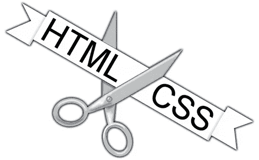
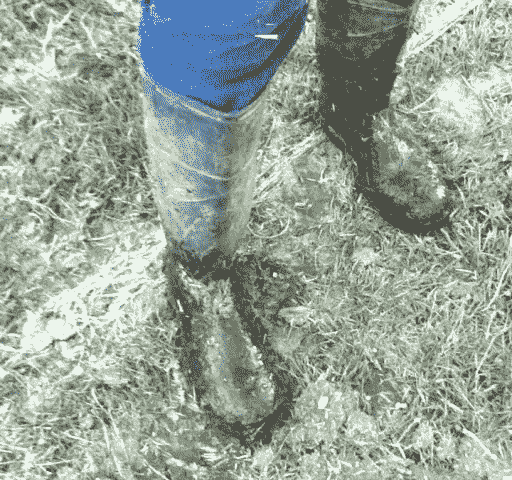
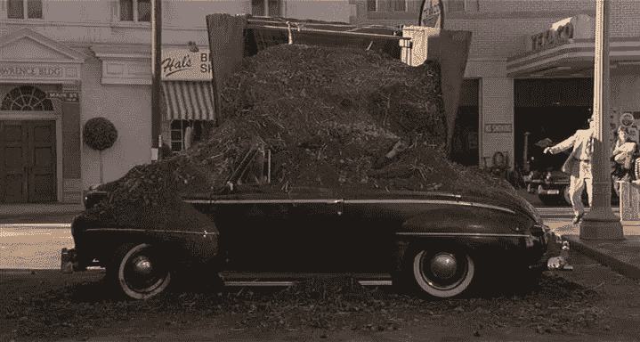

# 新闻快报——你可能一直在错误地使用 HTML。

> 原文：<https://levelup.gitconnected.com/news-flash-youve-probably-been-using-html-wrong-2dfb62755280>

在过去的十年里，我一直以自由职业者的身份为网站所有者提供可访问性和效率方面的咨询，这些网站所有者要么深陷法律纠纷，要么由于糟糕的开发决策而导致流量减少。在那段时间，我和客户现有的 IT 人员争论的一个持续的问题是他们的垃圾标记；坦率地说，大多数开发人员的头颅都嵌进了 1997 年的直肠。这在很大程度上源于这样一个事实，即所有的前端“框架”都是由没有资格编写一行 HTML 代码的人创建和维护的，这也是它们成为无知、无能和不称职的标志的一部分。



这不是巧克力和花生酱

# 语义标记:一种病态的委婉说法。

这个术语的产生只有一个原因，为了不冒犯那些错误使用 HTML 并且仍然使用过时的 HTML 3.2 风格的表示标记的无知的人。*甚至当他们在页面上方溢出一个 HTML 5 文档类型，并互相拍着对方的后背称赞他们有多“现代”的时候。*

当然，这是一个正确的词，因为它意味着使用 HTML 标签来表达它们的意思，而不是它们的默认外观，**真正应该翻译成“正确使用 HTML”。HTML 甚至有标签的全部原因并不是为了表示，而是作为一种手段来说明在一个专业的书面文档中什么是**什么是**或者什么是**。****

# **为什么说什么事情“是/应该是”如此重要？**

**因为你的基本标记不仅仅是为了坐在屏幕前看得很清楚的人。从第一天起，HTML 被创造出来的原因就是为了在目标设备的限制下，甚至在用户的任何障碍下，传递文档和信息。**

**蒂姆·伯纳斯·李**创建了** HTML，作为一种设备中立的传递方式。在互联网的早期，有几十种完全不同的设备需要一种统一的数据传输方式，以保留文档的专业写作含义。不管它是中央情报局的电传打字机，盲人用的 TTY 设备，雏菊轮式打印机，莱纳斯·托瓦尔兹正在使用的 VIC=20 的 21x22 纯文本显示器，某所高中的 Apple II 的 40x25 显示器，还是 TBL 在欧洲核子研究中心编写第一个浏览器时使用的下一个工作站的高端 1152x864 单色显示器。这些设备中的许多甚至不能描绘“粗体”、“斜体”，甚至不能绘制图形。你可能会说为什么某些东西会有某种风格，这样用户代理*(浏览器是一个 UA，但 UA 并不总是一个浏览器)*就可以在设备的限制范围内最好地确定如何传达这种风格。**

**没有什么像今天这样，每个人都使用完全相同尺寸的显示器，完全相同的分辨率，完全相同的字体堆栈，完全相同的字体渲染引擎，完全相同的默认字体大小和 PPI(每英寸像素)。对于那些错过的人来说，这是讽刺。**

**HTML 是可访问性的基础。它是**创造的**以使无障碍文件。写得好的 HTML 文档不仅仅是给坐在屏幕前视力良好的人看的**！！！**它是为那些使用屏幕阅读器*(大声朗读页面的软件)*、盲文阅读器、TTY、印刷品…甚至搜索引擎的人设计的，正如笑话所说，搜索引擎没有眼球，并且**不应该关心你的翻页风格！****

***事实上，搜索引擎只检查风格是否被滥用——比如内容伪装——以及移动兼容性。他们真的会对你的设计感兴趣。***

# ****那么我们是如何“用错了”的呢****

**人们在选择标记时会有各种各样的误解和错误的做法。**

## **表示标记**

**你们中的大多数人似乎仍然根据标签的默认外观来选择标签，而不是它们的含义。同样，好像 HTML 3.2 是开发技术的前沿。有趣的是，从之前的迭代中加入到 3.2 中的大部分内容都是表象垃圾，违背了当初创建 HTML 的初衷。**

**以 H1 为例..H6。它们意味着节和子节的开始。H1(单数)应该是**站点**上所有内容的(单数)标题(单数)。HTML 5 的“section”标签试图改变这一点，但这只会让事情变得更糟。因此，网站标题/徽标是你最有可能包装在页面上的**唯一的** H1 中的候选者。H2 标志着页面主要小节的开始，第一个 H2 意味着主要内容的开始。使主标签成为无意义的冗余。H3 标志着它前面的 H2 小节的开始。让小节和文章都成为毫无意义的冗余。一个 H4 标志着它前面的 H3 的一个小节的开始。想猜猜 H5 和 H6 是什么意思吗？即使是最低级的 HR 也意味着“主题或章节的变化，其中标题文本是不需要的/不必要的”。**

**它们不是指不同粗细和大小的字体，也不是指在屏幕上画一条线！！！**

**这就是为什么你不会跳过标题深度，不管你愿不愿意，直接跳到 H5，而没有 H4 作为它们的一部分。这就是为什么你的文档不用 H4 开头。这就是为什么把 H1 + H2 作为标题和口号是无知的垃圾。另一个原因是 WhatWG 的人显然没有资格编写 HTML 4 Strict 的继任者，因为他们似乎甚至不知道标题是干什么用的。请参阅“在 W3C 接受它为规范的几个月内被否决”这一愚蠢的废话。**

**就像 P 代表语法段落一样。**不是**某个随机浮动的句子片段，**不是**一个单独的图像，**不是**一个标签和输入对，**不是**因为“我想在这周围留一个空白”。就像 UL/OL 是用来表达简短的语法要点，而不是用来表达“视觉效果”或一页中值得有标题的主要部分。*(因为标题建立了相似的语义。对于看不见的 UA 来说，冗余语义往往比没有语义更糟糕)***

**即使是最低级的 B/CITE/EM/I/STRONG 标签也有与默认外观不同的含义。这就是“可能”发挥作用的地方。你不应该仅仅因为“我希望这个文本是粗体或斜体”就选择这些标签中的任何一个。相反，选择应该基于你为什么想要文本加粗或斜体。**

**选择所述标签有语法上的原因。**

***—强调***

****—更加强调****

**—您引用的报价或支持工作**

***—当 CITE 和 EM 没有涵盖斜体的语法原因时，例如您刚刚提到的书名或法律文件名称。***

****—与斜体相同，当文本因语法原因(如法律文件中的实体)而加粗时。****

**如果你不能提出使用任何语义标签的语法或结构原因——基本上是除了 DIV、SPAN 和 A 之外的所有标签——那么你可能不应该使用语义标签。**

**因此有这样一句话:**

> **如果你根据语义标签的样子来选择它们，那么你就是因为所有错误的原因而选择了所有错误的标签。**

**以我的一个朋友在 15 年前创造的这个例子为例，它和当时一样适用于今天。**

```
*<p>
  <i>GURPS,</i> <b>Steve Jackson Games'</b> flagship role-playing game, was first released in 1985\. Several licensed adaptations of other companies' games exist for the system, such as <i>GURPS Bunnies and Burrows.</i> However, <b>SJ Games</b> has no connection with <b>Wizards of the Coast</b>, producers of the <i>Dungeons and Dragons</i> RPG. <em>No <i>GURPS</i> content is open-source.</em> <strong>Do not plagiarize <b>SJ Games</b> work!</strong>
</p>*
```

***边注，那些还在鹦鹉学舌“总是使用 EM 和 STRONG”和“B 和我已被否决”的蠢蛋们正在说他们的坏话，他们迫切需要一套四重的 Sierra Tango 狐步舞制服！***

**同样，TABLE 也适用于表格数据。他们并不“邪恶”，他们本身并不是“黑客”。它们存在于列和行具有语义关系的情况下。**

****是的，**“用于布局的表格”不好。你不用桌子只是因为“哇哇，眼睛瞎了”。同时，对于本质上明显是表格的数据，不要滥用其他标记，比如列表。**

**所述表格也应该是“格式良好的”,也就是说在标题和正文中用表格标题来组织，它们之间的关系由范围或轴来建立。如果表格有一个标题，你不能跨越它，你可以使用题注。除了 TR 和 TD 之外，还有其他标记也可以放入表格中，可惜大多数研究 HTML 的人都不知道这一点。**

**拿一辆普通的购物车来说，你会经常看到无知无能的垃圾，比如:**

```
<table class="cart">
  <tr class="title">
    <td colspan="4"><b>Shopping Cart</b></td>
  </tr><tr class="headers">
    <td><b>Item</b></td>
    <td><b>Quantity</b></td>
    <td><b>Unit Price</b></td>
    <td><b>Total</b></td>
  </tr><tr>
    <td>Rovner Eddie Daniels II Ligature</td>
    <td>1</td>
    <td>21.99</td>
    <td>21.99</td>
  </tr><tr>
    <td>Yamaha 5C Alto Sax Mouthpiece</td>
    <td>1</td>
    <td>28.99</td>
    <td>28.99</td>
  </tr><tr>
    <td>Vandoren #3 Alto Sax JAVA Reeds, Box of Ten</td>
    <td>2</td>
    <td>32.99</td>
    <td>65.98</td>
  </tr><tr class="footer">
    <td colspan="3" align="right"><b>Shipping</b></td>
    <td>
      Free<br>
      <i>For orders over $50</i>
    </td>
  </tr><tr class="footer">
    <td colspan="3" align="right"><b>Total</b></td>
    <td><b>116.96</b></td>
  </tr>
</table>
```

**如果你看到这样的 HTML，你看到的是那些没有资格写表格的人写的代码。第一个 TR+TD 应该是一个标题。TR.headers 应该在一个 thEAD 中，用设置为 SCOPE="COL "的 TH 填充，因为它们描述了列。内容 TR 应该在 TBODY 内部，它们的第一个 TD 是 th，其中 SCOPE="ROW ",因为它们描述了行。最后两个跨区的 TR.footer 应该在 TFOOT 内，带有 th。粗体标签不应该出现在这里，斜体标签应该是强调。甚至 ALIGN 属性都是垃圾，因为那是表示，甚至不应该是 HTML 的翻转工作。只要父表有类，它们甚至不需要类，因为语义可以通过选择器和组合子来利用。**

**为了语义和适当的可访问性，应该是这样的:**

```
<table class="cart">
  <caption>Shopping Cart</caption>
  <thead>
    <tr>
      <th scope="col">Item</th>
      <th scope="col">Quantity</th>
      <th scope="col">Unit Price</th>
      <th scope="col">Total</th>
    </tr>
  </thead><tbody>
    <tr>
      <th scope="row">Rovner Eddie Daniels II Ligature</th>
      <td>1</td>
      <td>21.99</td>
      <td>21.99</td>
    </tr><tr>
      <th scope="row">Yamaha 5C Alto Sax Mouthpiece</th>
      <td>1</td>
      <td>28.99</td>
      <td>28.99</td>
    </tr><tr>
      <th scope="row">Vandoren #3 Alto Sax JAVA Reeds, Box of Ten</th>
      <td>2</td>
      <td>32.99</td>
      <td>65.98</td>
    </tr>
  </tbody><tfoot>
    <tr>
      <th scope="row" colspan="3">
        Shipping<br>
        <em>Free for orders over $50</em>
      </th>
      <td>0</td>
    </tr><tr>
      <th scope="row" colspan="3">Total</th>
      <td>116.96</td>
    </tr>
  </tfoot>
</table>
```

***边注，HTML 5 现在说 TFOOT* ***后面有*** *要走 TBODY。我说这是一个错误，忘记了为什么它是反过来的，但人们可以从 WhatWG 期待什么。越来越明显的是，他们没有资格创造 4 Strict 的继任者，W3C 如此轻易地接受它是愚蠢的。它经常散发出重现 3.2 最差版本的味道，以及同样的“让我们记录浏览器支持什么，而不是人们应该做什么”的想法又名“规范”的对立面。对于那些错过它的人来说，从语法/文学/结构的角度来看，这个斜体文本部分将是一个旁注；对 HTML 来说唯一重要的观点是，它并不意味着“文本放在一边”。***

**无论如何，后一个例子建立了所有的关系，使得表格在可访问性方面不那么糟糕，并且实际上在屏幕阅读器、盲文阅读器等等上变得有用。它还为您可能想要应用的任何样式提供了足够多的挂钩，而不用通过将类添加到所有东西上来破坏所有的标记。**

**老实说，你们中有多少人真的见过第二个例子中的表格？充分建立标题和范围？正确使用 THEAD、TBODY 和 TFOOT 这三个子部分标签。有多少人知道标题标签的存在？**

**没有这些挂钩，桌子就成了无障碍设施。滥用其他标签来做同样的工作是同样荒谬的，并在许多潜在的游客翻转鸟。**

## **表象课程**

**这是所有这些垃圾前端框架的通病，这些框架仍然很流行，尽管显然是由与编写 HTML 或 CSS 无关的人制作的，更不用说告诉其他人如何去做了。虽然我已经在我的文章中谈到了前端框架是多么愚蠢，以及他们声称的“更简单”是多么赤裸裸的谎言，但他们工作的核心原则才是问题所在。**用类来表示事物的样子是错误的！****

**在您的标记中这样做与所有那些在真正的 HTML 4 中早在 98 年就被否决的表示性标记是一回事。(又名“严”)。**

**以下两者之间几乎没有区别:**

```
<div class="w3-center w3-silver w3-xlarge">
```

**和**

```
<center><font color="silver" size="+3">
```

**在思维模式或心态上。出于表示的原因，在类中以这种方式编写代码，你正在挫败像 FONT 和 CENTER 这样的标签被弃用的原因，并且重新创建 20 多年前 4 Strict 试图阻止我们做的 HTML 编写类型。**

**使用类来说明事物应该是什么样子是错误的，因为 CSS 的全部目的是允许一个标记出现多次。“理想的”最佳 HTML 应该几乎不需要修改一个完整的皮肤，只需要制作一个新的样式表。它应该允许你为不同的媒体设备使用多种样式表——比如印刷、投影、听觉等。你要怎么办？有些东西在某个地方是红色的，但在另一个皮肤上却是蓝色的？**

**当您开始实现更现代的概念(如白天/晚上切换)时，这甚至是一个更大的问题。**

**你的 HTML 是用来描述事物是什么，会是什么，或者为什么它们会有一种风格。这应该扩展到类和 ID，因此，如果你使用表示类，或者准备在这篇文章的回复中为它们辩护……请——为了你订阅的任何童话故事《天空中的神奇男人》——承认失败，然后回去写 HTML 3.2。你的头显然已经长到了 20 世纪 90 年代中后期的水平，我们需要找一个牙齿矫正医生来处理拔牙的事情。**

## **无尽的无意义的类和 DIV**

**这与我们前面的部分是一致的，因为有很多谎言、糟糕的实践和简单的无知导致了臃肿的非语义代码库和不可访问性。**

**不要在你不需要的地方浪费时间。至少先尝试设计现有标签的样式。如果你不再为一个部分使用表格——比如一个图片库——停止使用 DIV 来划分行，让 inline-block / float wrapping 或 flex-wrap:wrap；注意排好队。在生成的内容可以做相同工作的情况下，不要添加空 span。是的，用你画汉堡图标的愚蠢方式，我在看着你。**

**上课也是一样。现在有一个**式的谎言**正在流传——甚至现在翻翻谷歌似乎也相信了——向每个该死的元素抛出类比使用选择器神奇地“更快”地“呈现”页面。**

**让这成为谎言的是你拥有的类越多，浏览器需要维护的类和类元素的列表就越大。标记越大，页面加载代码的时间就越长，服务器为这些代码提供服务的时间就越长，而**解析器**的时间也就越长。**

**因此，像 BEM 这样的废话和把类扔向任何事物都不是答案。在任何真正的网站上，最多也就是一场骗局。**

**实际上，当一台 486/66、8g 内存、运行 Win 3.x 下的 IE 5 可以处理它时，抱怨 CSS 中的标签选择器和组合器“慢”是在多 ghz 多核手持设备时代的 BS 声明。可笑的是，同样蹩脚的借口和毫无根据的主张“桌子是邪恶的，不应该被使用”。**

****

**说真的，你需要一根棍子才能把它刮下来。**

# **完美的风暴**

**“以上所有”滥用/误用 HTML 的一个很好的例子可以在几乎所有使用 Bootstrap 的代码库中找到**

**它深陷在铲粪的坏习惯中，正如我十多年前说过的，你能从 bootstrap 学到的唯一一件事就是如何不创建网站。**

**不要挑出 Boostrap，因为这样的缺陷在每个 HTML/CSS 框架中都可以找到。Tailwind，w3.css 等等等等。他们都只不过是通过宣传、掠夺性的做法和一厢情愿的想法而流行的精神侏儒。**

**举个简单的例子，比如他们的“定价”例子:**

**[https://getbootstrap.com/docs/4.5/examples/pricing/](https://getbootstrap.com/docs/4.5/examples/pricing/)**

**你会发现这样的无能瑰宝:**

```
<div class="pricing-header px-3 py-3 pt-md-5 pb-md-4 mx-auto text-center">
  <h1 class="display-4">Pricing</h1>
  <p class="lead">Quickly build an effective pricing table for your potential customers with this Bootstrap example. It’s built with default Bootstrap components and utilities with little customization.</p>
</div><div class="container">
  <div class="card-deck mb-3 text-center">
    <div class="card mb-4 shadow-sm">
      <div class="card-header">
        <h4 class="my-0 font-weight-normal">Free</h4>
      </div>
      <div class="card-body">
        <h1 class="card-title pricing-card-title">$0 <small class="text-muted">/ mo</small></h1>
        <ul class="list-unstyled mt-3 mb-4">
          <li>10 users included</li>
          <li>2 GB of storage</li>
          <li>Email support</li>
          <li>Help center access</li>
        </ul>
        <button type="button" class="btn btn-lg btn-block btn-outline-primary">Sign up for free</button>
      </div>
    </div>
```

**饼干上的圣诞节，多么精彩的演出。无止境的无意义的 div，无止境的无意义的类，对编号标题的完全无意义的乱码使用，应该是锚的按钮，因为它不是表单，也不应该是 JavaScript 的翻转工作。**

**第一个**四个** DIV 只做一个标签的工作，这些部分由一个 H4 开始，它是语义 gibverish，因为它使用了一个 H1 作为它的结构兄弟。你已经有了非常好的容器类，那么他们为什么要在标题、列表和按钮上转储类呢？非常明显，创建和维护 bootstrap 的人没有资格编写一行该死的 HTML 或 CSS 代码。**

**这是一个火车残骸箩筐如何**而不是**建立一个网站！都在做着这样的工作:**

```
<section id="pricing">
 <h2>Pricing</h2>
 <p>
  Quickly build an effective pricing table for your potential customers with this Bootstrap example. It’s built with default Bootstrap components and utilities with little customization.
 </p>
 <div class="cards">
  <section>
   <h2>Free</h2>
   <ul>
    <li><strong>$0 <span>/mo</span></strong></li>
    <li>10 users included</li>
    <li>2 GB of storage</li>
    <li>Email support</li>
    <li>Help center access</li>
   </ul>
   <a href="#">Sign Up For Free</a>
  </section>
```

**恰当的翻转语义和更少的代码。但是，请再次告诉我，使用 Bootstrap 这样的框架有多“简单”。坦率地说，如果你持有这种观点，你不知道足够的 HTML 或 CSS 来建立网站，更不用说选择一个框架。**

**在他们的例子中缺乏正确的语义，并且每个人都遵循这个线索，这基本上是告诉具有可访问性的用户需要自己动手。这使得 HTML 更难处理，使得服务器不得不更加努力地构建 HTML，并且在大多数情况下——正如我在重写“相册”示例时所证明的那样——你最终会比没有框架的情况下编写更多的代码。**

**如果不写更多的代码，写同样多的代码**怎么会“更容易”？它不是。****

****

**那些说这些事情“更容易”或“更有利于合作”的人只需要闭上嘴，认识到他们错得有多离谱。这是一个 100%的虚构，人们尖叫着“哇哇，眼睛 dunz wunna lurn HTML”。通常，同样的人声称 HTML 是“简单的”和“不是真正的编程语言”。**

**如果它如此简单，为什么他们不愿意学习它的规则并正确使用它呢？！？认真地说，那些鹦鹉学舌这两种说法最多的人通常是那些不能写出合适的 HTML 的人，如果他们的生活依赖于它的话。**

# **为什么这一切如此糟糕？**

**首先，它忽略了一个被称为“表示与内容分离”的概念。关注点分离在编程中一直是很好的实践，但是对于 HTML 和 CSS，它在许多人没有考虑的地方带来了好处。**

## **比如缓存。**

**HTML 通常很少在客户端缓存，因为内容可能会发生变化。一个网站更新得越频繁，这种情况就越真实。如果您将样式移动到标记中——就像关于将“文件夹样式之上”移动到 HTML 中的那个同样愚蠢的“谎言”——它不太可能被缓存。这就是为什么几乎 100%的时候你看到一个**

**CSS 更容易缓存，所以你能从标记中移进 CSS 的越多，加载、解析和呈现的速度就越快。如果对每种媒体类型使用单一样式表，这也可以跨多个页面使用。*(链接标签上的 media= " "中的内容，如果您省略了该属性或将其设置为 media="all "，您就完了)。*这有什么帮助？你可以预先缓存子页面的外观！在第一次加载时牺牲一点点带宽，你就可以让其他人访问你的网站时加载和渲染得更快！**

***事实上如此之快，以至于它经常能与 SPA 和其他 JS 的诡计相匹敌。在我自己的网站上，我经常有人问“隐藏负载的脚本在哪里”，因为子页面只需要发送极简标记！***

## **…或可访问性**

**再说一次，坏的/坏的/纯粹的垃圾非语义标记实际上是对坐在那里看屏幕的视力不太好的人的攻击。这是互联网，我们作为网络开发人员唯一能确定的是，我们不知道谁会访问我们的网站，也不知道是什么类型的用户代理！**

**不要成为那种抱怨自己的生意不得不为残疾人坡道付费的垃圾，不要在完全可以避免走五英尺的时候把车停在残疾人车位上，或者说“为什么盲人应该被允许使用互联网？”*(这句话来自我最近被一家“字母汤”联邦机构解雇的某人。)***

**尤其是现在，美国 ADA 或英国 EQA 等法律的法规遵从性不再仅仅适用于公共事业、医疗、银行和政府部门。由于美国最高法院拒绝审理和推翻多米诺案件，现在是零售网站无障碍诉讼的旺季。**

## **…或者搜索引擎优化**

**它也从语义标记中获益，因为搜索引擎没有眼睛。一个合适的文档结构可以帮助他们理解页面，这也是为什么标题通常比其他文本排名更靠前的原因。诀窍是不要滥用你的头球深度，因为这更有可能让你因为滥用而被扇耳光，而不是排名上升。**

**事实上，写得好、结构好的语义标记将轻而易举地击败那些你所谓的“SEO 专家”蛇油小贩试图用勺子喂你的低级、蹩脚、胡言乱语的把戏。**

**特别是从长远来看，今天有效的低级伎俩明天就会被谷歌和其他引擎所扼杀。这就是为什么每次有算法更新时，典型的 SEO 狂人会像一只被砍了头的鸡一样跑来跑去，而像我这样的开发人员则坐在后面拿着爆米花，指着傻瓜笑。**

**近 14 年来，我的网站没有因为算法更新而对流量产生负面影响。你玩一些低级的把戏，期望搜索引擎给你一个最好的反馈，最坏的情况下给你一罐下流话。**

**这一切都要追溯到 15 年前马特·卡茨告诉我们的事情，当时他是谷歌反滥用部门的负责人。**

> **为用户而写，而不是为搜索引擎。**

**为用户写作意味着所有用户，而不仅仅是坐在屏幕前视力良好的人。**

**就页面优化而言，两个最重要的因素是:**

1.  **有价值的独特的写得好的内容**
2.  **语义标记给用户代理——比如搜索引擎——更好的线索，让他们知道内容**是什么**。**

**大多数时候，你会听到搜索引擎优化专家喋喋不休地谈论页面上的其他任何东西，他们的废话比毕夫·坦南的 48 年福特超级豪华车还多。**

****

**我讨厌粪肥…**

# **你是不是夸大了 HTML 的重要性？**

**哦，我总是从《一无所知》里听到这句话。不。它的存在是有原因的，在许多行业中，如果你忽视这些原因，就会产生法律后果。它有规则。是基于专业的写作规范。未能遵循它会疏远潜在用户，导致代码更难维护，对你的搜索排名产生负面影响，总的来说,**是很多网站第一年失败的一大原因。****

**人们寻找低俗的捷径，盲目地复制糟糕的代码，因为他们认为自己太笨了，学不会。他们认为这比实际要难，让他们去相信任何说“容易”的事情，不管这是一个多么大的谎言。**

**框架之类的东西的宣传说它们的方式是“容易的”,暗示着替代方案是“困难的”。他们告诉你跨浏览器开发很难，你信以为真。他们使用各种闪闪发光的泛泛之谈来试图欺骗你，让你认为没有他们的帮助你太蠢了，或者没有他们的帮助你会“花太长时间”。**

**你猜怎么着我不相信你会这样。是的，你。正在读这篇文章的人。**我真的认为你足够聪明，可以学会所有这些。**如果你学会正确使用 HTML——进而使用 CSS——你会发现这个行业中的大多数人对 web 开发的评价简直就是 100%火上浇油。**

**HTML 是基石，你的基础。没有它，我们就不会有网络，如果使用不当，你就会有一个纸牌屋。大多数人使用 HTML 的方式就像在没有粘合剂的情况下用巨石建造两层房屋的地基，也没有测试其下的密度或含水量。如果刮风时它倒了，然后下雨导致整个东西被吸进一个天坑里，不要惊讶。**

# **结论**

**HTML 之所以有标签，是有明确的原因的，它是基于写作规范中常见的结构规则，至少在美国，这在 80 年代初至少在五年级就有了。*我想现在这是大学水平的选修课…*HTML 的规则、指南和整个要点是尽可能多的用户可以访问，你所做的任何事情——通过无知或故意愚蠢的干涉——意味着你根本没有领会 HTML 的目的。**

**停止根据默认外观选择标签。不要对没有意义的事物使用标签。停止使用类来复制 HTML 3.2 风格的白痴行为…和饼干上的圣诞节学习如何通过良好的实践来正确使用 HTML:例如渐进增强；关注点分离；以及其他你应该用它做的事情。**

**否则你就是在伤害你自己、你的网站和你的访问者。**