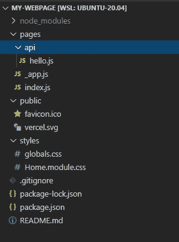

# Next.js +无需服务器的个人网页——用 Next.js 引导应用程序(第 3 部分)

> 原文：<https://levelup.gitconnected.com/next-js-serverless-personal-webpage-in-a-couple-of-hours-bootstrapping-the-app-with-next-js-b87d468f9cdc>

现代 JavaScript 开发因初始设置困难而臭名昭著，构建管道是传输程序、前处理器和后处理器的随机组合。虽然[中提到的 2017 年学习 JavaScript 的感觉](https://medium.com/front-end-weekly/how-it-feels-to-learn-javascript-in-2017-a934b801fbe)在 2021 年仍然非常相关，但有了*的脚手架*工具，如 create-react-app 和 create-next-app，你可以在几分钟内获得有见解的项目结构和工作构建。

在这篇文章中，我将使用 create-next-app 来引导我的 Next.js 项目。如果你对为什么 Next.js 是我静态网站的首选框架感兴趣，你可以阅读[https://www . freecodecamp . org/news/why-you-should-learn-next-js-as-a-react-developer/](https://www.freecodecamp.org/news/why-you-should-learn-next-js-as-a-react-developer/)

这是我为记录我在一个晚上建立个人网页的旅程而写的一系列文章的第三部分:

[第一部分:开发环境设置](https://jeremy-chan.medium.com/creating-a-personal-webpage-from-scratch-in-2021-development-environment-part-1-b0b45396da00)
[第二部分:购买自己的域名并设置邮件转发](https://jeremy-chan.medium.com/creating-a-personal-webpage-from-scratch-in-a-couple-of-hours-getting-a-domain-name-and-email-73a462a4c183) [第三部分:用 Next.js 引导 app](https://jeremy-chan.medium.com/next-js-serverless-personal-webpage-in-a-couple-of-hours-bootstrapping-the-app-with-next-js-b87d468f9cdc)(📍你在这里) [](https://jeremy-chan.medium.com/next-js-serverless-personal-webpage-in-a-couple-of-hours-bootstrapping-the-app-with-next-js-b87d468f9cdc) [第 4 部分:使用 Vercel](https://jeremy-chan.medium.com/next-js-serverless-personal-webpage-in-a-couple-of-hours-deploying-to-production-with-vercel-b35fe5daeaa7) [部署到生产第 5 部分:将您的联系人表单与 forms spree](https://jeremy-chan.medium.com/next-js-serverless-personal-webpage-in-a-couple-of-hours-create-contact-form-with-formspree-5-cb6419f86917) [第 6 部分:使用无服务器功能从介质中提取博客文章](https://jeremy-chan.medium.com/next-js-serverless-personal-webpage-in-a-couple-of-hours-pull-medium-posts-w-serverless-func-6-65855599509d)

# **启动 Next.js 应用程序(20 分钟)**

首先创建一个 git repo，然后使用下一个 CLI 工具初始化项目结构。

```
npx create-next-app
```

CLI 会将必要的 node_modules 下载到您的项目文件夹中。

开始 VS 代码的方式:

```
cd my-webpage
code .
```

您将看到项目结构:



`pages/`文件夹包含渲染你的应用的 JavaScript 文件，`_app.js`是入口点，`index.js`包含登陆页面的代码。

`pages/api`文件夹包含示例无服务器功能。我们将在本系列的第 6 部分中讨论这个问题。

图像进入`public/`，css 样式进入`styles/`。相当直接。

现在，在 VS 代码中按下`Ctrl-Shift-``,启动一个终端并运行以下程序:

```
npm run dev
```

默认情况下，它将在端口 3000 上启动一个 Next.js dev 服务器。在 Windows 主机上的浏览器中导航到[http://localhost:3000](http://localhost:3000)(WSL 为您处理端口转发)，您应该会看到默认的 Next.js 登录页面。


转到`pages/index.js`并做一些更改，在保存文件时，你会看到更改立即反映在你的浏览器中，不需要明确的刷新。欢迎来到现代 JavaScript 开发👍。

**发挥创意！**

我不打算介绍如何编写 React 组件或网页样式。网上有很多教程。根据你的目标，在这里你可以获得创造性或艺术性。像许多软件工程师一样，我的网页设计技能非常有限。我从 https://html5up.net/的 Next.js 模板开始。

如果您决定使用模板，我建议您在开始进行更改之前，花一些时间将依赖项(例如 Next.js、React)升级到最新、最好的版本。当你的项目干净、小的时候，升级总是比较容易。

**结论**

仅仅过了一个小时，我们就有了一个可用的 Next.js 应用程序，我们可以轻松地进行更改并在本地运行。在下一部分中，我们将把我们的应用程序部署到互联网上！

[第一部分:开发环境设置](https://jeremy-chan.medium.com/creating-a-personal-webpage-from-scratch-in-2021-development-environment-part-1-b0b45396da00)
[第二部分:购买自己的域名并设置邮件转发](https://jeremy-chan.medium.com/creating-a-personal-webpage-from-scratch-in-a-couple-of-hours-getting-a-domain-name-and-email-73a462a4c183) [第三部分:用 Next.js 引导 app](https://jeremy-chan.medium.com/next-js-serverless-personal-webpage-in-a-couple-of-hours-bootstrapping-the-app-with-next-js-b87d468f9cdc)(📍你在这里) [](https://jeremy-chan.medium.com/next-js-serverless-personal-webpage-in-a-couple-of-hours-bootstrapping-the-app-with-next-js-b87d468f9cdc) [第 4 部分:使用 Vercel](https://jeremy-chan.medium.com/next-js-serverless-personal-webpage-in-a-couple-of-hours-deploying-to-production-with-vercel-b35fe5daeaa7) [部署到产品第 5 部分:将您的联系人表单与 Formspree](https://jeremy-chan.medium.com/next-js-serverless-personal-webpage-in-a-couple-of-hours-create-contact-form-with-formspree-5-cb6419f86917) [集成第 6 部分:使用无服务器功能从介质中提取博客文章](https://jeremy-chan.medium.com/next-js-serverless-personal-webpage-in-a-couple-of-hours-pull-medium-posts-w-serverless-func-6-65855599509d)