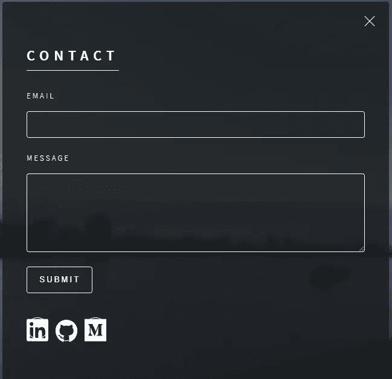
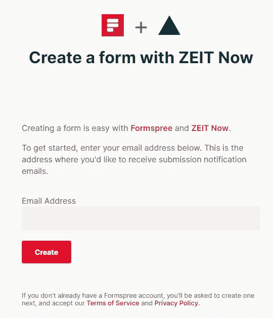
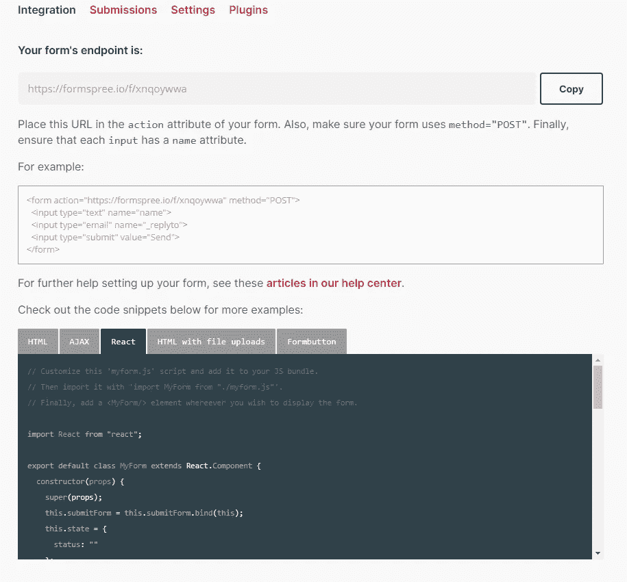
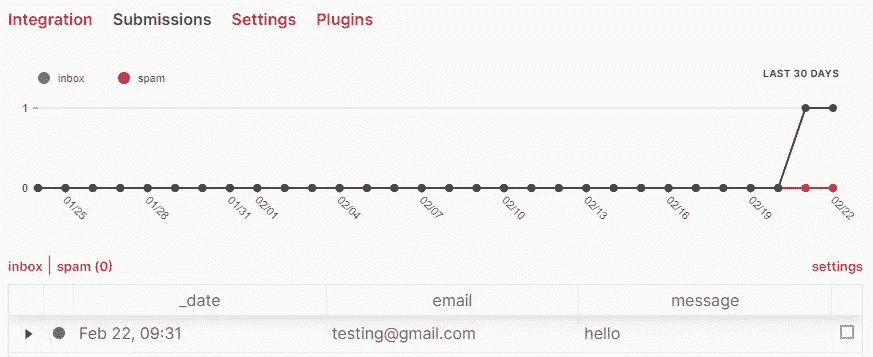

# Next.js +几个小时后的无服务器个人网页——用 Formspree 创建联系表单(第 5 部分)

> 原文：<https://levelup.gitconnected.com/next-js-serverless-personal-webpage-in-a-couple-of-hours-create-contact-form-with-formspree-5-cb6419f86917>

任何个人网页的一个常见组成部分是“联系”表单，因为您希望为访问者提供一种联系您的方式，同时保护您的电子邮件地址免受机器人垃圾邮件的攻击。

在传统的前端/后端设置中，我们通过点击将有效负载发布到后端，并在您选择的后端 web 框架(例如，NodeJS、PHP、Python 等)中实现联系表单。)，您编写代码来使用您有权访问的 SMTP 服务器发送电子邮件。

当我们没有后端时，我们该怎么办？

这是我为记录我在一个晚上建立个人网页的旅程而写的系列文章的第 5 部分:

[第 1 部分:开发环境设置](https://jeremy-chan.medium.com/creating-a-personal-webpage-from-scratch-in-2021-development-environment-part-1-b0b45396da00)
[第 2 部分:购买自己的域名并设置邮件转发](https://jeremy-chan.medium.com/creating-a-personal-webpage-from-scratch-in-a-couple-of-hours-getting-a-domain-name-and-email-73a462a4c183) [第 3 部分:用 Next.js](https://jeremy-chan.medium.com/next-js-serverless-personal-webpage-in-a-couple-of-hours-bootstrapping-the-app-with-next-js-b87d468f9cdc) [引导 app 第 4 部分:用 Vercel](https://jeremy-chan.medium.com/next-js-serverless-personal-webpage-in-a-couple-of-hours-deploying-to-production-with-vercel-b35fe5daeaa7)  [部署到生产第 5 部分:将您的联系人表单与 Formspree](https://jeremy-chan.medium.com/next-js-serverless-personal-webpage-in-a-couple-of-hours-create-contact-form-with-formspree-5-cb6419f86917) (📍你在这里)  [第六部分:用无服务器功能从介质中提取博客文章](https://jeremy-chan.medium.com/next-js-serverless-personal-webpage-in-a-couple-of-hours-pull-medium-posts-w-serverless-func-6-65855599509d)

# 在 Formspree 中创建联系人表单(20 分钟)

Formspree 和其他表单提供者如 FormKeep 和 Netlify Forms 提供的是一个 **API** 供你提交表单。因此，我们将把表单提交给 Formspree API，而不是把表单的有效载荷发布到后端(这不在我们的控制之下)。然后，它会触发表单提供者上的一个逻辑，向您指定的电子邮件发送电子邮件通知。

使用表单提供商，您通常可以免费获得垃圾邮件防护等附加功能。许多表单提供者与 reCAPTCHA 集成在一起，有些还有亵渎过滤器或基于机器学习的垃圾邮件过滤器。

用 Formspree 创建一个表单非常容易，反之亦然。前往 https://formspree.io/create/zeit 的，填写您希望接收提交通知的电子邮件地址(使用您在第 2 部分中创建的别名之一)。

在下一个屏幕上，您将获得表单提交的唯一端点。Formspree 为您提供了一个现成的 React 组件，非常方便。你所需要做的就是稍微修改它，使它适应你的代码库。

继续从您的联系表单中测试提交。它将显示在 Formspree 的提交选项卡中，您将在电子邮件通知中获得相同的详细信息，以便您可以回复您的访问者。

**有什么隐情？**

这一切都非常方便，效果也非常好。这里的问题是，您的联系人表单现在又依赖于第三方服务。使用表单提供程序的替代方法是从无服务器功能发送电子邮件。但是，除非您托管自己的 SMTP 服务器，否则您仍然需要依赖一些外部 API(如 sendgrid)来实现几乎相同的效果。

请注意，Formspree 的免费计划每月有 50 个提交的小限制(这对开始来说可能是好的)。还有其他免费提供者提供更慷慨的限制，所以你应该能够找到一个适合你的需求。

**结论**

在这一部分中，我们通过使用外部 API 扩展了我们的无服务器应用程序，使其具有一个可工作的联系我们表单。在下一部分中，我们将探索在无服务器部署中使用无服务器功能来实现一些后端功能。

[第 1 部分:开发环境设置](https://jeremy-chan.medium.com/creating-a-personal-webpage-from-scratch-in-2021-development-environment-part-1-b0b45396da00)
[第 2 部分:购买自己的域名并设置邮件转发](https://jeremy-chan.medium.com/creating-a-personal-webpage-from-scratch-in-a-couple-of-hours-getting-a-domain-name-and-email-73a462a4c183) [第 3 部分:用 Next.js](https://jeremy-chan.medium.com/next-js-serverless-personal-webpage-in-a-couple-of-hours-bootstrapping-the-app-with-next-js-b87d468f9cdc) [引导 app 第 4 部分:用 Vercel](https://jeremy-chan.medium.com/next-js-serverless-personal-webpage-in-a-couple-of-hours-deploying-to-production-with-vercel-b35fe5daeaa7)  [部署到生产第 5 部分:将您的联系人表单与 Formspree](https://jeremy-chan.medium.com/next-js-serverless-personal-webpage-in-a-couple-of-hours-create-contact-form-with-formspree-5-cb6419f86917) (📍你在这里)  [第六部分:用无服务器功能从介质中提取博客文章](https://jeremy-chan.medium.com/next-js-serverless-personal-webpage-in-a-couple-of-hours-pull-medium-posts-w-serverless-func-6-65855599509d)