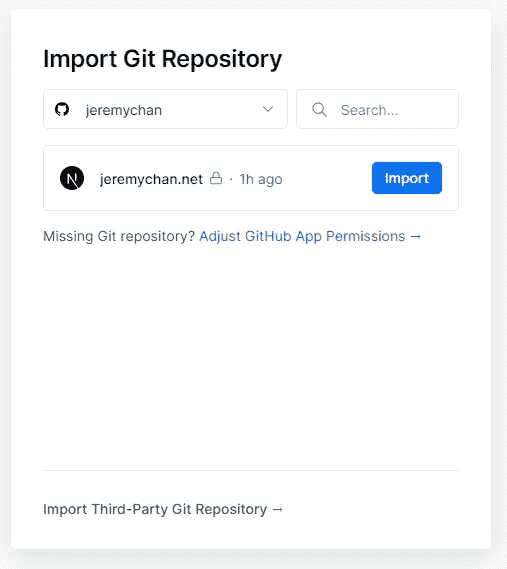
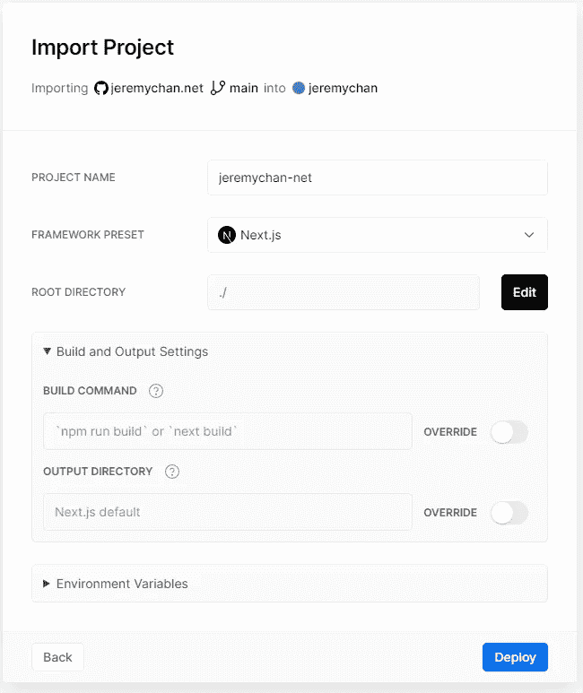
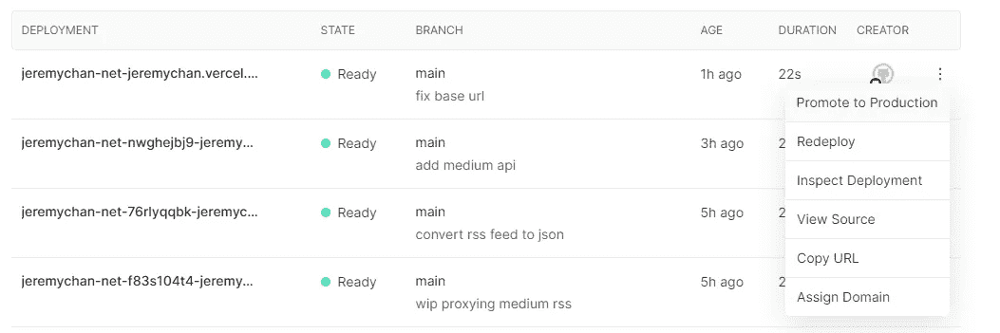
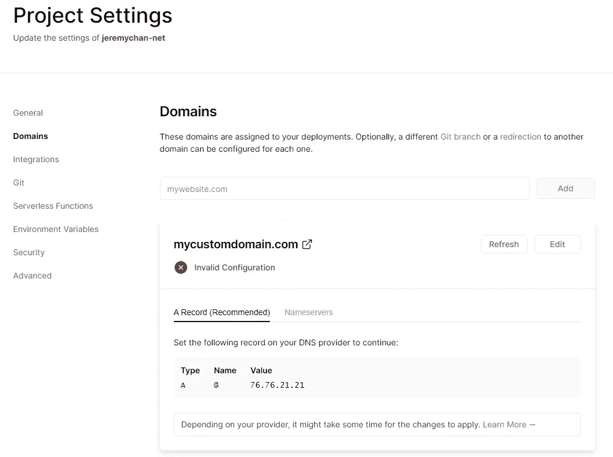
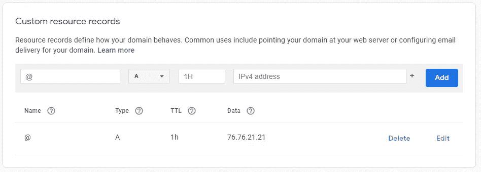
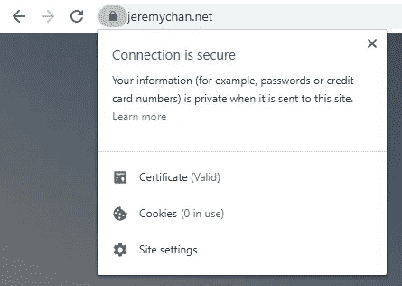

# Next.js +几个小时后的无服务器个人网页——使用 Vercel 部署到生产环境(第 4 部分)

> 原文：<https://levelup.gitconnected.com/next-js-serverless-personal-webpage-in-a-couple-of-hours-deploying-to-production-with-vercel-b35fe5daeaa7>

在过去，部署意味着 FTP 或 SSH 你的网站捆绑到一些远程 web 主机。如果您有一个独立的非生产/生产环境，这意味着用不同版本的代码重复相同的过程。这既费时又乏味，而且容易出错。Azure、AWS 和谷歌云平台等 IaaS 平台并没有让部署变得容易。事实上，它们只会让扩展变得更容易，但让事情运转起来却更难。

然而，有了无服务器或有时被称为后端即服务，事情开始变得真正容易。

> 要了解什么是无服务器以及为什么它是静态网页的好选择，请参见[https://www . cloud flare . com/learning/server less/what-is-server less/](https://www.cloudflare.com/learning/serverless/what-is-serverless/)

这是我为记录我在一个晚上建立个人网页的旅程而写的系列文章的第 4 部分:

[第 1 部分:开发环境设置](https://jeremy-chan.medium.com/creating-a-personal-webpage-from-scratch-in-2021-development-environment-part-1-b0b45396da00)
[第 2 部分:购买自己的域名并设置邮件转发](https://jeremy-chan.medium.com/creating-a-personal-webpage-from-scratch-in-a-couple-of-hours-getting-a-domain-name-and-email-73a462a4c183) [第 3 部分:用 Next.js](https://jeremy-chan.medium.com/next-js-serverless-personal-webpage-in-a-couple-of-hours-bootstrapping-the-app-with-next-js-b87d468f9cdc) [引导 app 第 4 部分:用 Vercel](https://jeremy-chan.medium.com/next-js-serverless-personal-webpage-in-a-couple-of-hours-deploying-to-production-with-vercel-b35fe5daeaa7) (📍你在这里)  [第 5 部分:将你的联系人表单与 forms spree](https://jeremy-chan.medium.com/next-js-serverless-personal-webpage-in-a-couple-of-hours-create-contact-form-with-formspree-5-cb6419f86917) [第 6 部分:用无服务器功能从介质中提取博客文章](https://jeremy-chan.medium.com/next-js-serverless-personal-webpage-in-a-couple-of-hours-pull-medium-posts-w-serverless-func-6-65855599509d)

# **将我们的应用程序上传到 Vercel (20 分钟)**

Vercel(以前的 ZEIT)是 Next.js 背后的公司。他们还提供免费的后端即服务，支持定制域、Git 集成和无服务器功能。在本文中，我们将把 Next.js 应用程序部署到 Vercel 上。

> **厂商锁定？**
> 
> 使用这些无服务器提供商(例如 Heroku、Vercel、Netlify)时，您可能会担心供应商锁定。我不认为这是一个问题。当转换到另一个供应商的成本如此之高，以至于你被“套牢”时，就会发生供应商“锁定”。然而，我们现在只投入很少的资金来建立我们的部署。这些公司都在相互竞争，通过为通用框架(如 Next.js)提供开箱即用的构建，使过程尽可能无缝。只要做最少的改动，我们就可以轻松地将我们的部署从 Vercel 切换到 Netlify。

一旦您在 Vercel 上登录您的帐户，您将获得连接到您的源代码控制和导入 Git 存储库的选项。可以和 GitHub，GitLab 或者 Bitbucket 集成。在这里，我使用 GitHub，并且只有 grantly Vercel 权限才能看到我希望部署的存储库。

在下一个屏幕上，您可以配置如何构建您的项目。选择 Next.js 预设，其他一切保持默认。

单击 Deploy 按钮，Vercel 将从 GitHub 主分支中提取文件，查看 package.json 并开始构建💪。

在部署页面上，您可以看到部署列表。默认情况下，每当主分支上有新的提交时，Vercel 都会触发一个构建。它还为您提供了一个唯一的 URL，供您对页面进行实时测试。

对部署满意后，单击“升级到生产”。瞧啊。您的网页已在 [https://【项目名称】. vercel.app/](https://jeremychan-net.vercel.app/) 上线。那不是很容易吗？

**将我们的自定义域指向 Vercel**

我们希望将我们在第 2 部分中购买的自定义域指向我们的 Vercel 生产应用程序，转到设置页面并导航到域。在文本框中键入您购买的域名，然后单击添加。

Vercel 会告诉你域名 DNS 记录没有被正确的设置来引导访问者到 Vercel。它还告诉您在您的 DNS 提供商中建立一个 A 记录，让我们这样做。

去你选择的域名提供商那里找到“DNS”的设置页面。找到可以添加“记录”的地方。我们将添加一个名为`@`(意味着没有子域，只有*yourdomainname.com*)的 A 记录，并将其指向 Vercel 提供的 IP 地址。

添加记录后，Vercel 应该检测到配置现在是有效的。

尝试启动它，您应该看到您的 Next.js 应用程序在您的域下启动并运行。你也可以自动获得 HTTPS，因为 Vercel 集成了**让我们加密**来提供免费的 SSL 证书。多好的体验啊！✔️

**结论**

在短短 20 分钟内，我们设法获得了一个自动构建管道，将我们的源代码控制连接到 Vercel 上的生产无服务器部署。

在下一部分中，我们将研究如何利用第三方服务，以无服务器的方式构建一个“联系人”表单。

[第一部分:开发环境设置](https://jeremy-chan.medium.com/creating-a-personal-webpage-from-scratch-in-2021-development-environment-part-1-b0b45396da00)
[第二部分:购买自己的域名并设置邮件转发](https://jeremy-chan.medium.com/creating-a-personal-webpage-from-scratch-in-a-couple-of-hours-getting-a-domain-name-and-email-73a462a4c183) [第三部分:用 Next.js 引导 app](https://jeremy-chan.medium.com/next-js-serverless-personal-webpage-in-a-couple-of-hours-bootstrapping-the-app-with-next-js-b87d468f9cdc) [第四部分:用 Vercel 部署到生产](https://jeremy-chan.medium.com/next-js-serverless-personal-webpage-in-a-couple-of-hours-deploying-to-production-with-vercel-b35fe5daeaa7)(📍你在这里)  [第 5 部分:将你的联系人表单与 Formspree 集成](https://jeremy-chan.medium.com/next-js-serverless-personal-webpage-in-a-couple-of-hours-create-contact-form-with-formspree-5-cb6419f86917) [第 6 部分:用无服务器功能从介质中提取博客文章](https://jeremy-chan.medium.com/next-js-serverless-personal-webpage-in-a-couple-of-hours-pull-medium-posts-w-serverless-func-6-65855599509d)