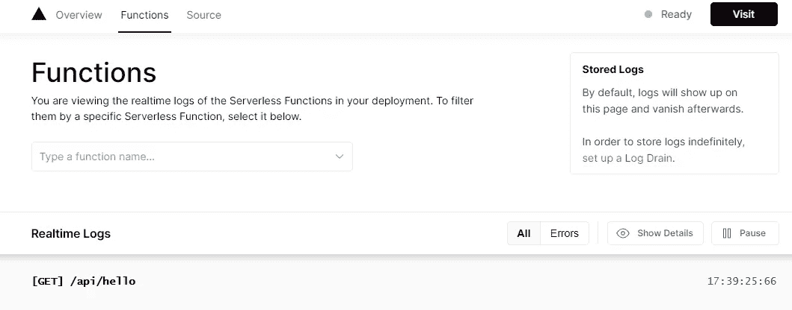
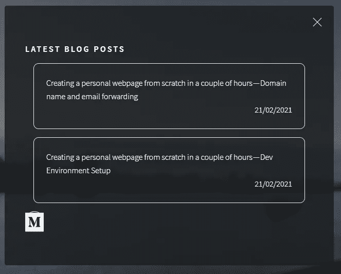

# Next.js +几个小时后的无服务器个人网页——用无服务器功能拉中型帖子(六)

> 原文：<https://levelup.gitconnected.com/next-js-serverless-personal-webpage-in-a-couple-of-hours-pull-medium-posts-w-serverless-func-6-65855599509d>

我想实现的是，当用户点击我网页上的“博客”按钮时，提供更无缝的体验。我想在我的网页上显示我最近在 Medium 上发表的文章列表，并让它们自动更新。


这是我为记录我在一个晚上建立个人网页的旅程而写的系列文章的第 6 部分:

[第 1 部分:开发环境设置](https://jeremy-chan.medium.com/creating-a-personal-webpage-from-scratch-in-2021-development-environment-part-1-b0b45396da00)
[第 2 部分:购买自己的域名并设置邮件转发](https://jeremy-chan.medium.com/creating-a-personal-webpage-from-scratch-in-a-couple-of-hours-getting-a-domain-name-and-email-73a462a4c183) [第 3 部分:用 Next.js](https://jeremy-chan.medium.com/next-js-serverless-personal-webpage-in-a-couple-of-hours-bootstrapping-the-app-with-next-js-b87d468f9cdc) [引导应用程序第 4 部分:用 Vercel](https://jeremy-chan.medium.com/next-js-serverless-personal-webpage-in-a-couple-of-hours-deploying-to-production-with-vercel-b35fe5daeaa7) [](https://jeremy-chan.medium.com/next-js-serverless-personal-webpage-in-a-couple-of-hours-deploying-to-production-with-vercel-b35fe5daeaa7) [部署到生产第 5 部分:将您的联系人表单与 Formspree](https://jeremy-chan.medium.com/next-js-serverless-personal-webpage-in-a-couple-of-hours-create-contact-form-with-formspree-5-cb6419f86917) [集成第 6 部分:用无服务器功能从媒体中提取博客文章](https://jeremy-chan.medium.com/next-js-serverless-personal-webpage-in-a-couple-of-hours-pull-medium-posts-w-serverless-func-6-65855599509d)(📍你在这里)

# **从媒体的 RSS 源提取数据(120 分钟)**

一种自然的方法是从媒体中提取数据，即使用他们的 REST API。经过一些研究，我得出结论，Medium 的 API 只提供创建发布的接口，不提供获取发布的接口。你可能会问为什么，但我猜一个显而易见的答案是，他们希望读者从他们的平台上阅读，而不是消费第三方服务的内容。

然而，Medium 确实提供了一个 RSS 提要，其中包含作者在 https://medium.com/feed/@author-handle[](https://medium.com/feed/@author-handle)**发表的文章的摘录。*这可以工作——我们只需要解析 RSS 提要(XML 格式)并用 JavaScript 格式化数据，对吗？。*

***CORS 问题***

*您可能想从客户端使用 JavaScript 发出一个 XHR 请求，从 Medium 的 RSS 端点检索数据。不幸的是，这将失败，因为来自中等 RSS 端点的响应不包括`Access-Control-Allow-Origin`头。所有现代的浏览器都尊重 CORS 政策，拒绝让 JavaScript 代码访问这些响应。*

***有什么解决办法吗？***

*一种选择是使用免费/公开的 CORS 代理[作为中间人，并将`Access-Control-Allow-Origin`添加到响应中。这种方法对代理提供商非常信任，你的网页现在也依赖于它的可用性。cors-anywhere 曾经是 Heroku 上的一个开放代理。](https://nordicapis.com/10-free-to-use-cors-proxies/)[从 2021 年 1 月起不再是这种情况](https://github.com/Rob--W/cors-anywhere/issues/301)。*

*这给我们带来了两个选择:*

1.  *运行我们自己的 CORS 代理*
2.  *使用无服务器功能设置 API 网关*

*在基础设施和成本方面，运行我们自己的 CORS 代理更加复杂。我选择第二个选项。对于无服务器功能，有几种选择，AWS lambda 是最流行的。然而，由于我们的部署已经存在于 Vercel 生态系统中，使用 Vercel 提供的无服务器功能也是有意义的。*

***让我们从 hello world 功能**开始*

*当你用`create-next-app`创建你的应用时，它已经在项目根目录的`/api`文件夹中给了你一个 hello world 函数的例子。默认情况下，`/api`下的任何函数都由 Vercel 自动托管并通过 HTTP 端点公开。*

*导航到[https://yourdomain.com/api/hello,](https://yourdomain.com/api/hello,)你应该会看到 JSON 的响应。*

*在 Vercel 上，导航到您的部署并转到 Functions。它显示无服务器功能的实时日志。*

**

***本地测试您的功能***

*虽然在 Vercel 上部署和测试很快。如果我们在开发时能够在本地测试无服务器功能，速度会更快。Vercel CLI 通过在 Vercel 上复制生产环境来提供此功能。通过运行以下命令安装 CLI:*

```
*npm i vercel*
```

*然后，通过以下方式启动本地开发服务器，而不是`npm run dev`:*

```
*npx vercel dev*
```

*它还使用`next dev`来监视项目目录中的变化，但是您现在也可以通过转到[http://localhost:3000/API/hello](http://localhost:3001/api/hello)来调用您的函数*

***在我们的函数中转储媒体 RSS 提要***

*让我们通过创建一个为我的账户[https://medium.com/feed/@jeremy-chan](https://medium.com/feed/@jeremy-chan)转储整个 RSS 提要的函数来做一个概念验证*

*首先，我们需要一些 http 客户端来触发来自无服务器功能的请求。我们将使用`axios`:*

```
*npm i --save axios*
```

*Vercel 将自动在`package.json`中为您的无服务器功能安装依赖项。*

*现在让我们编写一些代码来转储来自 RSS 提要的数据:*

*导航到[http://localhost:3000/API/medium](http://localhost:3001/api/medium)，您应该看到 XML 的内容被转储到 JSON 响应的`text`字段中。*

*尝试在 Vercel 上部署它，并观看它的实况。*

***将 XML 转换成 JSON***

*我们可以使用 xml2js 包将 XML 响应转换成 JSON。*

```
*npm i --save xml2js*
```

*修改上面的代码，将 XML 转换为 JSON，并在响应中返回。我们还从转换后的 JSON 中有选择地提取我们需要的信息，以保持我们的响应简洁明了。*

*再次点击您的 API，您应该会看到 RSS 提要被转换成 JSON 格式，如下所示:*

***显示网页内容***

*使用同一个域名下的 API 代理中等 RSS XML 并返回一个不错的 JSON，我们只需要将这些片段粘在一起，并使用 API 响应在我们的 UI 中呈现“Blog”组件。*

*这里，我们在组件的`useEffect`函数中调用 API。我们传递一个空数组`[]`作为函数的依赖，所以`useEffect`只在组件被渲染时运行一次。我们将从 API 获取的帖子保存到一个本地状态，并将其呈现到一个列表`<div>`中。*

*最终结果是这样的。有了无服务器功能，无论何时发布新帖子，网页都会保持同步。*

**

***结论***

*这个系列到此结束。我对自己在一个晚上学到的东西和取得的成就感到满意。我还对 Next.js 和 Vercel 为部署静态网页提供的愉快的开发人员体验印象深刻。*

*总花费时间:~4 小时
总费用:10
卡顿次数:0*

*[第 1 部分:开发环境设置](https://jeremy-chan.medium.com/creating-a-personal-webpage-from-scratch-in-2021-development-environment-part-1-b0b45396da00)
[第 2 部分:购买自己的域名并设置邮件转发](https://jeremy-chan.medium.com/creating-a-personal-webpage-from-scratch-in-a-couple-of-hours-getting-a-domain-name-and-email-73a462a4c183) [第 3 部分:用 Next.js](https://jeremy-chan.medium.com/next-js-serverless-personal-webpage-in-a-couple-of-hours-bootstrapping-the-app-with-next-js-b87d468f9cdc) [引导应用程序第 4 部分:用 Vercel](https://jeremy-chan.medium.com/next-js-serverless-personal-webpage-in-a-couple-of-hours-deploying-to-production-with-vercel-b35fe5daeaa7)
[部署到产品第 5 部分:将您的联系人表单与 Formspree](https://jeremy-chan.medium.com/next-js-serverless-personal-webpage-in-a-couple-of-hours-create-contact-form-with-formspree-5-cb6419f86917) [集成第 6 部分:用无服务器功能从媒体中提取博客文章](https://jeremy-chan.medium.com/next-js-serverless-personal-webpage-in-a-couple-of-hours-pull-medium-posts-w-serverless-func-6-65855599509d)*