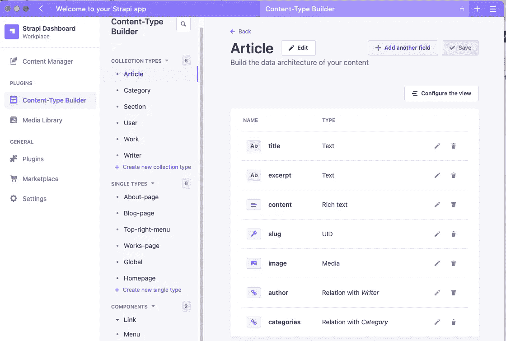
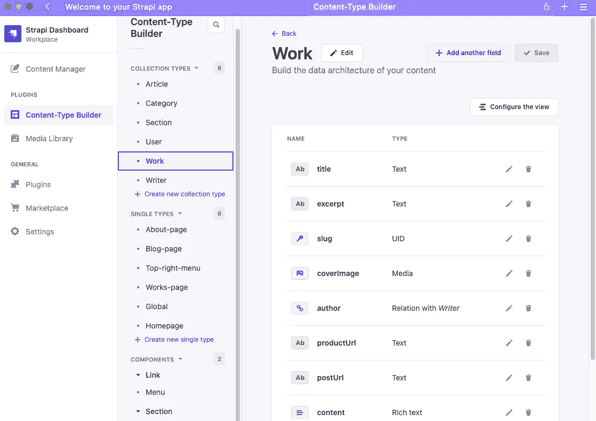

# [Next.js + Strapi]用 Next.js、TailwindCSS 和 Strapi V4 构建作品集网站)

> 原文：<https://levelup.gitconnected.com/next-js-strapi-build-my-portfolio-website-with-next-js-tailwindcss-and-strapi-v4-3f64d850554c>

## Next.js:客户端 appStrapi V4: CMS & Restful API。


使用 [Canva 创建图像。](https://www.canva.com/)

# 背景

## 项目(web 应用程序)是关于什么的？

我痴迷于将我的网站公开的想法，因为它是帮助我与人交流的有效工具。出于某种原因(也许我太懒了)，去年我用 [Ghost](https://ghost.org/) 建立了(某种程度上)我的网站。尽管我对漂亮的仪表板非常满意，它让我能够流畅、漂亮地创建内容。但是，作为一名全栈 web 开发人员，我觉得将应用程序开发“外包”给另一个平台是不合适的，所以我开始重新设计和重建我的网站，将 Next.js 作为客户端，将 Strapi V4 作为 CMS 和 Restful API 提供商。

## 项目是做什么的？

**~网站项目的章节(功能)**

*   博客
*   工程(项目)描述
*   个人职业简介


我的网站主页。[李冠仪](https://medium.com/u/9f2dc23bfffa?source=post_page-----3f64d850554c--------------------------------)截图。

# **技术堆栈和工具**

*   [Next.js](https://nextjs.org/docs/getting-started)
*   [尾翼 CSS](https://tailwindcss.com/)
*   [Strapi V4](https://strapi.io/)

**~文本编辑器**

*   终端+ Nvim

# 使用 Next.js 和 Strapi V4 构建全栈应用程序

让我向您介绍一下 Next.js、TailwindCSS 和 Strapi V4，以及我是如何在我的网站项目中实现它们的。

让我们首先将 Strapi V4 引入到我们的项目中，因为我们想先设置 api，并在本地环境中的 Postman 中测试它们。

# Strapi V4

> 加速现代数字体验的交付。Strapi 支持创建、管理内容丰富的体验，并将其展示给任何数字产品、渠道或设备。

## 我为什么选择 Strapi V4？有什么用？

以下是我的网站项目的需求:

*   我想轻松地创建/更新内容，包括博客帖子和我的作品描述页面，并有效地管理媒体文件。
*   我不需要处理多个作家的情况，因为我是唯一的作家，没有团队(至少现在没有)。
*   我需要在不超过两周内完成这个项目，因为我有我的启动项目工作。

我要么需要从头开始构建`Content Management System`要么利用现有的。此外，我没有足够的时间从头开始编写后端代码来创建 RestAPI，这将由客户端应用程序使用。Strapi 满足这两个要求。所以，我选择了它。

唯一的问题是，在我计划重建我的网站之前，我并不知道 Strapi。但幸运的是这并不难学。**边工作边学习。**

## 安装并运行 Strapi 应用程序

```
$ npx create-strapi-app@latest my-project
```

以下是我们的 Strapi 应用程序项目结构:


```
$ npm run development
```


去 [http://localhost:1337](http://localhost:1337/)


点击*打开管理*按钮


使用您的 Strapi 帐户登录

使用您的 Strapi 帐户登录(如果您还没有帐户，请创建一个帐户，只需输入您最喜欢的电子邮件和密码来创建一个帐户)，然后我们会看到我们的 Strapi 内容管理系统:


## 内容类型生成器

**第一步:创建一个新的集合类型**

点击*创建新的集合类型*按钮，创建新的集合类型(代表可重复项目)


我的文章收藏类型如下所示:


选择文章集合类型的字段:


在我的例子中，结果是这样的:



***解释*** *:* 在我的例子中，我为我的博客条目创建了文章的集合类型，为我的产品条目创建了工作，为我的博客文章创建了类别(因为我将在前端、后端、Docker、Vim、旅游等不同的领域创建一个博客。)，博客文章条目和产品条目的作者。因为我可能会邀请我的朋友写一些博客，或者与其他开发人员合作开发一些产品，所以我将作者视为一个集合类型，而不是单一类型。



**第二步:创建新的单一类型**

我有单一的类型，如主页(你可以给任何你喜欢的名字)，博客页面，作品页面和关于页面。

***解释:*** 集合类型为可重复项，而单个类型为不可重复项。我在我的网站上为不同的页面设置这些单一类型的原因是，我想为每个页面定制 SEO 信息，以防人们在社交媒体上共享不同的页面链接。稍后，我将分享我如何在 Next.js 应用程序的代码中实现 SEO。


在构建了集合类型和单个类型之后，现在开始填充将由

**第三步:创建一个新条目**

Strapi 是一个 CMS，允许我们轻松地创建条目。让我们创建我们的第一篇博文(文章)。打开内容管理器:


点击*创建新条目*按钮，创建我们的第一篇博文:


如您所见，这些字段——标题、摘录、内容、slug、图像——来自文章的集合类型。

因为我们的博客文章需要一张图片，所以让我们从媒体库上传媒体:


在 Strapi 仪表板中管理我们的媒体。由[李冠仪](https://medium.com/u/9f2dc23bfffa?source=post_page-----3f64d850554c--------------------------------)截图。

我们还需要为 Writer/Category 集合类型创建一个条目，因为博客文章也需要它们。


在 Strapi 仪表板中创建一个集合类型的 Writer。[李冠仪](https://medium.com/u/9f2dc23bfffa?source=post_page-----3f64d850554c--------------------------------)截图。


在 Strapi 仪表板中创建类别的集合类型。[李冠仪](https://medium.com/u/9f2dc23bfffa?source=post_page-----3f64d850554c--------------------------------)截图。

让我们为我们的第一篇博文创建一个条目:


在 Strapi 仪表板中创建一个条目。[李冠仪](https://medium.com/u/9f2dc23bfffa?source=post_page-----3f64d850554c--------------------------------)截图。

**第四步:保存/发布新条目。**

单击“保存”按钮会给您一个草稿版本。如果我们想要检索(发送一个 HTTP GET 请求)这篇文章，我必须发布它(只需单击 publish 按钮)。


在 Strapi 仪表板内起草一篇文章。[李冠仪](https://medium.com/u/9f2dc23bfffa?source=post_page-----3f64d850554c--------------------------------)截图。


在 Strapi 仪表板内发布一篇文章。[李冠仪](https://medium.com/u/9f2dc23bfffa?source=post_page-----3f64d850554c--------------------------------)截图。

**步骤 5:使用 Postman 测试 API**

让我们通过 Strapi 生成的 API 获取新创建的博客文章

对于我们创建的任何内容类型，Strapi 都会自动为我们创建 api 端点。例如，我们可以通过[http://localhost:1337/API/articles](http://localhost:1337/api/articles)获取文章


使用 Postman 测试 API 端点:/articles。[李冠仪](https://medium.com/u/9f2dc23bfffa?source=post_page-----3f64d850554c--------------------------------)截图。

为了细化结果，比如如果有多个条目，就对结果进行排序，或者填充一些字段数据)，您可以利用 [API 参数。](https://docs.strapi.io/developer-docs/latest/developer-resources/database-apis-reference/rest/api-parameters.html)


[http://localhost:1337/API/articles？sort[0]= published at % 3a desc&populate = categories&populate = image](http://localhost:1337/api/articles?sort[0]=publishedAt%3Adesc&populate=categories&populate=image)in Postman。[李冠仪](https://medium.com/u/9f2dc23bfffa?source=post_page-----3f64d850554c--------------------------------)截图。

你可以在 [Strapi 官方文档页面上找到关于 Rest API 的详细信息。](https://docs.strapi.io/developer-docs/latest/developer-resources/database-apis-reference/rest-api.html)

# 尾翼 CSS

> TailwindCSS 帮助您快速构建现代化网站，而无需离开您的 HTML。它是一个实用优先的 CSS 框架，包含了像`flex, and pt-4`这样的类，可以组合起来构建任何设计。

我选择 TailwindCSS 的原因是，它有助于我专注于工作，而不必费心编写单独的 CSS 文件。接下来，我们将讨论如何在 Next.js 应用程序中设置和实现 TailwindCSS。

# Next.js

*   创建 Next.js 应用程序

```
$ npx create-next-app my-nextjs-app
```

*   用 Next.js 安装 Tailwind CSS

```
$ cd my-nextjs-app
$ npm install -D tailwindcss postcss autoprefixer
$ npx tailwindcss init -p
```

*   在您的`tailwind.config.js`文件中配置模板路径


*   将顺风指令添加到 CSS 中


*   现在我们可以通过提供类名来使用 Tailwind


现在我们的 Next.js 项目结构如下所示:


[李冠仪](https://medium.com/u/9f2dc23bfffa?source=post_page-----3f64d850554c--------------------------------)截图。

*   在带有开发服务器的开发环境中运行 Next.js 应用程序(带有热加载特性)

```
$ npm run dev
```

*   或者在具有生产服务器的生产环境中运行应用程序(没有热加载功能)

```
$ npm run build
$ npm run start
```

*   创建应用程序页面并通过 Rest API 获取数据

在 Next.js 中，页面是 pages 目录中的 React 组件。每个页面都根据其文件名与一个路径相关联。我已经创建了一个关于页面，博客页面，和作品页面如下。


[李冠仪](https://medium.com/u/9f2dc23bfffa?source=post_page-----3f64d850554c--------------------------------)截图。

这是我的项目中`/pages/blog/index.js`的样子:


[李冠仪](https://medium.com/u/9f2dc23bfffa?source=post_page-----3f64d850554c--------------------------------)截图。

所有与 API 相关的异步函数都在一个单独的文件`/lib/api.js`中定义


[李冠仪](https://medium.com/u/9f2dc23bfffa?source=post_page-----3f64d850554c--------------------------------)截图。

我们通过从页面组件调用`getStaticProps`中的 API 来获取数据，因为 Next.js 将在构建时使用`getStaticProps.`返回的属性(在我们的例子中，这些属性包含来自 Rest API 的数据)来预呈现该页面。

数据将显示在网页上。并且我们可以从这个网址看到博客页面:[http://localhost:3001/blog](http://localhost:3001/blog)


我的网站的博客页面。[李冠仪](https://medium.com/u/9f2dc23bfffa?source=post_page-----3f64d850554c--------------------------------)截图。

如果试图打开其他不存在的页面，Next.js 的默认`404`页面就会出现(我们可以自定义这个错误页面)


404 页面默认构建在 Next.js 应用程序内部。截图者[李冠仪](https://medium.com/u/9f2dc23bfffa?source=post_page-----3f64d850554c--------------------------------)。

# 摘要

这篇文章简要介绍了使用 Next.js 和 Strapi V4 构建全栈 web 应用程序的开发过程。如果您不想处理数据库或使用 Django、Express、Spring boot 等框架构建 Rest API。，您可以简单地在 Strapi 中定义 Content-Type，让 Strapi 自动为您生成 api，就像我在这个项目中所做的那样。它节省了大量时间。特别是如果你的项目是博客网站或其他媒体网站，那么 Strapi 的 CMS 将会派上用场，它为你提供了一个很好的用户界面来编写、安排和发布内容，并为你管理多个内容作者。

虽然我在这个相对较小的博客网站上使用了 Next.js 和 Strapi V4，但是您可以将其应用扩展到其他有趣的项目。这两种技术都有非常好的文档，您可以在它们的网站上找到大量好的用例(如何在实际项目中实现它们)来帮助您快速入门。

一个软件项目只有在我们将它部署到托管服务并使其公开时才能有影响力。因此，在[的下一篇文章中，](https://amy-juan-li.medium.com/next-js-strapi-deploy-my-portfolio-website-to-vercel-and-digital-ocean-8011d5965038)我将向您介绍我是如何将前端和后端部署到两个独立的托管服务的——Vercel***(作为客户端的 Next.js 应用)和 DigitalOcean(作为后端的 Strapi V4 应用)。***

[](https://amy-juan-li.medium.com/next-js-strapi-deploy-my-portfolio-website-to-vercel-and-digital-ocean-8011d5965038) [## [Next.js + Strapi]将我的投资组合网站部署到 Vercel 和数字海洋

### Vercel for Next.js appStragpi V4 的数字海洋(DO)

amy-Juan-li.medium.com](https://amy-juan-li.medium.com/next-js-strapi-deploy-my-portfolio-website-to-vercel-and-digital-ocean-8011d5965038) 

*2023 年 2 月更新*

我已经用 wordpress 重建了我的个人网站。原因是我没有太多的时间来维护我的网站。我想在建立自己的创业软件业务的同时，专注于创造更有价值的内容。

但是我相信你可以从这篇关于技术栈的文章中学到一些有用的东西——next . js、TailwindCSS 和 Strapi V4——这是我的网站的早期版本所使用的。

以后我会用 Next.js 搭建一些其他有趣的项目，如果有兴趣，请关注我的 Medium。

[*如果你想在 Medium 上阅读来自*](https://medium.com/@amy-juan-li/membership) [*【李冠仪】*](https://medium.com/u/9f2dc23bfffa?source=post_page-----3f64d850554c--------------------------------) *以及成千上万其他作家的每一个故事，考虑成为 Medium 会员* *。每月 5 美元，你可以无限制地访问媒体内容。如果你通过我的链接* *注册，我会得到一点佣金。*

# 进一步阅读


[李冠仪](https://amyjuanli.medium.com/?source=post_page-----3f64d850554c--------------------------------)

## 网站开发

[View list](https://amyjuanli.medium.com/list/web-dev-db243e7bdf05?source=post_page-----3f64d850554c--------------------------------)6 stories

# **有用的来源和链接**

*   [Strapi V4 用户的 REST API 参考。](https://docs.strapi.io/developer-docs/latest/developer-resources/database-apis-reference/rest-api.html)
*   [next . js 中关于使用 TailwindCSS 的官方指南](https://tailwindcss.com/docs/guides/nextjs)
*   [next js 文档](https://nextjs.org/docs)