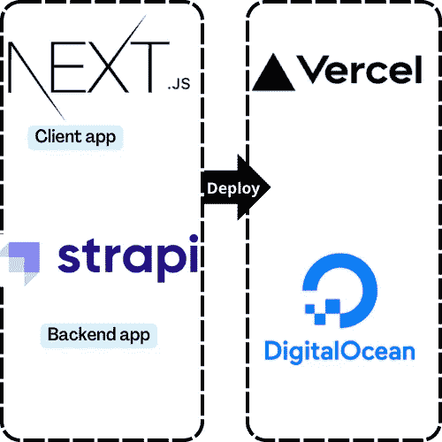
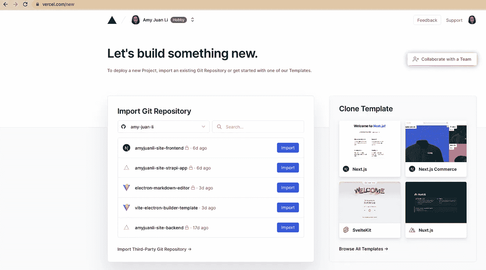

# [Next.js + Strapi]将 Portfolio 网站部署到 Vercel 和数字海洋

> 原文：<https://levelup.gitconnected.com/next-js-strapi-deploy-my-portfolio-website-to-vercel-and-digital-ocean-8011d5965038>

## 用 Vercel 部署客户端，用 Digital Ocean (DO)部署后端。

使用 [Canva 创建图像。](https://www.canva.com/)

# 背景

一旦我们在本地构建了我们的应用程序，就该部署它并将其公开了。

 [## [Next.js + Strapi]用 Next.js、TailwindCSS 和 Strapi V4 构建我的作品集网站)

### Next.js:客户端 appStrapi V4: CMS & Restful API。

amy-juan-li.medium.com](https://amy-juan-li.medium.com/next-js-strapi-build-my-portfolio-website-with-next-js-tailwindcss-and-strapi-v4-3f64d850554c) 

在这篇文章中，我将向您介绍为我的站点分别部署前端(Next.js 应用程序)到 [Vercel](https://vercel.com/) 和后端(Strapi v4 应用程序)到 [Digital Ocean (DO)](https://www.digitalocean.com/) 的过程。

# 第一部分:将前端(Next.js app)部署到 Vercel

## 选择 [Vercel](https://vercel.com/) 作为我们 Next.js 应用的托管服务

 [## 发展。预览。船。最佳前端团队- Vercel

### Vercel 将最好的开发人员体验与对最终用户性能的专注结合起来。我们的平台支持…

vercel.com](https://vercel.com/) 

与 DigitalOcean 相比，Vercel 部署 Next.js 应用程序相当简单(Vercel 也是 Next.js 的创建者)。那么为什么不是 Vercel 呢？

## 将 Next.js 应用程序部署到 Vercel 的步骤

首先将代码 repo(例如，来自 GitHub)连接到 Vercel，并按照说明一步一步地操作。

选择代码源。 [etup 的教程](https://medium.com/u/9f2dc23bfffa#setup-a-strapi-project-for-deploymentc)

**添加托管数据库:**[https://docs . strapi . io/developer-docs/latest/setup-deployment-guides/deployment/hosting-guides/digital ocean-app-platform . html # deploy-and-access-a-strapi-application](https://docs.strapi.io/developer-docs/latest/setup-deployment-guides/deployment/hosting-guides/digitalocean-app-platform.html#deploy-and-access-a-strapi-application)