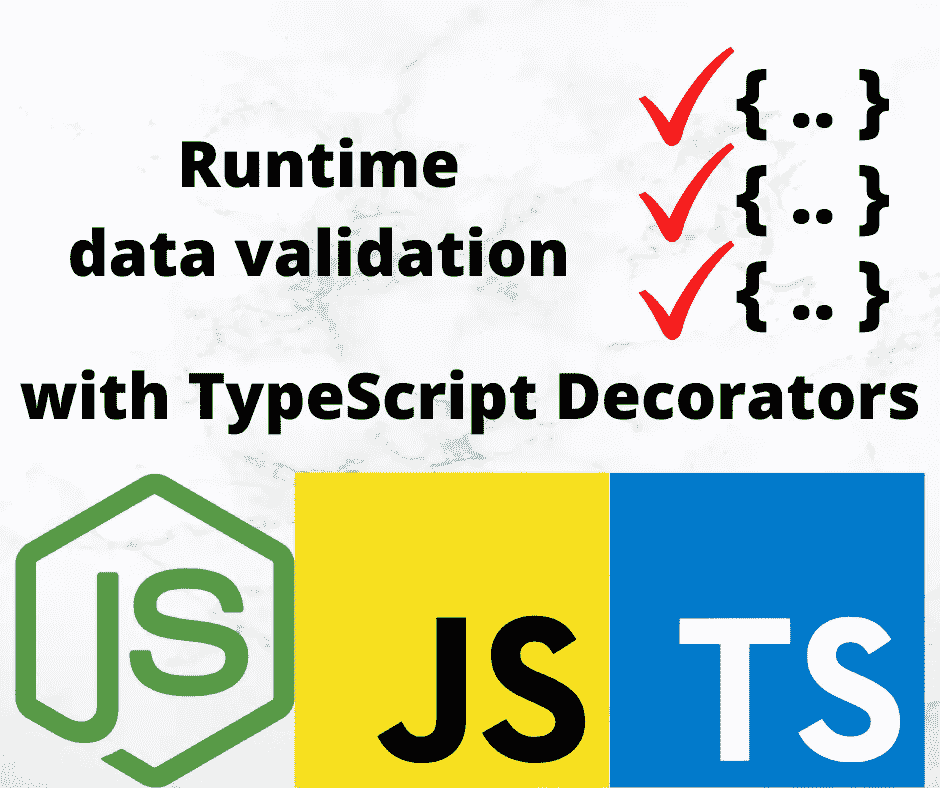

# 使用类和装饰器进行下一级 Typescript 运行时类型验证

> 原文：<https://levelup.gitconnected.com/next-level-your-typescript-runtime-type-validation-using-class-and-decorators-ddd2ce3c86f3>

本文旨在展示一种使用 Typescript 类和`class-validator`decorator 来验证数据的简单明了的方法。

TL；这里是的



# 第 1/2 部分。JSON 数据到类中

我们使用 JSON 对象在服务器和客户端应用程序之间，或者在本地节点项目中存储和传输数据。在 Typescript 中，有两种类型的对象。

*   **普通对象:**当我们试图使用 [JSON.parse()](https://www.geeksforgeeks.org/javascript-json-parse-method/) 方法解析 JSON 数据时，我们得到的是普通对象而不是类对象。
*   **Class(constructor)objects:**Class 对象是一个 Typescript 类的实例，它有自己定义的属性、构造函数和方法。

**示例:**

**数据 1:** 假设，我们在客户端定义了一个 Typescript 类:

```
class Todo {
    id: number;
    title: string;
    done: boolean;
    // some additional props or methods
}
```

**数据 2:** 我们在项目中本地存储了一个 JSON 对象:

```
const jsonData = {
  "id": 1,
  "title": "Upgrade typescript runtime validation with class decorators",
  "done": true,
}
```

上述 JSON 对象可以由服务器发送到网页或任何其他客户端应用程序。如果我们观察清楚了，JSON 对象的结构和 Typescript 类的结构是等价的，但是如果我们要为 JSON 对象访问 Todo 类的方法呢！我们有两种方法可以完成这项任务，使用 [Object](https://www.geeksforgeeks.org/javascript-objects/) 类的 **assign** 方法，这实质上是将 JSON 对象克隆到 Todo 类对象。另一种是使用**类转换器**工具，该工具用于将类型脚本对象转换成类对象。

## **方法一:** `Object.assign()`

首先，我们必须在我们的 TypeScript 文件中导入 JSON 对象，这可以通过使用 TypeScript 中的 **import** 关键字来完成，这将把 JSON 对象加载到 TypeScript 变量中。在我的例子中，我们将 JSON 文件存储在与我的 TypeScript 文件相同的目录中。然后，我们可以使用`Object.assign()`这个方法，它将返回一个 Todo 类对象，我们可以访问在 Todo 类中定义的方法。

**程序 1:**

```
const jsonData = {
  "id": 1,
  "title": "Upgrade typescript runtime validation with class decorators",
  "done": true,
}// Defining our Todo class
class Todo {
 userId: number;
 id: number;
 title: string;
 done: boolean;
}// Object.assign() will clone jsonData into
// Todo class object Storing the new class
// object in a typescript variable
let todoClass = Object.assign(new Todo(), jsonData);// Logging the output onto the console
console.log(newTodo);
```

输出:

```
Todo {
 id: 1,
 title: ‘Upgrade typescript runtime validation with class decorators’,
 done: true
}
```

## **方法 2:** 普通级(**变压器级)**

这里讨论的第一种方法对于简单的 JSON 对象来说既简单又有用，但是如果我们有一个具有复杂层次结构的对象或者一组复杂的 JSON 对象，事情可能会出错。为此，我们可以使用**类变压器**工具。在您的本地系统中，使用终端或命令窗口(取决于您的操作系统)执行以下命令。

*   **命令:****-g**标志用于全局安装。我们将使用 class-transformer 工具的 **plainToClass** 方法将我们的 JSON 对象转换成 TypeScript 类对象。

```
npm install -g class-transformer
```

这个方法有两个参数，第一个参数是 Todo 类的实例，第二个参数是从本地项目导入的 JSON 对象。首先，我们必须从我们的 TypeScript 文件中的 class-transformer 工具导入方法，以便 TypeScript 知道使用哪个方法。同样，我们将 JSON 文件存储在与 TypeScript 文件相同的目录中。

**程序:**

```
import { plainToClass } from "class-transformer";const jsonData = {
  "id": 1,
  "title": "Upgrade typescript runtime validation with class decorators",
  "done": true,
}// Defining our Todo class
class Todo {
 id: number;
 title: string;
 done: boolean;
}// plainToClass method will convert
// JSON data to Todo class object
// Storing the new class object in
// a typescript variable
let todoClass = plainToClass(Todo, jsonData);// Logging the output to the console
console.log(todoClass);
```

**输出:**

```
Todo {
  id: 1,
  title: 'Upgrade typescript runtime validation with class decorators',
  done: true
}
```

# 第 2/2 部分用类验证器装饰器进行验证

允许使用基于装饰和非装饰的验证。内部使用 [validator.js](https://github.com/chriso/validator.js) 执行验证。`[class-validator](https://www.npmjs.com/package/class-validator)`可在浏览器和 node.js 平台上运行。

我们需要添加那些装饰者

```
import { IsBoolean, IsNumber, IsString, validate } from "class-validator";class Todo {
  @IsNumber()
  id: number; @IsString()
  title: string; @IsBoolean()
  done: boolean;
}
```

然后

```
const jsonData = {
  "id": 1,
  "title": "Upgrade typescript runtime validation with class decorators",
  "done": false,
}
const convertedClass = plainToClass(Todo, jsonData);
console.log(convertedClass);validate(todoClass).then((errors) => {
  console.log(errors); // here handle errors such as logging, throwing, alerting
});
```

请随意查看 [**正式文档**](https://www.npmjs.com/package/class-validator) 了解更多特性，如值验证、嵌套验证、定制消息…等

## 延伸阅读:

*   [TypeScript 必备基础知识—类型别名和接口](/typescript-must-know-fundamentals-for-your-next-tech-interview-or-project-255ae70df0a3)
*   [像专家一样使用打字键盘](/use-typescript-keyof-like-a-pro-56f3a3d06b73)
*   [打字稿类——从零到英雄](/typescript-classes-from-zero-to-hero-a429a3c96189)
*   掌握类型脚本泛型:终极指南
*   打字技巧和提示:立刻成为专业人士
*   [TypeScript 中的泛型——愚蠢简化的基础知识](/generics-in-typescript-must-know-fundamentals-stupidly-simplified-e7b4d7ffc0e3)
*   [Typescript 遗漏了这一点，但你不应该—运行时类型验证](/typescript-missed-this-but-you-shouldnt-runtime-type-validation-aa8a81ce4289)
*   [Typescript 枚举陷阱和解决方案必须知道](/typescript-enum-pitfalls-and-solutions-must-know-bb971cb0f7d2)
*   [掌握类型脚本泛型—终极指南—基本接口技术](https://bootcamp.uxdesign.cc/mastering-typescript-generics-the-ultimate-guide-essential-interface-techniques-86e793cf1fc)
*   【Javascript 开发者经常忽略的 Typescript 特性
*   [掌握 TypeScript 中的交集和并集类型:终极指南和基本技术](/mastering-intersection-and-union-types-in-typescript-the-ultimate-guide-essential-techniques-49aa9f6a188a)

如果你觉得这个指南有帮助，请鼓掌并跟我来。通过[链接](https://medium.com/@caopengau/membership)加入 medium，获取我和所有其他优秀作家在 medium 上发表的所有优质文章。