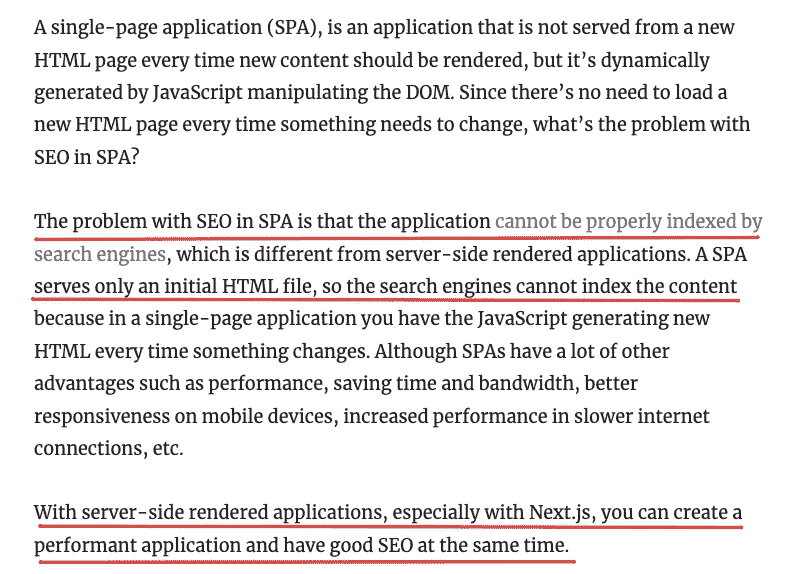
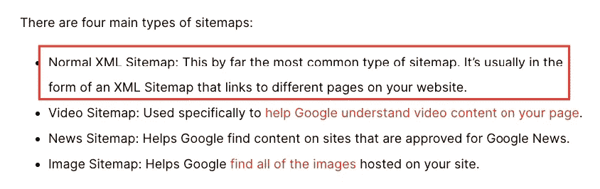
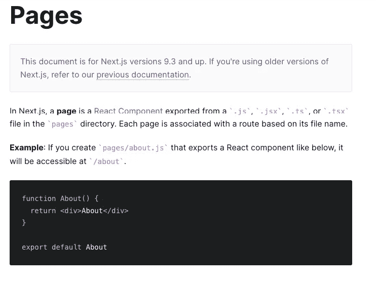
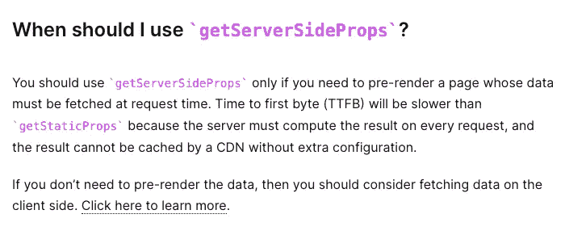

# 2022 年让你的 NextJS 网站更加 SEO 友好。轻松地添加一个自动更新的网站地图。

> 原文：<https://levelup.gitconnected.com/nextjs-dynamic-sitemap-2184b33bce2d>

## 网站地图是你向谷歌展示你关心它的爬虫的方式。


如果您已经选择使用 NextJS 开发下一个 javascript 网站，那么您可能已经考虑过使用 NextJS 比使用 plain React 带来的 SEO 好处。

如果你没有想到这一点，或者想知道 [NextJS 如何可能帮助你进行 SEO，这篇文章在某种程度上总结了这一点](https://blog.logrocket.com/how-next-js-can-help-improve-seo/)。



来源:[next js 如何帮助提高 SEO](https://blog.logrocket.com/how-next-js-can-help-improve-seo/)

因此，只要选择在 NextJS 中制作你的网站，你就已经在你的网站的潜在搜索排名上占了优势。

今天，我们将更进一步，看看如何通过添加一个站点地图来提高 NextJS 网站的搜索引擎友好性。我们将看看这样做到底有多简单和容易。

所以，让我们冲一杯新鲜的咖啡，然后开始吧。

# 首先，到底什么是网站地图？

简单地说，网站地图是一个易于遵循的网站蓝图。

它的主要好处是搜索引擎，因为它帮助搜索引擎爬虫做了几件不同的事情:

*   它告诉搜索引擎你网站上的哪些页面是最重要的，也就是说，哪些页面应该优先于其他页面。
*   它帮助搜索引擎查找、抓取和索引你网站上的所有内容。

把网站地图想象成浏览网站的路线图。

或者把它想象成一个建筑目录。

当你走进一座巨大的办公楼时，大厅里有一本方便的指南，告诉你哪些公司在大楼里有办公室。你会发现那些办公室在哪一层。有时，它甚至会告诉你，当你在任何一层楼下电梯到达你想去的办公室时，你应该向左转还是向右转。那很方便，不是吗？

网站地图正是如此。您网站上的各个页面是不同的办公室。你的网站，整体来说，就是办公楼。而你，访问者，在这种情况下，是谷歌搜索索引爬虫。

如果你想知道更多关于什么是网站地图，或者为什么你应该有一个网站地图，以及创建网站地图的不同方法，你可以[在 Backlinko](https://backlinko.com/hub/seo/sitemaps) 的这篇详细文章中阅读更多相关内容。

# 你需要网站地图吗？

在我们开始讨论如何为你的 NextJS 网站创建一个站点地图之前，让我们先快速解决你是否需要一个站点地图的问题。

严格来说，不需要。你的网站没有必要有一个网站地图。

今天的搜索引擎使用非常强大的网络爬虫来查找、索引甚至分类你的内容。所以，只要你网站上的网页链接正确，网络爬虫就能很容易地找到你的大部分内容，如果不是全部的话。

所以，如果你的网站没有网站地图，这不是一个交易破坏者。但是，这仍然是一个好主意。毕竟，如果你能引导搜索引擎以一种更好的方式浏览你的网站，为什么你不想要呢？拥有网站地图没有坏处，潜在的好处是巨大的。所以，让我们继续为我们的 NextJS 网站创建一个。

# 那么，如何在你的 NextJS 项目中创建一个站点地图呢？

如果你浏览了 Backlinko 的文章，你会注意到你可以为你的网站创建四种类型的站点地图。



不同种类的网站地图

至少，你应该有一个 XML 站点地图，对于大多数网站来说，这是唯一需要的站点地图。所以这正是我们要关注的。

解决了这个问题，让我们回到 NextJS。如果您正在使用 NextJS，那么您已经熟悉了页面的概念。您知道它们只是一种 React 组件，以及它们在应用程序路由方面的行为。



来源:[https://nextjs.org/docs/basic-features/pages](https://nextjs.org/docs/basic-features/pages)

从 backlinko 的文章中，我们知道我们希望我们的网站地图可以在[https://ourdomain.com/sitemap.xml](https://ourdomain.com/sitemap.xml)访问

因此，让我们继续在我们的 *Pages* 文件夹中创建一个新文件。我们将把它命名为 *sitemap.xml.jsx* ，这样就可以在我们需要的正确 URL 上访问它。

这是我们将放入 sitemap.xml.jsx 文件中的代码:

## 为什么这个组件返回 null？

因为我们不希望应用程序在这个组件中呈现任何内容。

## 这里使用 getServerSideProps 有什么关联？

当我们的站点地图 url 被点击时，我们希望我们的应用程序用*最新的*信息来响应，而这正是`getServerSideProps`允许我们做的。

> PS:请记住，当对 url 进行调用时，虽然会获取最新的数据，但是当客户端在页面上时，它不会更新数据。因此，如果您希望在项目中的其他地方使用它，请适当地使用它。

你可以在 NextJS 文档中的*数据获取*下了解更多信息。



来源:[https://nextjs . org/docs/basic-features/data-features # getserversideprops-server-side-rendering](https://nextjs.org/docs/basic-features/data-fetching#getserversideprops-server-side-rendering)

## 那么，这里发生了什么？

每当访问这个 URL(https://ourdomain.com/sitemap.xml)时，就会调用函数`getServerSideProps`，准备好站点地图，然后作为响应返回。

这正是我们希望我们的网站地图网址做的，以及我们希望它如何表现。这样，无论何时被访问，它都会将最新的站点地图返回给访问者(*，更重要的是，搜索引擎爬虫*)。

此外，我们正在设置标题类型，以清楚地表明这不是一个普通的页面，而是一个 XML 文件。

```
res.setHeader('Content-Type', 'text/xml');
```

# 实际创建网站地图

到目前为止，我们所做的一切都属于“*设置事情*”的范畴。我们已经确保一切都在正确的位置，并且正确的数据获取机制已经到位。

现在，是时候实际创建站点地图了。

我们希望“*网站地图创建*”过程是自动化的，这样我们就不需要每次在网站上添加新页面时都手动完成。

因此，让我们看看我们应该如何着手做这件事。

## 利用 NextJS 目录结构

我们已经知道 pages 目录包含 React 组件，这些组件自动成为我们网站上页面的 URL。

所以 about.jsx 可以在[https://ourdomain.com/about,](https://ourdomain.com/about,)访问，以此类推。

这是我们将要利用的行为，为我们的实际页面动态生成 URL。

## 照顾我们网站结构中的任何动态页面

有许多可能的场景，您可能会有大量动态生成的页面。

*   它们可能是博客帖子
*   它们可以是你在网站上销售的单个产品的产品页面

我们肯定希望搜索爬虫能够抓取和索引这些。所以它们都应该包含在站点地图中是有意义的。那么，我们该怎么做呢？

我们可以分两步完成:

*   第一步。数据提取

不管您考虑的是单个的博客文章还是产品页面，您可能已经使用了一系列 API 调用，这些调用获取了所有博客文章或产品的列表。我们可以在这里使用相同的 API。

*   第二步。正在生成 url

一旦我们在步骤#1 中获取了数据，使用它来创建这些博客文章或产品可以访问的 URL，只需简单地将它分配给正确的 URL 结构。

代码看起来会像这样:

## 仅添加我们的 pages 目录中的相关文件

好了，现在我们已经将所有的动态位添加到了我们的站点地图中，是时候加入静态位了。

我们将把页面目录中的每个文件都添加到我们的站点地图中。

但是等等！

1.  我们可能不想包含 sitemap.xml 文件——路由到我们的站点地图
2.  我们也不想把我们的 404.js 包含到我们的站点地图中
3.  我们希望我们的站点地图也忽略自定义页面，如 _app.js、_document.js，甚至我们的 api 文件夹。

因此，让我们编写代码来忽略这些，但是添加 pages 文件夹中存在的所有其他内容。

## 将所有这些放在一起创建最终的 sitemap.xml.js 文件

这是我们的 sitemap.xml.js 现在的样子:

就这样，我们为搜索引擎准备好了网站地图。

正如我们之前看到的，网站地图将在[https://ourdomain.com/sitemap.xml](https://ourdomain.com/sitemap.xml)开放

# 结论

创建一个网站地图，虽然不是强制性的，但对你的 SEO 有很大帮助。我肯定会推荐阅读我在故事前面链接的 backlinko 文章。但是，如果你不知道，这里有一些事情你应该知道，以充分利用你的网站地图:

*   一直都是。总是至少检查一次你的站点地图，以确保事情完全按照它们应该的方式进行。
*   你可以等待搜索引擎爬虫找到你的网站和站点地图。或者，你可以缩短等待时间，通过你的谷歌搜索控制台帐户手动提交你的网站地图给谷歌。*我绝对推荐至少这样做一次。它将帮助你了解谷歌如何看待或对待你网站上的不同页面。*
*   一旦谷歌成功地将它编入索引，你应该检查一下网站地图报告。你要留意任何错误、警告、排除等等。

基本上，你可以看看你的网站地图，和谷歌的网站地图处理报告，以确定你的网站通常会被索引的方式的问题。这将有助于你走在事情的前面，在这些问题对你的内容的可搜索性造成损害之前解决它们。

*   站点地图中的 URL 通常有一个“*最后修改时间*”字段。

我们刚刚编写的代码中没有，但这是最佳实践。这有助于向 Google 指示页面更新的时间和频率，以及需要重新索引。

除非您的内容发生了重大变化，否则更改更新日期从来都不是一个好主意。谷歌将任何此类琐碎的变化视为垃圾行为，你可能会因此受到惩罚。

就是这样。这就是全部了。除此之外，NextJS 在确保你的网站为 SEO 做好准备方面做得相当扎实，所以它在这方面帮了你。

# 2022 年你打算成为前端开发者吗？

> 去年，我决定学习编码。从那以后，我设计了无数的网站，集成了各种 API 以满足不同用例的需求，并构建了不同复杂度的系统。
> 
> 每个系统都不同。当他们需要时，我为他们设计后端的方式是不同的。
> 
> 不过有一点是始终如一的，那就是每一款车的前端都是用 Tailwind 打造的。

我正在把我学到的东西总结成一本初学者友好的书。它遵循了我所知道的对新开发人员来说最快、最简单和最有效的方法。我知道这一点，因为我遵循了我在书中概述的完全相同的方法。

如果你想得到这本书的提前版本，请给我发一封电子邮件。这本书包含几十个后续教程，我们将从一些最受欢迎和设计良好的网站上挑选组件进行设计。当你读完这本书的时候，你将能够立刻设计你遇到的任何网站。

提前获得这本书会让你在最终价格上节省 50%,并获得终身更新，以及一堆其他赠品。

[抓住它。😉](mailto:pirennesalvor@gmail.com)

今天到此为止。下次再见，保重！