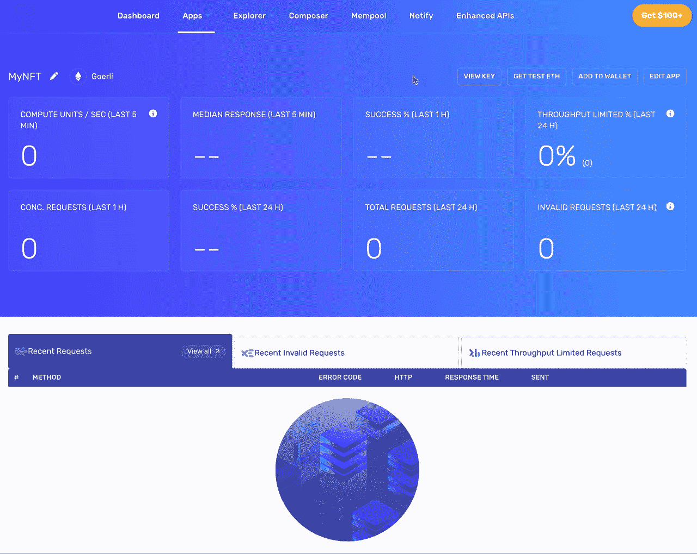
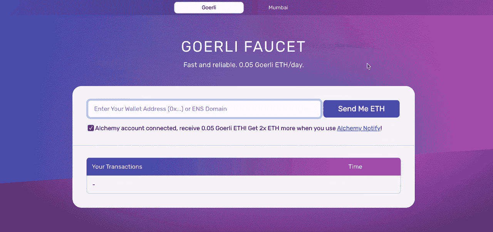
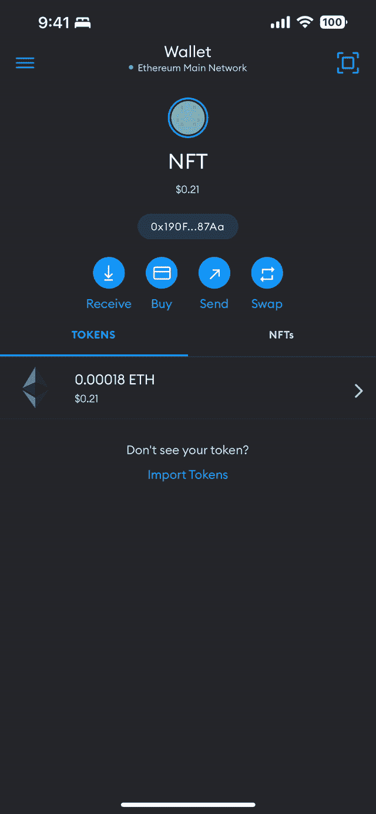
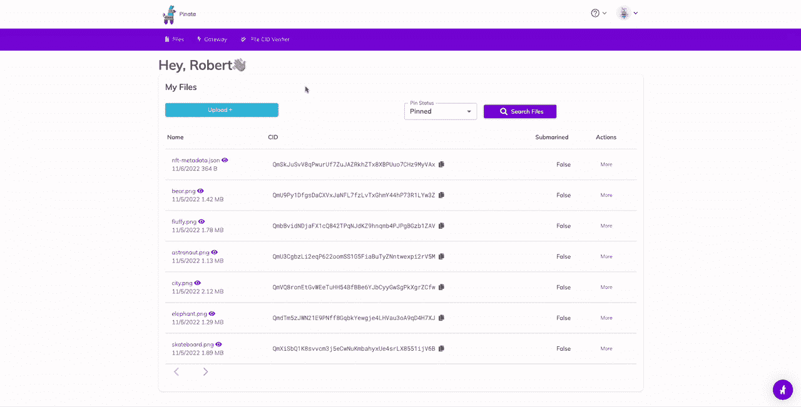
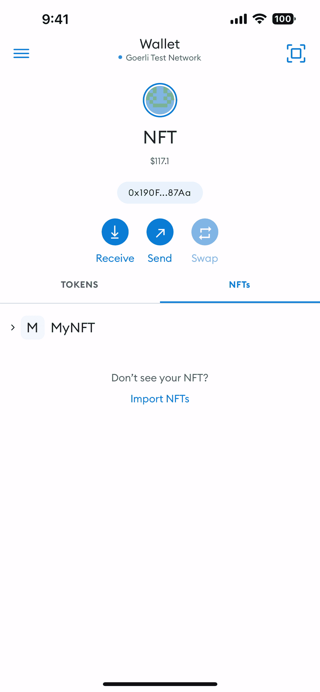

# NFT 发展速跑

> 原文：<https://levelup.gitconnected.com/nft-development-speedrun-8c64cdf77f6b>

以创纪录的速度在以太坊上部署 NFT 合同


从秘密的冬季胜利中出现，在天堂啜饮像素化的饮料( [bobbyg603](https://twitter.com/bobbyg603/status/1591846564414517248)

# 定义📖

*“术语‘加密冬天’指的是表现不佳的加密货币市场。这个术语类似于股市熊市。“加密冬天”的特点是负面情绪和各种数字货币的平均资产价值下降。”*——[——**迪克夏尔马**——](https://qr.ae/pvj8P2)

# 🥶的秘密冬季

现在是 2022 年 11 月，加密货币市场最近受到了重创。FTX 灾难占据了头条，许多新闻媒体再次宣布加密货币死亡。

尽管对加密货币的看法变得不乐观，但加密冬天是开发者和创造者投入新项目的最佳时机。“加密冬天”是指“快速致富”的人躲进他们的洞穴，而那些了解加密货币转型潜力的人开始寻找下一个大项目。

# 各就各位👟

在本教程中，我们将开发一套基本的 [Node.js](https://nodejs.org/en/) 工具，用于将 [NFT](https://en.wikipedia.org/wiki/Non-fungible_token) 合约部署到[以太坊](https://ethereum.org/)。我们将利用[炼金术](https://www.alchemy.com/)、[安全帽](https://hardhat.org/)和[皮纳塔](https://www.pinata.cloud/)来构建部署一个 [ERC-721](https://eips.ethereum.org/EIPS/eip-721) 令牌契约，可以在[元掩码](https://metamask.io/)钱包中查看。

这篇教程是从一篇[Ethereum.org 邮报](https://ethereum.org/en/developers/tutorials/how-to-write-and-deploy-an-nft/)上浓缩而来的，目的是聚焦于部署 NFT 背后的“如何”。如果你想了解这篇文章中各个步骤背后的“为什么”的更多信息，请查看[的原创博客文章](https://ethereum.org/en/developers/tutorials/how-to-write-and-deploy-an-nft/)或在下面留下评论。

本教程的配套报告可通过下面的链接获得。

[](https://github.com/bobbyg603/nft) [## GitHub - bobbyg603/nft: 🧑‍💻👾📱简单的 NFT 例子

### 使用炼金术，安全帽，元面具和皮纳塔将 NFT 部署到以太坊网络。此示例假设您有一个…

github.com](https://github.com/bobbyg603/nft) 

# 预备开始😬

在我们开发合同之前，我们需要熟悉工具。我们将使用 [Alchemy](https://www.alchemy.com/) 和 [alchemy-sdk-js](https://github.com/alchemyplatform/alchemy-sdk-js) 来构建与以太坊区块链交互的代码。 [Pinata](https://docs.pinata.cloud/what-can-i-learn-here/what-is-pinata) 是一个 [IPFS](https://ipfs.tech/) [固定服务](https://docs.ipfs.tech/how-to/work-with-pinning-services/#use-an-existing-pinning-service)，我们将使用它来为我们的 NFT 托管图像。 [Hardhat](https://hardhat.org/hardhat-runner/docs/getting-started#overview) 提供在以太坊上开发和测试智能合约的工具。 [Metamask](https://metamask.io/) 是一个加密钱包和区块链应用的网关。

在继续本教程之前，请创建一个炼金术帐户。通过使用此[链接](https://alchemy.com/?r=0e755050924e15d3)您可以免费开始，如果您决定在未来某个时候升级，我们都将获得平台积分。

此外，你需要创建一个 [Pinata](https://app.pinata.cloud/register) 账户，以便在[分散 IPFS 网络](https://docs.ipfs.tech/concepts/what-is-ipfs/#decentralization)上托管你的 NFT 的图像。

最后，您需要下载[元掩码](https://apps.apple.com/us/app/metamask/id1438144202)并导出您帐户的[公共地址](https://metamask.zendesk.com/hc/en-us/articles/360015289512-How-to-copy-your-MetaMask-account-public-address-)和[私有密钥](https://metamask.zendesk.com/hc/en-us/articles/360015289632-How-to-export-an-account-s-private-key)的副本。不要和任何人分享你的私处！

# 走吧。🚦

出门后，第一件事就是创建一个新的炼金术应用程序，确保选择 Goerli 测试网络。一旦我们创建了一个新的应用程序，我们需要复制 HTTPS API 的 URL。



获取 Alchemy HTTPS API URL

我们需要跨越的下一个障碍是在 Goerli 测试网络上获得一些 ETH。要获取您的 ETH 进行测试，请导航到 Alchemy 提供的 [Goerli 水龙头](https://goerlifaucet.com/)。



把你自己的 ETH 从 Goerli 水龙头送过来

点击应用顶部的**钱包**按钮，切换到 Metamask 中的 Goerli 测试网络，显示测试网络列表。确保您在之前的步骤中收到了来自水龙头的一些测试 ETH。



切换到格利测试网络

在您的桌面上，创建一个文件夹并初始化一个新的 Node.js 项目。

```
mkdir nft && cd nft && npm init
```

添加开发依赖项。

```
npm i --save-dev hardhat @nomiclabs/hardhat-ethers ethers@^5.0.0 ts-node typescript
```

添加生产依赖关系。

```
npm i @alch/alchemy-web3 @openzeppelin/contracts dotenv
```

创建一个新的安全帽项目。

```
npx hardhat
```

创建目录来存储`contracts`和`scripts`。

```
mkdir contracts scripts
```

在合同文件夹中创建`MyNFT.sol`。

NFT 合同可靠性代码

在项目的根目录下，创建一个`.env`文件来保存您的环境变量和秘密。不要将此文件签入源代码管理！

```
API_URL="https://eth-goerli.g.alchemy.com/v2/your-api-key"
PRIVATE_KEY="your-metamask-private-key"
PUBLIC_KEY="your-metamask-public-key"
```

在你的项目的根目录下，创建`hardhat.config.ts`。

安全帽配置文件

让我们起草我们的`MyNFT.sol`合同。

```
npx hardhat compile
```

在脚本文件夹中创建一个部署脚本`deploy.ts`。

NFT 部署脚本

运行您的部署脚本，将您编译的 MyNFT 契约部署到 Goerli 测试网络。复制您的合同部署地址。

```
npx hardhat --network goerli run scripts/deploy.ts

# Contract deployed to address: 0x4C5266cCc4b3F426965d2f51b6D910325a0E7650
```

我们的 NFT 将代表一件生成的艺术品，你可以自己生成一个图像(使用 [DALL-E 2](https://openai.com/dall-e-2/) 或者[稳定扩散](https://stability.ai/blog/stable-diffusion-public-release))或者你可以使用这篇文章的标题图像。

一旦选择了图像，将图像上传到 [Pinata](https://www.pinata.cloud/) 并复制文件的`CID`。



将您的 NFT 艺术上传到 Pinata

创建一个`nft-metadata.json`文件作为项目的根，用从上一步复制的`CID`替换`your-ipfs-image-CID`。将`nft-metadata.json`上传到 Pinata 并记下它的`CID`。

```
{
  "attributes": [
    {
      "trait_type": "Planet",
      "value": "Earth"
    }
  ],
  "description": "Astronaut enjoying a drink at a tropical resort.",
  "image": "ipfs://your-ipfs-image-CID",
  "name": "Captain Cook"
}
```

现在是时候铸造一个新的 NFT 了！让我们在脚本文件夹中创建`mint-nft.ts`。确保用之前步骤中复制的值替换`your-contract-address`和`your-ipfs-metadata-CID`的值。

NFT 铸造脚本

铸造你的 NFT！

```
npx ts-node scripts/mint-nft.ts
```

最后，将您的 NFT 添加到 Metamask，这样您就可以向您的朋友炫耀了。



将 NFT 添加到您的 Metamask 移动钱包中

# Mainnet🏙️

⚠️ *小心！创建一个新的 NFT 合同是昂贵的。写的时候交易费是 0* ***。*** *0267 ETH 或~ 30.52 美元。铸造一个 NFT 更便宜，大约需要 0.001 ETH 或者 1.50 美元。*

通过进行以下更改，您可以在以太坊主网上重复该过程:

*   将`.env`中的`API_URL`值替换为以太坊 Mainnet Alchemy App 的 HTTPS API URL。
*   将您的合同部署到以太坊主网

```
npx hardhat run scripts/deploy.ts
```

*   用新的 Mainnet 合同地址替换`scripts/mint-nft.ts`中的`contractAddress`值
*   铸造新的 NFT

```
npx ts-node scripts/mint-nft.ts
```

现在你在以太坊主网上有了一个 NFT，你可以像[那样将你的 Twitter 个人资料图片设置为六边形 NFT](https://help.twitter.com/en/using-twitter/twitter-blue-fragments-folder/nft#nftdeviceinstructions) 和[在](https://opensea.io/0x93D8f129Dca48771733abf0e286b13E8BD6d9bb6) [OpenSea](https://opensea.io/) 上显示你的 NFTs 。

# 恭喜你。🎉

您已经迈出了 NFT 发展之旅的第一步！如果你对 NFT 的项目有任何很酷的想法，或者不确定下一步去哪里，请在下面留下评论或者在推特上给我发消息——我很想听听你的下一个项目！

```
**Want to Connect?**

If you found the information in this tutorial useful please subscribe on [Medium](http://bobbyg603.medium.com), follow me on [Twitter](http://twitter.com/bobbyg603), and/or subscribe to my [YouTube](http://youtube.com/bobbyg603) channel.
```