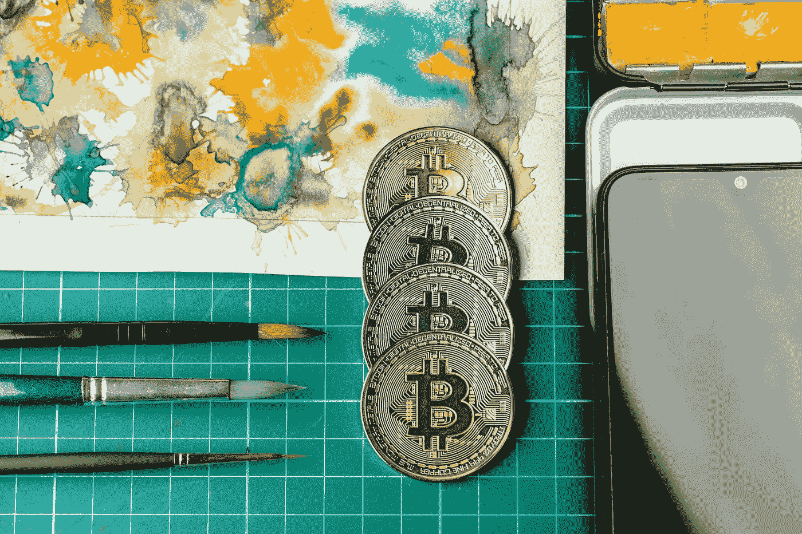
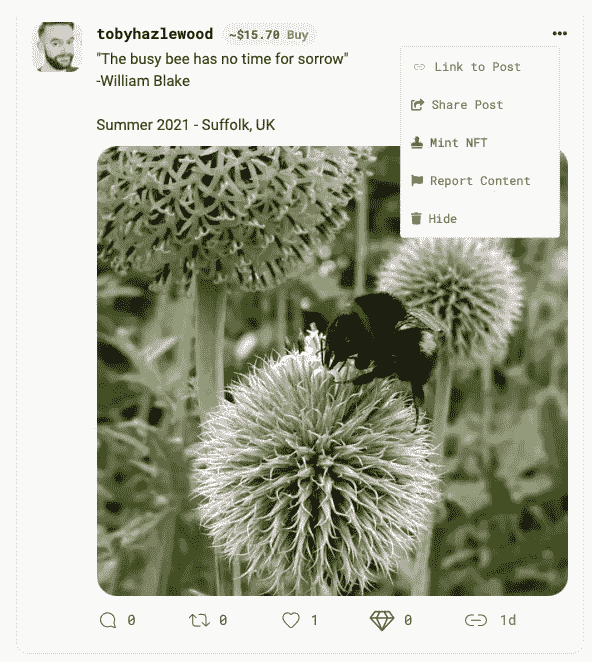

# NFT 热是真实的——以下是你今天可以参与的方式

> 原文：<https://levelup.gitconnected.com/nft-mania-is-real-heres-how-you-can-get-involved-today-f3ffec8cc439>

## 指导你如何做，而不是你是否应该做

图片来自 [Shutterstock](https://www.shutterstock.com/image-photo/crypto-art-transaction-set-new-way-1939270828)

在认识到市场的潜力方面，你很少能声称自己已经打败了加里·维纳查克——但在非技术密集型服务业中，我更愿意认为我是第一个。

他现在正在弥补失去的时间。通过他的 [VeeFriends NFT 项目](https://veefriends.com)，Gary Vee 加入了他自己独特的认可，这是一个我们应该注意的空间。

他的支持是 2021 年期间一长串事件中最新的一个，这些事件表明，非传统艺术市场正处于狂热之中，对艺术家、创作者和投资者来说都有巨大的潜力。

路透社报道称， [NFT 的销售额在 2021 年上半年飙升至 25 亿美元。这一年来，媒体上充斥着高调、高价值销售非专利技术的故事，以及名人、媒体人物和高调投资者加入 NFT 潮流的报道。](https://www.reuters.com/technology/nft-sales-volume-surges-25-bln-2021-first-half-2021-07-05/)

最近，NBA 球星斯蒂芬·库里也加入了投资 NFTs 的名人行列，他在一只无聊的猿 NFT 身上花了大约 18 万美元:

来源:[推特](https://twitter.com/lawmaster/status/1431520296872333313?s=20)

简而言之，NFT 市场现在非常火爆，2021 年的大部分时间都是如此。

你说什么？

**也许这一切都只是炒作？有可能，但考虑到所涉及的金钱和人员，我对此表示严重怀疑。
**也许这是一个即将破裂的泡沫？** —同样，可能但不一定如此。这是前所未有的时代。也许那些还没有涉足 NFT 的人已经错过了这个机会？** —对此，我说*绝对不是*。

如果你还没有参与到 NFTs 的世界中来，我想和你分享一些方法——你今天就可以这样做。

当然，我并不建议你这样做——就像任何有财务影响和后果的事情一样，我不建议你在没有做好自己的调查之前做任何事情。

如果你足够好奇，这篇文章总结了你*可以*参与非功能性测试的方式。如果你和我一样对非功能性测试感兴趣(现在仍然如此),那么这份指南将尽可能地关注实际情况，并详细列出一些你可以做的具体事情。

# 先决条件—购买一些加密货币

如果你已经持有一些加密货币，那么你可以跳过这一步。如果没有，请继续阅读。

想象一下参与 NFT 就像去外国度假一样——你不会在口袋里没有几欧元的情况下登陆德国，加密货币是 NFT 世界接受的货币。

在这个过程的这一点上，你只是改变你的钱进入市场，而不是真的花掉它。这仍然存在风险(因为加密货币的价值可以下跌也可以上涨)，但如果没有一点加密货币，你将无法在 NFT 做很多事情(如果有的话)。

根据我的经验，以太坊(ETH)是与 NFT 联系最紧密的加密货币。在某些情况下，比特币(BTC)也可能有用。

如果你还没有一些密码，也不知道如何使用，那么尽可能快速、简单和安全地使用密码的基本步骤如下:

1.  在[加密货币交易所](https://www.coinbase.com/join/hazlew_4d)创建账户——我推荐(并使用)[比特币基地](https://www.coinbase.com/join/hazlew_4d)。他们是最大的，公开上市的，随着规模和知名度而来的是安全性。您需要完成一些基本的注册活动，包括通过安全界面在线提交 ID。一个小时内就可以上线验证账号。
2.  为你的智能手机下载一个加密钱包——同样，我建议从使用[比特币基地钱包](https://wallet.coinbase.com)开始。它将安全地驻留在您的智能手机上，并允许您安全地发送和接收您的加密货币。
3.  使用借记卡或信用卡向您的比特币基地帐户中添加一些本国货币(美元、英镑、欧元或其他货币)。
4.  买一些 ETH。
5.  把那个 ETH 发到你的比特币基地钱包里。
6.  你准备好摇滚了。

如果你需要更深入的购买加密货币的指南，[看看我在 2021 年 1 月首次投资比特币后写的这篇指南](/the-exact-process-i-used-to-buy-my-first-bitcoin-in-under-an-hour-bee2df1ee001)。同样的过程适用于在比特币基地交易的所有加密货币(包括 ETH)。

你的钱包里有了一些 ETH，你现在准备好参与 NFTs 了。

# 买一幅 NFT，因为你喜欢艺术

NFT 进化成了一种保护数字作品独特性的手段，否则这些作品很容易被复制。有许多引人注目的例子，人们创造并出售 NFT 获得巨额资金，这可能是目前狂热的主要原因。

创造者争相铸造和出售 NFT，希望从中获利，而投资者购买 NFT，希望它们的价值会上升。

你可以参与其中的第一种方式是简单地购买一件你喜欢的艺术作品对应的 NFT，仅仅是因为你想拥有它并享受它。它们在交易所挂牌出售，比如 OpenSea，买家可以在这里与卖家互动。

[NBA Top Shot](https://nbatopshot.com) 已经成为今年 NFT 表现最好的项目之一。对于一个 NBA 球迷来说，我会认为拥有一台与他们最喜欢的 NBA 球星的数码视频相对应的 NFT 是一种荣誉和享受。你可以考虑投资一个这样的视频 NFT，作为拥有你特别欣赏的东西的一种方式，无论是主题*还是*本身就是一个 NFT。

我最近写了一篇文章，讨论由英国艺术家达明安·赫斯特发起的一项 NFT 实验，他发布了一系列 10，000 幅点画，每幅画都配有一幅 NFT。购买者可以选择拥有实体印刷品本身，或者与该系列中的一个相对应的 NFT。

我很想拥有一位如此著名的艺术家的原创作品，但却无法达到他过去的作品所要求的数百万的价格。在这个项目中，个别作品最初的价格是 2000 美元，我很高兴能有一件这样的作品挂在我桌子上方的墙上。

简而言之，也许你想购买并拥有一幅 NFT，仅仅是因为你把它当作一件艺术品来欣赏，不管它是否升值？你的回报是艺术本身的享受——如果你的投资增值，那就更好了。

# 买一个来交易

不可避免的是，目前 NFT 的狂热很大一部分是由那些投机性交易非金融交易并通过买卖赚取巨额利润的人推动的。看看这个例子:

来源:[推特](https://twitter.com/NFTLlama/status/1431493730578612224?s=20)

虽然我们不应该相信我们在 Twitter 上读到的所有东西，但不可否认的是，买卖非功能性交易可以获得巨大的利润。有史以来最著名的 NFT 项目之一是 crypto punk——一个 20 像素乘 20 像素的人物肖像的有限集合。最近的一篇文章列出了 10 个最赚钱的隐朋克销售，一个 1100 万美元的例子高居榜首。

当前狂热的美妙之处在于，我们仍处于“一切皆有可能”的阶段。我敢肯定，有一些策略可以用来识别那些 NFT 项目，这些项目是很好的投机性投资，可以在中短期内获得可观的利润。我还不具备这样的知识，现在我不愿意评论如何去做，或者它有多大的风险或潜在的回报。

我所知道的是，如果你有风险偏好和一些钱，如果事情出错，你可以承受损失，那么似乎很少有其他投机市场为机会主义投资者提供如此不成比例的上升空间。

虽然这不是我的包。如果是你的，小心行事。

# 创造(铸造)你自己的 NFT

继今年早些时候 Beeple 以 6900 万美元的价格出售了一辆 [NFT 之后，我第一次对 NFTs 产生了兴趣，并决定弄清楚如何铸造自己的车。我在媒体上分享了](/what-makes-a-digital-image-file-worth-69-million-4d49a9eabcb7)[我的“如何做”指南](/the-exact-process-i-used-to-create-and-sell-my-own-nft-art-on-the-ethereum-blockchain-698d9c59a2fe)，它已经成为我最近几个月最受欢迎的故事之一——也许是时代的标志？

创造 NFT 的过程(称为“铸造”)本质上就是在区块链上创造它的独特记录。不同的区块链上存在不同的 NFT 项目，但是该过程的目的是相同的——创建与原始创建相对应的 NFT(不可替换的令牌)。例如，在前面提到的达明安·赫斯特项目中，从 1 号到 10，000 号系列中的每幅画都有一个 NFT。

投机的创造者现在正在探索利用 NFT 来获利或仅仅是为了不可靠。无论哪种方式，如果 Twitter 值得信赖的话，可能性似乎是无穷无尽的:

来源:[推特](https://twitter.com/phon_ro/status/1433556938718019589?s=20)

铸造过程相当简单明了——类似于在易贝上列出一件待售商品。你需要出售的东西，一个销售平台上的帐户和你的帐户之间的一些集成，以确保项目的付款在销售时收到，项目本身被发送给买家。

我的铸造 NFT 指南将带你经历整个过程，从开始到结束，基于在 open sea(NFT 最大的公开交易所)铸造的 NFT I [。你只需要提供与 NFT 相对应的艺术作品或创作——可以是数字图像、音频文件、视频、动画、一段文字或其他任何东西。](https://opensea.io/collection/tzh-creations)

好消息是，你可以将 OpenSea 与你的比特币基地钱包无缝集成(如果你遵循了我上面购买和持有你的 ETH 的过程)。一旦铸造完成，你的 NFT 将保存在你的比特币基地钱包中，直到它被出售，届时你的钱包将收到你在瑞士联邦理工学院的销售收入，NFT 将从你的钱包转移到你的买家的钱包中。整个过程被无缝地处理，交易被不变地记录在区块链上。

更好的消息是，不像易贝销售，没有包装你的项目和跋涉到邮局。也不像易贝，如果你适当地设置了你的 NFT，你可以选择从未来的销售中获得版税或作为创作者的佣金，如果你的 NFT 在未来再次出售的话。

目前稍有不利的一面是，铸造一枚 NFT 的相关成本(以太坊上称之为“汽油费”)比平时要高。这反映了对资源需求的增加和目前围绕 NFTs 的狂热活动。

不幸的是，天然气费是这一过程的一部分，但区块链开发商正在努力寻找长期降低这一成本的解决方案。这个话题在[我的操作指南](/the-exact-process-i-used-to-create-and-sell-my-own-nft-art-on-the-ethereum-blockchain-698d9c59a2fe)中有广泛的介绍，但是要做好准备，在 ETH 花费相当于 50-150 美元以上在 OpenSea 上铸造你的 NFT。我的指南[中也介绍了降低这一成本的方法](/the-exact-process-i-used-to-create-and-sell-my-own-nft-art-on-the-ethereum-blockchain-698d9c59a2fe)。

如果你需要证明我遵循了自己的建议(或者想把你在 NFT 的第一笔投资变成 TZH 创作公司 NFT !),你也可以在 OpenSea 上查看我的 NFTs。)

# 发挥创造力

随着市场迅速成熟，许多人热衷于作为买家或收藏家参与进来，这是创作者参与和利用市场泡沫的大好时机。

但就像几年前亚马逊让作家可以自助出版并向世界推销电子书一样，进入门槛的降低意味着市场可能会充斥着垃圾。

从人群中脱颖而出的简单方法就是让你的作品尽可能的高质量。做一些值得出售的东西，让你感到自豪。

这似乎是一条微妙的路线，渴望创造高质量的艺术作品，但作为一个 NFT 是适销对路的。NFT 的部分遗产包括像前面提到的 CryptoPunks 这样的项目，它们为复杂性或独特的艺术价值设置了一个相当低的标准。然而这些东西一次就卖了几百万美元。

这种关于项目和创作的[相对艺术价值的争论一直存在。马克·罗斯科和杰森·布拉克的画受到一些人的崇敬，也受到一些人的嘲笑。对于非摇滚音乐来说，可能也是如此——你要么‘得到’了一个隐朋克的艺术价值，要么没有。](https://bettermarketing.pub/three-things-that-beeples-nft-reminds-us-about-making-and-selling-art-69f49f1e55b9)

那么简单的答案就是发挥创造力，不要太担心别人的想法。这也不仅仅是制作 JPEG 文件:

*   如果你是一个已经有作品收藏要出售的艺术家，考虑一下你如何[制作一系列 NFT 来出售这些收藏](/how-to-use-nft-technology-to-issue-a-limited-edition-run-of-digital-prints-d06575d1fc23)。
*   考虑你可能如何利用 [NFTs 来标记和推销你未来的潜力](/how-you-could-benefit-from-using-nfts-to-manage-your-career-e7cf0f8a6372)并使你的职业商品化。
*   NFT 可能是一种提供真实世界商品的合适方式吗，比如一幅画、一件雕塑，甚至是一栋待售的房子？这些项目已经在进行中。

这不仅仅是在 Photoshop 中快速拼凑出一些东西，然后在 OpenSea 上铸造出来(尽管那也可以！)

# 社交化

为了说明变化的速度，还有另一种新出现的方法来铸造你的第一个 NFT——我还没有完全探索过，但为了完整起见，似乎值得一提。

BitClout 是 Web 3.0 技术最大的新用途之一，社交网络使用区块链技术成为可能。各种媒体上的知名作家现在都出现在 BitClout 上，我也处于探索这个平台的早期阶段。

虽然该平台看起来(故意)很原始，但它提供了快速轻松地在社交媒体上发布帖子并将其作为 NFT 出售的功能，正如我最近的一篇 BitClout 帖子的截图中的下拉菜单所示:

截图来自[作者的 BitClout 页面](https://bitclout.com/u/tobyhazlewood)

BitClout 使用自己的本地加密货币($Clout)，通过在平台上发布和增值来赚取(由您的同伴用户认可，他们可以用您自己的令牌进行“交易”)。$Clout 也可以在使用比特币的平台上购买。

在 BitClout 上快速轻松地创建、购买和出售 NFT 的机会是存在的。这可能是一种革命性的方式，让 NFT 市场向更多人开放，并通过社交网络无缝融入我们的生活。

# 介入

尽管目前在非功能性测试上投入了大量资金，但这个市场确实还处于起步阶段。

作为区块链的一部分，它令人着迷，因为它提供了彻底改变创作者将作品带到世界并从中赚钱的方式的潜力。通过与艺术世界的交集，NFT 将把大量的人带入区块链的生态系统，这个生态系统以前是由技术专家和秘密投资者主导的。这也是一件非常好的事情。

试图跟上 NFT 领域的发展令人眼花缭乱，但也非常令人兴奋——新的平台和用例不断涌现，这在我看来是另一个重大利好。这表明仍有许多潜力未被发掘。

如果你对 NFT 的潜力持怀疑态度，或者担心会错失良机，那么我希望你已经被说服参与进来。

探索，调查，寻求理解。也许 NFT 热中也有你可以受益的东西？

注:*本文仅供参考。不应将其视为财务或法律建议。在做任何重大财务决定之前，先咨询财务专家。*

## [如果你喜欢这篇文章，我希望你能加入我的邮件列表。](http://bit.ly/TobyHazlewoodList)

如果你喜欢阅读这样的故事，并且愿意支持我和 Medium 上的其他作者，可以考虑注册成为 Medium 会员。一个月 5 美元，给你无限的故事。如果你注册使用我的链接，我会赚一小笔佣金。故事中的其他各种链接也是如此。

 [## 阅读托比·黑兹伍德(以及媒体上成千上万的其他作家)的每一个故事

### 作为一个媒体会员，你的会员费的一部分会给你阅读的作家，你可以完全接触到每一个故事…

tobyhazlewood.medium.com](https://tobyhazlewood.medium.com/membership)