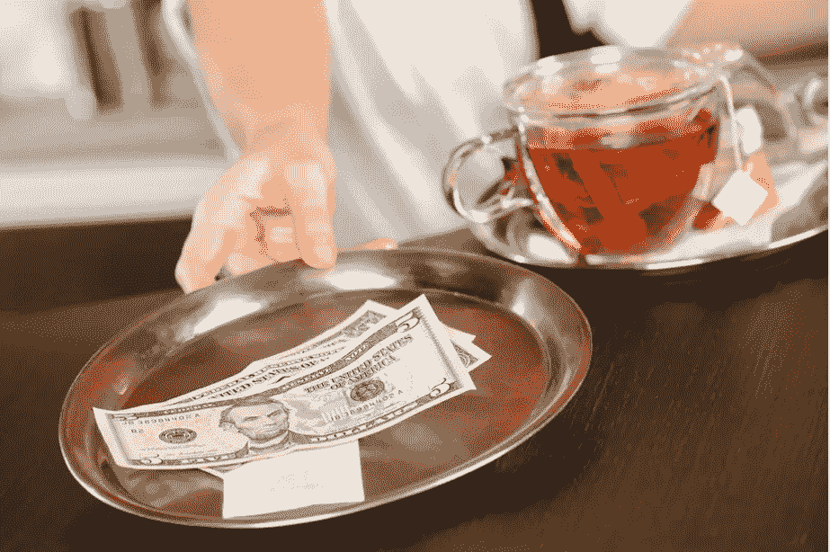
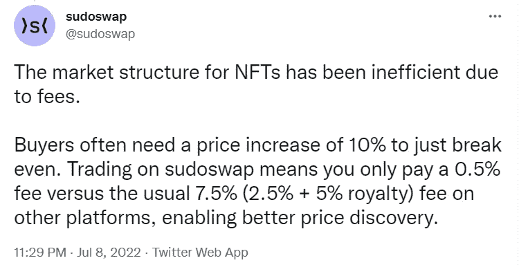

# NFT 版税可能会永远改变——完全分割 Web3

> 原文：<https://levelup.gitconnected.com/nft-royalties-mightve-changed-forever-completely-dividing-web3-caafd8cb3732>

[信用——Eater.com](https://www.eater.com/2018/3/22/17151172/tipping-laws-trump-budget-bill-pooling-minimum-wages)

2021 年 5 月我第一次进入 Web3 时，它的诱惑是创作者将永久获得版税。

太神奇了。

作为一个有才华的艺术家，你会在你一生的工作中，在你创作的每一件作品中看到财务上的好处，只要你能创造持续的需求。

旧制度已经完蛋了。

收藏家们会收藏一件作品很多年。最后，他们决定出售，在某些情况下，数百万美元。招揽生意的经纪人或拍卖行有时会收到高达 50%的销售费，剩下的利润归收藏家所有。

最初的创造者将一无所获。

与首次销售时一次性获利的实物票务或艺术品不同，NFTs 可以在每次二次销售时收取版税。

然后回到最初的创造者。永远。

# **还是呢？**

创作者版税是一个社会共识，而不是一个成熟的要求。类似于一些国家的小费文化。

当我回到南非的家乡或去美国参加 NFT 会议时，当地法律不要求我给提供服务的人小费。

如果有人给我很好的服务，我会给他们小费，这是社会公认的。或者，至少，他们会得到最终账单金额的 10%到 15%。

Web3 就是这样运作的。

获得创作者版税的过程并没有被硬编码到 NFT 的智能合同中。它是由出售 NFT 的市场商定和执行的。

感觉有点像狂野的西部。

像 Opensea、Looksrare 和 Magic Eden 这样的市场可以决定是否向创作者支付版税。

以上都是对创作者版税的尊重。

然而，一个市场完全取消了创作者版税，最终分割了 NFT 空间。

Sudoswap 可能会永远改变 NFT 的版税。

根据他们 7 月份在 Twitter 上的声明，在 Sudoswap 上交易意味着你只需支付 0.5%的费用，而在其他平台上通常需要支付 7.5% (2.5% + 5%的版税)，从而能够更好地发现价格。

[Credit — Sudoswap Twitter](https://twitter.com/sudoswap/status/1545535672240390145)

在费用最低的地方，NFT 短线交易者会为了一点点套利机会做任何事情。

常规交易者会通过进出项目和仓位来尝试和最大化利润。

具有讽刺意味的是，该项目的交易量和流失率越高，二次销售就越高，这对创作者版税量来说是健康的。

Sudoswap 正在解决一个更深刻的问题。

创作者版税太高，不可持续吗？

我的观点是，当市场活跃时，7.5%至 10%的典型版税可能足够了，但当市场下跌时，这是完全不可持续的。

我在 Twitter 上听到了一段有趣的对话，对话的对象是业内一位备受尊敬的思想领袖，他将 NFT 的数据与赌场中典型的“耙子”进行了比较。

赌场从玩家的赢款中抽取一部分，扑克玩家必须将其纳入策略中。

他引用数据称，典型的赌场费用在 2.5%到 10%之间

在赌场费用较低的地方，似乎有更多的赢家，当费用从 10%降至 6%时，更多赢家的数量相差 30%。

这些数据听起来很有趣。你不能否认 NFT 空间需要更多的赢家。

更多的创作者得到报酬，在我看来，不是像 Sudoswap 这样的零费用创造了，而是为了支持一个健康的交易经济而对较低费用价格的妥协。

> 以上都不是理财建议。我不是一个合格的财务顾问，尽管我尽了最大努力，我也无法预测未来。
> 
> **NFT 空间是有风险的。**
> 
> **专家称目前 99%的项目都将走向 0。**