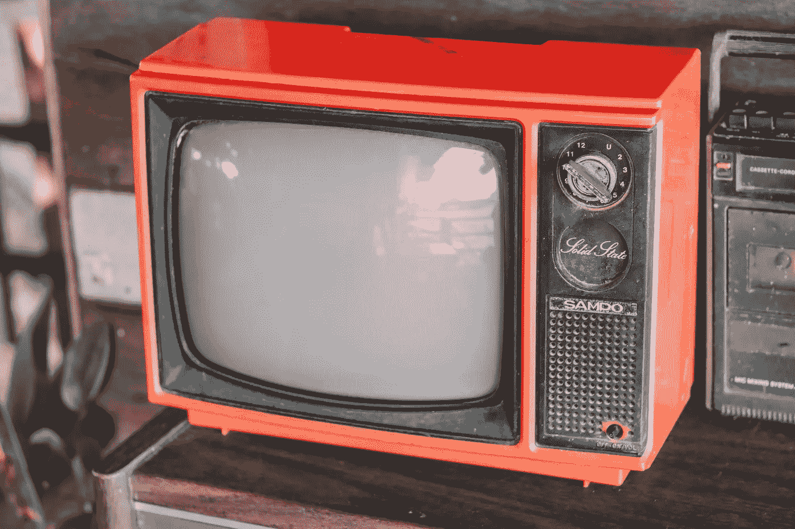
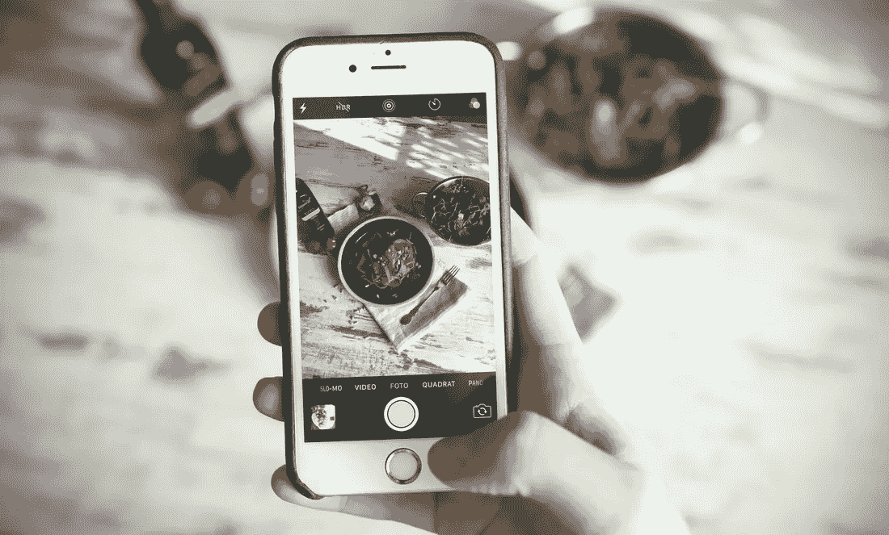

# NFTs——2022 年出现在你身边的电视屏幕上

> 原文：<https://levelup.gitconnected.com/nfts-coming-to-a-television-screen-near-you-in-2022-23d236fda098>

## 三星将 NFTs 在公众意识中向前推进了一步

戴夫·韦瑟罗尔在 [Unsplash](https://unsplash.com/s/photos/television?utm_source=unsplash&utm_medium=referral&utm_content=creditCopyText) 上拍摄的照片

去我祖父母家的最美好的回忆之一是从书架上拿出相册，翻看照片。我会想象 20 世纪 30 年代和 40 年代黑白照片背后的背景故事。我会嘲笑我父亲小时候的照片。我会寻找年轻时的照片，希望能重新点燃童年的快乐回忆。

当我的孩子探索我父母的相册时，我见证了同样的快乐。他们的一些快乐可能来自于同样让我开心的事情。有些也可能是因为新奇的价值；我们家明显缺少相册。

*和我这一代的许多人一样，尽管可以随时获得卓越的相机技术，但展示我们拍摄的照片的愿望和习惯似乎已经完全丧失了。*

我一直带着数码相机，内置在我的智能手机里——这是如今我们大多数人的常态。我的相机结合了尖端的镜头技术和各种各样的滤镜，共同确保照片的合理质量，尽管我缺乏摄影师的天赋。

我的最新作品——“我吃过的饭”(照片由 [Igor Miske](https://unsplash.com/@igormiske?utm_source=unsplash&utm_medium=referral&utm_content=creditCopyText) 在 [Unsplash](https://unsplash.com/s/photos/smartphone-food?utm_source=unsplash&utm_medium=referral&utm_content=creditCopyText) 上拍摄)

我拍的照片很少被打印出来，也很少被整理成相册挂在墙上欣赏或展示。他们更有可能在社交媒体上分享，或者保存在手机上，只是偶尔在手机屏幕上查看，以打发空闲时间。

直到最近，人们才能够在智能电视上以旋转幻灯片的形式显示照片。普通家庭中装饰许多房间的无处不在的电视屏幕现在可以很容易地用作相框来显示我们每个人定期捕捉的大量图片。

随着三星最近的声明，NFTs——在区块链计算机网络上被标记的数字图像(大部分)——也可以在智能电视上显示。

三星将在 2022 年为其三款智能电视带来 NFT 功能。

这些设备的所有者还将能够浏览 NFT 市场，购买、出售和交易非功能性交易——所有这些都通过内置在电视中的原生功能来实现。

理解这项创新的重要性需要对什么是 NFT 有一个基本的了解。如果你以前听过这句话，请阻止我…

# NFT 101 大楼

世界上某个地方的 NFT 车主可能已经把他们的 JPG 复制到他们的智能电视上进行显示——但这与三星在他们的新电视上所做的不太一样，或者至少这不是*他们正在做的所有事情。*

要理解他们创新的意义，需要在基础层面上对什么是非技术创新有一点理解和认识。

NFTs(如果你还没遇到过的话，它是不可替代令牌的简称)的特殊之处在于，它表明并认可了数字创作中的独特性和原创性，否则它们可能会很容易被复制和共享。

数字创作可以不受限制地复制，但总是有原创的——挑战在于如何识别和合法化第一个和原始的副本。

# 考虑传统艺术…

只有一幅真正的*蒙娜丽莎挂在巴黎的卢浮宫美术馆。*

一个有才华的艺术家可以尝试复制它，然后试图将他们的复制品冒充为原作。但真正的文章挂在一张防弹有机玻璃后面的墙上，由一名警惕的警卫看守，作为其原创性的“象征”。物理安全层进一步保护它。合法的复制品被大量生产出来，我们可以购买一个印刷品并享受其艺术性，但是这个复制品显然不是真的。

对于数字创作来说，这并不容易。

创作者可能会花很多时间运用他们的技能和艺术来完善一件数字艺术品，一旦发布(无论是出售还是免费在线发布)，它就很容易被复制。

*右键—保存图像—完成。*

NFTs 的核心目的是为一个数字作品创造一个独特的原创性标志，并永久不变地存储在区块链网络上。区块链从代币产生的那一刻(称为铸造的过程)开始跟踪代币的保管，直到所有后续的销售和所有权转让。令牌的持有者被确认为拥有原始项目，而不管将来有多少拷贝被取走或分发。

这对于数字作品的创作者来说具有概念上的吸引力和实际应用，无论他们制作的是图像、文本、音频、视频还是代码。他们可以为他们的每一件作品创造一个 NFT，这给了他们一种表示和识别原始“事物”的方式。它也给了创作者一种手段来限制获取，加强稀缺性，并最终将他们的作品卖给出价最高的人。

NFT 让数字艺术品的购买者可以做艺术品购买者和收藏者一直以来都在做的事情——能够夸耀和灵活地表明他们拥有作品的原始版本，而不仅仅是复制品。

我自己收藏的 CryptoSaint # 1996 嗯，是原作的复制品，但我也拥有它… [这是在开放海洋市场上的](https://opensea.io/assets/0x1b1cbf84f3833aa2dec981aef8c7bd2730f1223c/1996?ref=0x5c5321ae45550685308a405827575e3d6b4a84aa)

# 展示和讲解

艺术品与洗钱犯罪世界以及寻求避税的高净值个人有着长期而可疑的联系。2013 年[经济学家](https://www.economist.com/briefing/2013/11/23/uber-warehouses-for-the-ultra-rich)估计，多达 1000 亿美元的艺术品被安全存放在避税天堂日内瓦。

但是，除了艺术被用作储存财富的手段(非功能性艺术品也能很好地实现这一功能)之外，艺术的一个重要吸引力在于它的所有者能够欣赏它，并向他人展示它。

艺术收藏家和爱好者想要欣赏和欣赏作品，在欣赏它们的美丽的同时体验它们所唤起的情感。

艺术品收藏家也想炫耀他们拥有的艺术品。它满足多种目的(大多与自我相关):

*   他们可以享受拥有独一无二的东西带来的地位；
*   他们可以享受别人享受他们所拥有的东西；
*   展示它有助于建立其他想要购买它的人的欲望——这种欲望是赋予艺术价值的一部分。

# 这告诉我们，展示艺术品的方式几乎和艺术本身一样重要。

NFT 的所有者向其他人展示他们的收藏的选择通常被限制在要么把作品放在画廊里，放在 NFT 市场上，通过手机或笔记本电脑的屏幕，要么通过社交媒体平台分享它(或者更常见的是，它的副本)。许多人用他们的 NFT 作为个人资料图片或头像，就像这个人:

来源:[推特](https://twitter.com/apelicious55/status/1479093915810775047?s=20)

现在，三星给 NFT 收藏者提供了另一种选择——假设安装了软件更新，现代三星电视的数亿用户将可能能够在现有设备上显示 NFT。

选择新的三星电视(目前是他们的 MICRO LED、Neo QLED 和 Frame 型号)的买家将能够在屏幕上显示他们的收藏，正如他们的创造者所希望的那样。

三星的简报表明，他们的电视将使用智能校准功能自动调整设置。根据三星代表的说法，电视将调整设置“到创作者的预设值，所以你可以放心，你的作品看起来无可挑剔，具有真实的原始图像质量。”

考虑到许多 NFT(例如 OG 项目之一——crypto 朋克)极其简陋，仅仅是 24 x 24 像素的图像，这一点显得尤为重要。然而，其他的则极其丰富和复杂。

自适应显示功能也很重要，因为许多 NFT 要么是动画的，要么由于生成代码而随时间演变和改变，这意味着图像及其组成元素在不断变化。

最简单的例子就是公认的第一个也是最早的 NFT——凯文·麦考伊在 2014 年创造的[量子](https://blog.portion.io/the-history-of-nfts-how-they-got-started/):

来源:[推特](https://twitter.com/LuisRiCartoons/status/1440694865428242451?s=20)

在电视上展示这样的 NFT 可能会比在智能手机屏幕上展示更有影响力。

# 整合和聚合的市场

三星新产品的最高荣耀可能是与 NFT 市场的整合。

现在，NFT 买家可以去一些商业网站，如 OpenSea 或 Cent，为了看而浏览 NFT，或者买卖它们。交易过程相对简单，对区块链技术和加密货币有初步的了解。在许多方面，像 OpenSea 这样的网站相当于 NFTs 的易贝。

作为其新电视产品线的一部分，三星承诺将来自多个来源和网站的 NFT 聚合在一起，实现对它们的购买、销售和交易，但只在智能电视功能中进行。

# 每个家庭都有一个 NFT？

NFT 技术在三星电视中的出现可能代表着 NFT 进入一个全新的潜在收藏家群体意识的重要垫脚石，但这不是一个必然的结论。

当然，这款应用的存在并不能保证一定会被采用——例如，我自己的智能电视就集成了一款亚马逊 Prime TV 应用，但我没有像往常一样订阅，因此也没有使用它。即使杰夫·贝索斯给了我一个月的免费时间，我仍然会使用手机上的应用程序，并通过另一个设备将它上传到电视上。现有的技术不能保证它的使用。

但是，许多想要向访客展示他们收藏的 NFT 车主，很可能会在三星今年发布新设备时特意购买一台，只是为了成为早期用户之一。时间会证明这次发射有多成功，但是作为一种激起人们对 NFTs 的兴趣和认识的方式，这似乎是一个天才之举。

我会关注事态的发展。

*如果你喜欢阅读这样的故事，并且愿意支持 Medium 上的作家，考虑注册成为 Medium 会员。一个月 5 美元，给你无限的故事。如果你* [*用我的链接*](https://tobyhazlewood.medium.com/membership) *注册，我会赚一小笔佣金。*

 [## 通过我的推荐链接加入灵媒——托比·黑兹伍德

### 作为一个媒体会员，你的会员费的一部分会给你阅读的作家，你可以完全接触到每一个故事…

tobyhazlewood.medium.com](https://tobyhazlewood.medium.com/membership) 

注意:*本文仅供参考。不应将其视为财务或法律建议。在做任何重大财务决定之前，先咨询财务专家。*

## 如果你喜欢这篇文章，我希望你能加入我的电子邮件列表。