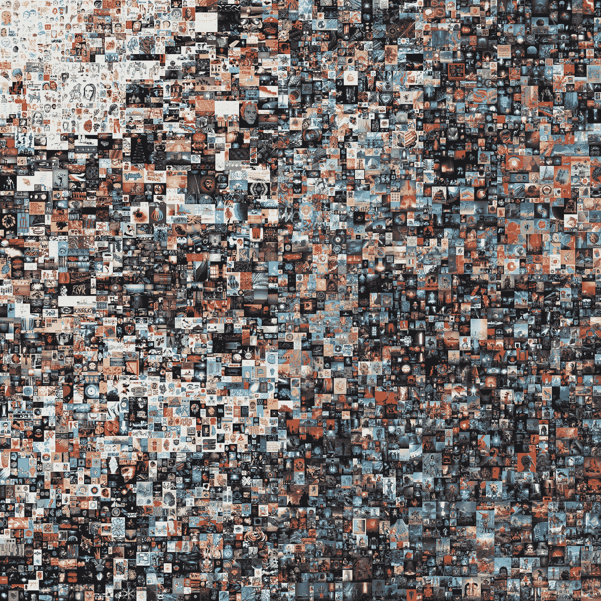

# NFTs 解释说:他们是什么，他们如何工作，他们的未来

> 原文：<https://levelup.gitconnected.com/nfts-explained-what-they-are-how-they-work-and-their-future-8808937d92b3>

## 探索不可替换令牌的特殊之处，为什么它们如此受欢迎，以及 NFT 的未来

最近几个月网络上到处都是 NFT。这篇文章的目标是理解 NFT 是如何工作的，它们实际上是什么，最后看看 NFT 的未来会是什么样子。

# 基础——区块链

在我们试图理解什么是 NFT 之前，我们需要清楚区块链是如何工作的。区块链的目标是允许数字信息被记录和分发，但不能被编辑。

照片由 [CHUTTERSNAP](https://unsplash.com/@chuttersnap?utm_source=medium&utm_medium=referral) 在 [Unsplash](https://unsplash.com?utm_source=medium&utm_medium=referral) 上拍摄

区块链就像一个数据库，存储着大量的数据。它的特别之处在于这些数据块是链接在一起的——因此得名区块链。

每个块中的数据可能彼此没有关系，但是相邻的块以及它们的创建顺序非常重要。非常简单地说，每个块都链接到相邻块中的数据。因此，如果您更改单个块中的数据，整个区块链中的数据将会无效。这使得区块链是不可变的(一旦你在区块链中添加了一个块，你就不能修改它了),而这个属性正是它的特别之处。

普通数据库存储在中央服务器上，有权访问它的人可以修改数据。而区块链分布在世界各地，数据不属于单个个人或实体。区块链网络上的每个节点都有一份完整的数据记录，从一开始就存储在其中。

因此，如果有人想篡改区块链中的数据，首先他们必须验证所有无效的块，这需要合理的计算能力。接下来，他们必须为世界上 51%的拥有区块链副本的节点执行此操作，这几乎是不可能的。

现在，在我们理解 NFTs 之前，让我们看看什么是令牌。

# 加密令牌

加密令牌广泛代表一种特定的可替代和可交易的资产或在区块链上常见的[初始硬币发行](https://en.wikipedia.org/wiki/Initial_coin_offering) (ICO)上创建的公用事业。

Pierre Borthiry 在 [Unsplash](https://unsplash.com?utm_source=medium&utm_medium=referral) 上拍摄的照片

在加密货币中，代币是由区块链生成的硬币，它们在开始时就在上面，并在 ICO 期间分发。但是加密令牌可以代表任何资产或工具，并且可以用作任何东西的虚拟替代品。

区块链由于其不变性，保证了这些令牌的所有权。所有权的转移也是在区块链安全完成的。以太坊网络引入了智能合约或分散应用的概念，允许其用户创建令牌和可编程的自动执行代码，用于管理区块链上发生的各种交易。

现在让我们理解什么是不可替换的令牌。

# 不可替换的令牌

不可替换的令牌或 NFT 是区块链上的一个数据单位，其中每个 NFT 代表一个唯一的数字项。

如果某样东西可以被一个相似的项目替代或交换，我们就说它是可替代的。例如，货币是可替代的。相同面额的流通券具有相同的价值，可以互相兑换。加密货币也是可替代的。

但是 NFT 代表一种独特的数字物品，它可能具有不同的货币价值。因此它不可互换。我不能用一个 NFT 来换取另一个 NFT，仅仅因为它们指向两个不同的项目，每个项目都有自己的价值。

NFTs 可以用来表示任何独特的数字项目，如图像、音频、视频、视频游戏中的收藏品以及任何其他形式的创造性作品。

## 创建 NFT

创建 NFT 非常简单。现在假设你创作了一幅数码画，想把它作为 NFT 作品出售。首先要做的是选择你想要出售的区块链——以太坊是最受欢迎的。

一些受欢迎的以太坊 NFT 市场有 [OpenSea](https://opensea.io/) 、 [Rarible](https://rarible.com/) 和 [Mintable](https://mintable.app/) 。大多数 NFT 都是使用一个被称为 [ERC-721](https://ethereum.org/en/developers/docs/standards/tokens/erc-721/) 的一致标准构建的。这些市场只是这个标准的一个实现，并把你的 NFT 添加到以太坊区块链。

接下来你可以上传你的画到某个地方，比如 google drive 或者[星际文件系统](https://en.wikipedia.org/wiki/InterPlanetary_File_System)(IPFS)——这是一个分布式文件系统。然后你去其中一个市场创建一个新的 NFT——在那里你需要连接你的以太坊钱包(就像 [Metamask](https://metamask.io/) )并填写一些细节，比如你作品的名称和描述。

最后，你的 NFT 需要铸造。这意味着在以太坊区块链上添加一个区块，表明您创建的 NFT 属于您的帐户。这个动作需要修改区块链，因此花费了一些“汽油”。汽油基本上是修改区块链的服务费，通常很便宜。所以在 NFT 市场上列出你的作品并不是免费的——它需要一些钱。

完成后，您对 NFT 的所有权将添加到区块链中，任何人都可以验证它，并购买您的作品。

# 但是是什么让一幅 NFT 价值 6930 万美元呢？

[皮普尔](https://www.beeple-crap.com/)(迈克·温克尔曼)以 6930 万美元的价格出售了他的作品《每一天:第一个 5000 天》、《T7》中的 NFT。这是他自 2007 年 5 月 1 日以来前 5000 天创作的所有艺术作品的拼贴画。他一天也没有错过。

来源—[https://onlineonly.christies.com/s/beeple-first-5000-days/](https://onlineonly.christies.com/s/beeple-first-5000-days/)

所以这意味着，谁拥有这幅 NFT，谁就拥有了原作。但是他们没有版权。人们仍然有权利做他想做的事。他的作品遍布互联网，任何人都可以看到或下载。那么所有权到底意味着什么呢？

当你拥有一件数字艺术作品的 NFT 时，这意味着你拥有该艺术家制作的原始拷贝。别人复制或者下载都无所谓，真实的东西归你所有。它被每个人接受，这是由造物主签署的，并永久保存在区块链上。他们能够证明它的所有权，每个人都同意，因为它在区块链，任何人都可以验证。

把它想象成拥有一幅很久以前一位著名艺术家的稀有画作。它可以陈列在博物馆里，供人们观赏或拍照。人们甚至可以复制它。但是原件会留在你身边，永远保持它的价值。

它还有一个社区方面。价值是由整个社会决定和认同的。人们购买 NFT 是期望它的价值在未来会上升，这只有在其他人发现它在未来有价值的情况下才会发生。所以这与艺术家、他们的名声和工作有关。但就连皮普尔也承认，现在的情况有点疯狂，整个事情可能是一个泡沫。

# NFTs 的未来

在这一节中，我想讨论 NFTs 的当前和潜在用例。

*   数字内容—这是现在最流行的一种使用情形。它允许艺术家直接销售给他们的观众，没有任何中间人。它还允许人们非常容易地支持他们喜爱的艺术家。
*   游戏——目前，玩家购买的游戏资产存储在游戏服务器上。如果他们因为某种原因关闭了游戏，你所有的资产都会随之消失。但通过创建游戏内资产作为 NFT，玩家拥有完全的所有权。他们可以把它卖成真钱，在其他市场上交换，甚至在其他游戏中使用。
*   物理物品——在未来，NFTs 可以用来拥有物理物品，如一辆汽车或一块土地。甚至可能使用 NFTs 作为抵押品，或文件验证。想象一下 NFT 护照。时装业也在探索 NFT 来销售独特的服装。
*   专利和知识产权——人们可以利用非专利技术很容易地获得技术和发现的专利。

## 环境冲击

所有的好东西都是有代价的，一般来说，区块链是能源密集型的，因为需要持续不断的采矿过程来维持。采矿是必要的，以确保区块链保持分散和可信。

所以碳足迹不一定是因为 NFTs。这是因为它是基于区块链技术。如果有一种新技术可以保证安全、信任并且是去中心化的，那么 NFTs 的概念可以很容易地应用到那个平台上。

以太坊目前正在经历一系列升级，称为 Eth2，将用一种称为打桩的新流程取代采矿流程。这将消除作为安全机制的计算能力，并将以太坊的碳足迹减少约 99.98%1。在这个世界里，利益相关者投入资金而不是计算能力来保护网络。他们已经开始这样做了，它被称为[信标链](https://ethereum.org/en/eth2/beacon-chain/)，预计将在 2022 年与目前的区块链合并。

希望这篇文章有助于理解这个疯狂的非功能性测试的世界，甚至可以解释为什么它如此受欢迎。

在 [Twitter](https://twitter.com/adarsh_menon_) 、 [LinkedIn](https://www.linkedin.com/in/adarsh-menon-/) 上与我联系，并查看我的 [YouTube 频道](https://youtube.com/adarshmenon)。

参考资料及延伸阅读:
[https://ethereum.org/en/nft/#environmental-impact-nfts](https://ethereum.org/en/nft/#environmental-impact-nfts)
[https://en.wikipedia.org/wiki/Cryptocurrency](https://en.wikipedia.org/wiki/Cryptocurrency)
[https://en.wikipedia.org/wiki/Non-fungible_token](https://en.wikipedia.org/wiki/Non-fungible_token)
[https://level up . git connected . com/what-makes-a-digital-image-file-worth-6900 万-4d 49 a9 eabcb 7](/what-makes-a-digital-image-file-worth-69-million-4d49a9eabcb7)
[https://www.investopedia.com/terms/c/crypto-token.asp](https://www.investopedia.com/terms/c/crypto-token.asp)
[https://medium . com/@ medipedia/the-variable-type-of-crypto-tokens](https://medium.com/@medipedia/the-various-types-of-crypto-tokens-26bab8f6622c)