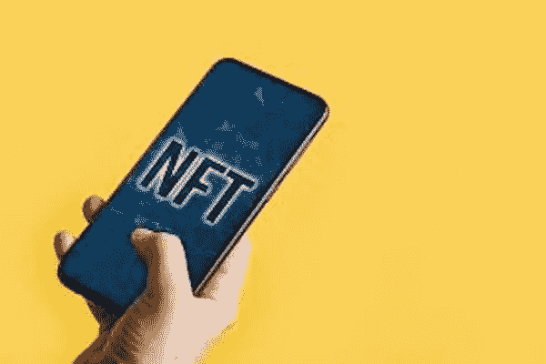
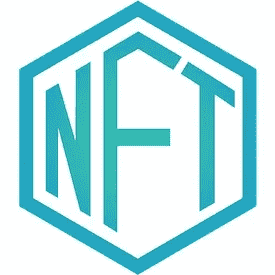

# 非伪造代币推动数字艺术繁荣

> 原文：<https://levelup.gitconnected.com/nfts-nonfungible-tokens-propel-boom-in-digital-art-d8e77fe1c8b2>

NFTs 图片来源: [Marco Verch](https://www.flickr.com/photos/30478819@N08/) 根据[知识共享](https://creativecommons.org/licenses/by/2.0/)

NFT，或者说[不可伪造的](https://www.investopedia.com/terms/f/fungibility.asp)代币，已经成为头条新闻，因为它们在艺术界和其他领域引起了混乱。2021 年 2 月，Nyan 猫视频 meme 的 NFT 售价超过 50 万美元。后来，一位买家以 20.8 万美元的价格买下了勒布朗·詹姆斯·NFT，展示了这位明星运动员扣篮的视频剪辑。2021 年 3 月，随着佳士得艺术拍卖行以 6930 万美元的价格出售一幅数字拼贴画，NFTs 真正成为人们关注的焦点。

NFT 的爆炸为艺术家、音乐家、消费者、投资者和其他数字创作者创造了新的机会。主流吸引力的激增既创造了有前途的创新，也产生了新的问题。

## **NFTs:概述**

不可实现意味着不可互换。因此，这些令牌代表独特的数字资产。一个人不能把一个换成同等价值的东西。例如，一幅梵高的画或一个体育比赛中特定时刻的视频剪辑都是独一无二的，不可互换。

图片来源: [NFT 妇幼保健+](https://medium.com/mchplus/announcement-nft-icon-is-available-for-everyone-a6bd4cae2b71?) 根据[知识共享](https://creativecommons.org/licenses/by-sa/4.0/deed.en)

NFTs 的一个有趣的方面是，买方没有获得特定加密货币令牌所代表的作品的知识产权。购买 NFT 可让您获得 NFT 所有权的数字收据。但是，它并不授权您拥有数字资产或潜在作品的所有权。这给平台、艺术家和 NFT 所有者带来了许多关于知识产权和可执行性的新颖而复杂的法律问题。

NFT 并不是一项新的创新。几年前，以太坊网络上的区块链游戏 CryptoKitties 掀起了一股 NFT 热潮。人们以疯狂的速度在网上买卖 CryptoKitties 的独特图像、视频剪辑和动画。交易数字收藏品的热潮最终扩展到了体育纪念品和其他形式的艺术。

2020 年，NFT 市场增长了 300%。风险投资家 Tal Elyashiv 指出，NFT 正以多种显著方式增长。“这不仅仅是因为交易的数量和总价值。专用市场的数量、进行非功能性金融交易的活跃钱包数量以及使用非功能性金融交易的资产类型也出现了大幅增长。”

## **在线市场**

NFT 的交易发生在使用加密货币的在线市场上。当你购买 NFT 时，交易记录在区块链上。作为一个开放的分布式账本，区块链向人们灌输了对其可靠性的信任。向 NFTs 的购买者提供唯一的数字证书，该证书证明相关对象的所有权历史。只要看一看《区块链纪事报》,就能立即证实其真实性。

最大的网络交易市场之一是 OpenSea。OpenSea 是一个点对点市场，用于交易数字收藏品、密码猫和各种其他数字资产。OpenSea 的联合创始人兼首席执行官 Devin Finzer 表示，在该平台上，NFT 通常以 100 美元至 1000 美元的价格交易。

NBA 的 Top Shot 是一个位于区块链的市场，交易 NBA 集锦和艺术品的数字收藏品，销售额超过 2.3 亿美元。类似的 NFT 趋势已经在音乐行业扎根。加拿大音乐家 Grimes 在 Nifty Gateway 上卖出了 600 万美元的数字艺术品，包括歌曲片段。Nifty Gateway 是另一个非伪造代币的在线市场，最近大受欢迎。

Twitter 创始人兼首席执行官杰克·多西以 NFT 的身份将第一条推文以 290 万美元的价格卖给了一家马来西亚区块链公司的首席执行官。第一条推文说，“正在设置我的 twttr”。买家新浪 Estavi 现在拥有这条推文的数字证书。推文本身将在 Twitter 上保持直播。

Estavi 先生是区块链一家名为 Bridge Oracle 的公司的首席执行官，他评论道:“这不仅仅是一条推特！我认为多年后人们会意识到这条微博的真正价值，就像蒙娜丽莎的画一样。”埃斯塔维还出价购买了埃隆·马斯克(Elon Musk)一条推文的 NFT 奖。在马斯克决定不再出售这条推文之前，埃斯塔维是出价最高的人。

## **艺术家的新机遇**

NFT 为像乔西·贝里尼这样的独立艺术家创造了新的机会。贝里尼以非艺术形式卖出了大约 300 幅她的画。她的一件艺术品目前售价为 45 万美元。每当有人在区块链网上交易她的 NFT 作品，她都会收到至少 5%的版税。“这太不可思议了，即使它被交易 10 次、20 次或更多次，我仍然会从中获得报酬。迄今为止，艺术界完全不是这样运作的，”贝里尼说。

迈克·温克尔曼(Mike Winkelmann)的艺名是 Beeple，他通过著名的艺术拍卖行佳士得(Christie's)在网上以 6930 万美元的价格出售了一幅数字图像。在杰弗·昆斯和大卫·霍克尼之后，这使得毕普成为第三位最昂贵的在世艺术家。

诺亚·戴维斯(Noah Davis)是纽约佳士得的战后和当代艺术专家，他负责安排了这场价值 6930 万美元的 Beeple 拍卖会。他解释说，NFTs 使艺术作品的相关知识“永久系统化、自动化，任何人都可以访问。”随着 Beeple 数字拼贴画的出售，佳士得成为第一家出售仅以数字形式存在的作品的大型拍卖行。

哥伦比亚大学数字媒体教授汤姆·理查森称 NFT 的趋势“迷人”。一些人将对不可伪造代币的兴趣激增视为泡沫行为。尽管价格过高，但其他人认为 NFTs 为艺术家提供了新的赚钱方式。